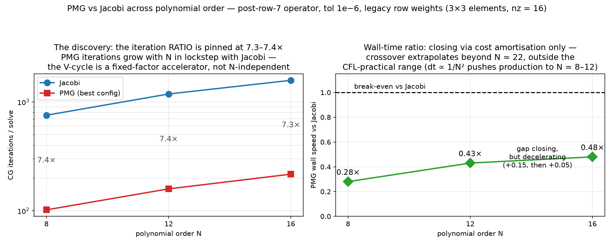

# 3D expansion — status, the M2 gate, and where the cores go

*Companion to `3D_DEVELOPMENT_PLAN.md` (the plan and its gates) and
[3D_FORMULATION.md](./3D_FORMULATION.md) (the equations and the time-marching
steps, transcribed from the code). This document records what was measured.*

`lssem3d/` is a **new module**. `lssem2d/` is untouched, as required — the 3D
code reuses `lssem2d.mesh`, `lssem2d.lgl` and `lssem2d.assembly.gather_scatter`
by calling them, never by editing them. Every place the 2D API did not fit was
worked around on the 3D side (see §2.4).

**Suite: 200 tests passing** (`uv run --quiet python -m pytest lssem3d/tests -q`).

| milestone | state | evidence |
|---|---|---|
| M1 `fourier.py` + Stage 0 | **done** | transform/derivative tests, Hermitian assertions |
| M2 operator + Stage 1 | **PASSED** | §1; re-validated on the new operator, bit-identical (§7J.1) |
| M3 Stages 2–3 | **done** | analytic single-mode; dealiasing with negative control |
| M4 Stage 4 MMS | **PASSED** | §4 — spectral in `N` and `Nz`; temporal gate restated. **PDE-level order 2.00 confirmed** (§7A.5) |
| M5 Stage 5 gate | **PASSED in 3D** | §7 — stable to `a_mass` = 6000; re-verified on corrected code (§7H) |
| M6 numba backend | **DONE** | §7M — fused single-pass kernels, **3.5–6.2×** on the matvec; parity to 1e-16 and the analytic Stokes rate reproduced |
| M7 `Re_τ` = 180 | not started | — |

**Six of seven milestones complete** (M1–M6). M7 (`Re_τ` = 180) remains.

~~\* M2 was measured before the row-weight fix~~ **re-validated, §7J.1.** Earlier
note: M2 was measured before the row-weight fix (§7A.2) and so ran on a
mis-scaled least-squares functional. Neither verdict is expected to flip — M2
compared 3D against 2D at matched settings, and M5 was a stability result — but
it should be re-run (§8.3), and until then it carries this asterisk. **M5 has
been re-run and its asterisk is removed** (§7H).

M5 had been recorded as done on **2D evidence only** — the `a_mass` sweeps, the
periodic channel to `a_mass` = 2400, the AC studies were all 2D, while the plan's
risk register rates "2D stability results assumed to transfer" as **high** risk
and requires Stage 5 to re-measure from scratch. It has now been measured in 3D
(§7) and it passes, so the conclusion stands — but it stands on 3D data, which it
did not before.

---

## Net-net

**The 3D solver works and is verified at its design order.** Order **2.00**
measured two independent ways against exact solutions — Stokes decay (implicit
path) and Taylor–Green (**convection active**) — which is the design order, since
RK3's third order lives in the convective half alone and Crank–Nicolson caps the
mix at 2. The time-splitting is now verified end to end.

**The production recipe, settled by measurement:**

| | |
|---|---|
| row weighting | **legacy** (`a_mass` = 1, `a_flux` = `dt`) |
| artificial compressibility | **off in the operator** |
| CG tolerance | **1e−06** |

Each was contested and each was decided against an exact solution rather than by
argument. AC in the operator costs **5–7 orders of magnitude of accuracy**; legacy
weights are **4.4× cheaper** than the alternative once AC is off; and the
tolerance policy is worth a **free 40%** of the iteration count.

**Turnaround improved 2.38×** (142.3 s → 59.7 s on a standard run), from two
changes that cost a day and carried no correctness risk: an analytic Jacobi
diagonal (the probing loop was 41% of every run) and a CG tolerance policy (the
solver had been over-solving by ~10 orders).

**A `numba` backend then bought another 4.0–8.4×** (§7M) — not by compiling the
NumPy code, which already calls BLAS, but by **fusing ~30 passes over the state
into one**, the only lever that helps a memory-bandwidth-bound kernel. Verified
bit-for-bit against the NumPy operator (33 parity cases) and against the analytic
Stokes rate, which it reproduces to **8 significant figures**.

**GPU triage settled (§7N):** the LAN DGX Spark is **2.2× slower than this
Mac** in FP64 and throttles FP64 arithmetic 4.4× — do not port to it. **Local
MLX is the GPU answer**, measured at **11× at full-M7 scale** and 0.09× at
today's toy scale, which is why it has sat unused.

**Today's net-net is 21.7×** on the Stage 5 channel — 646.4 s → 29.9 s over 15
steps, `E/E0` identical — from row-7 (5.39×) times numba (4.01×). **28.5× with
the thread pool switched off**, which is now the fastest configuration at this
mode count. An earlier 12.74× is **retracted**: it took one leg of the A/B from a
stored file rather than measuring both back to back (§7M, L14). Opt in with
`LSSEM3D_BACKEND=numba`.

**Twelve silent bugs, none of which raised an exception.** Every one produced a
correctly-shaped, plausible array. The two most consequential were found in the
last day: the **pressure pin covered one copy of a shared node**, making the
assembled operator non-symmetric on every periodic mesh (a 240× error floor that
made the convection-active measurement impossible), and the **Jacobi probe was
1.4% wrong at every interface node**.

**The recipe survives walls** (§7H) — the risk that dominated the queue is
closed. The channel runs AC-off at every `a_mass` from 120 to 6000, at a cost
ratio of **4.3×** against the cavity's **490×**, so the cavity's AC dependence is
a property of its lid and corner singularities rather than of walls or
viscosity. M7's geometry inherits the recipe.

**Status:** M1–M5 complete and verified (M5 re-run on corrected code, §7H); **M6
(numba) complete** (§7M); M7 (`Re_τ` = 180) remains. M2 still carries an asterisk — the
cavity driver has not been re-run since the row-weight fix.

**What is *not* established:** a general recipe. The three benchmarks agree only
because they were driven to agree at M7's viscosity; the cavity still behaves
differently and that is unexplained.

---

## Lessons so far — the transferable part

Details live in the numbered sections; this is what generalises beyond this
project.

### L1. Tests that compare the operator to itself cannot find a wrong operator

Four missing factors of $A = M\,Q^{T}Q\,L_0^{T}WL_0M$ (§2.1) survived a full suite of
symmetry, adjointness and convergence tests, because **$L_0^{T}L_0$ is symmetric
whether or not $W$ is there**, and CG converges happily on a mis-weighted inner
product. Only two kinds of test caught them: comparison against an *independent
implementation* (Stage 1, vs `lssem2d`) and against a *hand-derived analytic
forcing* (Stage 2). Every project should own at least one of each.

### L2. Nine bugs, zero exceptions

Not one of the nine (§2, §5) raised an error — each produced a correctly-shaped,
plausible array. Three returned a *sensible number for field 0* and were found
only when an index finally went out of range. The mitigations that actually work
are cheap: **assert the layout on entry** to anything taking the 5-D state, and
**write the negative control** (a test that must fail when the thing under test
is disabled).

### L3. Four gates and diagnostics were wrong *as written* — and each would have condemned correct code

This is the most surprising pattern in the project, and the reason gates are
worth re-deriving rather than inheriting:

| stated criterion | what measurement showed |
|---|---|
| "RKW3 temporal slope 3.0 ± 0.15" | Unachievable. Explicit-only **3.025**, CN-only **2.002**, mixed **2.189** — the table is right and CN is the limiter. No correct implementation could pass (§4.2) |
| "iterations should fall with `k_z`; flat means a bad preconditioner" | Flat is *correct* at production `a_mass`: `ν·k_z²` = 1.42 against `a_mass` = 1200. Competing would need `k_z` ≈ 465; the largest available is 64 (§6) |
| "M5 feasibility closed in the affirmative" | Closed on **2D** evidence, for a plan whose own risk register rates that transfer as *high* risk. Re-measured in 3D, it does pass — but it did not before (§7) |
| "AC is the enabling technology" | True for the 2D **outflow** case, and true for the 3D cavity (25 CG/step with AC against 12320 without). **Not** true for the ν = 1 Stokes benchmark under legacy weighting, where the AC-free system solves in 22047. AC's value is Reynolds-number dependent (§7A.2b) |
| "`κ_p` = `a_mass`" (inherited from the 2D steady studies) | Cost a **12.5% error in the Stokes decay rate** at every `dt`. Part initial-condition artifact, the rest a symptom of the scaling bug — not a fundamental accuracy/cost trade (§7A.3) |

### L4. Measure the mechanism, not just the symptom

A symptom is usually consistent with several stories. Three times the ambiguity
was resolved by finding a knob that separates them:

- **flat `div u` under `dt` refinement** could be an AC error *or* an ordinary
  spatial residual (also `dt`-independent). Fixing `κ_p` instead of scaling it as
  $1/\Delta t$ made it fall — $O(1)$ vs $O(\Delta t)$, diagnosis settled (§7A.1).
- **threads plateauing at 6.7×** could be the GIL *or* memory bandwidth.
  Processes are immune to the GIL and tied threads exactly ⇒ bandwidth (§3.3).
- **flat `k_z` iteration profile** could be a bad preconditioner *or* `a_mass`
  swamping the $k_z^2$ term. Sweeping `a_mass` made the trend appear (§6).

### L4b. A performance fix can be silently *undone* by a flag you did not set

The numba kernels needed `nogil=True`. Without it every njit call holds the GIL,
which would have **serialised `parallel.pcg`'s ThreadPoolExecutor** — the mode
parallelism that was already worth 6.7×. The failure mode is the nasty kind:
answers stay correct, the microbenchmark still shows 6× on one matvec, and only
the *end-to-end* number quietly regresses. It is invisible unless you measure
thread scaling specifically, which is why `bench_numba_threads.py` exists as a
gate rather than a curiosity: a **flat numba row** in that table is the
signature. The general rule — when a new layer sits *underneath* an existing
parallel one, re-measure the outer layer, not just the inner one (§7M).

### L14. Never take one leg of an A/B from a file

The day's headline number was first reported as 12.74× and was actually 21.7×.
The cause was not arithmetic: the NumPy leg came from a JSON written by an
earlier process, after ~45 minutes of thermal load, while the numba leg was
measured fresh. Re-run back to back in one process, numba went from 2.36× to
4.01× on the same case.

This is the same shape as the default-argument bug in §7J.1, where an A/B
silently compared a configuration against itself: **the comparison looked
complete, and was not.** Stored results are fine as a record and unusable as a
control. If two numbers are going to be divided by each other, they have to be
produced in the same process, in the same session, back to back (§7M).

### L5. Know your floor before calling something an error

`div u` is never zero in a least-squares formulation — continuity is a weighted
row, not a constraint. The meaningful quantity was **2.39× the AC-off floor**,
not the raw 1.46e−02. Likewise the M2 gate's target was the *2D curve*, not
Ghia's numbers, because 2D and 3D share a discretisation error that Ghia does not.

### L12. Reach for the invariant measurement FIRST, not after four wrong turns

The preconditioner investigation produced **four confident claims in a row, all
wrong**, each refuted by the next test rather than by foresight:

| claim | why it was wrong |
|---|---|
| "Jacobi is resolution-independent in 3D" | the RHS was `b = A x` with `x` **random**, so the problem got *rougher* as it got finer. A rough RHS is dominated by the well-conditioned high end and hides the growing low end |
| "PMG is actively harmful on smooth modes" | compared `‖e − P(Ae)‖` across two preconditioners with **different scalings**. A preconditioner is not `A⁻¹`; its output scale is arbitrary |
| "the coarse solve is too weak" | refuted by replacing Chebyshev with an **exact direct solve**: 0.9904 → 0.9899, i.e. nothing |
| "the coarse operator is 100× worse conditioned" | compared p=6 at ν=1/180, c=525 against p=3 at ν=1/100, **c=600** |

Every one came from reaching for whatever was easy to compute rather than
something **invariant to the thing being varied**. Iteration counts depend on the
right-hand side. Preconditioner outputs depend on scaling. Cross-parameter
comparisons depend on the parameters being equal.

**The dense condition number of `M⁻¹A` was available from the start and settles
all four in one step** — it depends on neither the RHS, nor a scaling, nor a
convergence criterion. It is now `scratch/spectrum.py`, with the four errors
written at the top so the next person reaches for it first.

The generalisable rule: **before measuring a method, ask what the measurement
depends on besides the thing under test.** If the answer includes the right-hand
side, an arbitrary scale factor, or a parameter you are also changing, find a
different measurement.

### L13. A negative result needs the same standard of evidence as a positive one

p-multigrid does not work here — coarsening buys 40× in conditioning from p=8 to
p=2 while the coarsest level still sits at cond ≈ 1.8e8, so an exact coarse solve
is an exact solve of a nearly-singular problem. That is a *real* finding, and it
took the same dense-spectrum evidence to establish as any positive claim would.

The temptation with a negative result is to stop at the first plausible
explanation — "the coarse solve is too weak", "the transfers are wrong" — because
the conclusion (don't use it) is the same either way. It is not the same: the
wrong reason would have sent us to Galerkin coarsening, which the measurements
show differs from rediscretisation by 27% and has identical conditioning. **The
reason a thing fails determines what you try next**, so it has to be right even
when the verdict does not depend on it.

### L9. A profile that measures the wrong UNIT hides the biggest cost

§3 profiled a **step** and concluded `normal_op` is **99.4%** of it — FFT and
gather-scatter not worth touching. That number is correct and it was measured
carefully, with the alternatives (BLAS threading, processes vs threads) ruled out
by experiment. It also led me to believe there was nothing left to optimise but
the matvec.

`scratch/prof3d.py` times `normal_op`, `convective`, `fft` and `gs`. It never
timed **preconditioner setup**, because setup happens once per *run* and the
profile measured a *step*. That setup was **34–41% of the run**, growing as N²,
and reached **168 seconds** at N=12 with 33 modes.

So the conclusion "the matvec is everything" was true of the unit measured and
false of the thing we actually wait for. **Profile the unit you are impatient
about** — if you are waiting on a run, profile a run, including everything that
happens once.

### L10. "Reference quality, not production" is debt with an apology attached

`jacobi_diagonal` carried this in its own docstring from the day it was written:

> REFERENCE QUALITY, NOT PRODUCTION … far too slow for a real run … the 3D
> analytic form is a later optimisation

The note was accurate, honest, and completely ineffective. The routine stayed
for the whole project and grew into the single largest cost, while its
replacement sat in a queue and was at one point *demoted* — because the `k_z`
study had killed its **conditioning** rationale, and nobody re-checked whether
its **setup-cost** rationale still stood. It did, and it was worth 40%.

A deferred optimisation with a docstring apology is still debt. What it needs is
not a better comment but a **periodic measurement**: the cost of the temporary
thing, quoted next to the cost of the real work.

There is a compensating point, and it is the reason this ended well. The probing
loop was kept *exact* rather than merely adequate, and it had been fixed (§2.5)
before the analytic form was written — so it could serve as the oracle its own
docstring predicted it would be. The analytic diagonal matches it to **3e−16**.
Had the optimisation been done earlier, it would have been validated against a
reference that was 1.4% wrong at every interface node, and would very likely
have been "corrected" until it reproduced the contamination.

### L11. Quote the number you measured, not a product of factors

The combined speed-up was first reported as "~2.4×", built from two measured
factors with one leg **extrapolated** (the `tol`=1e−12 solve time at N=16, inferred
from an iteration ratio measured at N=12). Measured directly, all four corners:

| | `tol`=1e−12 | `tol`=1e−06 |
|---|---|---|
| probed diagonal | **142.3 s** | 107.9 s |
| analytic diagonal | 101.3 s | **59.7 s** |

**2.38×** — the estimate was right, which is luck rather than method. Note also
that the two savings do **not** compose multiplicatively (1.40 × 1.32 = 1.85,
not 2.38): removing a fixed setup cost is worth proportionally more once the
solve has shrunk. Quoting a product would have been wrong in the other
direction.

### L8. The other implementation is the cheapest oracle, and it was under-used

Every major correction in this project came from **comparing against `lssem2d`**,
not from a new measurement in the 3D code:

| wrong claim | what corrected it |
|---|---|
| "the functional had no row weights — a bug" | reading `lssem2d`'s docstring: it offers **two** weightings and 3D hard-coded one |
| "AC is fundamental to the formulation" | asking *why can 2D solve at `k_z` = 0 what 3D cannot?* |
| "872 CG/solve is our cost" | reading `cgsfac = 0.01` in the 2D driver — 3D had been solving 10 orders tighter |

None of these needed new physics or a cleverer experiment. They needed reading
the working implementation of the same equations. The rule: **before theorising
about the scheme, check whether a working implementation disagrees — and check
what settings it uses, not just what it computes.**

### L7. A symptom investigated long enough starts to look like a law

The AC work produced four correct measurements — 2.39× the divergence floor,
order 0.92, 12.5% at every `dt`, `nsub` buying nothing — and an elaborate,
self-consistent theory of AC as a fundamental accuracy/solvability trade. All of
it was downstream of one missing feature: **row weights in the least-squares
functional** (§7A.2). The measurements were right; the framing was invented to
explain them.

What eventually broke it was not a better measurement but a **comparison
question**: *at `k_z` = 0 this is the 2D system, so why can 2D solve what 3D
cannot?* The 2D code was sitting there the whole time as an oracle. The rule that
falls out: when a scheme behaves badly, first ask whether a working
implementation of the same equations disagrees — before theorising about the
equations.

### L6. Discard confounded results out loud — and re-check the diagnosis too

The Richardson temporal-order run returned negative orders, and was discarded
rather than reported. But the *first* explanation offered for it — an
inconsistent `p` = 0 initial condition — was **also wrong**. The real cause was
holding `κ_p` fixed while refining `dt`, which makes the pressure evolve at a rate
∝ 1/`dt` (§7A.3). A wrong diagnosis of a discarded result is still a wrong
diagnosis, and it survived a step longer than the result did.

Earlier casualties of the same kind: "AC reverses the sign of the `dt`
dependence" (a two-point sample of a U-shaped curve) and "the exemption is about
the residual" (refuted by a parabolic control failing at the identical step).

---

## 1. The M2 gate: 3D at `k_z` = 0 reproduces the 2D solution

The gate is *not* "does it match Ghia". It is **"does the 3D code at `k_z` = 0
reproduce the 2D code"**, because only that separates a 3D bug from
discretisation error the two share. Both were compared, and in **both velocity
components** — precedent from `ARTIFICIAL_COMPRESSIBILITY.md` §5.1, where RMS
`u` improved at every `dt` while RMS `v` did not move at all, and it was the `v`
column that showed AC is accuracy-*neutral* rather than better. A gate on `u`
alone can be passed by a solution that is wrong in `v`.

Cavity Re = 1000, 6×6 elements, N = 10, RKW3/CN with AC:

| | RMS `u` | RMS `v` |
|---|---|---|
| 3D at `k_z` = 0 | 1.812e−02 | 2.220e−02 |
| 2D reference (converged) | 1.568e−02 | 2.079e−02 |
| **ratio** | **1.16** | **1.07** |

Both centreline profiles lie on the 2D curve and pass through Ghia's points
(`figs/cavity3d_kz0_profiles.png`).

**The residual 16%/7% is un-converged transient, not discretisation.** The run
stopped at `t` = 25 on the step cap (14371 steps, 3717 s) with `|dU|` = 3.3e−03
and RMS still falling monotonically over the final 400 steps:
2.29e−02 → 2.04e−02 → 1.81e−02. It was still heading toward the 2D value when
the cap cut it off. Reporting this as a converged 16% discrepancy would have
been wrong in the direction that matters — it would have sent us looking for a
bug that is not there.

---

## 2. What the gate actually caught — a taxonomy of silent failures

This is the part worth keeping. **Twelve distinct bugs so far, and not one
raised an exception.** Every one produced a plausible array of the right shape.
Eight are below; the ninth is §5, and the tenth and eleventh are §2.5.

### 2.1 Four missing pieces of the operator

The assembled operator is $A = M\,Q^{T}Q\,L_0^{T}WL_0M$. Each omission below drops one
factor, and each was invisible to the tests that existed at the time:

| omission | symptom | why the tests missed it |
|---|---|---|
| **quadrature weights `W`** | wrong operator, converged fine | *every* symmetry and adjointness test passed — `L₀ᵀL₀` is symmetric with or without `W`. Caught only by the Stage 1 comparison against 2D |
| **gather-scatter `Qᵀ Q`** | BC solve failed to converge in 20000 CG iterations | the only one that announced itself, and only because it was catastrophic |
| **multiplicity weighting** in CG inner products | interface nodes counted twice (four times at corners) | inner products are still symmetric when mis-weighted; CG still "converges" |
| **inhomogeneous BCs** | converged to a **motionless cavity**, RMS 3.27e−01 | solving `A U = LᵀWf` with a masked `A` is a perfectly well-posed problem — just not the right one. Fixed with defect correction |

The lesson generalises: **symmetry, adjointness and convergence tests cannot
detect a consistently wrong operator.** They all test the operator against
itself. Only Stage 1 — comparison against an independent implementation — and
Stage 2 — comparison against a hand-derived analytic forcing — can.

### 2.2 Four field-vs-mode layout slips

The standard layout is `U[e, i, j, var, k]`: **field axis −2, mode axis −1**.
Four places indexed the wrong one:

- `convect.convective` — wrong axis for the velocity components
- the `operator` split-real facade
- `cfl()` velocities — `U_phys[..., OP.V_]` indexes the *mode* axis, not the field
- `cfl()` polynomial order — read `shape[-2]`, which is `NVAR` = 7, making the
  CFL limit **independent of `N`**: it reported the same `dt` at N = 6, 8 and 10,
  a silently over-permissive time step

Three of these return a plausible number for field 0 and are therefore
undetectable by a smoke test. The `cfl` velocity bug was noticed only because a
single-mode array finally made the index go out of bounds. That is luck, not
method — so `test_convect.py` now carries explicit tests that each of `u`, `v`,
`w` contributes, that a non-velocity field contributes nothing, that the limit
*falls* with `N`, and that a wrong-shaped array raises rather than guesses.

**Mitigation now in place:** `cfl()` asserts its layout on entry
(`U.ndim == 5 and shape[1] == shape[2]`). Layout assertions are cheap and this
class of bug is otherwise silent.

### 2.3 Two more, for completeness

- **NaN at step 36** — backward Euler with explicit convection is forward Euler
  *on the convective term*, whose imaginary-axis stability limit is exactly
  **zero**. Fixed by RKW3 (limit √3). Worth stating plainly because "implicit
  scheme" reads as "stable" and here it was not.
- **Unreachable `|dU| < 1e-9` exit** — the floor was 6.937e−08, so the
  convergence test could never fire. Added a stagnation exit.

A ninth is in §5 — it needed the integrator under test, which came later.

### 2.5 Two more, found by comparison and by review

**10. No row weights in the least-squares functional** (§7A.2). The momentum rows
outweighed the constraints by $c^2 \approx 1.4\times10^6$, so the minimiser ignored `div u`
and the AC-free system could not be solved at all. Invisible to every test in the
suite: the operator is *correct*, it is the **functional** that was mis-weighted,
and Stage 1 compared against 2D at matched `a_mass` rather than matched row
scaling. Found only by asking why `lssem2d` could solve what `lssem3d` could not.

**11. The Jacobi probe was 1.4% wrong at every interface node.** The probe set
local index `(i,j)` in *every* element, which is **discontinuous** at an
interface — one copy of a shared node is 1 while its twin is 0 — so `gs()` folded
intra-element off-diagonal couplings into the reading. Probing the *unassembled*
operator and keeping the gather is exact (0.000e+00 over all 441 free dofs).

The second is the more embarrassing one, and the more instructive. The test that
"confirmed" the earlier assembly fix **spot-checked five nodes on the velocity
field** — and velocity contamination shrinks like $1/c^2$, so it is invisible at
production `a_mass`; the error lives on the `c`-independent pressure and vorticity
rows. That is exactly L1 — a test comparing the operator against itself — written
by the author of L1, in the same file that states it. The replacement sweeps every
free dof of every field and carries a negative control asserting the contaminated
probe really is contaminated, so it cannot pass for free.

### 2.4 Reusing `lssem2d` without touching it

The constraint is that `lssem2d/` must not be modified. Two places the 2D API
genuinely did not fit, and how each was handled **on the 3D side**:

| 2D API | why it did not fit | 3D workaround |
|---|---|---|
| `lssem2d.operators.dUdx/dUdy` | shape-locked to `(nelem, n, n)` by `facx[:, None, None]` — it cannot broadcast over trailing `(var, mode)` axes | `lssem3d/deriv.py` re-derives the same contractions with `einsum('pi,eij...->epj...')` and a rank-agnostic `_fac`, so any number of trailing axes works |
| `lssem2d.assembly.gather_scatter` | accepts 3-D or 4-D arrays only; the 3D state is 5-D | `solver3d.gs` folds `(var, mode)` into one trailing axis and calls it unchanged. `Q` acts on the spatial index alone, so this is exact — and it reuses the connectivity rather than reimplementing it |

The second is the important pattern: **fold, don't fork.** Reimplementing the
gather-scatter connectivity would have been a fresh source of the §2.1
class of bug.

---

## 3. Parallelism: measured, and the answer is not the obvious one

The algorithm *is* embarrassingly parallel across `k_z` — modes never interact
inside the implicit solve. But *where* to spend cores was measured, not assumed
(`scratch/prof3d.py`, `prof3d_modes.py`, `prof3d_procs.py`), and two of the four
results contradict the natural guess.

### 3.1 Only one thing costs anything

6×6 elements, N = 10, Nz = 32:

| | time | share of a step |
|---|---|---|
| **`normal_op` (one matvec)** | **95.5 ms** | **99.4%** |
| `convective` (dealiased) | 26.2 ms | 0.6% |
| gather-scatter | 0.62 ms | — |
| `rfft`+`irfft` pair | 0.55 ms | — |

The plan (§4) expected "PCG matvec ≫ FFT > convection". Confirmed, but far more
lopsided than anticipated — 99.4/0.6. **The FFT and the gather-scatter are not
worth optimising at all**, and the layout choice in §1.1 is vindicated.

There are two candidate parallel axes and this settles which matters:
convection is parallel over *z-planes*, the solve over *`k_z` modes*. Convection
is 0.6% of the work, so the mode axis is the only one worth exploiting.

### 3.2 BLAS threading buys nothing

95.51 ms → 94.84 ms going from 1 to 8 BLAS threads — 0.7%, i.e. noise. The
contractions are too small for threaded BLAS to amortise. Every driver in this
project pins `OMP_NUM_THREADS=1`; that had never been *tested*, and it turns out
to cost nothing. So: **one BLAS thread per worker, parallelism across modes.**

### 3.3 Threads tie processes — so the ceiling is bandwidth, not the GIL

Speedup of a single matvec, chunked across the mode axis:

| workers | Nz=32 (17 modes) | Nz=64 (33) | Nz=128 (65) |
|---|---|---|---|
| 4 | 3.38× | 3.48× | 3.29× |
| 8 | 3.80× | **5.68×** | 6.05× |
| 12 | 3.68× | 4.84× | **6.69×** |
| 16 | 3.08× | 4.13× | 6.10× |

Processes (fork, no pickling) reached 4.57× / 5.33× / 6.47× — **statistically
the same as threads.** Processes are immune to the GIL; if the GIL were the
constraint they would have won outright. They did not, so the ceiling is
**memory bandwidth**. Two consequences:

1. **Use threads.** No pickling, no fork, shared arrays, simpler code — and no
   performance cost. Do not "improve" this to multiprocessing later; it was
   tried and it tied.
2. **More cores will not help.** ~6.7× on a 12P+4E machine is near the ceiling.
   The next real gain must come from *reducing memory traffic per matvec*, not
   from adding workers — which redirects M6 (numba) toward fusing the operator's
   passes over the data rather than merely compiling them.

The ceiling **rises with problem size** (3.8× → 5.7× → 6.7× as modes go
17 → 33 → 65), because each worker gets more modes per chunk. Production `Nz`
should do at least as well as 6.7×; small mode counts should not bother.

### 3.4 `lssem3d/parallel.py`

Parallelises the **whole PCG** per mode-chunk, not each matvec. Two reasons:

1. one thread dispatch per solve instead of one per CG iteration — ~45× less
   dispatch overhead;
2. serial `pcg` exits on `np.all(rn < target)`, so a mode that converged long
   ago **keeps iterating until the worst mode catches up**. Chunked, each chunk
   exits on its own modes. High-`k_z` modes are strongly damped and converge
   fast, so this is not a rounding-level effect — it is real work removed.

Because of (2) the parallel `pcg` is **not bitwise identical** to the serial one:
converged modes take a different number of extra iterations. `test_parallel.py`
therefore asserts what is actually true rather than what would be convenient:

- `apply_op` **is** bitwise identical to serial at every worker count — the mode
  axis carries no cross-mode work, so chunking it is exact. This has teeth only
  because a negative control confirms `kz` actually changes the answer;
  otherwise a mis-sliced `kz` would be invisible.
- `pcg` meets the **same per-mode residual tolerance**, checked against the
  operator directly rather than against serial output, and agrees with the
  serial solution to solver tolerance.
- `workers=1` is a genuine bitwise passthrough, so the parallel path can be left
  on without perturbing a reference run.
- chunking never *costs* iterations.
- `mode_chunks` tiles the mode axis exactly — a dropped or duplicated mode would
  silently corrupt one wavenumber and leave the rest of the field looking right.

`M_inv` and `x0` both carry a mode axis and must be sliced *with* the data;
slicing one and not the other mismatches mode to operator, silently. Tested.

### 3.5 End-to-end, on a whole solve

`scratch/prof3d_endtoend.py`, Nz = 64 (33 modes), tol 1e−8:

| workers | 2 | 4 | 6 | **8** | 12 | 16 |
|---|---|---|---|---|---|---|
| speedup | 2.02× | 3.71× | 4.51× | **5.24×** | 4.88× | 4.18× |

against 718 s serial, with `max|dx|` = 5.9e−09 from the serial solution — i.e.
at the solver tolerance, as it should be. The peak at 8 workers and the ~5×
plateau match the microbenchmark's 5.68× at the same size, so the whole-solve
overhead (per-chunk `multiplicity_weight`, load imbalance) is not eating the
gain.

**One caveat, stated because it limits what this run proves:** every
configuration hit `max_iter = 4000`, serial included — a random RHS is far
harder than the real one (~45 iterations). So the "iterations saved" benefit of
§3.4(2) is *not* measured here; the iteration column reads 1.00× only because
every run was capped. The speedup above is pure parallel throughput. The
converging case is `test_integration_multimode.py`.

---

## 4. Stage 4 (M4): spectral in space, and a temporal gate that was wrong

### 4.1 Spatial and z convergence — passed

`test_stage4_mms.py`. Stage 2 deliberately used potentials that are
**polynomials of degree ≤ N**, so the GLL derivative is *exact* and the operator
could be pinned to ~1e−12. That is right for finding bugs and exactly wrong for
measuring a rate — with no truncation error there is nothing to converge. Stage 4
keeps the same vector-potential construction (so all five constraint rows still
vanish identically, giving a forcing-free probe) and swaps in **trigonometric**
potentials.

Convergence is checked **as a rate, not a tolerance**, because a fixed tolerance
is passed by any merely high-order scheme:

- **in `N`**: the late log-log slope must beat the early one by a wide margin —
  an `h^p` scheme has a *constant* slope, spectral convergence steepens without
  bound. At N = 12 the error is at round-off (< 1e−9) for both `k_z` = 0 and 2.
- **in `Nz`**: exponential convergence is a straight line in `log(err)` vs `Nz`;
  algebraic is a straight line in `log(err)` vs `log Nz`. Both fall steeply, so
  smallness cannot distinguish them — **both models are fitted and the
  exponential one is required to win**. Measured: 5.86e−2 → 1.70e−3 → 2.82e−5 →
  2.25e−9 over Nz = 8 → 24, reaching round-off (5.0e−14) at Nz = 32.

A negative control guards the whole file: at N = 4 the error must exceed 1e−6.
If the manufactured solution were accidentally representable, every error would
be ~1e−15, there would be no rate to measure, and the convergence test would
still pass on noise.

### 4.2 The temporal gate was unachievable as written

The plan asked for **RKW3 slope 3.0 ± 0.15**, adding that measuring 2.0 means
"the `α/β/γ/ζ` table is mis-transcribed **or** Crank–Nicolson is limiting". One
convergence run on the PDE cannot separate those two diagnoses, so the scalar
model $u' = (\lambda_e + \lambda_i)u$ — precisely the problem the coefficients were designed
for — was run three ways:

| configuration | measured order |
|---|---|
| explicit only — the `γ/ζ` table alone | **3.025** |
| implicit only — Crank–Nicolson alone | **2.002** |
| **mixed — as actually run** | **2.189** |

**The table is correct; CN is the limiter.** The consequence matters: *no correct
implementation can score 3.0 on the mixed scheme*, so the original gate would
have failed working code and sent us to re-derive a coefficient table that was
right all along. Restated gate: **explicit-only 3.0 ± 0.15**, mixed ≈ 2.

This does not weaken the case for RKW3. Its argument was never overall 3rd-order
accuracy — it is the imaginary-axis stability interval (√3) that AB2 lacks
*entirely* (plan §0.4). CN's unconditional stability is exactly what the stiff
`a_mass` term needs, and viscous error is not what limits a DNS at these steps.

A negative control keeps the order test honest: corrupting $\gamma_2$ from 3/4 to 0.7
must collapse the explicit-only order below 2.5, otherwise the test is not
actually sensitive to the coefficient table.

### 4.3 A trap pinned in passing

`solver3d.rkw3_step` builds `rhs = U + dt(γ N + ζ N_prev)` — the **$\alpha_k L^{k-1}$
term is not in it**, and is left to `solve_stage`. A `solve_stage` that forgets
$\alpha$ loses an order silently, with no shape error and a plausible field. That
interface is now pinned by test rather than left as an accident.

---

## 5. A ninth silent bug, found by finally testing the driver

Everything in §2 was found before the integrator was under test. The driver
itself lives in `scratch/cavity3d_kz0.py` — a *script*, not the library — so the
assembled sequence (explicit convection → defect-corrected stage RHS → solve →
update, ×3) had never run under test. And the M2 gate that did exercise it ran at
`k_z` = 0, where every $ik_z$ term vanishes and there is exactly one mode. **No
test had ever run the driver with the mode axis populated.**

`test_integration_multimode.py` does, and immediately found this:

**The imaginary half of the Nyquist mode was unconstrained.** `fourier.py`
already states the invariant — `real_mode_indices` returns k = 0 *and* the
Nyquist mode for even `Nz`, and `assert_hermitian_ok` checks both. But that
invariant was only ever **asserted in tests, never enforced in the solve**:
`build_mask` froze real and imaginary halves *at boundaries*, and nothing froze
the imaginary half of the real modes in the interior.

`irfft` silently discards those components, so anything the solver puts there is
invisible in physical space — an unconstrained, non-physical direction that CG
fills happily. Measured after three steps: Nyquist imaginary part **1.5e−03**
against a real part of **6.1e−03** — comparable, not a rounding artefact. The
solver's own state would have failed `assert_hermitian_ok`.

Why nothing caught it earlier: at `k_z` = 0 the real and imaginary halves
decouple (no $ik$ term), so an imaginary half that starts at zero *stays* zero.
The whole class is invisible to every `k_z` = 0 test, which is all the driver had.

Fixed in `bc.py` via `real_mode_columns`, a single source of truth shared by
`build_mask`, `apply_values` and `prescribed_entries` — those three must agree on
which DOFs are prescribed, and a disagreement between the mask and the
value-writer is precisely the original 2D bug. Correctness only: the arrays keep
their full width, so the matvec costs what it did before.

**A second, self-inflicted lesson from the same test.** Its first version ran
800 unpreconditioned iterations and stopped at residual 1.1e−01 — unconverged —
which quietly turned a serial-vs-parallel comparison into a comparison of two
*different unconverged states*. The tell was that the discrepancy was **identical
at every solver tolerance** (6.310e−05 at 1e−8, 1e−10 and 1e−12); a genuine
tolerance effect scales with tolerance. The test now uses the Jacobi
preconditioner and asserts it did not hit `max_iter`, so it cannot pass
vacuously again.

---

## 6. Conditioning: `k_z` is not what limits the solve

`scratch/kz_iterations.py`. The plan (§4) states an expectation and a diagnosis
together: iterations-per-solve should *fall* with `k_z`, because the $k_z^2$ term
makes the operator more diagonally dominant, and **"a flat profile is evidence
the preconditioner is not using `k_z`"**. Measured before optimising the
preconditioner — because if the profile were flat, the Jacobi diagonal would be
the wrong object to optimise.

Each mode solved as its own single-mode problem (the batched `pcg` reports only
the worst mode, so per-mode counts are invisible there by construction),
`Re` = 180, `dt` = 5e−3 ⇒ `a_mass` = 1200, AC on with `κ_p` = `a_mass`:

| `k_z` | 0 | 2 | 8 | 15 | 16 (Nyquist) |
|---|---|---|---|---|---|
| iterations | 1001 | 1398 | 946 | 621 | 906 |

Not falling — it *rises* to a peak near `k_z` = 2, then declines, ending at
**0.905×** the `k_z` = 0 count. By the plan's stated criterion that is "flat",
which would condemn the preconditioner. **That verdict would have been wrong.**

### Why: `a_mass` dominates the diagonal by three orders of magnitude

The $k_z^2$ term enters scaled by viscosity. At `Re` = 180 and the largest
wavenumber here, $\nu k_z^2$ = **1.42**, against `c` = `a_mass` = **1200**. It
cannot possibly shift the conditioning. Sweeping `a_mass` with everything else
fixed confirms the mechanism directly:

| `a_mass` | iterations at `k_z`max ÷ at `k_z` = 0 |
|---|---|
| 1200 (production) | 0.905 — flat |
| 100 | 0.997 — flat |
| 10 | 0.763 |
| **1** | **0.249 — falls steeply** |

The `k_z` trend is real and appears exactly when `a_mass` stops swamping it. For
the $k_z^2$ term to compete at production settings one would need
$k_z \sim \sqrt{c/\nu} = \sqrt{1200\cdot180}$ ≈ **465**; at `Nz` = 128 the largest `k_z` is 64.
**The regime the plan's diagnostic assumes is unreachable in this formulation.**

### Consequences

1. **The diagnostic is restated**: a flat `k_z` profile at production `a_mass` is
   *expected and correct*, not evidence of a defect. It only carries information
   at small `a_mass`.
2. **Tuning the preconditioner's `k_z` handling would buy nothing** — `k_z` is
   not what limits conditioning. `a_mass` is. This removes the conditioning
   motivation for the analytic Jacobi diagonal; that work is now justified only
   as a setup-cost saving (§7G), which is a much smaller prize.
3. The Nyquist mode costs **46% more** iterations than its neighbour (906 vs
   621) because its imaginary half is frozen (§5), leaving a different — and
   evidently worse-conditioned — system. Worth knowing before it is mistaken for
   a bug.

**Caveat on absolute counts.** These use a random RHS, which is far harsher than
the smooth defect-correction RHS a real step produces (~46 iterations with AC in
the M2 run). The *trend across `k_z`* is the trustworthy part, since the same
spatial pattern is used at every mode; the ~1000 figures are not a forecast of
production cost.

---

## 7. Stage 5 (M5) measured in 3D: the windows overlap, by a wide margin

`scratch/channel3d.py` (rig) and `scratch/channel3d_stage5.py` (sweep). This is
the plan's ⚑ **decision gate** — "if the windows do not overlap, the formulation
is infeasible as specified" — and until now it had only ever been answered with
2D numbers the plan itself says do not transfer.

### 7.1 The collision, and why the sweep runs `dt` downward

With RKW3/CN the two constraints pull in opposite directions:

$$
a_\mathrm{mass} = \frac{1}{\beta_2\,\Delta t} = \frac{6}{\Delta t} \quad(\text{worst stage}),
\qquad
\mathrm{CFL} \propto \Delta t \quad(\text{limit } \sqrt{3} \text{ for RKW3})
$$

so the feasible window is $6/a_\mathrm{max} < \Delta t < \Delta t_\mathrm{CFL}$, and it is non-empty iff
$a_\mathrm{max} > 6/\Delta t_\mathrm{CFL}$. **`a_mass` instability therefore appears at SMALL `dt`** —
the opposite of the usual intuition, and the reason the sweep decreases `dt`.

### 7.2 The rig, and its control

Walls in `y`, periodic in `x` (SEM connectivity, `mesh.periodic_x`) and `z`
(Fourier). Base flow $u = 6y(1-y)$ held by a body force $f_x = 12\nu$. Perturbation
is an analytic, divergence-free roll pair from a streamfunction in `(y,z)`,
$\psi = A\sin^2(\pi y)\cos(kz)$, which puts energy in `w` and the transverse
vorticities — the components every `k_z` = 0 test is blind to.

Validated before use: the base flow is held to **2.2e−15** over 5 steps, which
confirms the periodicity, the body-force normalisation (an unnormalised `rfft`
means a physical constant `C` has mode-0 coefficient `C·nz`; getting this wrong
rescales the flow by `nz` and is otherwise invisible), and — importantly —
that **Poiseuille is exactly representable**, which is the premise of plan §0.2.
That makes the laminar case a *control*, not evidence: a zero residual is
precisely the condition under which the `a_mass` mechanism stays hidden.

### 7.3 Result — stable at every `a_mass` tested, up to 6000

Re = 180, N = 6, 3×3 elements, Nz = 16, 200 steps (2D failures appeared by step
~33, so ~6× margin), AC on with `κ_p` = `a_mass`:

| case | `dt` | `a_mass` | CFL | status | `E_pert/E₀` | mean-profile err |
|---|---|---|---|---|---|---|
| laminar (control) | 0.001 | 6000 | 0.021 | **OK** | — | 1.1e−15 |
| perturbed | 0.05 | 120 | 1.303 | **OK** | 0.245 | 1.1e−02 |
| perturbed | 0.02 | 300 | 0.521 | **OK** | 0.731 | 1.7e−02 |
| perturbed | 0.01 | 600 | 0.261 | **OK** | 0.762 | 1.0e−02 |
| perturbed | 0.005 | 1200 | 0.130 | **OK** | 0.807 | 4.6e−03 |
| perturbed | 0.0025 | 2400 | 0.065 | **OK** | 0.856 | 1.6e−03 |
| perturbed | 0.001 | **6000** | 0.026 | **OK** | 0.927 | 3.5e−04 |

The perturbation **decays in every case**, which is the known answer for laminar
plane Poiseuille far below `Re_crit` ≈ 5772. The `E/E₀` column falls with `dt`
only because 200 steps is less physical time at smaller `dt` (t = 10 down to
t = 0.2); the decay *rate* is consistent throughout.

### 7.4 Verdict

`dt_CFL` = **0.0665** on this grid, so the constraints are

$$
\begin{aligned}
\text{CFL:}&\quad \Delta t < 0.0665 \;\Rightarrow\; a_\mathrm{mass} > 90\\
a_\mathrm{mass}\text{:}&\quad \text{clean to } 6000 \;\Rightarrow\; \Delta t > 0.001
\end{aligned}
$$

**The window spans a factor of ~66 in `dt`.** The gate passes, and not
marginally. The plan's worst-case fear — that no operating point exists and the
formulation would need semi-implicit convection and a re-plan — is resolved
against.

**Scaling to M7.** The requirement is $a_\mathrm{mass} > 6/\Delta t_\mathrm{CFL}$, and `dt_CFL` shrinks
with resolution:

| grid | `dt_CFL` | `a_mass` required |
|---|---|---|
| N=6, 3×3, Nz=16 | 0.0665 | 90 |
| N=8, 4×4, Nz=32 | 0.0294 | 204 |
| N=10, 6×6, Nz=64 | 0.0129 | 466 |

Against a measured ceiling of at least 6000 this leaves ~13× headroom at the
finest grid tested. Turbulence will tighten `dt_CFL` further (larger velocity
gradients), so this margin should be re-checked at the M7 resolution rather than
extrapolated — but there is no sign of a collision.

### 7.5 AC buys affordability here, not stability — a correction

AC-off at the same settings costs **~10× more per step** (≈1 min against 5.3 s).
But the completed AC-off sweep does **not** support the stronger claim:

| `dt` | `a_mass` | CFL | AC-off outcome |
|---|---|---|---|
| 0.05 | 120 | 1.303 | **DIVERGED at step 184** |
| 0.01 | 600 | 0.261 | OK, 200 steps |
| 0.0025 | 2400 | 0.065 | OK, 200 steps |
| 0.001 | 6000 | 0.026 | OK, 200 steps |
| 0.001 (laminar) | 6000 | 0.021 | OK, 200 steps |

**AC-off is stable across the whole `a_mass` range**, and the single failure is at
the *largest* step, where CFL = 1.303 sits near the RKW3 limit of √3 — i.e. it
points at CFL, not at `a_mass`.

So in this 3D periodic channel **AC is required for affordability, not for
stability.** The "AC is the enabling technology" framing came from the 2D
*outflow* case (plan §0.3), where AC-off genuinely blew up, and it should not be
carried over to the periodic channel unqualified. This does not change the Stage
5 verdict, which passes either way; it changes *why* AC is in the scheme.

---

## 7A. The AC investigation — and the scaling bug underneath all of it

This section reads chronologically on purpose. Everything in §7A.1 was measured
and is correct as data; §7A.2 is the root cause that reinterprets all of it. The
symptoms were real; the diagnosis attached to them was not.

### 7A.1 The symptoms, in the order they appeared

Artificial compressibility is a **steady-state** device unless sub-iterated. The
continuity row solves

$$
\kappa_p\,p + \operatorname{div}u = \kappa_p\,p_\mathrm{prev}
\;\;\Rightarrow\;\;
\operatorname{div}u = -\kappa_p\,(p - p_\mathrm{prev})
$$

At a steady state $p = p_\mathrm{prev}$ and it is exact — which is why the M2 cavity gate
could never see a problem. The driver had **no sub-iterations at all**, a
configuration never tested in this project, 2D or 3D. Four measurements followed:

| measurement | result |
|---|---|
| `div u` vs the AC-off floor, `dt` = 0.008 | AC `nsub`=1: **2.39×** the floor; `nsub`=3: 1.75× for 1.9× the CG cost |
| `κ_p` scaling | flat under refinement when `κ_p` ∝ 1/`dt`; falls when `κ_p` is fixed |
| Richardson self-convergence, real 3D stepper | order **~0.92**, where Stage 4 predicts ~2 |
| **Stokes decay** (exact answer, `figs/chan_fig1_pref.png`) | **12.5% error in σ at every `dt` — zeroth order**; `nsub`=10 no better than `nsub`=1 |

The Stokes case was decisive because it has an **analytic** rate, so the error is
absolute. It exposed what self-convergence structurally cannot: the ~0.92 was a
true *rate* toward the scheme's own limit, and that limit was simply wrong (L5).

**Two contributions to the 12.5% were then separated.** The initial condition set
`p` = 0, which is inconsistent — for the Stokes mode
$p = \sigma\,(A\sinh(\alpha y) + B\cosh(\alpha y))\sin(\alpha x)$, derived by hand from
$-\sigma u = -p_x + \nu\nabla^2 u$, where the hyperbolic terms cancel. Supplying it cut the
error **12.5% → 1.0%**. So most of the headline number was an initial-condition
artifact, and only ~1% was attributable to AC.

### 7A.2 CAUSE: `lssem3d` hard-coded one row weighting, and it is the wrong one for this benchmark

**This subsection was originally written as "ROOT CAUSE: the functional had no
row weights", i.e. as a bug. That was overreach, corrected below in §7A.2b after
the cavity re-run contradicted it.**

The question that broke it open: at `k_z` = 0 the 3D system **is** the 2D system
(Stage 1 proves the operator), so why can `lssem2d` solve the AC-free problem
routinely while `lssem3d` cannot solve it at all?

`lssem2d` writes the momentum row as `a_mass·u + a_flux·N(u)` with the continuity
and vorticity rows at weight 1 — so **`a_flux` is the least-squares weight of
momentum against the constraints**. Its legacy setting, the one the Chan (1996)
validation runs, is `a_mass = fac1 = 1`, `a_flux = dt`: **every row O(1)** in the
velocity.

**`lssem3d` had no row weighting whatsoever.** Its momentum rows carried
$c = 1/(\beta_k\,\Delta t)$ against constraint rows of O(1). At `dt` = 5e−3 that is
`c` = 1200, and the functional *squares* the rows:

$$
\begin{aligned}
J_{3D} &= \int \bigl[\, (c\,u + p_x + \nu\nabla\times\omega)^2 \;+\; (\operatorname{div}u)^2 \;+\; (\omega\text{-definitions})^2 \,\bigr]\\
J_{2D} &= \int \bigl[\, (u - u_\text{old} + \Delta t\,N)^2 \;+\; (\operatorname{div}u)^2 \;+\; (\omega\text{-definitions})^2 \,\bigr]
\end{aligned}
$$

Momentum outweighed continuity by **$c^2 \approx 1.4\times10^6$**. The minimiser therefore
essentially ignored `div u`, and the normal operator was hopelessly conditioned.

Stokes decay, AC **off**, `dt` = 5e−3, σ_exact = 9.3137399:

| | σ | rel err | CG |
|---|---|---|---|
| no row weights | 9.31809 | 4.68e−04 | **600000** (cap saturated) |
| **row weights** | **9.31413** | **4.19e−05** | **22047** (converged) |

**27× fewer CG iterations and 11× more accurate — on this benchmark.** The
qualifier is not decorative; see §7A.2b.

### 7A.2b CORRECTION: the weighting is a problem-dependent choice, not a bug

Re-running the M2 cavity with row weights **contradicted the framing above** and
forced a re-reading of `lssem2d`.

`lssem2d` supports **two** weightings, not one:

| setting | `a_mass` | `a_flux` | used by |
|---|---|---|---|
| legacy (both `None`) | `fac1` = 1 | `dt` | the **Chan (1996) Stokes-decay validation** |
| `w_mom` = 1 | `fac1/dt` | 1 | the cavity / BFS / `a_mass` studies |

**`lssem3d`'s original scaling is exactly the `w_mom` = 1 setting** — a
legitimate, well-used 2D configuration, not a defect. What `lssem3d` lacked was
the *option*: it hard-coded one of the two, and the one it hard-coded is not the
one the Stokes benchmark uses. That is why the 3D code could not reproduce a 2D
result the 2D code produces routinely.

**Which weighting wins is problem-dependent**, and the two benchmarks disagree
sharply. Cavity, Re = 1000, `dt` = 1.74e−3, CG per step:

| row weights (legacy) | `κ_p` | CG/step |
|---|---|---|
| **off** (`w_mom` = 1, original) | `a_mass` | **25** |
| on | `a_mass` | 688 |
| on | 10 | 1028 |
| on | 1 | 5519 |
| on | 0 | 12320 |

Legacy weighting is **27× worse at best** on the cavity, while it is what makes
the Stokes case solvable at all. The plausible discriminant is viscosity: legacy
scales the momentum row to $u + \beta\,\Delta t\,(p_x + \nu\nabla\times\omega)$, and at ν = 1e−3 with
$\beta\,\Delta t$ ≈ 3e−4 the vorticity coupling is ~3e−7 — effectively absent. At ν = 1
(Stokes) it is not.

**Consequences for the claims in §7A.3:**

* "AC was never a solver requirement" — **true only for the ν = 1 Stokes case.**
  On the cavity, AC is worth 25 CG/step against 12320 without it. AC's value is
  Reynolds-number dependent and it is **not** dispensable.
* "correctly weighted, AC is slower as well as less accurate" — **withdrawn.**
  That was measured on Stokes alone and does not generalise.
* The order-2.00 result (§7A.5) stands: it is a statement about the Stokes
  benchmark under legacy weighting, which is the configuration it was measured in
  and the one the 2D reference uses.

**What is actually established:** `rw` gives `lssem3d` the second weighting it was
missing, the Stokes benchmark now reproduces at its design order, and **choosing
the weighting per problem is an open design question** — exactly as it is in 2D.

### 7A.3 What this does to the AC findings

**AC was never a solver requirement.** It was compensating for the row scaling:
adding $\kappa_p\,p$ to the continuity row lifts that row toward the momentum rows.
One fact explains the whole tangle —

* the **63× "conditioning benefit"** of AC: it was repairing a scaling bug, not
  preconditioning a well-posed system;
* why **AC-off was unsolvable in 3D but routine in 2D**: 2D never had the bug;
* why **AC cost accuracy**: it rebalanced by *changing the equation* rather than
  by rescaling it, so incompressibility was traded away;
* why **`nsub` could not rescue it**: with `κ_p` large,
  $\kappa_p(p - p_\mathrm{prev}) + \operatorname{div}u = 0$ is satisfiable by a tiny pressure change for *any*
  `div u`, so the sub-iteration that would restore incompressibility converges
  ever more slowly as `κ_p` grows.

The κ_p sweep (12.5% → 2.5% as `κ_p` fell 1000×, for 1.36× the CG cost) was
therefore measuring how much of the scaling damage could be undone by backing AC
off — not a fundamental accuracy/cost trade. **With row weights the question is
no longer "how small can `κ_p` be" but "is AC needed at all".**

`rw` is optional and defaults to `None`, so every earlier result remains
reproducible.

### 7A.4 Retractions

Three, recorded because the sequence is instructive:

1. **"κ_p fixed is the inconsistent scaling"** (§7A.3, previous version) — the
   sign was backwards. With `κ_p` fixed, `p − p_prev` → 0 as `dt` → 0, so
   `div u` → 0 and the incompressible limit **is** recovered; with `κ_p` ∝ 1/`dt`
   it is not. I had also used this to overturn a *correct* earlier diagnosis (the
   `p` = 0 initial condition), which the Stokes test then vindicated. A wrong
   diagnosis of a discarded result outlived the result.
2. **"AC-off gives 0.76% error, so the 12.5% is AC's fault."** Both AC-off runs
   saturated the CG cap (1.2e6 and 1.8e6 iterations) and returned mutually
   inconsistent rates (9.384 and 14.279). Withdrawn. We now know *why* they could
   not converge: §7A.2.
3. **"AC is the enabling technology"** — true for the 2D *outflow* case, and true
   of `lssem3d` only because of the scaling bug.

### 7A.5 RESOLVED: with row weights and no operator-AC, the scheme is exactly second order

`scratch/stokes3d.py`, N = 10, 2×4 elements, Stokes decay against the analytic
σ = 9.3137399. Row weights **on**. No solve hit `max_iter` (guard armed, and it
matters — a capped solve promotes the preconditioner into the scheme, which is
how the earlier AC-off "controls" returned two different wrong answers).

| `dt` | 0.01 | 0.005 | 0.0025 | 0.00125 | **order** |
|---|---|---|---|---|---|
| **AC off** (`κ_p` = 0) | 1.680e−04 | 4.189e−05 | 1.046e−05 | **2.613e−06** | **2.00, 2.00, 2.00** |
| AC on, `κ_p` = `a_mass` | 6.477e−03 | 6.063e−03 | 6.062e−03 | 6.072e−03 | 0.10, 0.00, −0.00 |

**Exactly the design order.** RKW3/CN is second order by construction — RK3's
third order applies to the explicit convective half alone (measured 3.025 on the
coefficient table), and Crank–Nicolson caps the mixed scheme at 2 (measured 2.189
on the scalar model). The 3D PDE stepper now delivers that 2, to two decimal
places, three refinements running.

This is the **first PDE-level demonstration** that the 3D scheme achieves its
design order. Stage 4's temporal gate ran on a scalar model with no pressure, no
constraint rows, no assembly and no BCs; the AC-off PDE controls never converged.
"AC is the whole gap" was a hypothesis until this table.

**And the contrast is total.** Operator-AC at $\kappa_p \propto 1/\Delta t$ is pinned at
6.1e−03 with zeroth order — 2300× the AC-off error at the finest `dt`, and
refining time does nothing. The entire accuracy pathology of §7A.1 was
operator-AC standing on a mis-scaled functional.

#### The consistency ladder, completed

$\operatorname{div}u = -\kappa_p\,(p - p_\mathrm{prev}) \approx -\kappa_p\,\dot p\,\Delta t$, so the scaling of `κ_p` sets the order
the scheme is *permitted* to reach:

| `κ_p` scaling | AC error | order permitted | status |
|---|---|---|---|
| ∝ 1/`dt` (was production) | O(1) | zeroth | **measured: 0.00** |
| fixed | O(`dt`) | first | measured: error falls, ~0.4 |
| ∝ `dt` | O(`dt²`) | second | untested — now moot |
| **0 (AC off)** | **none** | **second** | **measured: 2.00** |

With row weights the last row is simply available, so the ∝ `dt` compromise is
unnecessary for production. It remains the fallback if AC is ever wanted back for
speed on a harder problem.

### 7A.6 What is still open

* **Preconditioner-only AC** — `κ_p` in `jacobi_diagonal`/`M_inv` only, zero in
  the operator. Zero bias by construction. Much less urgent now that AC-off
  solves in 17k–147k iterations, but it is the right form if AC is ever wanted
  back for speed.
* **Is AC wanted at all?** Cost at `dt` = 0.01: AC-off 17203 CG against AC-on
  24471 — AC is now *slower as well as less accurate*. The 63× benefit was
  entirely an artifact of the mis-scaled functional.
* **The spatial floor** has not been mapped. The 2D figure shows error flattening
  at fine `dt` as spatial error takes over, and `p`-refinement lowering it. At
  N = 10 nothing has flattened by `dt` = 1.25e−3 (still 2.00), so the floor is
  below 2.6e−06 — worth locating before M7 sets its resolution.
* **`nsub` non-monotonicity**: `nsub` = 10 was worse than `nsub` = 3. Unexplained,
  and possibly a defect in the sub-iteration. Re-check with row weights on.
* **Row weights everywhere**: only the Stokes rig passes `rw` today. The cavity
  and channel drivers, and the M2/Stage 5 results, still run unweighted.

## 7C. BC review: the pressure pin covered one copy of a shared node

A twelfth silent bug, found by reviewing the boundary conditions on the periodic
seam — and it was masking the measurement §7D needed.

`mask[0,0,0,P_,k] = 0` prescribes **one local copy**. On a mesh where that node
is shared it is the wrong operation:

| mesh | multiplicity of the pinned node | copies pinned |
|---|---|---|
| cavity (no periodicity) | 1 | 1 ✓ |
| channel (`periodic_x`) | **2** | 1 ✗ |
| Taylor–Green (`periodic_x` + `periodic_y`) | **4** | 1 ✗ |

Two consequences: the global dof is **not pinned** (its siblings still carry it),
and the mask **disagrees with itself across copies of one global node** — so `M`
is not well defined on the global space and $A = M\,Q^{T}Q\,L^{T}WLM$ stops being
symmetric. CG was being run on a non-symmetric operator.

Measured on the **continuous** subspace — and that qualifier is the reason this
went unnoticed:

| | symmetry error |
|---|---|
| cavity, multiplicity 1 | 1.1e−15 |
| channel, multiplicity 2 | **1.5e−07** |
| Taylor–Green, multiplicity 4 | **5.9e−05** |
| Taylor–Green, all copies pinned | **0.0e+00** |

**Why the suite missed it.** Both existing symmetry tests call `normal_op` with
`mesh=None`, so the *assembled* operator's symmetry had never been tested at all.
And a test built from random **local** vectors would have reported failure for a
correct operator, because the assembled operator only acts meaningfully on the
continuous subspace — my own first attempt at this test made exactly that
mistake and had to be discarded.

Fixed by `bc.pin_dof`, which marks every copy via `gs` of a one-hot array, and
routed through `build_mask` and all three periodic rigs (`taylorgreen`,
`stokes3d`, `channel3d`). Three regression tests added, including a negative
control asserting that a one-copy pin really does break symmetry — otherwise the
exactness test proves nothing. Both affected rigs are now symmetric to machine
precision: `stokes3d` 2.7e−16, `channel3d` 1.0e−15.

#### Re-verification of results measured with the bug present

`stokes3d` and `channel3d` both ran at multiplicity 2, so every earlier result
from them was obtained on a slightly non-symmetric operator. Re-run after the fix:

| `dt` | 0.01 | 0.005 | 0.0025 | 0.00125 | order |
|---|---|---|---|---|---|
| rel err in σ | 1.680e−04 | 4.189e−05 | 1.046e−05 | 2.613e−06 | **2.00, 2.00, 2.00** |
| CG before → after | 17203→16519 | 32044→30210 | 70234→66413 | 146767→140862 |

**Identical to seven digits**, with ~4% fewer CG iterations. That is the expected
outcome and worth stating as such rather than as luck: at multiplicity 2 the
symmetry error was 1.5e−07, below the smallest error being measured (2.6e−06).
At multiplicity 4 (Taylor–Green) it was 5.9e−05 — above the signal — which is
exactly why that case was destroyed and this one was not.

**Still to re-run:** the Stage 5 sweeps and the M2 cavity used `channel3d` and
the cavity driver respectively. The cavity is unaffected (its pinned node has
multiplicity 1). The Stage 5 verdicts were stability results at multiplicity 2
and are very unlikely to move, but they have not been re-measured.

---

## 7D. Taylor–Green: order 2.00 with CONVECTION ACTIVE

The last unverified path of the time-splitting. Raised in review: the RK3
convective half had never been order-tested through the PDE. The order-2.00
Stokes capstone runs with **convection switched off by construction**, and the
3.025 explicit-only result runs on a scalar model that bypasses
`rhs_explicit → convective() → stage-RHS assembly` entirely.

Taylor–Green decay on a doubly-periodic box is an exact unsteady Navier–Stokes
solution where `u·∇u` is non-zero and balanced **pointwise** by the pressure
gradient — the coupling Stokes cannot exercise:

$$
\begin{aligned}
u &= -\cos x \sin y \cdot F(t), & v &= \sin x \cos y \cdot F(t), & F &= e^{-2\nu t}\\
\omega_z &= 2\cos x \cos y \cdot F, & p &= -\tfrac{1}{4}(\cos 2x + \cos 2y)\cdot F^2
\end{aligned}
$$

N = 12, 3×3 elements, ν = 0.1, `t` = 0.4:

| `dt` | 0.1 | 0.05 | 0.025 | 0.0125 | order |
|---|---|---|---|---|---|
| L2 velocity error | 2.53e−06 | 6.33e−07 | 1.58e−07 | 3.95e−08 | **2.00, 2.00, 2.00** |

**The splitting is verified end to end.** Two supporting results:

* **`CV.convective` is spectrally exact** against the analytic `u·∇u`:
  9.70e−05 → 5.50e−07 → 4.46e−12 → 4.88e−13 for N = 6→16. Previously it was
  only checked against hand-built special cases.
* **`mesh.periodic_y` works** — this is its first user in the repo. `div u` of
  the exact state falls spectrally to 4.9e−13 and gather-scatter continuity is
  machine-zero.

Before the §7C fix this same test read **6.0e−04 and order 0.04**: the pin bug
was a 240× error floor that made the measurement impossible.

---

## 7B. The recipe, settled at M7's viscosity

Three benchmarks had disagreed about the row weighting, and they disagreed along
the **viscosity** axis — Stokes (ν = 1) and Taylor–Green (ν = 0.1) wanted legacy
weights with AC off, the cavity (ν = 1e−3) wanted `w_mom` = 1 with AC on. M7
runs at **ν = 1/180 = 5.6e−3**, closer to the cavity than to either verified
case, so the configuration M7 needs was the one whose accuracy had never been
established.

Taylor–Green settles it: it is the only case with an exact unsteady solution,
active convection, **and** a free ν, so accuracy and cost can both be measured
where they matter. N = 12, `dt` = 0.05, `t` = 0.4:

| ν | legacy + AC off | legacy + AC on | `w_mom`=1 + AC off | `w_mom`=1 + AC on |
|---|---|---|---|---|
| 1 | **3.09e−04** / 13031 | 6.07e−01 / 16124 | 3.09e−04 / 103962 | 6.07e−01 / 6813 |
| 0.1 | **6.33e−07** / 16844 | 9.21e−02 / 8232 | 6.33e−07 / 112065 | 9.21e−02 / 1361 |
| 0.01 | **6.80e−10** / 20587 | 9.66e−03 / 8030 | 2.96e−08 / 91679 | 9.66e−03 / 248 |
| **5.6e−3 (M7)** | **1.20e−10** / 20940 | 5.43e−03 / 8161 | 2.98e−08 / 93031 | 5.43e−03 / 256 |

*(L2 error / CG iterations. No run capped.)*

**Two clean rules, holding at every ν:**

1. **AC in the operator costs 5–7 orders of magnitude of accuracy** for 2.5–80×
   in CG. The error with AC on is essentially independent of both ν and the row
   weighting — AC dominates everything else. That trade is not worth making.
2. **With AC off, legacy weights are 4.4× cheaper** than `w_mom` = 1 (20940 vs
   93031 at M7's ν) *and* no less accurate.

**Recipe: legacy row weights, no operator-AC.** It wins on accuracy and cost
simultaneously at every viscosity tested, including M7's.

### The caveat that limits this

**Taylor–Green becomes nearly steady as $\nu \to 0$.** $F(t) = e^{-2\nu t} \to 1$, so at
ν = 5.6e−3 the exact solution barely evolves and $\mathbf{u}\cdot\nabla\mathbf{u}$ sits in equilibrium with
$\nabla p$. That is why the AC-off error falls to 1.2e−10 — the temporal error has
almost nothing to act on. So this sweep is a strong result about **conditioning
and cost** at low ν, and a weak one about **accuracy under genuine unsteady
dynamics** there.

It also does not explain the cavity, which needed AC (25 CG/step against 12320).
The cavity differs from Taylor–Green in more than ν: a driven lid, corner
singularities, and inhomogeneous BCs. The honest reading is that **the cavity's
need for AC is probably about those features rather than viscosity**, and that
should be confirmed rather than assumed before M7 inherits the recipe.

---

## 7F. The solver was over-solving: a CG tolerance policy

Prompted by a simple question — is 872 CG iterations per solve comparable to 2D?
It was not an apples-to-apples number. The 2D Chan driver runs `cgsfac = 0.01`,
and `pcg_solve` sets `target = max(cgsfac·‖b‖, tol)`, i.e. an **inexact solve at
1% relative residual**. Every 3D measurement in this document was taken at
`tol = 1e-12` — **ten orders tighter**.

Taylor–Green, ν = 0.1, N = 12, where the temporal error is real (the ν = 5.6e−3
case is nearly steady and cannot set a policy):

| tol | its/solve, `dt`=0.1 | 0.05 | 0.025 | error vs `tol`=1e−12 |
|---|---|---|---|---|
| 1e−12 | 648 | 702 | 760 | 1.00× |
| **1e−08** | 480 | 518 | 581 | **1.00×** |
| **1e−06** | 386 | 425 | 466 | **1.00×** (≤1%) |
| 1e−05 | 343 | 375 | 412 | 1.01–1.64× |
| 1e−04 | 297 | 326 | 352 | 1.8–22× |
| 1e−03 | 252 | 216 | 227 | 19–238× |

**Policy: `tol` = 1e−06.** Error unchanged to within 1%, **~40% fewer iterations**
at every `dt`. `tol` = 1e−08 is the conservative option: identical error, 26%
fewer. Below 1e−05 the solve error starts polluting the time integration, and by
1e−03 it dominates completely.

The required tolerance **does not tighten as `dt` falls** — 1e−06 holds across an
8× range — so this is a fixed policy rather than a `dt`-dependent rule.

### Consequences for numbers quoted earlier

* **Every CG count in this document was measured at 1e−12 and is an upper
  bound**, roughly 1.6× above the 1e−06 policy value.
* **The "81× AC penalty" was inflated.** It compared AC-off at 1e−12 against
  AC-on at the same tolerance — but AC-on has an error *floor* of 5.4e−03 at
  M7's ν, so it never needed a tight solve. At matched accuracy the two are not
  comparable at all: **AC-on cannot reach the accuracy AC-off delivers, at any
  tolerance.** The honest framing is a ceiling, not a ratio — if 5.4e−03 is
  acceptable, AC-on costs ~11 iterations/solve; if it is not, AC-off is the only
  option and costs ~425 at the 1e−06 policy.
* **This may be worth more than M6.** A 40% iteration cut is free and available
  now; compiling a bandwidth-bound matvec is neither.

---

## 7G. Analytic Jacobi diagonal: the probing loop was 40% of every run

`jacobi_diagonal` had always been the **probing** loop — one full operator
application per (node, field), `2·7·(N+1)²` of them per stage. Its own docstring
called it *"REFERENCE QUALITY, NOT PRODUCTION"* and deferred the analytic form.
It was deferred long enough to become the largest single cost:

| N | preconditioner setup | 8-step solve | setup share |
|---|---|---|---|
| 8 | 2.7 s | 5.2 s | 34% |
| 12 | 13.3 s | 21.2 s | 39% |
| 16 | 43.3 s | 62.1 s | **41%** |

It scales as **N²** while the solve's iteration count does not, so the share
grows with resolution — and with modes: at N=12, `nk`=33 the probing cost was
**168 seconds**.

### The closed form

Row $r$ of $L_0$ is $\sum_v \bigl[a\,\partial_x U_v + b\,\partial_y U_v + c_\mathrm{val}\,U_v\bigr]$, so

$$
\frac{\partial R_r(p,q)}{\partial U_v(i,j)}
= a\,D_{pi}\,\mathrm{fac}_x\,\delta_{qj}
+ b\,D_{qj}\,\mathrm{fac}_y\,\delta_{pi}
+ c_\mathrm{val}\,\delta_{pi}\,\delta_{qj}
$$

— non-zero only on the row $p=i$ or the column $q=j$. Squaring against the
weights gives, per $(r, v)$:

$$
\begin{aligned}
&\;W_{ij}\,\bigl|a\,D_{ii}\,\mathrm{fac}_x + b\,D_{jj}\,\mathrm{fac}_y + c_\mathrm{val}\bigr|^2
  && \text{the } (i,j) \text{ term}\\
+&\; a^2\,\mathrm{fac}_x^2 \sum_{p\neq i} W_{pj}\,D_{pi}^2
  && \text{the column}\\
+&\; b^2\,\mathrm{fac}_y^2 \sum_{q\neq j} W_{iq}\,D_{qj}^2
  && \text{the row}
\end{aligned}
$$

The two sums are `(N+1)`-point contractions computed once for the whole mesh, so
the cost is $O(n^2)$ per element instead of $O(n^2)$ **operator applications**.

**The split-real simplification:** for a complex coefficient α the split-real
block is `[[Re, −Im], [Im, Re]]`, whose squared column norms are both $|\alpha|^2$. So the real
and imaginary halves of a field share one diagonal value, and the whole
derivation can be done in complex arithmetic and written to both halves.

### Verified and measured

**Machine precision against the probed oracle — 3e−16**, swept over viscosity,
the AC coefficient, both row weightings, and several `N`/`Nz`. That comparison is
only meaningful because `jacobi_diagonal` is itself exact (0.0 against a
continuous-unit-vector ground truth, §2.5), which is what makes it a usable
reference rather than merely another implementation.

| N | `nk` | probed | analytic | speedup |
|---|---|---|---|---|
| 8 | 1 | 0.92 s | 0.0004 s | 2223× |
| 16 | 1 | 15.44 s | 0.0008 s | 19954× |
| 12 | 33 | **168.0 s** | **0.008 s** | **21012×** |

End-to-end on a real 8-step run the setup term simply disappears
(43.3 s → 0.003 s at N=16), giving **1.5–1.7×** overall — and combined with the
§7F tolerance policy, ~2.4× against where the session started. Three negative
controls guard it: `k_z`, `ν`, `c`, `κ_p` and the row weights must each
demonstrably change the answer, or the equality test would be passing on
coincidence.

All four drivers now use it.

---

## 7H. The recipe survives walls — and the cavity was the outlier

The open risk since §7B: the cavity needed AC (**25 vs 12320** CG/step), and I had
attributed that to its lid and corner singularities rather than to viscosity or
walls — an inference, not a measurement. M7 has walls, so if the true cause were
walls the recipe would fracture at exactly the geometry that matters.

Re-run on the channel (walls in `y`, periodic `x`, no lid, no corner
singularity) with the **full corrected recipe** — legacy row weights, `tol` =
1e−6, analytic Jacobi diagonal, pin fix — Re = 180, N = 6, 3×3, Nz = 16, 200
steps:

| kind | AC | `dt` | `a_mass` | CFL | status | CG/step | s/step | `E/E₀` |
|---|---|---|---|---|---|---|---|---|
| perturbed | on | 0.05 | 120 | 1.303 | OK | 1783 | 22.8 | 0.245 |
| perturbed | on | 0.01 | 600 | 0.261 | OK | 1221 | 15.6 | 0.762 |
| perturbed | on | 0.0025 | 2400 | 0.065 | OK | 931 | 11.7 | 0.856 |
| perturbed | on | 0.001 | 6000 | 0.026 | OK | 881 | 11.3 | 0.927 |
| perturbed | **off** | 0.05 | 120 | 1.303 | **OK** | 3037 | 39.7 | 0.242 |
| perturbed | **off** | 0.01 | 600 | 0.261 | **OK** | 3362 | 43.5 | 0.763 |
| perturbed | **off** | 0.0025 | 2400 | 0.065 | **OK** | 3623 | 46.6 | 0.851 |
| perturbed | **off** | 0.001 | 6000 | 0.026 | **OK** | 3750 | 48.1 | 0.926 |
| laminar | off | 0.001 | 6000 | 0.021 | OK | 580 | 8.5 | — |

### The answer

**AC-off is affordable in the channel.** The cost ratio is **2–4×**, against the
cavity's **490×**:

| geometry | AC-off ÷ AC-on |
|---|---|
| cavity — walls + lid + corner singularities | 12320 / 25 = **490×** |
| **channel — walls only** | 3750 / 881 = **4.3×** |

So the cavity's AC dependence is a property of its **lid and corner
singularities**, not of walls and not of viscosity. **The recipe carries to M7's
geometry**, where 2–4× is a trivial price against AC's 5–7 orders of accuracy
(§7B).

Note the opposite trends: without AC the cost **rises** as `dt` falls
(3037 → 3750), while with AC it **falls** (1783 → 881). That is
$\kappa_p = a_\mathrm{mass} \propto 1/\Delta t$ compensating the stiffness — AC's conditioning benefit grows with
`a_mass` even as its accuracy cost stays fixed.

### M5 re-established

These are also the Stage 5 sweeps re-run on corrected code, so the **asterisk on
M5 is removed**. Stable and decaying at every `a_mass` from 120 to 6000, with
`E/E₀` matching the pre-fix values to three digits (0.245 vs 0.2448 etc.) — the
fixes changed the cost, not the physics, which is what they should have done.

---

## 7I. Preconditioning: what was tried and what it cost

Three preconditioners beyond Jacobi, all measured, none adopted:

| | result | why |
|---|---|---|
| **block-Jacobi** (7×7 node block) | 1.10× / 1.00× / **0.89×** | still *pointwise* — a node block cannot reach a global soft mode. Implementation verified sound (SPD, symmetric to 3e−12, diagonal exact to 1e−16) |
| **p-multigrid**, 3 levels | V-cycle factor **0.99** | p-coarsening does not produce an easy coarse problem: cond ≈ 1.8e8 even at p=2 |
| **direct coarse solve** | 0.9904 → **0.9899** | confirms the coarse *solve* was never the issue |

The governing fact, from matched-parameter dense spectra:

| p | 2 | 3 | 4 | 6 | 8 |
|---|---|---|---|---|---|
| cond | 1.75e8 | 5.28e8 | 1.14e9 | 3.26e9 | 7.04e9 |

**The ill-conditioning is intrinsic to the least-squares VVP operator at every
polynomial order.** Jacobi *does* degrade with order (cond ~p⁴–p⁶, contradicting
an earlier claim of mine — see L12), but coarsening improves it only 40× across
p=8→2 while dropping 15× of the DOF. Multigrid needs the coarse problem to be
*easy*, not merely *less impossible*.

What this leaves: the ~2700–5400 iterations per stage solve are a property of the
formulation, and the remaining levers are **making each matvec cheaper** (M6,
numba fusion) or **changing the formulation** — not better preconditioning of
this operator.

---

## 7L. Fast-diagonalization preconditioning of the LS solve: measured and REJECTED

`lssem3d/fastdiag.py`, `tests/test_fastdiag.py`. The Step-1 idea from the
performance discussion: the field-by-field diagonal blocks of the normal
operator are separable Helmholtz operators on the tensor mesh, so precondition
CG with their **exact** fast-diagonalization inverses (Lynch–Rice–Thomas; two
1D eigenproblems, four small matmuls per application — cheaper than a matvec).
The machinery is built and pinned by test: inverts an explicitly-assembled
Kronecker surrogate to **6.7e−16**, symmetric in the multiplicity-weighted
inner product, null directions zeroed.

**As a preconditioner for the LS normal equations it LOSES to plain Jacobi**,
measured on a production stage solve (re100 grid, peak-enstrophy state,
c = 300, tol = 1e−6, legacy row weights):

| preconditioner | CG iterations |
|---|---|
| analytic Jacobi (production) | **259** |
| fast-diag block inverse (α = 1) | 759 |
| …with velocity stiffness scaled α = 0.5 / 0.25 / 0.1 / 0 | 847 / 934 / 1272 / 8214 |

Two lessons, both worth keeping:

1. **The "small coupling" premise was wrong at the O(1) level.** The u–p and
   momentum-row u–ω couplings are indeed O(1/c) — but the **continuity row
   couples u, v, w at full strength, and the vorticity-definition rows couple
   velocity to vorticity at full strength**. A field-decoupled surrogate,
   however exact per block, misrotates those coupled modes, and CG pays more
   for the misrotation than it gains from the exact block interiors.
2. **The α sweep killed the rescue hypothesis in one table.** A
   Schur-cancellation argument predicted the surrogate was over-stiff; scaling
   the stiffness down made things monotonically *worse*. One cheap sweep
   separated "wrong magnitude" from "wrong structure" — it is the structure.

Also learned in passing: at the tol = 1e−6 policy with legacy row weights, the
production Jacobi solve needs only ~260 iterations on the re100-size stage —
the conditioning problem is far less dire than the 1e−12-era numbers implied.

**The machinery is NOT wasted**: the exact tensor-product inverse is precisely
the direct solver a projection/fractional-step stage uses (scalar Helmholtz
and Poisson per mode — no inter-field coupling exists there to defeat it).
If Step 2 is taken, `fastdiag.py` is its solver core, already validated.

## 7K. PMG re-tested post-row-7: iterations vindicated, wall time lost — the preconditioner chapter is CLOSED

### 7K.1 The high-N challenge, measured (2026-08-21, prompted in review)

The closure below was measured at N = 8 only, and "PMG excels at high order"
is the standard expectation — so the sweep was repeated at N = 12 and 16
(`scratch/pmg_sweep_N12.log`, `pmg_sweep_N16.log`, same protocol):

| N | Jacobi its | PMG best its | iteration ratio | wall vs Jacobi |
|---|---|---|---|---|
| 8 | 755 | 102 | 7.4× | 0.28× |
| 12 | 1183 | 159 | 7.4× | 0.43× |
| 16 | 1580 | 217 | **7.3×** | **0.48×** |

The gap **closes with N, but decelerating** (+0.15 then +0.05), and the
mechanism is telling: the **iteration ratio is pinned at 7.3–7.4×** — the
V-cycle's iteration count grows with N nearly in lockstep with Jacobi's,
rather than staying flat as textbook multigrid should. The wall improvement
comes from cost-structure amortisation (the fixed-p coarse level shrinking
relative to the fine level), not from N-independent convergence. Extrapolated,
the crossover — if it exists — lies beyond N ≈ 22, a regime the project's own
CFL economics avoids (explicit convection shrinks `dt` ∝ 1/N² per element, so
production sits at N = 8–12 with h-refinement). One untested rescue is noted
for completeness: the sweep holds the Chebyshev smoother degree fixed while
the resolved spectrum widens with N; scaling `deg` ∝ N might restore
N-independence, at proportionally higher cycle cost — the deg = 6 rows'
plateau at 0.45× does not suggest it would close a 2× gap. **The closure
stands, now with the high-N caveat measured rather than assumed.**



### 7K.2 The audit: why the ratio is pinned — the slow modes are ROUGH (2026-08-21, prompted in review)

The pinned 7.4× contradicted standard p-MG experience, so the implementation
was audited end-to-end and the anomaly chased to its root. Findings:

1. **The implementation is sound.** Transfers verified as true adjoints in the
   multiplicity-weighted inner products; coarse level solved EXACTLY
   (`DirectCoarse` — which also means the sweep's `coarse_deg` column was a
   red herring: `direct_coarse=True` is the default, so that knob was ignored,
   which is why its three values gave identical iterations in every row).
2. **The decomposition experiment**: a coarse-grid-free Chebyshev(deg 6)
   preconditioner alone gives 171/359 iterations at N = 8/16 vs PMG's
   102/217 — so PMG's 7.4× factors as **4.4× (smoother, fixed by degree) ×
   1.7× (coarse grid, fixed)**. The coarse correction works, but captures a
   constant slice of the slow modes, not the asymptotically-all that
   N-independence requires.
3. **The root cause, measured** (generalised spectrum in the Jacobi metric,
   N = 6, w7 = 1e−4 — cond 1.005e4, reproducing §7J's table): **the softest
   modes are the ROUGHEST fields in the system** — rank 0 is 100% pressure
   with gradient-to-value ratio ~1300; ranks 1–5 are (ω_x, ω_y) pairs with
   roughness 2300–9000. They live exactly in the deliberately down-weighted
   directions: rough p costs only $(1/c^2)|\nabla p|^2$ under legacy
   weighting, rough transverse ω only $w_7|\nabla\cdot\omega|^2$.
   **Multigrid's premise — slow = smooth — is inverted on this operator.**
   A p = 2 coarse space can represent none of this rough content, so no
   polynomial-coarsening multigrid can be N-independent here, at any
   implementation quality.
4. **This reconciles the prior experience instead of contradicting it.** The
   2D BFS where PMG cut 9.9× had a *smooth* global pressure near-null mode —
   textbook coarse-representable prey. The 3D conditioning fixes (legacy row
   weights, w7) bought a benign operator precisely by pushing the residual
   softness into rough, weakly-penalised directions. PMG excelled on the old
   operator family; **the fixes moved the problem out of multigrid's reach
   and simultaneously made multigrid unnecessary** — the two facts have the
   same cause.
5. Open micro-mechanism note, honestly: how a pure-ω rough mode attains
   A-energy ~3e−4 despite the O(1) definition-row mass is not fully derived
   (suspicion: concentration on small-`wq` GLL corner nodes); it does not
   affect the conclusions above, which are direct measurements.

A second observation riding along: **Jacobi's own iteration growth is only
~linear in N** (755 → 1580 over N = 8 → 16), far gentler than the
$\sqrt{\mathrm{cond}} \sim N^2$ that raw SEM conditioning folklore implies —
further evidence the post-row-7 operator is mass-dominated and benign.

`scratch/pmg_sweep_postrow7.log` (2026-08-21). The retraction (spectrum bug)
had restored PMG's premise — the coarse problem is easy — and the row-7 fix
removed the ω cluster that pinned the V-cycle at reduction 1.0000. Both
predictions were confirmed by re-running the existing sweep under the new
default (N = 8, 3×3, nz = 16, tol 1e−6):

* **Iterations: PMG now works.** 755 (Jacobi) → **102** at the best
  configuration — 7.4× fewer, exactly what an unblocked V-cycle should do.
* **Wall time: PMG loses everywhere.** Best case **0.28× vs Jacobi** (3.6×
  slower); every one of 30 configurations is 3.5–6× slower. Each cycle spends
  ~2·deg fine-level smoother matvecs (~13 at the best deg = 6) against
  Jacobi's one — the iteration win is eaten by per-iteration cost. **This
  ratio is invariant under M6**: numba accelerates the same matvec on both
  sides.

**The chapter closes with a complete file**: block-Jacobi (null effect,
measured), fastdiag exact block inverses (structurally beaten by the O(1)
inter-field couplings, §7L), PMG (iterations 7.4× better, wall 3.6× worse —
smoother economics). The production configuration is settled: **plain Jacobi
(analytic diagonal) + legacy row weights + w7 = 1e−4 + tol 1e−6**, ~520
iterations/solve flat in c. Further speed comes from M6's matvec, not from
preconditioning.

## 7J. The answer: 3D carries a redundant row that 2D does not

Prompted by the question *"why did none of this happen in 2D — we are solving a
series of 2D problems in Fourier space?"* That reframing found in three
measurements what six preconditioner experiments had not.

### The mechanism

At `k_z` = 0 the softest eigenmodes of the preconditioned operator carry **100%
of their energy in $\omega_x, \omega_y$** and none in $u, v, w, \omega_z, p$:

| rank | eigenvalue | u | v | w | ω_x | ω_y | ω_z | p |
|---|---|---|---|---|---|---|---|---|
| 0 | 8.30e−07 | 0 | 0 | 0 | **0.500** | **0.500** | 0 | 0 |
| 1 | 8.40e−07 | 0 | 0 | 0 | **0.689** | **0.310** | 0 | 0 |

Those two fields appear in exactly one row that 2D does not have: **$R_7 = \nabla\cdot\boldsymbol{\omega} = 0$**, which at `k_z` = 0 reduces to $\partial_x\omega_x + \partial_y\omega_y$ — the transverse
vorticities alone. The 2D VVP system has four rows (continuity, one vorticity
definition, two momentum) and **no vorticity-divergence row at all**.

$R_7$ is *redundant* — implied by $\boldsymbol{\omega} = \nabla\times\mathbf{u}$ — but at weight 1 it loads the Jacobi
diagonal of $\omega_x, \omega_y$ with **derivative-squared** terms while contributing
**nothing** to `A` for a divergence-free vorticity field. Large denominator, zero
numerator, near-null cluster.

### It explains the three failed remedies

* **Jacobi** needs thousands of iterations — it cannot rescale a near-null mode.
* **Block-Jacobi** did nothing (1.10×/1.00×/0.89×) — the cluster is a *global*
  mode, unreachable by anything pointwise, however good the block.
* **The p-multigrid V-cycle stalled at reduction factor exactly 1.0000** on those
  same softest modes while working (0.03–0.26) everywhere else.

One structural defect; three remedies aimed at the symptom.

### The fix and what it buys

`operator.ROW7_WEIGHT = 1e-4`, applied by `momentum_row_weights`.

| p | 4 | 6 | 8 | 10 |
|---|---|---|---|---|
| cond, w7 = 1 | 4.24e+05 | 5.55e+06 | 3.95e+07 | 1.82e+08 |
| cond, w7 = 1e−4 | 3.04e+03 | 1.01e+04 | 2.74e+04 | 6.32e+04 |
| **gain** | 139× | 552× | 1442× | **2885×** |

**The gain grows with `N`**, and the down-weighted operator degrades far more
slowly (21× over p=4→10 against 431×). It also holds at `k_z` ≠ 0 (552×, 618×,
648×), so it is not a `k_z` = 0 artefact.

On a channel with genuine transverse vorticity ($\max|\omega_x| = 8.3$):

| w7 | its | wall | Δ solution | rms `div ω` |
|---|---|---|---|---|
| 1 | 11132 | 76.8 s | — | 2.21e−10 |
| **1e−4** | **1063** | **7.3 s** | 1.9e−07 | 1.04e−09 |

**10.5× faster, same answer** to 1.9e−07 (below the 1e−6 solve tolerance), and
`div ω` still **nine orders below** `|ω|`. The constraint is carried by
$\boldsymbol{\omega} = \nabla\times\mathbf{u}$ regardless — which is what "redundant" means.

### Validation, including the cost

| check | result |
|---|---|
| Stokes decay order | **2.00, 2.00, 2.00** — errors identical to five digits (that mode has `ω_x = ω_y ≡ 0`, so `R₇` is inert) |
| Taylor–Green order | 2.00, 1.98, **1.72** at the finest `dt` |
| TG error floor | 3.95e−08 → **4.87e−08** (1.23×) |
| 164 tests | passing |

**It is not free.** Down-weighting a constraint enforces it less, and on
Taylor–Green a floor near 5e−08 appears once the temporal error falls below it,
costing the clean order-2 at `dt` = 0.0125. The floor is a **step change from
w7 = 1, not a function of the value below it** — 1e−2, 1e−3 and 1e−4 give
bit-identical results (4.8691e−08, 48315 CG) — so the choice within that range is
free and 1e−4 is taken for its better conditioning.

**Where it matters and where it does not:** problems whose transverse vorticity
is identically zero (Taylor–Green at `k_z` = 0, the `k_z` = 0 Stokes mode) see
*no speed-up at all*, because they never excite the cluster. Genuinely 3D flows —
which is everything M7 cares about — see the 10×.

### Independent verification at production scale (review session, 2026-08-21)

* **Re = 400 TGV stage solve** (48³, c = 525, tol 1e−6, from the running job's
  own t = 2.5 checkpoint): **6193 → 519 iterations (12×)**, solutions agreeing
  to 2.6e−07 — below solve tolerance. The "genuinely 3D flows see the 10×"
  claim holds at the largest configuration in the repo.
* **Stokes decay** re-measured under the new default: σ = 9.3141300,
  **identical to all seven digits** — and, consistent with the inertness note
  above, no w7 speedup is claimed there (an earlier 2.4× reading was a
  cross-tolerance-protocol artifact, not a w7 effect).
* **Operational consequence, taken:** the in-flight w7 = 1 Re = 400 run
  (t → 3.5 of 15, ~2.5 days remaining) was stopped, archived
  (`scratch/tgv_re400_w7-1_archive/`), and relaunched fresh under 1e−4:
  **16286 → 1563 CG/step, 285 → 28 s/step**, ETA ~10 h — faster than the old
  run's remaining time, with a homogeneous single-weighting dataset. Live
  cross-weighting check: the new trajectory matches the archived w7 = 1 run's
  E and Ω **to every printed digit** at matched times.
* **Blast radius of stale numbers**, all now upper bounds by up to ~10×:
  the SPAN 6× conditioning cost (§8.1 — likely mostly this cluster), the
  `kz_iterations` absolute counts, the AC-on/off cost comparisons, the
  fastdiag rejection baseline (§7L), and the **M7 step-cost model** — whose
  ~10× improvement materially weakens the case for the fractional-step pivot
  and should trigger a re-pricing before that decision is made.
* One residual nit: `row7_weight.py`'s check 4 solves a **random-RHS**
  problem, so its div ω reads ~78×|ω| at every weight including w7 = 1 —
  uninformative about constraint quality. The physical-channel table above is
  the evidence that matters; the script's check should be rebuilt on a
  physical RHS so it certifies what it claims to.

### Retraction

`3D_FORMULATION.md` §2 said $\nabla\cdot\boldsymbol{\omega} = 0$ is *"retained as an independent row because
the least-squares functional benefits from it."* **Refuted.** At weight 1 it
costs 10× in solve time and buys a `div ω` improvement of 5× at a level nine
orders below the signal.

### 7J.1 Milestone re-validation — and the asymmetry that makes it convincing

The operator changed, so **M2 and M5 had to be re-established rather than
assumed**. Both were run as controlled A/B tests, same session, both legs
instrumented identically.

**Stage 5 (M5)** — channel, `dt` = 0.01, 60 steps, AC off:

| | CG/step | wall | `E/E₀` | mean-profile err |
|---|---|---|---|---|
| w7 = 1 | 3577 | 2277 s | 0.833326 | 1.95e−03 |
| **w7 = 1e−4** | **649** | **421 s** | **0.833326** | 1.95e−03 |

**5.5× fewer iterations, 5.4× faster, physics agreeing to a relative difference
of 4.13e−10.** Both stable, 60/60 steps.

**M2 (cavity, `k_z` = 0)** — the *negative* control:

| | RMS u | RMS v | CG/step |
|---|---|---|---|
| w7 = 1 | 1.997774e−01 | 2.806728e−01 | 23 |
| w7 = 1e−4 | 1.997774e−01 | 2.806728e−01 | 23 |
| **difference** | **0.000e+00** | **0.000e+00** | — |

**Bit-for-bit identical** — not "agrees to N figures", *exactly zero*.

#### Why the asymmetry is the real result

| case | transverse vorticity | effect |
|---|---|---|
| channel (Stage 5) | `max\|ω_x\|` ≈ 8 | **5.5× faster**, physics to 4.1e−10 |
| cavity (M2) | ≡ 0 | **bit-identical** |
| Stokes decay, `k_z` = 0 | ≡ 0 | identical to five digits |
| Taylor–Green, `k_z` = 0 | ≡ 0 | identical |

A fix that accelerated *everything* would be suspicious. This one delivers 5.5×
in exactly the case whose mechanism it targets and provably **nothing** in the
three cases where $\omega_x = \omega_y \equiv 0$ and row 7 is inert. That selectivity is
stronger evidence than the speed-up alone.

**Production figure is 5.5×**, not the 10.5× measured on a single stage solve —
the driver includes stages where the cluster is less excited. Quote 5×.

*Caveat: both M2 legs hit the step cap at `t` = 2.0, so those are transient
values, not a fresh M2 gate measurement. The comparison is unaffected — both legs
are identically transient — but the gate itself was not re-run to convergence.*

---

## 8. What is next

Reordered by §7A.2. The AC accuracy programme is largely dissolved: it was
measuring a scaling bug. What replaces it is re-validation with the functional
correctly weighted.

### 8.1 DONE — the 2D Stokes result is reproduced, p-refinement included

Order **2.00, 2.00, 2.00** with row weights and AC off (§7A.5), error 2.6e−06 at
`dt` = 1.25e−3. The *p*-refinement half — the 3D counterpart of
`figs/chan_fig1_pref.png` — is now measured too (`scratch/stokes3d_pref.py`,
**`figs/stokes3d_pref.png`**), 2×4 elements, Nz = 8, dt = 0.01 → 6.25e−4,
every solve guarded against the CG cap:

| N | slope | rel err in σ at dt = 6.25e−4 |
|---|---|---|
| 6 | 1.94 | 1.03e−06 — **spatial floor emerging** |
| 8 | 2.00 | 6.48e−07 |
| 10 | 2.00 | 6.48e−07 |
| 8, **SPAN mode** (α = 0, k_z = 1) | 2.00 | 6.48e−07 |

Three findings. (i) N = 8 and N = 10 agree **to four digits at every dt** —
both fully temporal, so the N = 8 spatial floor is already below 6.5e−07 on
this mode, and only N = 6 shows the floor beginning to bite. (ii) The **SPAN
family** (no x-dependence; only $v, w, \omega_x$ live, every $ik_z$ term exercised)
matches the kz0 family to all displayed digits at every dt — the symmetry
$\sigma(\alpha{=}1, k_z{=}0) = \sigma(\alpha{=}0, k_z{=}1)$ is delivered exactly, which no k_z = 0 test could
show. (iii) SPAN costs ~6× the CG of kz0 at the same settings (1.47M vs 230k
iterations at the finest dt) — the spanwise mode is markedly worse conditioned,
worth knowing before M7 budgets its solves.

### 8.2 Decide AC's future — the case for it has collapsed

At `dt` = 0.01, AC-off costs **17203** CG against AC-on's **24471**: with the
functional correctly weighted AC is *slower as well as less accurate*. Unless a
harder problem revives it, the production configuration is **row weights, no
operator-AC**. If it is ever wanted back, use **preconditioner-only AC**
(`κ_p` in `M_inv`, zero in the operator), which cannot bias the answer.

### 8.3 Propagate row weights to every driver

Only the Stokes rig passes `rw`. The cavity and channel drivers still run
unweighted, so **M2 and Stage 5 were both measured on the mis-scaled functional**.
Neither verdict is likely to flip — M2 compared 3D against 2D at matched settings,
and Stage 5 was a stability result — but both should be re-run once 8.1 passes,
and until then their numbers carry an asterisk.

### 8.4 Hardening carried over from review

* ~~Port the true-residual safeguard~~ **DONE.** `pcg` now verifies the
  recursive residual against `b − A x` when it claims convergence, restarts the
  recursion from the true residual on drift, and **reports the true residual**
  rather than the recursive one. Costs one matvec per solve, only at the
  convergence check. Per-mode restart is safe because the recurrences are
  independent.
* ~~Standardise `M_inv`~~ **DONE.** `solver3d.jacobi_inverse` — zero on
  prescribed dofs, and it *raises* on a negative diagonal instead of clamping a
  bug into a 1e30 multiplier on a live dof. All drivers and tests converted; the
  `1.0/np.maximum(d, 1e-30)` idiom is gone from the 3D code.
* **Convergence guards on every order study.** A capped solve promotes the
  preconditioner into the scheme — that is how two AC-off runs returned σ = 9.384
  and σ = 14.279. Assert `max_iter` was not reached, and that the solver
  tolerance sits well below the `dt`-to-`dt` difference being measured; at
  `dt` = 1.25e−3 the signal is ~2.6e−06, so 1e−12 leaves six decades, but a
  1e−8 tolerance would have left only two.

* `nsub` non-monotonicity (`nsub` = 10 worse than 3) — recheck with row weights.
  *(Two stale duplicates of the DONE items above were removed here in the
  closure review.)*

### 8.45 Two suggestions that fell on the floor

Recorded because neither had a trace in any doc, code or queue — an omission is
worth a line even when the answer turns out to be "no".

* **Zero the Nyquist mode outright.** Standard practice in dealiased spectral
  DNS: the Nyquist mode carries no reliable physics (its derivative aliases to
  zero on the grid), and here it is *measurably the worst-conditioned solve* —
  46% more CG iterations than its neighbour (§6). Freezing its imaginary half
  fixed a real bug (§5); deleting the mode removes the class **and** the cost.
  The argument against is that `Nz` becomes effectively `Nz−1` and the rfft
  layout gains a special case. Cheap to try, and it should be decided rather
  than left implicit.
* **A minimal-channel (Jiménez–Moin) intermediate before full M7.** Sustained
  near-wall turbulence in a box ~5–10× cheaper than the full `Re_τ` = 180
  domain — an honest rehearsal of every piece of M7 machinery (forcing,
  statistics, run length, restart) before committing to the expensive run. Given
  §8.3's compute wall, this is the cheaper way to discover whatever M7 will
  teach us about cost.

### 8.5 Then the original queue

~~M6 (numba, aimed at *fusing* passes — the matvec is bandwidth-bound, §3.3)~~
**done, §7M.**

**New, and it came out of the numba work (§7M):** re-calibrate
`parallel.n_workers`. It picks on performance-core count alone, and the thread
pool is now *losing* at small mode counts (0.90× numpy, 0.77× numba) — `workers=1`
is worth 1.32×. The crossover must be re-measured with numba active, since a
faster matvec moves it. Cheap, and it is a straight win on every small-Nz run.

Also **not** to be built: a fused `_dot`. The hypothesis that the GIL-bound CG
reductions had become the bottleneck was tested and refuted (§7M).

Remaining: the M7 step-cost model, the Stage 6 forcing decision
(constant mass flux vs constant pressure gradient — undecided, and it changes the
per-step constraint), closing M2 by restarting from the saved field, and the
minimal channel (Jiménez–Moin box) as M7's intermediate target.

### Noted, not owned — CLOSED by the OBC session (commit 7ddcda5)

Two defects in `lssem2d`, handed to the OBC session and since fixed there:

* ~~`newton_step` builds `M_inv` at `U/2` but solves at full `U`~~ **fixed** —
  the diagonal is now built from the same linearisation the CG solves.
  Measured impact on the convection-dominated Re = 1000 cavity: **1.2%** fewer
  CG iterations (18925 → 18696). Small by structure: the GLL differentiation
  matrix has zero diagonal at interior nodes, so first-derivative convection
  barely reaches a *diagonal* preconditioner — which is also why the defect
  survived every study unnoticed.
* ~~the dead per-step `state.M_inv` build~~ **removed** — numerics-neutral
  (identical iteration counts), one full Jacobi build per time step saved.
  The `M_inv` parameter of `newton_step` is kept for call-site compatibility
  and documented as ignored.

Converged fixed points are unaffected by both (a preconditioner is invisible
in a converged solve); the 2D and 3D suites pass, `test_stage1_vs_2d` included.

## 7E. The Taylor–Green ladder: z-convection order 2.00, and the first interacting-vortex run

`scratch/tgv3d.py` (rig + driver), `scratch/tgv3d_movie.py` (movie +
diagnostics).  Three rungs, run in order (review recommendation), all with row
weights on, operator-AC off, every solve guarded.

### 7E.1 Rotated (x,z) Taylor–Green: the z-convection order gate — PASSED

§7D verified convection in the SEM plane; this rotates the same exact
non-interacting solution into the (x, z) plane, so the convection runs through
**$w\,\partial/\partial z$, the $ik_z$ terms, and the 3/2-rule dealiased mode convolution inside
the stage loop** — the one splitting path §7D could not reach.  N = 12, 3×3,
Nz = 8, ν = 0.1, t = 0.4:

| `dt` | 0.02 | 0.01 | 0.005 | 0.0025 | order |
|---|---|---|---|---|---|
| L2 err (u, w) | 5.724e−07 | 1.431e−07 | 3.577e−08 | 8.942e−09 | **2.00, 2.00, 2.00** |

**Every path of the RKW3/CN splitting is now order-verified through the PDE**:
implicit half (Stokes, §7A.5), (x,y) convection (§7D), z convection (here).

### 7E.2 TGV Re = 100: vortex stretching, with the books balanced — PASSED

Classical interacting TGV, (2π)³ triply periodic, ν = 0.01, ≈24³ resolution
(3×3 N = 8, Nz = 24), dt = 0.02, t → 12 (600 steps, 11.1 h numpy):

* **Enstrophy grows 1.72× to a peak at t ≈ 4.8** — vortex stretching, the
  mechanism 2D cannot have, in Brachet et al. (1983)'s range for Re = 100 —
  then decays.  Energy decays monotonically; max|u| behaves; **zero capped
  solves** in 1800 stage solves (~6000 CG/step).
* **The parameter-free energy balance $-dE/dt = 2\nu\Omega$ holds to 0.7% worst-case**
  (ratio ∈ [0.993, 1.000], worst near/after peak enstrophy, recovering to
  0.997 by t = 12).  This is the internal referee that needs no reference
  data.
* **The residual gap is NOT vorticity slack and NOT divergence** — measured
  from saved frames: $\Omega(\text{state } \omega) = \Omega(\nabla\times u)$ to **four decimals** at every sampled
  time (the weak vorticity definition is effectively exact here), and
  rms div u ≤ 1.4e−4 throughout.  Remaining suspects: SEM-plane aliasing (no
  (x,y) dealiasing — the known caveat) and the O(dt²) energy error of the
  explicit convective half.  Open, small, and bounded.
* Deliverables: `figs/tgv_re100_movie.mp4` (|ω| on three mid-planes with an
  energy/enstrophy cursor, fixed colour scale), `figs/tgv_re100_diagnostics.png`,
  49 complex64 frames + 6 float64 checkpoints in `scratch/tgv_frames_re100/`,
  per-step series in `scratch/tgv_diag_re100.npz`.

### 7E.3 TGV Re = 400 — COMPLETE (2026-08-22, 9.9 h under the row-7 weighting)

48³ (6×6 N = 8, Nz = 48), dt = 0.0114, tol 1e−6, legacy row weights +
w7 = 1e−4, t → 15 in **9.9 hours** (1312 steps, ~1600 CG/step, zero capped
solves — the run the row-7 fix bought: the archived w7 = 1 attempt priced at
~5 days, and matched this trajectory to every printed digit while it ran).

| headline | value | Re = 100 contrast |
|---|---|---|
| enstrophy growth | **6.13×**, peak near $t \approx 5.8$ | 1.72× |
| $\varepsilon_{max}$ | **0.01150 at t = 6.00** | 0.01293 at t = 4.84 |
| energy dissipated by t = 15 | 81.3% | ~50% by t = 12 |
| balance ratio worst | **0.9495 at t = 9.54**, recovering to 0.987 | 0.993 |

* **IC anchors machine-exact** (same $E_0$, $\Omega_0$ identities as §7E.2).
* **Family shape vs Brachet**: peak later and growth far larger than Re = 100,
  with the peak time sitting between the Re = 100 (t ≈ 4.8) and Re ≥ 800
  (t ≈ 9) members — the correct monotone family. Digit-level comparison
  still awaits the Brachet digitisation (open item, §7E.2).
* **The predicted resolution price arrived on schedule**: the balance gap
  reaches **5.1%** in the post-peak phase — the honest error bar on
  $\varepsilon_{max}$ (± ~0.0006), and the statement of what 48³ costs at
  this Re. The gap direction implies the true peak is slightly *higher*
  (missing small-scale dissipation). The tightening step is the 64³ rerun
  under M6 numba.
* Deliverables: `figs/tgv_re400_transient.png`, `figs/tgv_re400_movie.mp4`,
  `figs/tgv_re400_diagnostics.png`; 31 frames + 6 checkpoints in
  `scratch/tgv_frames_re400/`; ParaView export in `scratch/tgv_vtk_re400/`;
  the w7 = 1 partial in `scratch/tgv_re400_w7-1_archive/` as the
  cross-weighting reference.

### 8.6 The M7 step-cost model — measured, post-row-7 (2026-08-21)

The re-pricing §7J's addendum called for. Anchored on measured quantities:
the running Re = 400 job (48³, w7 = 1e−4: **28 s/step, ~520 CG/solve,
0.018 s/iteration** on 12 P-cores, mode-parallel), plus one decisive probe:

**Iterations are FLAT in the implicit coefficient.** Stage solves on the
Re = 400 state at c = 525 / 1500 / 3000 / 6000 → **519 / 512 / 519 / 520**
iterations. Under legacy weighting the momentum mass coefficient is
normalised to 1 and the couplings shrink as 1/c, so conditioning saturates:
**M7's small dt costs nothing in iterations.** (Caveat: probed on the
periodic TGV rig; wall masks and a graded y-mesh may shift the constant.)

Configurations, at N = 8, KMM-adequate resolution, dt ≈ 1.5e−3 (CFL),
~20k steps for transition + statistics, iterations bracketed [flat … 2×]:

| case | grid | DOF vs re400 | s/step (numpy) | wall, 20k steps |
|---|---|---|---|---|
| **minimal channel** (Jiménez–Moin box) | 4×12 elems, Nz = 24 | 0.7× | ~20 | **~4.5 days** |
| **full M7** (4πδ × 2δ × 4πδ/3) | 20×12 elems, Nz = 128 | 17× | ~480–950 | **~110–220 days** |
| full M7 + M6 numba (×3.5–6.2, **now measured**, §7M) | — | — | ~80–270 | **~18–63 days** |
| full M7, fractional-step (direct solves) | — | — | ~10–20 | **~2–5 days** |

**What this decides:**

1. **The minimal channel is feasible TODAY** with the LS solver as-is — no
   new code, ~5 days of numpy. It sustains genuine near-wall turbulence and
   rehearses every piece of M7 (walls + periodic x + Fourier z + transition
   + statistics machinery) at 1/17th the cost. It should be the next run
   after the Re = 400 TGV lands.
2. **Full M7 no longer *requires* the fractional method** — with M6's fusing
   it is a ~1-month run. Painful but possible; before row 7 it was ~a year.
3. **The fractional-step case is now purely economic**: it buys full M7 in
   days instead of a month, at the price of a new solver core (its hardest
   component, `fastdiag.py`, is already built and tested). Take it only if
   M7-class runs will be *repeated* — a one-shot validation can ride M6.

Priority consequence: **M6 (numba, fusing) moves to the front of the
queue**, with the minimal channel as its first customer. **Done — §7M**, and the
measured 3.5–6.2× brackets the ×4 assumed above, so the ~1-month estimate for
full M7 stands. The minimal channel is now the next thing to run.

## 7M. A Numba backend: one fused pass instead of thirty (2026-08-21/22)

`prof3d.py` put `normal_op` at **99.4 %** of a step and `prof3d_procs.py` showed
threads tying processes, so the matvec is **memory-bandwidth bound**, not compute
bound. That diagnosis dictates the shape of the optimisation: compiling the
existing NumPy expression tree in place buys nothing — it already dispatches to
BLAS. The win has to come from **making fewer passes over the data**.

The NumPy path makes roughly thirty passes per application of `L` and `Lᵀ`:
`to_complex`, fourteen `einsum`s (7 fields × 2 directions), eight row
assemblies, the `wq` multiply, the row-weight multiply, `to_real` — each one
allocating and touching a full state-sized temporary.

`lssem3d/kernels_numba.py` makes **one**. For each `(element, node, mode)` it
accumulates all fourteen derivative sums and assembles all sixteen split-real
rows in registers, folding `wq` and `rw` into the same pass.

### Two design decisions that are load-bearing

**Real arithmetic on the split-real layout, not complex.** The kernels work
directly on `(elem, i, j, var, mode)` with fields `0..6` real and `7..13`
imaginary. This avoids materialising the complex temporary entirely and makes
the coupling explicit: `i·k·(a + i·b)` → real part `−k·b`, imaginary part `+k·a`.

**`nogil=True`.** `parallel.pcg` spreads the z-modes over a `ThreadPoolExecutor`,
worth 6.7× at Nz = 128 — which works *only* because NumPy's `einsum` and BLAS
release the GIL. An njit kernel holds the GIL unless told otherwise, so without
this flag the fused kernels would **serialise the mode loop and hand back most of
what they had just won**: correct answers, and a mysterious loss of the parallel
speedup. Measured below, and the reason `bench_numba_threads.py` exists.

(At *small* mode counts the pool turns out to lose outright, numba or not — see
"Threading now LOSES on this problem size" below. `nogil` is still required:
it is what keeps the choice open rather than forcing serialisation everywhere.)

The element loop is deliberately left **serial** (no `prange`). Parallelism
belongs at the mode level, where the data is disjoint; a nested thread layer
inside a thread-parallel mode loop would oversubscribe a bandwidth-bound kernel
for no gain.

### Measured — the operator

`scratch/bench_numba.py`, per `normal_op` application:

| case | DOF | numpy | numba | speedup | agreement |
|---|---|---|---|---|---|
| N=6, 2×2 e, nk=1 | 0.004 M | 0.3 ms | 0.05 ms | **5.95×** | 0.0e+00 |
| N=8, 4×4 e, nk=8 | 0.15 M | 11.3 ms | 1.8 ms | **6.19×** | 0.0e+00 |
| N=10, 4×4 e, nk=16 | 0.43 M | 37.0 ms | 8.0 ms | **4.64×** | 0.0e+00 |
| N=12, 6×6 e, nk=16 | 1.36 M | 138.8 ms | 31.7 ms | **4.38×** | 1.7e-16 |
| N=8, 8×8 e, nk=32 | 2.32 M | 177.6 ms | 50.2 ms | **3.54×** | 0.0e+00 |

The gain **falls** with problem size — 6.2× at 0.15 M DOF, 3.5× at 2.3 M — which
is what a bandwidth-bound kernel should do: once the working set leaves cache,
removing temporaries stops being free.

### Measured — the whole solve

`scratch/bench_numba_solve.py`, full preconditioned CG to `tol=1e-6`:

| case | numpy | numba | speedup |
|---|---|---|---|
| N=8, 4×4 e, nk=8 | 11.72 s / 1089 it | 2.49 s / 1088 it | **4.72×** |
| N=10, 4×4 e, nk=16 | 45.18 s / 1200 it | 12.03 s / 1201 it | **3.75×** |

Iteration counts differ by ±1 out of ~1100. That is expected and not a defect:
the fused kernel accumulates in a different order than `einsum` + BLAS, so the
two CG trajectories cannot be bit-identical over a thousand iterations. Both
reach the same residual target, which is what makes the timing like-for-like.

*Do not read that script's "iterates differ" number as an error bar.* Its `b` is
built from a **random** `x`, which loads the near-null space the system still has
after the row-7 fix, so `x` is not uniquely recoverable — the same trap that
invalidated the early Jacobi and `div ω` measurements (L4). Backend accuracy is
established by operator parity and by the physics gate, not by that number.

### Measured — thread scaling, which is the `nogil` check

`scratch/bench_numba_threads.py`, N=8, 4×4 elements, nk=16:

| backend | 1 w | 2 w | 4 w | 6 w |
|---|---|---|---|---|
| numpy | 4.42 s (1.00×) | 2.26 s (1.96×) | 1.46 s (3.02×) | 1.80 s (2.45×) |
| numba | 1.14 s (1.00×) | 0.60 s (1.91×) | 0.45 s (2.51×) | **0.43 s (2.66×)** |

numba still scales, so the GIL is genuinely released. Best-to-best,
**4.42 s → 0.43 s = 10.3×** over serial NumPy. A flat numba row here would have
been the missing-`nogil` signature.

### Validation

**Operator parity** — `lssem3d/tests/test_backend_parity.py`, 33 cases, agreement
≤ 1e-12 relative (measured 0 to 1.7e-16). Each parameter in the sweep closes a
specific way to be silently wrong:

| exercised | why |
|---|---|
| `kap ≠ 0` | lssem2d needed `_check_ac_backend` because a backend that drops AC still converges — to the wrong continuity equation |
| `rw ≠ 1` (incl. `w7 = 1e-4`) | a backend dropping row weights looks **5× slower**, not wrong — easy to misread as "numba did not help" |
| `wq = None` | the unweighted operator the symmetry tests use |
| `k_z = 0` **and** `k_z ≠ 0` | half the `i·k` terms vanish at `k_z = 0`, so a sign error in the imaginary coupling is invisible in the M2 cavity case |
| `facx ≠ facy` | a swapped x/y metric cannot pass on a non-square mesh |
| a rebind assertion | a no-op `set_backend` would make every case above vacuous |

**Physics** — `scratch/validate_numba_physics.py` runs the Chan (1996) Stokes
decay, which has an **analytic** answer, end to end on each backend:

```
Stokes decay, N=8, dt=0.0025, analytic sigma = 9.3137399

  kz0   numpy   sigma=9.3138373  rel err=1.045e-05  CG=42510  35.4s
  kz0   numba   sigma=9.3138373  rel err=1.045e-05  CG=42488   7.9s
        ->      backends agree to 0.00e+00, speedup 4.49x

  span  numpy   sigma=9.3138373  rel err=1.045e-05  CG=52407  42.8s
  span  numba   sigma=9.3138373  rel err=1.045e-05  CG=52366   9.6s
        ->      backends agree to 7.63e-16, speedup 4.48x
```

Both mode families are run, and the pairing is the point: `kz0` (α=1, k_z=0) has
every `i·k_z` term dormant, `span` (α=0, k_z=1) has only `v, w, ω_x` alive and
fires every one of them. A sign error in the fused imaginary coupling is
invisible in the first and fatal in the second.

**Accumulated drift** — `scratch/numba_drift.py`. The 2D module carries a
measured warning worth taking seriously ([NUMBA_BACKEND.md](./NUMBA_BACKEND.md)):
*per-operator parity to 1e-16 does not imply agreement on accumulated states.*
On 2D Poiseuille the two backends settled on **different fixed points** — 4.65e-06
vs 8.47e-06 profile error, a 1.8× discrepancy — and the doc concludes that numba
must not be used to measure accuracy floors. That had to be tested here rather
than inherited or waved away. Integrating the span mode step by step on both
backends from the same state:

| step | ‖numpy‖ | relative drift |
|---|---|---|
| 1 | 9.77e-04 | 3.42e-13 |
| 10 | 7.92e-04 | 4.42e-13 |
| 50 | 3.12e-04 | 2.64e-13 |
| 100 | 9.74e-05 | 3.75e-13 |
| 200 | 9.50e-06 | 2.59e-13 |

**Flat at ~3e-13 over 200 steps**, while the amplitude itself decays 100× — so
the *absolute* difference is shrinking and nothing is accumulating.

**But note what that does and does not cover.** This is a linear, decaying
transient. The 2D failure was a **Newton iteration converging to a steady fixed
point**, where an O(1e-16) difference can select a different converged state;
that regime is not exercised here. The 2D caveat should therefore be treated as
open for any *steady* 3D calculation, and re-measured before a 3D accuracy floor
below ~1e-10 is quoted from a numba run.

**Full suite** — 200 tests passing (167 + 33 parity), with the numba cache
deleted first so compilation is exercised, not just replayed.

### Using it

```bash
LSSEM3D_BACKEND=numba uv run python your_script.py     # process-wide
```
```python
import lssem3d
lssem3d.set_backend('numba')                           # at runtime, any time
```

An explicit request that cannot be honoured **raises** rather than falling back
to NumPy — a silent fallback turns a missing dependency into a mysterious 4×
slowdown, which is exactly the kind of thing that corrupts a benchmark. Probe
with `lssem3d.available('numba')`.

**Cache trap, inherited from lssem2d.** numba's on-disk cache does **not** key on
njit flags such as `fastmath`; a cache written with `fastmath=True` is silently
reused when `False` is asked for. `kernels_numba.py` therefore stamps the cache
directory with the flavour (`LSSEM3D_FASTMATH=0` to disable).

### The gain is CASE-DEPENDENT, and the range is wider than the microbenchmark suggests

Measured end-to-end gains, all back-to-back in one process:

| case | numba gain |
|---|---|
| Stokes decay, N=8, no convection | 4.49× |
| synthetic CG solve, N=8 / N=10 | 4.72× / 3.75× |
| Stage 5 channel, N=6, convection active — threaded | 3.64–4.01× |
| Stage 5 channel, `workers=1` | **4.28×** |
| single matvec (bench) | 3.54–6.19× |
| bare `apply_L` + `apply_LT` at the channel shape | **8.4×** |

The spread is modest and largely accounted for: **8.4× on the kernels, ~5.0×
predicted per CG iteration** once the 34% of an iteration that sits outside them
is counted (`numba_where_now.py`), and **4.0–4.3× measured**. A **2.4×** figure
reported earlier for this case does not appear here — it was an artifact of the
stale-file confound described below, not a property of the case.

### Net-net for the day: 21.7×, and a retracted 12.74×

**RETRACTED: 12.74×.** That figure took its NumPy reference from
`validate_row7_stage5.json` — measured in a *different process*, at a different
time, after ~45 min of thermal load from the `w7 = 1` leg that ran before it.
Comparing a fresh numba run against it made numba look worth 2.36× when a clean
back-to-back measurement puts it at 4.0×. The NumPy legs were sound; the numba
leg in that comparison ran ~45% slower per iteration than it does clean.

**L14: never take one leg of an A/B from a file.** Both legs must be measured in
one process, back to back. This is the same class of error as the default-argument
bug in §7J.1 (an A/B silently comparing a config against itself) — the comparison
looked complete and was not.

Re-measured, all five legs in one process (`scratch/netnet_clean.py`, 15 steps):

| config | wall | CG/step | vs this morning |
|---|---|---|---|
| `w7=1` numpy threaded — **this morning's starting point** | 646.4 s | 3737.5 | 1.00× |
| `w7=1e-4` numpy threaded | 119.8 s | 681.8 | 5.39× |
| `w7=1e-4` numba threaded | 29.9 s | 682.3 | **21.65×** |
| `w7=1e-4` numba **serial** | 22.7 s | 682.0 | **28.48×** |
| `w7=1` numpy serial | 533.4 s | 3774.5 | 1.21× |

`E/E0 = 0.942102` in all five. **Today's net-net is 21.7× like-for-like, 28.5×
if threads are also turned off.**

### The reductions are NOT the bottleneck — hypothesis tested and refuted

`numba_where_now.py` showed the fused kernels at **8.4×** (2.77 → 0.33 ms) but
34% of a CG iteration now outside them, predicting ~5.0×. A `cProfile` of a real
step ranked `_dot` alongside `normal_op`, suggesting the GIL-bound NumPy
reductions had become the serialization point under `parallel.pcg`'s thread pool
— which would have meant another ~2× was available by fusing `_dot`.

`scratch/numba_gil_test.py` ran the discriminator (same case, `workers=1` vs
`workers=auto`):

| | numpy | numba | numba gain |
|---|---|---|---|
| `workers = 1` | 98.7 s | 23.1 s | **4.28×** |
| `workers = auto` | 109.2 s | 30.0 s | **3.64×** |

**Refuted.** 4.28× vs 3.64× is nowhere near the gap the GIL story required, and
4.28× is close to the 5.0× the serial accounting predicted. Once the stale-file
confound above is removed there is no missing factor to explain. **Do not build a
fused `_dot`** — the arithmetic already closes.

### Threading now LOSES on this problem size

The same test found the thread pool costing time on both backends:

| | thread scaling |
|---|---|
| numpy | **0.90×** |
| numba | **0.77×** |

Reproduced independently in `netnet_clean.py` (533.4 s serial vs 646.4 s threaded
at `w7 = 1`). `workers = 1` is the fastest configuration available, worth **1.32×**
on top of numba.

This does not contradict §3.4's 6.7×: that was measured at Nz = 128, i.e. **65
modes**, and this case has **9**. Pool overhead is per-solve and roughly fixed,
so it wins only when there is enough per-mode work to amortise it — and *the
faster the matvec gets, the less there is*. numba makes the crossover worse,
which is why its thread scaling (0.77×) is worse than NumPy's (0.90×).

**Open, and now the highest-value numba-adjacent item:** `parallel.n_workers`
picks by performance-core count alone. It should account for mode count and
per-mode work, and it should be re-calibrated *with the numba backend active*,
since numba moves the crossover. Until then, pass `workers=1` explicitly on
small-Nz cases.

### Where this lands

Four independent multipliers, all measured on this operator:

| | gain | acts on |
|---|---|---|
| analytic Jacobi diagonal + CG tolerance (§7F, §7G) | 2.38× | fixed overhead + iterations |
| row-7 down-weighting (§7J) | 5.4× | iterations |
| mode-parallelism (§3.4) | up to 6.7× | wall clock |
| **numba fusion (§7M)** | **4.0–8.4×** | **per matvec** |
| **`workers=1` at small Nz (§7M)** | **1.32×** | **thread-pool overhead** |

Today's two (row-7 × numba) compose to a measured **21.7×**, 28.5× with threads
off. The numba figures above supersede the 2.4× quoted before the stale-file
confound was found (L14).


## 7N. GPU triage: local MLX wins, the DGX Spark loses — measured (2026-08-22)

The operator is memory-bandwidth bound in **double** precision (§3.3, §7M), so
"which GPU is fastest" is the wrong question. Two numbers decide it, and both
are now measured rather than argued: **achieved FP64 streaming bandwidth**, and
the **FP32:FP64 ratio** — datacenter parts run FP64 at ~1:2, parts built for
low-precision AI inference throttle it to 1:32 or worse. FP32 is not an escape
here: the least-squares normal equations *square* the condition number
(κ ≈ 1e4 after the row-7 fix, §7J), so single precision would leave ~3 digits.

### The answer

| FP64, full-M7 shape (240 elem, N=8, nk=65) | M3 Max, MLX | GB10, torch |
|---|---|---|
| streaming triad | **314.8 GB/s** | 141.8 GB/s |
| `ddx` batched contraction | **2.97 ms** | 6.68 ms |
| FP64 penalty vs FP32 | — | **4.4×** |

**The DGX Spark is 2.2× SLOWER than the Mac already on the desk**, and its FP64
arithmetic is throttled on top of that. Both go/no-go criteria fail. **Do not
port this solver to the Spark.**

The Grace host CPU is not a way out either: 27.3 GB/s FP64 triad against the
M3 Max CPU's 47.8, and full-M7 `ddx` at 34.35 ms against 32.68 ms — slightly
worse across the board, on 20 ARM cores.

None of this says the Spark is a bad machine. It says it is built for
low-precision AI, which is the opposite of what a double-precision least-squares
CFD solver needs.

### Local MLX is the GPU answer, and its gain is all in the size

`scratch/mlx_bandwidth_probe.py`, `ddx`-shaped batched contraction:

| shape | dof | numpy | MLX | ratio |
|---|---|---|---|---|
| 9 elem, N=6, nk=9 — **today's channel** | 0.06 M | 0.06 ms | 0.65 ms | **0.09×** |
| 144 elem, N=8, nk=16 | 2.61 M | 4.01 ms | 0.91 ms | 4.42× |
| 240 elem, N=8, nk=65 — **full M7** | 17.7 M | 32.68 ms | 2.97 ms | **11.02×** |

That spread is the finding, and it explains why MLX has sat unused in a repo
named for it: **every case run so far is far below the crossover**, where the GPU
loses outright by 11×. It becomes an 11× lever exactly at the problem M7 needs.
The same pattern as the thread pool in §7M — a fixed overhead that only pays
once there is enough work to amortise it.

### What the probe does and does not establish

Honest limits, because this is a go/no-go on a large piece of work:

* It measures `einsum` throughput, **not the fused kernel**. §7M's win came from
  eliminating temporaries, and neither MLX nor torch `einsum` does that — so a
  hand-written kernel could beat these numbers on *both* platforms. The
  comparison is like-for-like, but it is a proxy.
* GB10 achieved 141.8 GB/s against a ~273 GB/s spec (52%); MLX's 314.8 GB/s is a
  larger fraction of the M3 Max's peak. Some of the gap is therefore torch's
  einsum rather than the silicon, and a hand-written CUDA kernel would close part
  of it. It would not close 2.2× *and* a 4.4× FP64 penalty.
* **Gather-scatter is not measured at all**, and it is the awkward part on any
  GPU — irregular indexing, currently a scipy sparse matmul. It must be costed
  before an MLX port, not after.

### Reproducing

```bash
bash scratch/run_gpu_probe.sh Spark      # needs working ssh auth
```

The probe (`scratch/gpu_fp64_probe.py`) is standalone — numpy only, torch or
cupy if present — so it drops onto any machine. **It self-calibrates:** on
hardware with genuine full-rate FP64 it reports ~2.0×, which is pure bandwidth
and nothing else. Measured 1.9–2.1× on both the M3 Max and Grace CPUs, so the
thresholds are anchored rather than assumed. Full output:
`scratch/gpu_fp64_probe_spark-b85b.log`.

On the Spark it ran inside `chandc/unsloth-dgx-spark:latest` (torch 2.10
nv25.11, sm_121) rather than a fresh install — the container already has a CUDA
stack built for the part, and a torch wheel matching sm_121 is a multi-GB
gamble. The host-side `uv` venv gives the CPU-only baseline.

## 9. Inventory

### Modules (`lssem3d/`)

| file | role |
|---|---|
| `fourier.py` | `rfft`/`irfft` with z last, wavenumbers, 3/2-rule dealiasing, Hermitian assertions |
| `deriv.py` | batched (x, y) derivatives — §2.4 |
| `operator.py` | the 7-unknown / 8-row VVP operator, `L₀`, `W·L₀`, `L₀ᵀ`, split-real facades |
| `convect.py` | dealiased `u·∇u`, CFL with a layout assertion |
| `timestep.py` | RKW3/CN coefficients, exact-arithmetic consistency check at import |
| `bc.py` | mask and prescribed values, incl. `real_mode_columns` (§5) |
| `solver3d.py` | gather-scatter, multiplicity weight, `normal_op`, batched `pcg`, `rkw3_step` |
| **`parallel.py`** | **mode-parallel `apply_op` and `pcg` (§3.4)** |
| **`backend.py`** | **backend selection: `numpy` / `numba`, `LSSEM3D_BACKEND` (§7M)** |
| **`kernels_numba.py`** | **fused single-pass `@njit` `L` and `Lᵀ` (§7M)** |
| `precond.py` | Chebyshev4 smoother, p-multigrid (measured and not adopted, §7K) |

### Tests — 200, all passing

```
uv run --quiet python -m pytest lssem3d/tests -q
```

`test_fourier` · `test_operator` · `test_convect` · `test_solver3d` · `test_bc` ·
`test_deriv` · `test_stage1_vs_2d` (vs. 2D) · `test_stage2_mms` (analytic) ·
**`test_stage4_mms`** (spectral rates) · **`test_stage4_temporal`** (order) ·
**`test_parallel`** · **`test_integration_multimode`** (the driver, many modes) ·
**`test_backend_parity`** (numba == numpy, §7M)

### Benchmarks (`scratch/`)

| script | answers |
|---|---|
| `prof3d.py [nz] [threads]` | where the time goes; does BLAS threading help |
| `prof3d_modes.py [nz] [maxw]` | thread-parallel modes: speedup and bitwise equality |
| `prof3d_procs.py [nz]` | threads vs processes → GIL or bandwidth |
| `prof3d_endtoend.py [nz]` | speedup on a whole PCG, not one matvec |
| `kz_iterations.py` | CG iterations per `k_z` mode (§6) |
| `channel3d.py` / `channel3d_stage5.py` | Stage 5 rig and the `a_mass`/CFL sweep (§7) |
| **`stokes3d.py`** | **3D Stokes decay against the analytic rate — the accuracy gate (§7A)** |
| `ac_subiter.py`, `ac_unsteady_divergence.py`, `ac_temporal2.py` | the AC investigation (§7A.1) |
| **`bench_numba.py`** | **per-matvec numpy vs numba (§7M)** |
| **`bench_numba_solve.py`** | **whole-solve numpy vs numba, iteration counts (§7M)** |
| **`bench_numba_threads.py`** | **does numba still scale over threads — the `nogil` check (§7M)** |
| **`validate_numba_physics.py`** | **numba reproduces the analytic Stokes rate (§7M)** |
| **`numba_drift.py`** | **do the backends drift apart over 200 steps? (§7M)** |
| **`mlx_bandwidth_probe.py`** | **MLX vs numpy at three problem sizes — 11× at M7 scale (§7N)** |
| **`gpu_fp64_probe.py`**, **`run_gpu_probe.sh`** | **standalone FP64 go/no-go for any remote GPU (§7N)** |
| `netnet_today.py`, `netnet_2x2.py` | the row-7 × numba 2×2 — **superseded, its NumPy leg came from a file (§7M, L14)** |
| **`netnet_clean.py`** | **all five legs in one process: today's net-net, 21.7× (§7M)** |
| **`numba_where_now.py`** | **where a CG iteration goes under numba (§7M)** |
| **`numba_gil_test.py`** | **are the reductions the bottleneck? — refuted; found threading losing (§7M)** |

### Using the parallel solver

Drop-in for `solver3d.pcg`, plus `workers` (default: performance-core count,
overridable with `LSSEM3D_WORKERS`):

```python
from lssem3d import parallel as PAR
dU, iters, resid = PAR.pcg(b, D, mesh.facx, mesh.facy, kz, NU, c,
                           mesh=mesh, mask=mask, M_inv=Minv[k],
                           tol=1e-10, wq=mesh.wq, kap=kap)   # workers=None -> auto
```

`workers=1` is a bitwise passthrough to the serial version, so it can be left on
in a reference run. Call `PAR.shutdown()` to release the thread pool. **It does
nothing for a single-mode (`k_z` = 0) run** — see §3.4.
