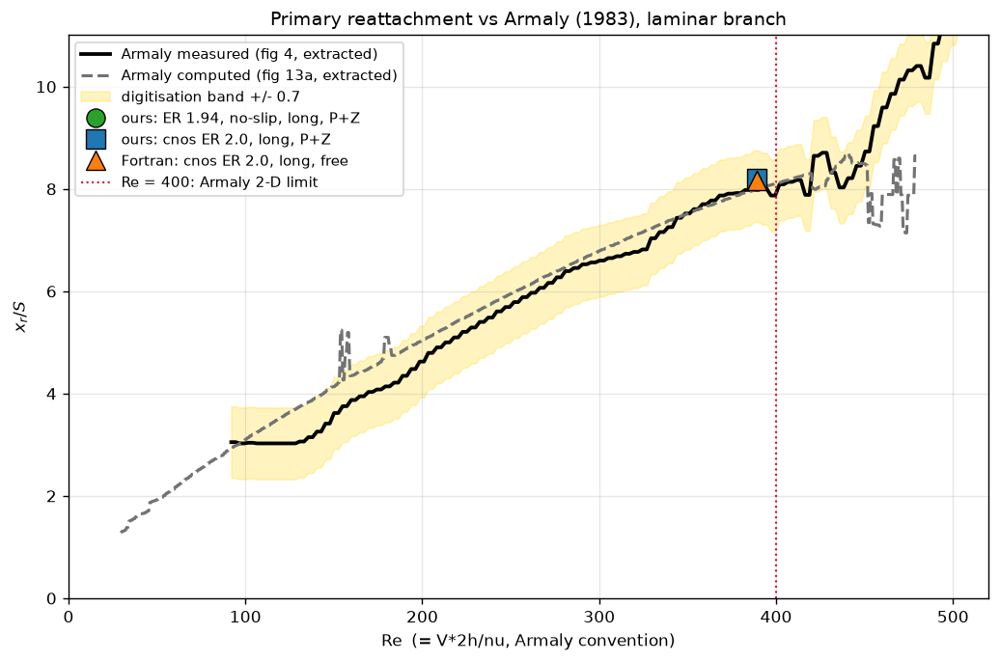
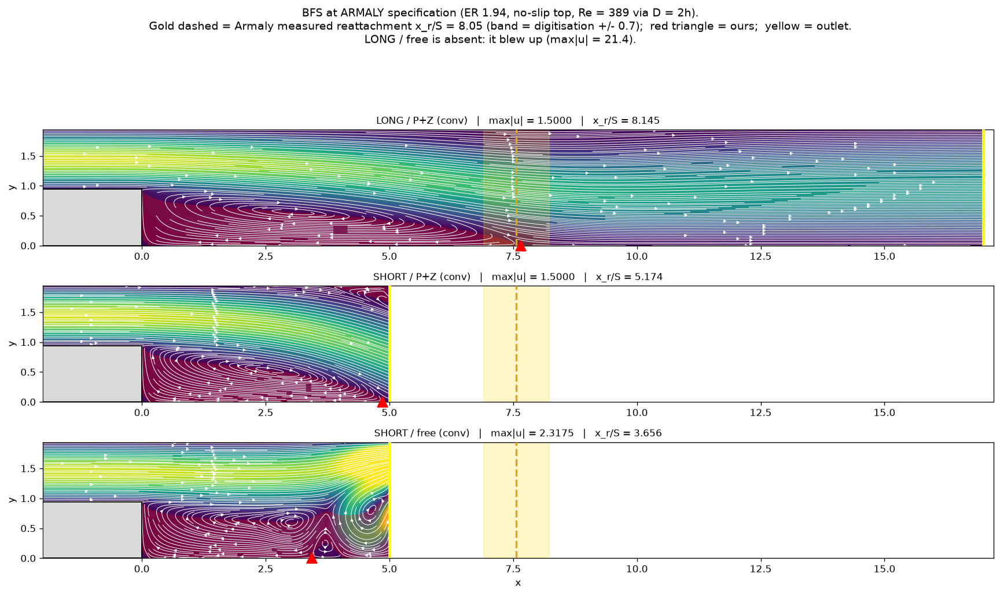
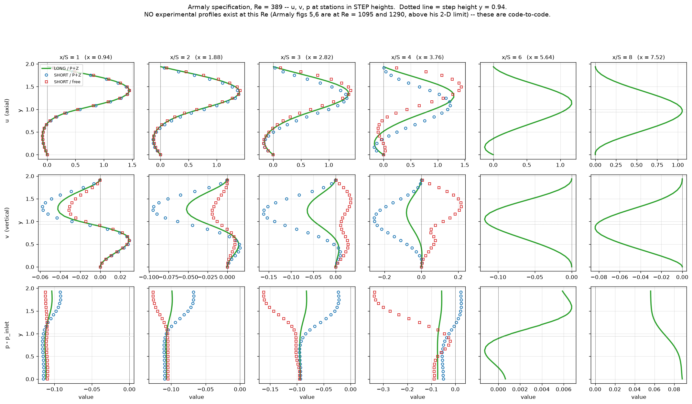
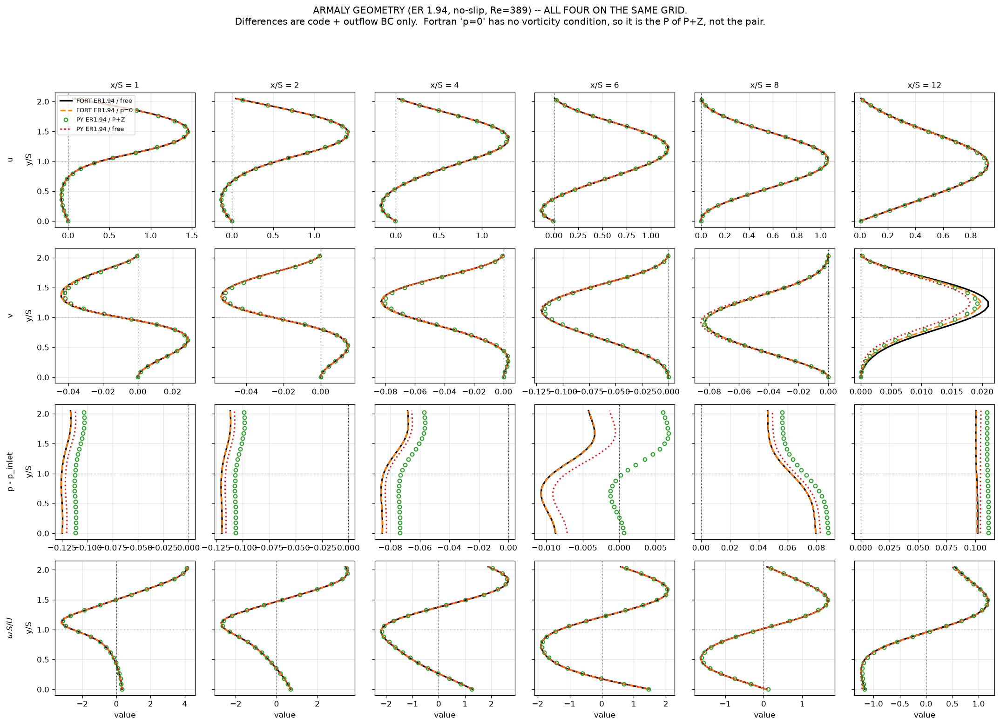
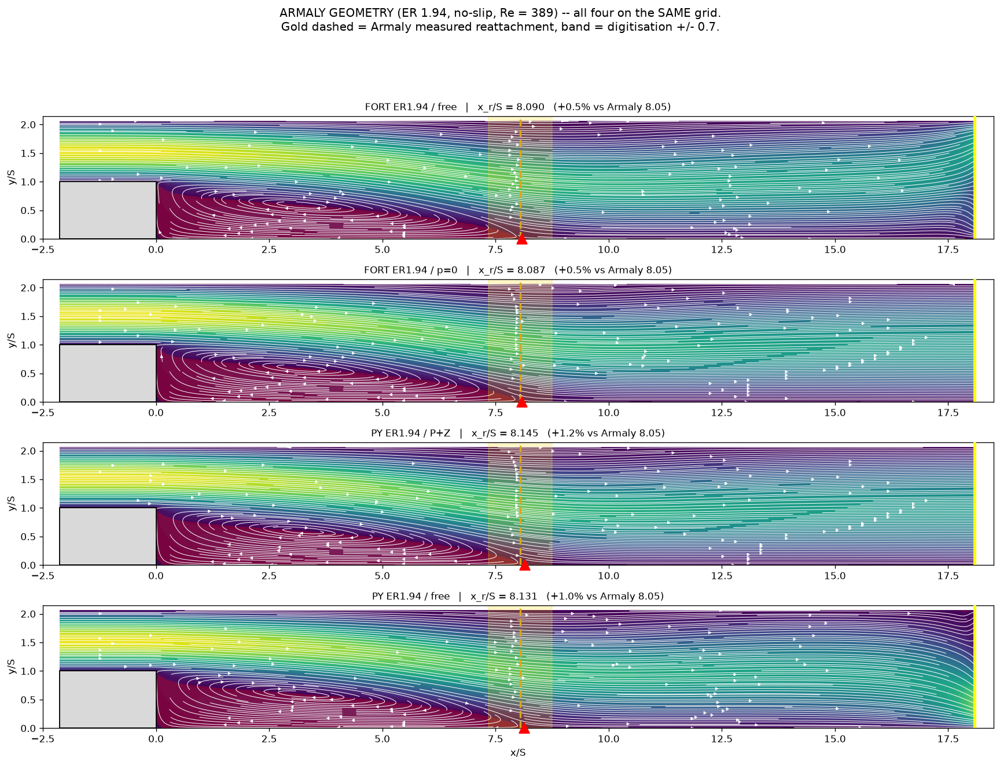

# Validation against Armaly (1983): backward-facing step at Re = 389

Study date: 2026-08-13. First run of this case with the geometry, the wall
conditions and the Reynolds convention **all simultaneously correct** — a
combination that existed in neither the Python nor the Fortran archive.

Source: B. F. Armaly, F. Durst, J. C. F. Pereira & B. Schönung, *Experimental and
theoretical investigation of backward-facing step flow*, J. Fluid Mech. **127**
(1983) 473–496. Local copy:
[`reference/armaly_durst_pereira_schonung_JFM_1983.pdf`](./reference/armaly_durst_pereira_schonung_JFM_1983.pdf).

Reproduce: `scratch/mesh_armaly_er194.py` (grids), `scratch/armaly_run.py`
(Python solves), `scratch/armaly_freeretry.py` (free-outflow stability matrix),
`scratch/armaly_compare.py` and `scratch/er194_crosscode.py` (figures),
`reference/armaly_digitize.py` (experimental data),
`F90_SEM/pmg_clean/run_armaly_er194_{free,p0}` (Fortran solves).

---

## Executive summary

1. **Reattachment matches experiment to 1.2%.** `x_r/S = 8.145` against Armaly's
   measured **8.05 ± 0.7**, at Re = 389 — just inside his Re < 400 limit for
   two-dimensional flow. Nothing was tuned; every parameter is derived.

2. **Two traps, both of which caught earlier attempts** (and my first one):
   the `armaly_*` grids in `F90_SEM/pmg_clean/` have a **symmetry top wall**, and
   the Reynolds number depends on the inlet height through `D = 2h`. Getting
   either wrong lengthens the bubble — together they gave `x_r/S = 18.0`.

3. **The 6% expansion-ratio idealisation is worth < 1%.** ER 1.94 gives 8.145,
   ER 2.0 (the `cnos` grids, Chan's simplification) gives 8.200. Every earlier
   `cnos` comparison therefore stands.

4. **Cross-code agreement at this geometry, including vorticity** (§5). Four
   solutions on the same grid — Fortran free, Fortran `p = 0`, Python P+Z, Python
   free — all reattach within **1.2% of experiment** and within **0.7% of each
   other**, with u and ω profiles agreeing to ~2e-02 and ~5e-02. The Fortran runs
   were created for this purpose; no cross-code comparison existed at ER 1.94.

5. **Free outflow survives only on a crutch, and there are two of them** (§6).
   At `a_flux = 1` with a fully-resolved solve it blows up. It converges if the
   CG iterations are **capped at 500** (leaving the linear residual at 1e-02 —
   deliberate under-solving) *or* if the momentum weight is **halved to
   `a_flux = 0.5`**. P+Z needs neither, converging at `a_flux = 1` with a full
   solve in a third to a fifth of the steps.

6. **The momentum weight really does destabilise the iteration here** — which
   partially **reinstates `POISEUILLE_DT_STUDY.md` §4**, withdrawn earlier on
   Poiseuille evidence. On Poiseuille the weight is harmless; on a BFS with an
   unconstrained outflow it decides blow-up versus convergence (§6).

7. **The truncated domain is unusable**, and the outflow condition changes how
   badly: short/P+Z gives −35.7%, short/free −54.6%. Its outlet at x/S = 5.3 sits
   *inside* the true bubble.

8. **No experimental velocity profiles exist at this Re.** Armaly's figures 5 and
   6 are at Re = 1095 and 1290, both above his own two-dimensionality limit. Only
   reattachment can be compared.

---

## How to reproduce, step by step

All commands are run from `sem_demo/`. The scripts `os.chdir` there themselves,
so they work from anywhere, but the relative paths below assume it.
Timings are wall-clock on an M-series laptop, single process unless stated.

### 0. Environment

```bash
cd /Users/danielchan/Dropbox/Apple_MLX_CFD/sem_demo
.venv/bin/python -c "import numpy, matplotlib, scipy; print('ok')"
```

`numpy` is the backend used throughout — **do not switch to numba** for anything
quantitative here (`NUMBA_BACKEND.md`: the two disagree at ~1e-06 on accumulated
states, which is the size of several effects in this study).

### 1. Build the grids  (~2 s)

The archived `armaly_*` grids have a symmetry top wall and must not be used (§2).

```bash
.venv/bin/python scratch/mesh_armaly_er194.py 17.0 grids/armaly_er194_long_grid.dat
.venv/bin/python scratch/mesh_armaly_er194.py  5.0 grids/armaly_er194_short_grid.dat
```

Verify — expect `top_bc=[1]`, `ER=1.940`, `h=1.00`, `S=0.94`:

```bash
.venv/bin/python -c "
import sys; sys.path.insert(0,'scratch'); sys.path.insert(0,'.')
from fgrid import load
m,_,_ = load('grids/armaly_er194_long_grid.dat')
top = sorted({int(m.bc[e,3]) for e in range(m.nelem)
              if abs(m.ynod[e].max()-m.ynod.max())<1e-9})
inl = [e for e in range(m.nelem) if m.bc[e,0]==3]
h = max(m.ynod[e].max() for e in inl) - min(m.ynod[e].min() for e in inl)
print(f'top_bc={top}  ER={m.ynod.max()/h:.3f}  h={h:.2f}  '
      f'S={min(m.ynod[e].min() for e in inl):.2f}  nu={2*h/389:.6e}')"
```

### 2. The four main solves  (long ~7 + ~14 min, short ~9 + ~14 min)

```bash
.venv/bin/python -u scratch/armaly_run.py long  both > scratch/armaly194_long.log  2>&1 &
.venv/bin/python -u scratch/armaly_run.py short both > scratch/armaly194_short.log 2>&1 &
wait
grep -h "/" scratch/armaly194_*.log
```

`both` runs free then P+Z. Use `free` or `pz` for one. Expect:

```
   long / free:   BLEWUP     25 steps   max|u| = 21.3692
   long /  P+Z:     conv    374 steps   max|u| = 1.5000   x_r/S = 8.145
  short / free:     conv    327 steps   max|u| = 2.3175   x_r/S = 3.656
  short /  P+Z:     conv    843 steps   max|u| = 1.5000   x_r/S = 5.174
```

Each writes `scratch/armaly_<domain>_<bc>.npz` holding `U, xnod, ynod, hy, N, nu`
— **always saved before post-processing**, so no re-solve is ever needed to answer
a follow-up question.

### 3. The free-outflow stability matrix  (8 cases in parallel, ~25 min)

One process per case; `argv = dt  legacy|w1  nitcgs`.

```bash
for a in "1.0 w1 500" "1.0 legacy 500" "1.0 legacy 200000" "1.0 w1 200000" \
         "0.5 legacy 500" "0.5 w1 500" "0.5 legacy 200000" "0.5 w1 200000"; do
  tag=$(echo $a | tr ' ' '_')
  nohup .venv/bin/python -u scratch/armaly_freeretry.py $a > scratch/fr_$tag.log 2>&1 &
done
wait
for f in scratch/fr_*.log; do grep -v "^Warning: PCG\|^ *dt " $f | grep -v "^$" | head -1; done
```

The `Warning: PCG did not converge after 500 iterations` lines are **expected and
are the point** at `nitcgs=500` — the under-solve is what regularises the free
outflow (§6). Filter them out when reading the table.

### 4. Experimental data  (~20 s)

Renders the paper's figures at 600 dpi with ghostscript and extracts the curves.
Requires `gs` on the PATH.

```bash
.venv/bin/python reference/armaly_digitize.py
```

Writes `reference/armaly_fig{4_x1_measured,13a_x1_predicted}.csv`. Expect
`measured 8.049 / predicted 8.001` at Re = 389.

### 5. Fortran cross-check  (optional, ~35 min each)

```bash
cd /Users/danielchan/Dropbox/F90_SEM/pmg_clean
for v in free p0; do
  ( cd run_armaly_er194_$v && nohup ./SEM_2D_BFS_* < in.nml > run.log 2>&1 & )
done
```

Watch `grep -c "At time=" run_armaly_er194_free/run.log` reach 1400; the final
residual should be ~8e-07. **`re = 194.5` in `in.nml`, not 389** — see §1.

### 6. Figures

```bash
.venv/bin/python scratch/armaly_compare.py     # armaly_{streamlines,profiles,reattachment}.png
.venv/bin/python scratch/er194_crosscode.py    # armaly_vs_fortran_{profiles,streamlines}.png
```

Both read only saved `.npz`/`.dat` files, so they re-run in seconds and can be
edited and repeated freely without touching the solver.

### Common pitfalls

| symptom | cause |
|---|---|
| `x_r/S ≈ 18` | symmetry-top grid — use `grids/armaly_er194_*`, not the archived `armaly_*` (§2) |
| bubble ~2× too long | `ν = 1/389` instead of `2/389`; ν depends on the grid's inlet height (§1) |
| long/free blows up at step 25 | expected at `a_flux = 1` with a resolved solve — cap `nitcgs` or halve the weight (§6) |
| a scratch import re-runs a whole sweep | some scratch scripts lack an `if __name__ == '__main__'` guard |
| results differ at ~1e-06 | numba backend; use numpy |

---

## 1. Input parameters, in full

### Geometry (paper §2.1, p. 475)

| | paper | mesh units |
|---|---|---|
| inlet channel height | h = 5.2 mm | **1.00** |
| outlet channel height | H = 10.1 mm | **1.94** |
| step height | S = H − h = 4.9 mm | **0.94** |
| expansion ratio | 1 : 1.94 | 1.940 |
| S/h | 0.942 | 0.942 |

`x/S` is normalised by **step** height, not inlet height — they differ by 6%.

### Grids — `grids/armaly_er194_{short,long}_grid.dat`

Generated by `scratch/mesh_armaly_er194.py`, adapted from
`F90_SEM/pmg_clean/mesh_armaly_long.py` with the top wall changed from symmetry
to no-slip.

| | long | short |
|---|---|---|
| x range | **[−2, 17]** | **[−2, 5]** |
| y range | [0, 1.94] | [0, 1.94] |
| elements | 72 | 72 |
| polynomial order | N = 10 | N = 10 |
| y block boundaries | 0, 0.47, 0.94, 1.44, 1.94 | same |
| inlet channel | x ∈ [−2, 0], y ∈ [0.94, 1.94] | same |
| **top wall** | **no-slip (bc = 1)** | **no-slip (bc = 1)** |
| bottom wall | no-slip (bc = 1) | no-slip (bc = 1) |
| x grading | clustered at the step, power 1.6 | same |

### Reynolds number — the definition matters (paper §2.2.1, p. 478)

> `Re = VD/ν`, where V is two-thirds of the maximum inlet velocity — i.e. the
> **average inlet velocity** — and D is "the hydraulic diameter of the inlet
> (small) channel … equivalent to **twice its height**, D = 2h".

With h = 1.0 and V = 1:

```
    D  = 2h = 2.0
    nu = V*D/Re = 2.0/389 = 5.141388e-03
```

**Using `ν = 1/389` here would be Re = 778, twice Armaly's.** On the `cnos` grids
h = 0.5, so D = 1.0 = the code's length unit and `ν = 1/389` *is* right — "the two
factors of two cancel". The correct ν depends on the grid.

### Boundary and initial conditions

| boundary | condition |
|---|---|
| inlet (x = −2, y ∈ [0.94, 1.94]) | parabolic `u = 6η(1−η)`, `η = (y−0.94)/1.0`; `u_max = 1.5`, `u_avg = 1.0`, `v = 0` |
| top wall y = 1.94 | no-slip `u = v = 0` |
| bottom wall y = 0 | no-slip `u = v = 0` |
| step faces | no-slip |
| **outlet — P+Z** | `p = 0` on the plane **and** `∂ω/∂x = 0`; u, v free |
| **outlet — free** | nothing imposed; pressure pinned at the outlet SE corner |
| initial condition | **cold start, U = 0** |

### Solver settings

| | |
|---|---|
| weights | `w_mom = w_mass = 1` (so `a_mass = fac1/dt`, `a_flux = 1`) |
| time step | `dt = 1.0`, BDF2 after the first step |
| sub-iterations | `max_newton = 1`, `newton_tol = 1e-12`, `newton_factor = 0` |
| linear solve | Jacobi-PCG, `cgsfac = 1e-3`, `cg_tol = 1e-6`, `cg_max_iter = 200000` |
| convergence test | `max\|ΔU\| < 1e-11` |
| divergence guard | `max\|u\| > 20` |
| backend | numpy (see `NUMBA_BACKEND.md` — numba differs at 1e-6 on accumulated states) |

The loose linear tolerance matches the Fortran reference runs. It also matters:
see `OUTFLOW_BC_STUDY.md` §7c on solver inexactness acting as regularisation.

### Fortran runs on the same grid (new, 2026-08-13)

Created so a cross-code comparison exists at this geometry — nothing in the F90
archive had it. Directories `F90_SEM/pmg_clean/run_armaly_er194_{free,p0}`:

```
&input
  fin='armaly_er194_long_grid.dat', fout='o.dat', re=194.5, dt=0.5, ntime=1400,
  nsub=1, iprt=0, tol=1.0e-6, nitcgs=500, istart=0,
  frun='armaly_er194_<free|p0>.dat', iform=1, cgsfac=1.e-3, nsave=50,
  ystep=0.94, hinlet=1.0,
  pmg_on=.true., pmg_levels=3, pmg_nu=2, pmg_omega=0.5, pmg_pmin=2, pmg_pmid=4,
  pmg_cheby4=.true., pmg_cheby_opt=.true., pmg_cheby_deg=10
/
```

| | |
|---|---|
| executables | `SEM_2D_BFS_FREEOUT` (free) and `SEM_2D_BFS_PMASK` (`p = 0`) |
| **`re = 194.5`, NOT 389** | the code sets `pr = 1/re` on the **mesh length unit** (`LSSEM_ALGORITHM.md` §439). With `h = 1.0` here, `D = 2h = 2.0`, so Armaly's Re = 389 needs `ν = 2/389` ⇒ `re = 194.5`. On the `cnos` grid `h = 0.5` makes `D = 1.0` and the twos cancel, which is why `re = 389` is right *there*. |
| `ntime = 1400` | twice the reference's 700: the ER 1.94 grid is twice the length scale, so steady state needs ~twice the physical time (t = 700) |
| preconditioner | p-MG, unlike our Jacobi |
| **outcome** | both converged: residual **8.2e-07** (free) and **7.8e-07** (`p = 0`) at t = 700 |

**The Fortran has no vorticity condition.** `FREEOUT`, `PMASK` and `TRACTION`
are the only outflow variants, so `PMASK` is the **P of P+Z, not the pair**.
P+Z exists only in the Python.

---

## 2. The two traps

### Trap 1 — the archived grids have a SYMMETRY top wall

```
armaly_long_grid.dat   top bc = 5   SYMMETRY   (v = 0, omega = 0, free slip)
cnos_long_grid.dat     top bc = 1   no-slip
```

Armaly's rig is a closed channel: his figure 2(b) shows non-zero vorticity at the
top wall, which is no-slip. A slip top removes the wall friction that decelerates
the jet, so the shear layer stays energetic and the bubble runs far longer.

Measured on the archived grid, everything else correct: **`x_r/S` = 18.0** against
8.05. The `F90_SEM/pmg_clean/OUTFLOW_BC_STUDY.md` records the same error in its
own §10.3 — *"§10.3 ran a symmetry top, so the entire upper half of the profile
was structurally wrong, and `re` was being tuned downward to compensate for the
missing wall friction."* I reproduced it by trusting the filename.

**No archived grid has both ER 1.94 and a no-slip top:**

| grid | ER | top wall |
|---|---|---|
| `armaly_{long,short}` | **1.94** ✓ | symmetry ✗ |
| `armaly_noslip`, `armaly_sym` | 2.0 ✗ | no-slip / symmetry |
| `cnos_{long,short}` | 2.0 ✗ | **no-slip** ✓ |

Hence the new meshes.

### Trap 2 — ν depends on the grid's inlet height

Because `Re = V·2h/ν`, doubling the inlet height doubles the ν needed for the same
Re. The archived `run_armaly_*` cases set `re = 389` on a grid with `hinlet = 1.0`
while the code takes `ν = 1/re`, giving Re = 778. Both traps lengthen the bubble,
which is why the earlier attempt "fitted" `re = 160` to recover `x_r/S = 8` — a
fitted parameter masquerading as a validation, as that study says.

---

## 3. Experimental data

The paper contains **no tables**; every quantity is a figure. Extracted with
`reference/armaly_digitize.py`, which renders the pages at 600 dpi with
ghostscript, locates axes and ticks by projection, calibrates, and takes the
median ink row per column — reproducible, not read by eye.

| file | source | points |
|---|---|---|
| `reference/armaly_fig4_x1_measured.csv` | fig 4, laser-Doppler | 180 |
| `reference/armaly_fig13a_x1_predicted.csv` | fig 13a, their TEACH code | 685 |

| at Re = 389 | `x₁/S` |
|---|---|
| **measured** | **8.05** |
| computed (TEACH) | 8.00 |

> An earlier version of this digitisation was read by eye and gave 7.0 for fig 13a
> at Re = 389 — a **14% error**. Eyeball digitisation of a scanned figure is not
> good enough.

**Validity window.** "The present experimental study yielded two-dimensional flows
only at Reynolds numbers Re < 400 and Re > 6000" (p. 474). Re = 389 sits
deliberately just inside. Above 400 a 2-D calculation should *not* match.

**What is not available.** The published velocity profiles (figs 5, 6) are at
Re = 1095 and 1290, above the 2-D limit. There is no experimental velocity
profile at Re ≈ 389, so u/v/p comparisons here are code-to-code only.

---

## 4. Results

| case | status | steps | `\|dU\|` | `max\|u\|` | `x_r` | **`x_r/S`** | vs 8.05 |
|---|---|---|---|---|---|---|---|
| **long / P+Z** | **conv** | 374 | 0.000e+00 | 1.5000 | 7.656 | **8.145** | **+1.2%** |
| long / free | **BLEWUP** | 25 | 8.4e+02 | 21.37 | — | — | — |
| short / P+Z | conv | 843 | 0.000e+00 | 1.5000 | 4.863 | 5.174 | −35.7% |
| short / free | conv | 327 | 0.000e+00 | **2.3175** | 3.437 | 3.656 | −54.6% |

Cross-check against every other route to this number:

| | ER | top wall | outflow | `x_r/S` | vs measured |
|---|---|---|---|---|---|
| **Armaly measured** | 1.94 | no-slip | — | **8.05** | — |
| Armaly computed (TEACH) | 1.94 | no-slip | `∂u/∂x = ∂v/∂x = 0` | 8.00 | −0.6% |
| **this study** | **1.94** | **no-slip** | **P+Z** | **8.145** | **+1.2%** |
| Python, `cnos` | 2.0 | no-slip | P+Z | 8.200 | +1.9% |
| Fortran, `cnos` | 2.0 | no-slip | free | 8.154 | +1.3% |
| this study, archived grid | 1.94 | **symmetry** | P+Z | **18.02** | +124% |





The long/P+Z bubble closes on Armaly's measured reattachment (gold dashed, band =
digitisation uncertainty) and recovers over the remaining 9 step heights. The
short domain, outlet at x/S = 5.3 — *inside* the true bubble — is wrong in both
variants; free additionally produces a **spurious secondary vortex** near the exit
and accelerates to `max|u| = 2.32`, 55% above the inlet peak.



Code-to-code only. The three agree at x/S = 1–2 and separate as the short outlet
is approached. As on Poiseuille and the `cnos` BFS, **v and p are far more
sensitive than u**: at x/S = 2 the axial profiles are nearly coincident while the
transverse ones are already visibly apart.

---

## 5. Cross-code at Armaly's geometry — all four on the same grid

The comparison that could not be made before: same grid, same Re, same walls, so
the only differences are **code and outflow BC**.





| case | `max\|u\|` | `x_r/S` | vs Armaly 8.05 |
|---|---|---|---|
| FORT ER1.94 / free | 1.5000 | **8.090** | **+0.5%** |
| FORT ER1.94 / `p = 0` | 1.5000 | **8.087** | **+0.5%** |
| PY ER1.94 / P+Z | 1.5000 | 8.145 | +1.2% |
| PY ER1.94 / free | 1.5000 | 8.131 | +1.0% |

**All four within 1.2% of experiment; the two codes within 0.7% of each other.**

Maximum profile differences against `FORT / free` — same grid, so code + BC only:

| x/S | | FORT `p=0` | PY P+Z | PY free |
|---|---|---|---|---|
| 2 | u | 1.68e-05 | 1.82e-02 | 1.62e-02 |
| 12 | u | 3.31e-03 | 1.06e-02 | 1.40e-02 |
| 2 | v | 7.85e-06 | 1.54e-03 | 1.31e-03 |
| 12 | v | 1.40e-03 | 2.08e-03 | 3.44e-03 |
| 2 | p | 6.71e-06 | 1.30e-02 | 3.87e-03 |
| 12 | p | 5.98e-04 | 9.75e-03 | 4.34e-03 |
| 2 | ω·S | 1.63e-04 | 4.40e-02 | 5.83e-02 |
| 12 | ω·S | 1.94e-02 | 1.52e-02 | 5.15e-02 |

Three readings:

1. **u and ω agree across both codes and all three outflow treatments** — ~2e-02
   in u, ~5e-02 in ω·S, with the curves visually indistinguishable. This is the
   first cross-code check of the **vorticity** field, and it says imposing
   `∂ω/∂x = 0` does not distort ω relative to a code that imposes nothing.
2. **The two Fortran solutions are nearly identical** — free vs `p = 0` differ by
   1.7e-05 in u at x/S = 2. On a domain this long the outflow condition is almost
   irrelevant, consistent with §7c of the outflow study.
3. **Pressure is the field that separates**, by ~1.2e-02, and **v diverges only
   near the exit** (x/S = 12). Both are boundary-datum and near-outflow effects,
   not bulk disagreement.

> **A correction.** An earlier version of these figures compared the ER 1.94
> Python run against the `cnos` (ER 2.0) Fortran solution and reported the
> difference — 2.6e-01 in u, 6.4e-01 in ω·S — as though it measured code or BC
> error. **It does not: those are two different rigs.** That comparison measured
> the geometry, and the framing was wrong. The figures above replace it. The
> geometry sensitivity is real and worth knowing (an order of magnitude larger
> than any code/BC effect) but it is a property of the apparatus, not an error.

---

## 6. What keeps free outflow alive — the stability matrix

All at ER 1.94, long domain, **free outflow throughout**, cold start
(`scratch/armaly_freeretry.py`, eight cases in parallel):

| dt | weighting | `a_flux` | `nitcgs` | status | `x_r/S` |
|---|---|---|---|---|---|
| 1 | legacy ≡ w=1 | 1.0 | 200000 | **BLEWUP** (25 steps) | — |
| 1 | w=1 | 1.0 | **500** | conv (1838 steps) | 8.146 |
| 0.5 | **w=1** | **1.0** | 200000 | **BLEWUP** (88 steps) | — |
| 0.5 | **legacy** | **0.5** | 200000 | **conv** (659 steps) | **8.131** |
| 0.5 | legacy | 0.5 | 500 | near-conv | 8.141 |
| 0.5 | w=1 | 1.0 | 500 | near-conv | 8.159 |
| 0.25 | w=1 | 1.0 | 500 | near-conv | 8.182 |

**Two independent things keep a free outflow from destroying itself:**

**(a) Capping the CG iterations.** `(1, w=1, 500)` converges where
`(1, w=1, 200000)` blows up — same everything else. The linear residual sits at
1e-02–1e-01 throughout, i.e. the solve is *deliberately unconverged*, and that is
what stabilises it. Both this project and the F90 study reached this
independently; the F90 note reads *"`nitcgs=40000` over-solves and amplifies the
near-null mode → NaN; `nitcgs=500` stops before exciting it → clean convergence.
**Iterative regularisation**."*

**(b) Halving the momentum weight.** Rows 3 and 4 differ *only* in `a_flux`
(1.0 vs 0.5) at the same dt with the same fully-converged solve: 1.0 blows up,
0.5 converges. So the momentum weight really does destabilise the iteration here.

> **This partially reinstates `POISEUILLE_DT_STUDY.md` §4**, which claimed exactly
> that and which `OUTFLOW_BC_STUDY.md` withdrew after the Poiseuille periodic test
> showed the fixed point stable at every dt. The correct statement is narrower
> than either: **on Poiseuille the weight is harmless; on a BFS with an
> unconstrained outflow it is the difference between blow-up and convergence.**
> The withdrawal over-generalised from a single case.

**P+Z needs neither crutch.** It converges at `a_flux = 1` with a fully resolved
solve — the one combination in which free outflow always fails — in 374 steps
against free's 659–1838.

Every route that reaches a steady state agrees on `x_r/S` = 8.09–8.18. The
physics is robust; only the path to it is fragile.

---

## 7. Caveats

- **Only reattachment is compared with experiment.** Everything else is
  code-to-code, because no experimental profile exists at this Re.
- **`x_r/S = 8.145 ± ?`** — the ±1.2% is against a digitised value carrying its own
  ±0.7 (±8.7%) reading uncertainty, and Armaly's own experimental tolerance is
  stated as "less than 10 percent". The agreement is well inside both, but it is
  not a 1%-accurate validation.
- **One Reynolds number, one grid resolution.** No mesh-refinement study was run
  on the new grids; the element count matches the archived long grid (72, N = 10)
  but the short grid was not coarsened, so it is *finer* per unit length than the
  long one — the short-vs-long difference therefore mixes truncation with
  resolution.
- **`dt = 1` and loose tolerances** were chosen to match the Fortran reference,
  not from a convergence study on these grids.
- **Domain length.** Armaly's own computation used `L = 4·X_R` (p. 486) — with
  `x_R = 7.66` that is L ≈ 30. Our long domain is 17, i.e. `L/X_R = 2.2`, and the
  short one 0.65. Even the long domain is shorter than the rule he considered
  necessary for the exit condition not to influence reattachment.
