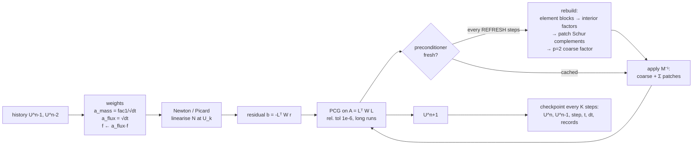
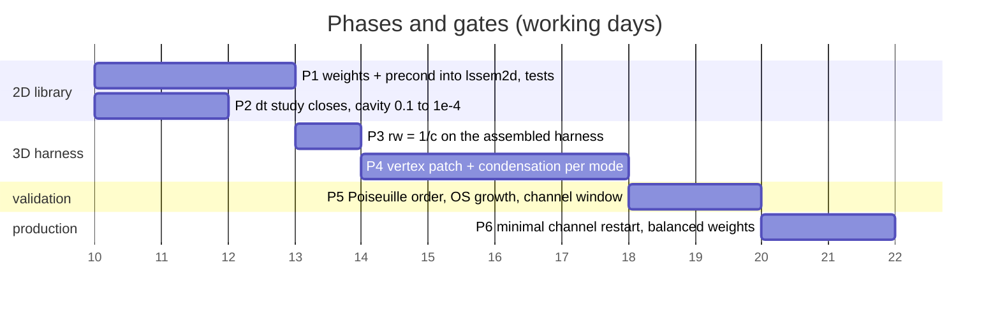

# Implementation plan: balanced weighting + condensed vertex-patch Schwarz

**Goal.** Make the least-squares (FOSLS, velocity–vorticity–pressure) time
step both *accurate at small $\Delta t$* and *cheap at high polynomial order*,
in the 2D library first and then in the 3D Fourier–SEM channel code, with a
gate at every phase.

The two ingredients have been measured separately and together in 2D:

| ingredient | what it fixes | evidence |
|---|---|---|
| balanced weighting $w_{\rm mom}=w_{\rm mass}=\sqrt{\Delta t}$ | the small-$\Delta t$ zigzag, the $\Delta t$-dependent steady state, the loss of the Orr–Sommerfeld growth rate below $\Delta t=0.1$ | ZIGZAG_CURE_RESEARCH.md §4.1, §4.4, §4.5 |
| condensed vertex-patch additive Schwarz + $p=2$ coarse | CG iteration counts that grow with $N$ and with $c=1/\Delta t$ (Jacobi: 435 → 4010 for $N$ = 5 → 20; patch: 19–21 flat) at 8–13× less memory than dense patches | LOW_MEMORY_PATCH_SOLVERS.md §3, §3.1; VERTEX_SCHWARZ_IMPLEMENTATION.md |

Sources for everything cited: ADN_FOSLS.md (theory and assembled
measurements), SCHWARZ_SEM_TUTORIAL.md (the algorithm with pictures),
CAVITY_N15_MARCH.md (the marches), CHANNEL_VALIDATION.md §6 (Orr–Sommerfeld).

---

## 0. Status (2026-09-09, end of day)

| item | state | evidence |
|---|---|---|
| balanced weighting, 2D | **validated**: steady state $\Delta t$-independent from $10^{-2}$ to $10^{-4}$; Orr–Sommerfeld <0.1 % at $\Delta t$ = 0.02/0.01 (legacy 3–6 %); second order on smooth transients; error model $C_2\Delta t^2 + C_1\Delta t\lVert R_h\rVert$ | ZIGZAG_CURE_RESEARCH.md §4.5–4.7, `figs_fosls_vs_fs/ghia_rms_vs_dt.png`, `os_balanced_vs_legacy.png` |
| balanced weighting, 3D | **blocked** with explicit convection: channel divergence 3e−1 → 6e−1 in 10 steps (legacy 8e−4); $q=1.5$ holds 3e−2 | §5.3 below, `scratch/minchan_w_*.log` |
| legacy weighting, 3D zigzag | **absent**: run01 fields have the same node-alternation statistics as the fractional-step field and less top-mode energy | ZIGZAG_CURE_RESEARCH.md §4.8, `scratch/zigzag3d.py` |
| 3D options | **in**: `weighting`, `mom_exp`, `precond`, `share_precond`; defaults unchanged; 248 + 7 tests pass | §4b |
| vertex patch + coarse, 3D | **p-independent** (36–38 it, N = 4–10) and **71 vs 4675 it** per stage on the channel; batched fp64 apply: 70 s/step on the Mac CPU (was 64 min), identical step to Jacobi | §4b, §8b, FP64_ON_APPLE_GPU.md |
| next | GEMM-form apply on Accelerate (Mac) and the GB10 timing; increment-divergence term or implicit convection for 3D; corner grading for the singular cavity | §9, FP64_ON_APPLE_GPU.md §5 |

---

## 1. The equations

### 1.1 One time step as a least-squares problem

With BDF coefficients ($\mathrm{fac}_1=\sum_m\alpha_m$: BDF1 $1$, BDF2 $\tfrac32$),
the 2D step from history $\{U^{n-m}\}$ to $U=(u,v,p,\omega)$ minimises

$$
J(U)\;=\;\Big\|\,\underbrace{\tfrac{w_{\rm mass}}{\Delta t}\big(\mathrm{fac}_1\,\mathbf u-\textstyle\sum_m\alpha_m\mathbf u^{n-m}\big)}_{\text{mass + history}}
\;+\;\underbrace{w_{\rm mom}\,\mathcal N(U)}_{\text{momentum}}\,\Big\|_0^2
\;+\;\|\nabla\!\cdot\mathbf u\|_0^2\;+\;\|\omega+u_y-v_x\|_0^2 ,
$$

$$
\mathcal N(U)=(\mathbf u\cdot\nabla)\mathbf u+\nabla p+\nu\,\nabla\times\omega-\mathbf f .
$$

In the code the momentum row is $a_{\rm mass}\,\mathbf u+a_{\rm flux}\,\mathcal N(U)$ with

| weighting | $a_{\rm mass}$ | $a_{\rm flux}$ | history | squared momentum weight | $c=a_{\rm mass}/a_{\rm flux}$ |
|---|---|---|---|---|---|
| legacy (`w_mom=w_mass=None`) | $\mathrm{fac}_1$ | $\Delta t$ | $1$ | $\Delta t^{2}$ | $\mathrm{fac}_1/\Delta t$ |
| **balanced** ($w=\sqrt{\Delta t}$) | $\mathrm{fac}_1/\sqrt{\Delta t}$ | $\sqrt{\Delta t}$ | $1/\sqrt{\Delta t}$ | $\Delta t$ | $\mathrm{fac}_1/\Delta t$ |
| time-accurate ($w=1$) | $\mathrm{fac}_1/\Delta t$ | $1$ | $1/\Delta t$ | $1$ | $\mathrm{fac}_1/\Delta t$ |

Two facts follow directly from the table and drive the whole plan:

1. **The ratio $c$ is the same in all three.** $c$ sets the operator regime
   (ADN_FOSLS.md §2: crossover $c^{\ast}\approx\nu p^4/h^2$; above it the
   $(\mathbf u,\omega)$ pair is coupled and pointwise smoothers stall). The
   preconditioner built and measured for the legacy weighting therefore
   carries over unchanged — confirmed: 24–38 CG iterations per step with
   the balanced weighting against 12–15 legacy, no stall (the $w=1$
   weighting, whose *row scale* is $\Delta t$ larger again, did stall).
2. **Only the row scale relative to the constraints changes:** $\Delta t^2\to\Delta t$.
   That is what the balanced-norm theory (Adler–MacLachlan–Madden 2019,
   ZIGZAG_CURE_RESEARCH.md §2.1) prescribes for a reaction-dominated
   first-order system, and it is what the measurements reward.

### 1.2 Why the steady state depends on $\Delta t$ — and why the balanced choice removes it

Let $C(U)$ collect the two constraint rows. A fixed point of the step map
satisfies $U=U^{n-1}=U^{n-2}=\dots$, so the mass and history terms cancel and
the residual of the momentum row is just $a_{\rm flux}\mathcal N(U^{\ast})$. The
first-order optimality condition of $J$ at that point, for every admissible
$\delta U$, is

$$
\boxed{\;a_{\rm flux}\,a_{\rm mass}\,\big\langle \mathcal N(U^{\ast}),\,\delta\mathbf u\big\rangle
\;+\;a_{\rm flux}^{2}\,\big\langle \mathcal N(U^{\ast}),\,\mathcal N'(U^{\ast})\,\delta U\big\rangle
\;+\;\big\langle C(U^{\ast}),\,C'\,\delta U\big\rangle\;=\;0\;}
$$

The **cross term** $a_{\rm flux}a_{\rm mass}$ is the part the steady
functional $a_{\rm flux}^2\|\mathcal N\|^2+\|C\|^2$ does not have: the fixed
point of the *time-stepping map* is not the minimiser of the steady
functional, it is the solution of the equation above.

| weighting | cross term $a_{\rm flux}a_{\rm mass}$ | Gauss–Newton term $a_{\rm flux}^2$ | limit $\Delta t\to0$ |
|---|---|---|---|
| legacy | $\mathrm{fac}_1\,\Delta t$ | $\Delta t^2$ | $\langle C,C'\delta U\rangle=0$: **momentum drops out**, any divergence-free, curl-consistent field is a fixed point → non-unique, mesh-scale zigzag, $\Delta t$-dependent plateau (0.0122 vs 0.0095 at $\Delta t=1$) |
| **balanced** | $\mathrm{fac}_1$ | $\Delta t$ | $\mathrm{fac}_1\langle\mathcal N,\delta\mathbf u\rangle+\langle C,C'\delta U\rangle=0$: momentum tested in $L^2$ with an $O(1)$ weight → **well-posed limit**, $\Delta t$-dependence of $O(\Delta t)$ |
| $w=1$ | $\mathrm{fac}_1/\Delta t$ | $1$ | momentum dominates the constraints by $1/\Delta t$: solvable in principle, but the operator's row scale defeats the $(\mathbf u,\omega)\mid p$ preconditioner (measured stall) |

This is the mechanism behind every measurement in ZIGZAG_CURE_RESEARCH.md:
the legacy fixed point *loses the momentum equation* as $\Delta t\to0$, the
balanced one keeps it with a fixed weight. It also says what to expect
from the running $\Delta t$ study (§6): the balanced steady states at
$\Delta t=0.1,10^{-2},10^{-3},10^{-4}$ should differ from each other by
$O(\Delta t)$ times the discretisation error, and the BDF1 and BDF2 fixed
points differ through $\mathrm{fac}_1$ (measured: a one-level restart from
the BDF2 fixed point moves by $4\times10^{-3}$ in the first step at
$\Delta t=10^{-2}$; the two-level restart moves by $2.5\times10^{-8}$).

### 1.3 The 3D form

The channel operator (lssem3d) works per Fourier mode $k_z$ with $c=1/(\beta\Delta t)$
and 7 complex unknowns $(\hat u,\hat v,\hat w,\hat p,\hat\omega_x,\hat\omega_y,\hat\omega_z)$.
The momentum rows are $c\,\hat{\mathbf u}+\nabla_k\hat p+\nu\nabla_k\times\hat{\boldsymbol\omega}-\hat{\mathbf f}$;
`momentum_row_weights` squares their weight to $1/c^2$ (legacy: row divided by
$c$ so the mass coefficient is 1). The balanced prescription is one line:

$$
\text{rw}[4{:}7]=\frac{1}{c^{2}}\;\longrightarrow\;\text{rw}[4{:}7]=\frac{1}{c}
\qquad\Big(\text{row scale } c^{-1}\to c^{-1/2};\ \text{in 2D notation } a_{\rm mass}=c\,s,\ a_{\rm flux}=s,\ s=c^{-1/2}\Big),
$$

with the history term and any body force scaled by the same factor
(the forcing rule of CHANNEL_VALIDATION.md §6: `f` carries $a_{\rm flux}$).
$c$ is unchanged, so the $c$-regime findings of 3D_STATUS.md §7U stand; the
row scale relative to the constraints rises by $c\approx5400$, so
**divergence must be re-measured** (the $w=1$ experiment bought 4.3× fewer
iterations at 109× worse $\nabla\!\cdot\mathbf u$; $1/c$ sits between the
two and has to be checked, not assumed).

### 1.4 The preconditioner

Additive Schwarz with one overlapping patch per mesh vertex and a $p=2$
coarse space (ADN_FOSLS.md §8, SCHWARZ_SEM_TUTORIAL.md):

$$
M^{-1}\;=\;P_c\,A_c^{-1}\,P_c^{\!\top}\;+\;\sum_{v}R_v^{\!\top}\,\big(R_v\,A\,R_v^{\!\top}\big)^{-1}R_v ,
$$

$R_v$ selects all dofs of the four elements around vertex $v$; $R_vAR_v^{\!\top}$
is the *assembled* operator restricted to the patch (the ring of neighbouring
elements contributes through assembly — a patch built from its own four
elements alone is singular). Each patch block is equilibrated
($D^{-1/2}A_vD^{-1/2}$) before Cholesky.

**Static condensation** orders each patch as interior dofs of its four
elements $I_1..I_4$ (nodes not on any element edge) followed by the edge/vertex
dofs $E$:

$$
A_v=\begin{pmatrix}A_{II}&A_{IE}\\A_{EI}&A_{EE}\end{pmatrix},\qquad
A_{II}=\mathrm{blockdiag}(A_{I_1I_1},\dots,A_{I_4I_4}),\qquad
S_v=A_{EE}-A_{EI}A_{II}^{-1}A_{IE},
$$

$$
x_E=S_v^{-1}\big(r_E-A_{EI}A_{II}^{-1}r_I\big),\qquad
x_I=A_{II}^{-1}\big(r_I-A_{IE}\,x_E\big).
$$

The element interior factors $A_{I_eI_e}^{-1}$ are **shared by the four patches
that contain element $e$** and stored once; only $S_v$ (dimension $\approx12N$
per field in 2D) is per patch. The result is identical to the dense patch
solve (iterations and $\kappa$ equal to the digit) at 7.7× (N=8) to 13× (N=24)
less memory and 2–4× faster applies.

---

## 2. Diagrams

### 2.1 One time step



### 2.2 A vertex patch and its ring

```
        ring element (assembled into the patch operator, dofs NOT solved)
        ┌───────┬───────┬───────┬───────┐
        │       │       │       │       │
        ├───────┼───────┼───────┼───────┤
        │       │ ●●●●● │ ●●●●● │       │      ● patch dofs: all GLL nodes of the
        │       │ ●●●●● │ ●●●●● │       │        4 elements around vertex v
        │       │ ●●●●●─v─●●●●● │       │        (2N+1)² nodes × 4 fields
        │       │ ●●●●● │ ●●●●● │       │
        ├───────┼───────┼───────┼───────┤      R_v A R_vᵀ  = rows/cols of the
        │       │       │       │       │      ASSEMBLED operator on ●
        └───────┴───────┴───────┴───────┘
```

### 2.3 Condensed patch block structure

```
  patch dofs ordered  [ I₁ | I₂ | I₃ | I₄ | E ]      I_e: (N-1)² interior nodes of element e
                                                       E : the 12N+… edge/vertex nodes (shared)
        ┌────────┬────────┬────────┬────────┬──────┐
   I₁   │ A_I₁I₁ │        │        │        │ A_I₁E│   ← A_IeIe⁻¹ factored ONCE per element,
   I₂   │        │ A_I₂I₂ │        │        │ A_I₂E│     shared by the 4 patches that use it
   I₃   │        │        │ A_I₃I₃ │        │ A_I₃E│
   I₄   │        │        │        │ A_I₄I₄ │ A_I₄E│
   E    │ A_EI₁  │ A_EI₂  │ A_EI₃  │ A_EI₄  │ A_EE │   ← S_v = A_EE − Σ_e A_EIe A_IeIe⁻¹ A_IeE
        └────────┴────────┴────────┴────────┴──────┘     factored per patch (small: ~12N·F)
```

### 2.4 The 3D layout (channel, Fourier in $z$)

```
  for each Fourier mode k_z (nk = nz/2+1, independent, batched on the GPU):
      operator A_k  (7 complex fields per node = 14 real)  — never assembled globally
      ├─ element blocks by probing apply_L on each element (once per c)
      ├─ interior factors  A_IeIe⁻¹ : 108 elements × (N-1)³·7 complex   ← 0.9 GB at N=8
      ├─ patch Schur complements S_v : 114 vertices × (face+edge+vertex nodes)·7   ← 3.3 GB at N=8
      └─ p=2 coarse (PMG2 transfers, DirectCoarse)
  three stage values of c  → refactor per stage (≈6e11 flop) or keep 3 sets (×3 memory)
```

### 2.5 Phases



(P2 runs in the background; dates are working-day placeholders)

---

## 3. Phase 1 — 2D library (lssem2d), 2–3 days

Everything below already exists in `scratch/`; this phase moves it into the
library behind stable interfaces and covers it with tests.

| step | change | file | gate |
|---|---|---|---|
| 1.1 | `SolverState(..., weighting=...)` with `'balanced'`, `'legacy'` or `'unit'` sets `w_mom, w_mass` from $\Delta t$; default stays `legacy` until 1.6 passes, then flips to `balanced` | `lssem2d/lssem.py` (`ls_coeffs` already implements the general form) | `ls_coeffs` returns $(\mathrm{fac}_1/\sqrt{\Delta t},\sqrt{\Delta t},1/\sqrt{\Delta t})$; existing tests unchanged with `legacy` |
| 1.2 | body-force helper `state.weighted_force(f)` = `a_flux*f` so callers never scale by hand (CHANNEL_VALIDATION.md §6 trap) | `lssem2d/lssem.py` | Orr–Sommerfeld base-flow gate: $\max\lvert u-U_0\rvert=0$ after 200 steps for both weightings |
| 1.3 | `lssem2d/precond.py`: `element_blocks`, `VertexSchwarzCondensed2D`, `make_coarse` moved from `scratch/vertex_schwarz2d.py`; a `PatchPreconditioner(state, refresh=100)` wrapper that owns the snapshot/rebuild cache now hand-rolled in `scratch/ghia_n15_run.py` | new | identical iteration counts to the scratch version on the N-sweep (19–21 it at N = 5…20) |
| 1.4 | `newton_step` keeps the `precond_factory` hook (the only library change so far); `pcg_solve` default tolerance becomes **relative** (`cgsfac=1e-6, cg_tol=1e-14`) — the absolute 1e-8 produced a false STEADY (CAVITY_N15_MARCH.md finding 3) and the loose 1e-2 cost 0.5 % in the growth rate over $10^4$ steps (ZIGZAG_CURE_RESEARCH.md §4.5) | `lssem2d/solver.py` | 90-test suite passes; Poiseuille temporal order ≥ 2.0 |
| 1.5 | restart with a change of $\Delta t$: `t_off` bookkeeping and a two-level restart from a steady field ($U^{n-1}=U^{n-2}$), already in `scratch/ghia_n15_run.py` (a one-level BDF1 restart injects a $4\times10^{-3}$ transient and, at $\Delta t=10^{-4}$, 154 CG iterations per step — measured in `scratch/restart_probe.py` and the first attempt of the study); **add** the unsteady case: rebuild $U^{n-2}$ at the new spacing by interpolating the stored pair | `lssem2d/timestep.py` (new) | restart from the balanced $\Delta t=10^{-2}$ steady field at the same $\Delta t$ moves $<10^{-7}$ per step |
| 1.6 | tests: (a) fixed-point test — the stored steady field is a fixed point of the balanced step to $10^{-7}$; (b) zigzag metric on the under-lid line after 200 steps at $\Delta t=10^{-2}$: sign changes ≤ 2/8 balanced, ≥ 6/8 legacy (the regression guard); (c) Orr–Sommerfeld N=10, $\Delta t=0.1$, 200 steps: local $\sigma$ within 1 % | `lssem2d/tests/test_balanced.py` | all three pass on the Mac in < 5 min |

Cost model for the 2D step (measured, N = 15, 4×4, 8 threads):

| | CG it/step | s/step | notes |
|---|---|---|---|
| legacy + Jacobi | 2709 | 1.0 | grows ∝ N |
| legacy + condensed patch | 12–15 | 1.0–1.2 | prototype apply is numpy-bound |
| **balanced + condensed patch** | 24–38 | 1.6–2.5 | same preconditioner, same $c$ |
| balanced + Jacobi | 35k+ | blew up | do not ship this combination |

The prototype's patch apply is 84 ms at N = 15 against a flop bound near
5 ms (LOW_MEMORY_PATCH_SOLVERS.md §3.1); a batched (numba/torch) apply is
the one optimisation worth doing in this phase, after correctness.

---

## 4. Phase 2 — close the $\Delta t$ study (background, running)

Runs in flight (all balanced, N = 15, 4×4, condensed patch, relative CG
tolerance $10^{-6}$):

| $\Delta t$ | $w$ | start | length | purpose |
|---|---|---|---|---|
| 0.1 | 0.316 | rest | to steady (cap 3000 steps) | upper end |
| $10^{-2}$ | 0.100 | rest | done, $t=90$: rms vs Ghia 0.0061/0.0060 | reference |
| $10^{-3}$ | 0.0316 | rest ($t=1$ continued) | to $t=90$ (89 000 steps, days) | independent check |
| $10^{-3}$ | 0.0316 | $\Delta t=10^{-2}$ steady field | 20 000 steps ($t$ 90→110) | drift to the $10^{-3}$ fixed point |
| $10^{-4}$ | 0.0100 | $\Delta t=10^{-2}$ steady field | 5 000 steps ($t$ 90→90.5; ≈16 s/step) | drift to the $10^{-4}$ fixed point (initial rate and its decay only) |

Probe already measured (`scratch/restart_probe.py`, `restart_probe2.py`):
the per-step change after the $\Delta t$ switch is concentrated at the two
lid corners ($x=0.013$ and $x=1.0$, $y=0.996$): $\max\lvert\delta u\rvert=2.6\times10^{-3}$
at $\Delta t=10^{-3}$ against an rms of $9\times10^{-5}$ and $6.9\times10^{-4}$ away
from the lid. The pressure moves most ($\max\lvert\delta p\rvert$ 0.13–0.44, at
the corner). This is the singular-corner momentum residual re-weighted, as
§1.2 predicts, not a bulk change. The deliverable is the table from
`scratch/dt_study_balanced.py` (rms/max vs Ghia, zigzag metric, drift from
the reference field, CG it/step) at every checkpoint, plus a plot of the
centreline profiles for the four $\Delta t$.

Acceptance: centreline rms vs Ghia within $\pm0.001$ of the $\Delta t=10^{-2}$
value at every $\Delta t$; zigzag sign changes ≤ 2/8 at every $\Delta t$.

---

## 4b. Implemented 2026-09-09 — the 3D options (Phases 3–4, first cut)

Both enhancements are in `lssem3d` as **input options with the validated
behaviour as the default**, so every existing run and test is unchanged
unless an option is set.

| option | where | values | default |
|---|---|---|---|
| `weighting` | `operator.momentum_row_weights(c, weighting=…)`; `channel3d.step/make_precond`; `minchan.py run/price weighting=…` | `legacy` ($q=2$), `balanced` ($q=1$), `unit` ($q=0$) | `legacy` |
| `mom_exp` | same call sites, `mom_exp=<float>` | any exponent $q$ in $w_{\rm mom}/c^{q}$ (e.g. 1.5) | none |
| `LSSEM_WEIGHTING`, `LSSEM_MOM_EXP` | environment, for the validation ladder | as above | unset |
| `precond` | `channel3d.make_precond(precond=…)`; `minchan.py run/price precond=…` | `jacobi`, `pmg`, `vschwarz` (condensed vertex patch + exact $p=2$ coarse), `vschwarz1` (patches only) | `jacobi` |
| `condense`, `pc` | `make_precond(**pkw)` / `VertexSchwarz3D(...)` | dense reference blocks; coarse order | `True`, 2 |

Example: `uv run python scratch/minchan.py price weighting=balanced precond=vschwarz`.
The options are recorded in `config.json` and the run-log header.

`lssem3d/precond.py::VertexSchwarz3D` is the port of §1.4: per Fourier mode,
element blocks by probing the unassembled per-mode operator ($n^2\cdot14$
probes per mode, one mode at a time so the transient block array is per
mode), shared element-interior Cholesky factors, per-patch edge Schur
complements, ring assembly, equilibration, and the $p=2$ coarse term through
`DirectCoarseE` with PMG's transfers.  Callable like `PMG`; a device-resident
residual is moved to the host and back (functional, not yet fast).

Gates passed (`lssem3d/tests/test_vertex_schwarz.py`, 7 tests;
`scratch/vs3d_check.py`):

| mesh | weighting | $c$ | condensed vs dense | symmetry | Jacobi it | patch + coarse it | patches only |
|---|---|---|---|---|---|---|---|
| 2×2 N=6 | legacy | 1 | 3e−14 | 3e−15 | 300 | **17** | 16 |
| 2×2 N=6 | legacy | 5405 | 4e−15 | 3e−16 | 397 | **17** | 16 |
| 2×2 N=6 | balanced | 1 | 2e−14 | 2e−16 | 303 | **17** | 16 |
| 2×2 N=6 | balanced | 5405 | 2e−12 | 1e−14 | 796 | **17** | 16 |
| 4×4 N=4 | balanced | 5405 | 1e−14 | 7e−12 | 1158 | **36** | 64 |
| 4×4 N=6 | balanced | 5405 | 2e−14 | 3e−10 | 2306 | **35** | 63 |
| 4×4 N=8 | balanced | 5405 | 6e−14 | 3e−10 | 3593 | **36** | 64 |
| 4×4 N=10 | balanced | 5405 | 1e−13 | 3e−12 | 4802 | **38** | 64 |

**Gate 4.3 (p-independence) passed on the 4×4 mesh:** 36 → 38 iterations
from N = 4 to 10 while Jacobi grows 1158 → 4802; the one-level patch
(no coarse term) sits at a flat 64, so the coarse term is worth 1.8× on a
4×4 mesh and more on larger ones.  Memory (5 modes, split-real, double):
condensed 87 / 245 / 542 / 1042 MB at N = 4 / 6 / 8 / 10 against dense
240 / 1061 / 3126 / 7315 MB (2.8× → 7×).  Build time in the NumPy prototype
2 / 11 / 53 / 272 s — the $(N-1)^6$ interior factorisations; per-mode
complex-Hermitian storage and a batched build are the step-4.4/4.5 items.
The balanced weighting doubles Jacobi's iterations at large $c$ (as in 2D)
and leaves the patch count unchanged — the $c$-regime argument of §1.1.

**On the Stage-5 time-stepping rig** (`scratch/weighting3d_gate.py`, 2×2 N=6
nz=8, $c$ = 865–1200, 20 RKW3 steps): vertex patch 13 / 11 / 13 CG
iterations per stage for legacy / balanced / $q=1.5$ against Jacobi's
515 / 467 / 359, identical solutions (profile error, divergence and decay
rate agree to all printed digits with the Jacobi rows below), 1.2 s/step
against 3.5 s with the un-batched NumPy apply.

**Gate 3.3, first measurement** (`scratch/weighting3d_gate.py`: Stage-5 rig
2×2 N=6 nz=8, laminar Poiseuille + decaying rolls, $\Delta t=5\times10^{-3}$,
$c$ = 865/960/1200 per stage, 20 RKW3 steps, CG to $10^{-8}$, Jacobi):

| weighting | rms $\nabla\!\cdot\mathbf u$ after 20 steps | profile error | $E'/E'_0$ | CG it/stage (mean) | s/step |
|---|---|---|---|---|---|
| initial state | 4.6e−6 | 0 | 1 | | |
| legacy ($q=2$) | **5.6e−8** | 2.8e−8 | 0.95988 | 515 | 3.7 |
| balanced ($q=1$) | 5.0e−6 | 2.8e−8 | 0.95994 | 467 | 1.6 |
| $q=1.5$ | 2.0e−6 | 2.8e−8 | 0.95990 | 359 | 1.4 |

The physical answer is identical (profile error and decay rate agree to five
digits); the balanced weighting **does not reduce the initial-condition
divergence** (it holds it at the 4.6e−6 the discrete initial state carries)
where legacy drives it down 80×.  That is the constraint/momentum trade
§1.3 warned about, at a milder size than the $w=1$ experiment (109×) and at
a level (5e−6 rms) far below the turbulent channel's logged divergence.
**100 steps** (same rig, Jacobi): legacy div 4.1e−8, balanced 4.4e−6 —
the balanced divergence *decays slowly* (4.55e−6 → 4.41e−6) rather than
growing, and the physical answer is identical ($E'/E'_0$ = 0.84534 for both,
profile error 5.7e−7 for both).  So the trade in 3D is: the balanced
weighting keeps whatever divergence the initial condition carries (and, in
a turbulent run, whatever the explicit convection injects per step) instead
of projecting it out each step.  §9's mitigation (increment-divergence
term) stays queued; the deciding measurement is the channel window of
Phase 5.

**Gate 5.3 measured on the turbulent channel (2026-09-09, Mac, numba,
Jacobi):** restart from run01's last checkpoint ($t=4.96$, 6×18 N=8 nz=32,
$\Delta t=8\times10^{-4}$, $c$ = 5400–7500) under the three weightings.

| weighting | rms $\nabla\!\cdot\mathbf u$: 1 step / 10 / 20 / 30 steps | $u_\tau$ at 10 steps | CG/stage |
|---|---|---|---|
| legacy ($q=2$) | 8.6e−4 / 8.5e−4 / – / – | 0.9918 | 4691 |
| balanced ($q=1$) | 3.3e−1 / **5.7e−1** (growing) / – / – | 0.9917 | 12465 |
| $q=1.5$ | 3.8e−2 / 3.6e−2 / 3.2e−2 / 3.3e−2 (flat) | 0.9918 | 2975 |

(run01's own divergence at that time: 8.6e−4.)  The bulk physics is the
same to four digits in $u_\tau$, energy and dissipation, but the balanced
weighting inherits the divergence of the explicit convective right-hand side
and it grows step by step; $q=1.5$ holds it at 40× legacy and costs 37 %
fewer Jacobi iterations.  **Conclusion: with explicit convection in 3D the
plain balanced weighting is not usable**; the 2D gains came with implicit
(Newton) convection, where the step can satisfy momentum and continuity
together.  The routes that keep the 2D benefit are (a) the space–time
increment-divergence term (§9, ZIGZAG_CURE_RESEARCH.md candidate C) or
(b) implicit convection in 3D; $q=1.5$ is the interim compromise if a
solver saving is wanted at 40× the divergence.  The balanced restart was
stopped after 10 steps; the $q=1.5$ run completed 30.

## 5. Phase 3 — 3D weighting on the assembled harness, 1 day

`scratch/adn_block_precond.py` assembles $A_k$ per mode (2×2–4×4 elements,
N 4–12, $c$ = 1 and 5405, $k_z$ = 0 and 5.88) and reports CG iterations
and $\kappa$ for Jacobi, the block preconditioners and the vertex patch.

| step | measurement | gate |
|---|---|---|
| 3.1 | `momentum_row_weights(c, w_mom=...)` with squared weight $1/c$ (a `weighting='balanced'` switch next to `MOM_WEIGHT`) | operator assembles; $A$ SPD (Lanczos $\kappa$ finite) |
| 3.2 | $\kappa$ and iterations for Jacobi, PMG, vertex patch at $c=5405$, both $k_z$, N 4–12 | patch iterations flat in $p$ (≤ 1.3× from N=4 to 12), as in 2D |
| 3.3 | **divergence and vorticity-consistency of the solution** of a manufactured Stokes step (the $w=1$ trap: 109× worse $\nabla\!\cdot\mathbf u$) | $\lVert \nabla\!\cdot\mathbf u\rVert$ within 3× of the legacy value at the same $\Delta t$; if not, try $c^{-3/2}$ as the compromise and record |
| 3.4 | 3D Poiseuille start-up temporal order (the 2D §4.4 harness has a 3D twin in TEMPORAL_ACCURACY_STUDY.md) | slope ≥ 2.0 |

Do not touch the running channel machinery until 3.3 passes.

---

## 6. Phase 4 — 3D vertex patch with condensation, 4 days

Follows VERTEX_SCHWARZ_IMPLEMENTATION.md §4 steps 1–5 with condensation
built in from the start (dense 3D patches are 32 GB at N = 8; condensed
≈ 4 GB).

```
lssem3d/precond.py
  class VertexSchwarzCondensed3D(level, refresh)
    build(c):
      for e in elements:                 # once per c
          A_e  ← probe apply_L on element e (14 real fields per node, per mode)
          F_e  ← cholesky(A_IeIe)        # (N-1)³·7 complex, shared
      for v in vertices:
          gather A_v from the assembled ring (R_v A R_vᵀ) using the element blocks
          S_v  ← A_EE − Σ_e A_EIe F_e⁻¹ A_IeE ;  equilibrate ;  cholesky
      coarse ← DirectCoarse(p=2 level)
    apply(r):  coarse(r) + Σ_v scatter( S_v⁻¹, F_e⁻¹ back-substitution )   # batched over v and k_z
```

| step | gate |
|---|---|
| 4.1 element probing per mode: block equals the assembled-harness block to $10^{-12}$ | exactness |
| 4.2 condensed patch solve equals the dense patch solve on one patch to $10^{-10}$ | exactness |
| 4.3 iterations on the 6×18 N=8 channel at $c=5405$, all 17 modes: 30–45, flat across modes | performance |
| 4.4 memory on Spark ≤ 6 GB per value of $c$ (single precision factors, double residual) | fits beside the state |
| 4.5 batched apply ≤ 2× the cost of one operator application | wall-time win over Jacobi ≥ 5× at $c=5405$ |

Known pitfalls carried forward (each cost time already): `build_mask` must
be built for the full `nk` and sliced (3D_STATUS.md trap); the $k_z=0$ mode
with pinned pressure needs its own pin inside the patch and in the coarse
operator; patches built from their own elements only are singular — always
the assembled ring.

---

## 7. Phase 5 — validation, 2 days

| test | reference | pass |
|---|---|---|
| 3D Poiseuille start-up, balanced, $\Delta t$ halving ×5 | closed form | order ≥ 2.0 |
| Orr–Sommerfeld at $k_z=0$ in the 3D code, N=10/14, $\Delta t$ = 0.1 and 0.02 | $\sigma=0.00223497$ | ≤ 0.3 % at both $\Delta t$ (legacy fails at 0.02) |
| minimal channel: restart from run01's final field, balanced weights, 1 flow-through; compare $u^+$, $u'_{\rm rms}$, $\omega'_{\rm rms}$, $p'_{\rm rms}$ over the window to the legacy window and to MKM/LM2015 (REFERENCE_DATA_RE180.md §6) | run01 statistics | within run01's own window-to-window scatter; $\nabla\!\cdot\mathbf u$ not worse than 3× |

---

## 8. Phase 6 — production choices

- **$\Delta t$.** With the balanced weighting the step is no longer limited
  by the least-squares compromise, only by the explicit convection CFL and
  by accuracy; take the CFL-limited $\Delta t$ and stop worrying about
  "$c$ too large".
- **Preconditioner refresh.** Rebuild every 50–100 steps (the frozen-snapshot
  patch lost nothing measurable in the cavity at 100); one rebuild per
  stage value of $c$ in the 3-stage scheme, or three resident sets if memory
  allows.
- **CG tolerance.** Relative $10^{-6}$ on the residual for time-accurate
  runs; $10^{-4}$ costs 0.5 % in a growth rate over $10^4$ steps.
- **Expected cost, channel N=8, per mode per step:** ≈ 40 patch iterations
  at ≈ 2 operator-equivalents each against ≈ 2000 Jacobi iterations (3D_STATUS.md
  §7U) — a 25× reduction in operator work, bounded in practice by the batched
  apply (gate 4.5).

---

## 8b. Resource estimates: Jacobi vs patch + coarse on the production channel

Anchors (measured): run01, minimal channel 6×18 elements N=8 nz=32
(17 modes), $\Delta t=8\times10^{-4}$, cuda backend on the GB10: **17.8 s/step**
(6250 steps in 30.9 h), ≈4680 CG iterations per stage at the end, i.e.
≈1.3 ms per batched CG iteration (operator apply on all 17 modes).  Patch
figures scale from the 4×4 N=8 nk=5 measurement (25 patches × 5 modes = 125
patch-modes: 542 MB condensed / 3126 MB dense, 0.58 s per NumPy apply,
36 iterations) to 114 patches × 17 modes = 1938 patch-modes.

| | Jacobi (run01) | patch + coarse, NumPy prototype | patch + coarse, batched GPU (estimate) |
|---|---|---|---|
| CG iterations per stage | ≈4680 (grows with $c$ and $N$) | 40–50 (flat) | 40–50 |
| cost per iteration | 1.3 ms | 1.3 ms + 9 s (1938 patch solves in Python) | 1.3 ms + 4 ms (fp32 factors) … 17 ms (fp64) |
| per stage | 6 s | 6–7 min | 0.2–0.9 s |
| **per step (3 stages)** | **18 s** | **≈20 min** (not viable) | **0.6–2.7 s → 7–30×** |
| factor memory, one $c$ | ≈0 | 8.4 GB (split-real double) | 2.1 GB (complex-Hermitian fp32) |
| factor memory, three stage values of $c$ | ≈0 | 25 GB | 6.3 GB (or refactor per stage) |
| dense patches for comparison | | 48 GB per $c$, 145 GB for three | does not fit the 121 GB Spark |
| build, one $c$ | 0 | ≈20 min (probes + factorisations in Python) | ≈5 s (1134 batched probes + 2e12 flop) |

Flop content of one patch apply at N=8, split-real: Schur solve 1302² × 2
plus four interior back-substitutions 686² × 4 and couplings 2 × 686 × 1302
≈ 1.8e7 per patch-mode, 3.5e10 per CG iteration over the channel (1.7e10
in complex-Hermitian form).  That is the number the GPU rate is applied to;
the 4 ms figure assumes ≈10 TFLOP/s effective on batched fp32 triangular
solves, the 17 ms figure ≈2 TFLOP/s fp64.

**At N = 12** (the next order up): patch dofs 1694 interior / 1974 edge per
field-block, ≈27 MB per patch-mode split-real double → 52 GB per $c$
(13 GB complex fp32); ≈1.6e11 flop per iteration → ≈16 ms fp32; with
Jacobi's count growing to 7–9k the estimate is 2.3 s/step against ≈75 s,
≈30×.  Raising N is the direction that costs $(N-1)^6$ in the build and
$\sim N^4$ in memory; refining in $h$ is linear in both.

**2D, measured (cavity 4×4 N=15, 8 threads, NumPy):** Jacobi 2709 it/step at
1.0 s; condensed patch 20 it/step at 1.65 s CG + 8 s one-time build,
80 MB stored; flop bound of the same apply ≈0.1 s/step.  The prototype is
apply-bound in Python, not in arithmetic — the same conclusion as the 3D
column.

**Weighting has no resource cost of its own:** the balanced weighting leaves
the patch iteration count unchanged (17 vs 17; 11 vs 13 per stage on the
rig) and changes Jacobi's by −10 % to +100 % depending on $c$; $\Delta t$
remains CFL-limited by the explicit convection.

**Measured on the channel itself (2026-09-09, Mac, numba operator, NumPy
patch apply, legacy weighting, restart from run01 at $t=4.96$, one shared
patch preconditioner built at the middle stage's $c$ = 6000 and reused for
$c$ = 5400 and 7500):** worst-stage CG **77 iterations against Jacobi's
4675** (61× fewer), identical step ($u_\tau$ 0.9937, div 8.64e−4, energy and
dissipation to all printed digits).  Build 40 min and 18 GB stored
(split-real double; three separate builds would have been 54 GB, hence the
`share_precond` option); the step itself took 64 min because the 1938
patch solves per iteration run in a Python loop (≈16 s per iteration
against 1.3 ms for the operator).  The iteration count is the production
number; the time is the prototype's.

**Step 4.5 done on the Mac (2026-09-10, fp64, `precond=vsbatch`,
`lssem3d/precond.py::VertexSchwarzBatched3D`, FP64_ON_APPLE_GPU.md §3):**
padding to uniform block sizes, factor sharing by mask pattern (3 element
and 5 patch types per mode on the channel, 5 and 11 at $k=0$ with the pin,
verified equal to round-off before sharing), one back-substitution per
element, torch batched `cholesky_solve` with the modes stacked.  Equal to
the reference to 3e−15.  Channel, per stage value of $c$: build 2.3 min and
1.4 GB (was 40 min, 18 GB); apply 0.21 s per CG iteration (was 16 s);
**full step 70 s on the Mac CPU (71 CG/stage) against 64 min before and
≈80 s for Jacobi's 4675/stage**; a two-step restart from run01 reproduces
the Jacobi step to every logged digit (`scratch/minchan_vsb_legacy.log`).
The apply is now arithmetic-bound at ≈70 GFLOP/s on the CPU's batched
solves; the GEMM form with precomputed inverses runs the same work at
300+ GFLOP/s on Accelerate (≈30 ms), and the GB10's native FP64 is the
production target.

Bottom line: patch + coarse turns the channel solve from ≈18 s/step into an
estimated 1–3 s/step for ≈6 GB of factors, provided the apply is batched on
the device (step 4.5).  Without that step it is a correctness tool only.

## 9. Risks and what to do about them

| risk | signal | mitigation |
|---|---|---|
| balanced $1/c$ weight degrades $\nabla\!\cdot\mathbf u$ in 3D | gate 3.3 | intermediate exponent $c^{-3/2}$; or keep $1/c$ and add the increment-divergence term of the space–time theory (ZIGZAG_CURE_RESEARCH.md candidate C) |
| 3D patch memory at N > 8 | 148 GB dense at N=12; condensed ≈ 15–20 GB | condensation is the plan; beyond N=12 refine in $h$ (linear) not $p$ ($(2N+1)^4$) |
| BDF1 restart transient when $\Delta t$ changes | $4\times10^{-3}$ first-step jump | two-level restart (step 1.5) |
| accumulated CG error on long runs | growth-rate drift, false STEADY | relative tolerance $10^{-6}$; steady criterion on $\max\lvert\Delta U\rvert/\Delta t$ with the relative tolerance |
| patch apply too slow in numpy | 84 ms at N=15 vs 5 ms bound | batched kernel (numba on the Mac, torch/cupy on Spark) — same code path as the 3D port |

---

## 10. Files

Existing: `lssem2d/lssem.py` (`ls_coeffs`, weights), `lssem2d/solver.py`
(`precond_factory` hook), `scratch/vertex_schwarz2d.py`
(`VertexSchwarzCondensed2D`, `make_coarse`), `scratch/ghia_n15_run.py`
(restartable driver with `t_off`), `scratch/os_run_balanced.py`,
`scratch/pois_temporal_balanced.py`, `scratch/dt_study_balanced.py`,
`scratch/restart_probe.py`, `scratch/adn_block_precond.py` (3D assembled
harness), `lssem3d/operator.py` (`momentum_row_weights`), `lssem3d/precond.py`
(PMG, DirectCoarse, `_Level`).

To create: `lssem2d/precond.py`, `lssem2d/timestep.py`,
`lssem2d/tests/test_balanced.py`, `lssem3d/precond.py::VertexSchwarzCondensed3D`,
`lssem3d/tests/test_vertex_schwarz.py`.
