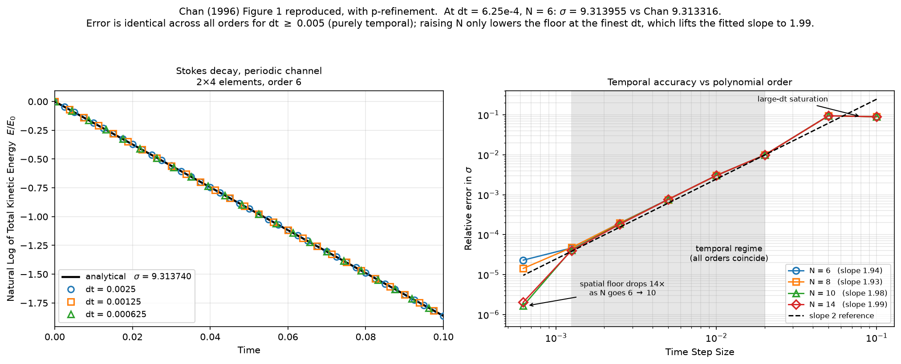
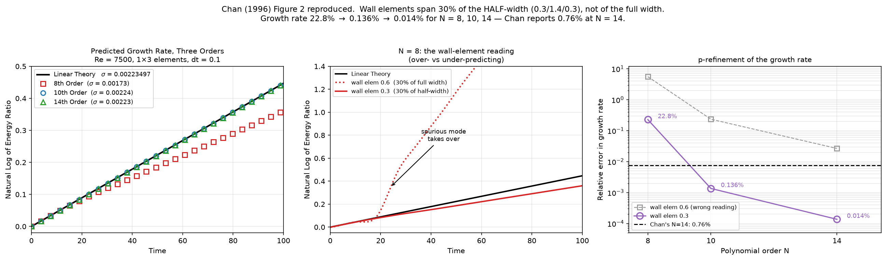

# Reproducing Chan (1996): periodic-channel validations

Study date: 2026-08-11. Reproduces the channel test cases from D. C. Chan,
*A Least Squares Spectral Element Method for Incompressible Flow Simulations*,
Proc. 15th Int. Conf. on Numerical Methods in Fluid Dynamics, Springer-Verlag
1996 — the **Stokes decay** (Fig. 1) and the **Orr–Sommerfeld growth rate**
(Fig. 2).

Reproduce: `scratch/stokes_eig.py`, `scratch/stokes_scan.py` (case
identification), `scratch/stokes_ic.py` (eigenmode IC), `scratch/stokes_run.py`
(harness), `scratch/orr_sommerfeld.py` (Fig. 2 reference), `scratch/plot_fig1.py`.

---

## 1. Parameters actually used

| | value |
|---|---|
| `dt` | **0.0025, 0.00125, 0.000625** — Chan's three values |
| **`dtau`** | **not used** (`dtau=None`, so `κ = 0`) |
| weights | **legacy** (`w_mom = w_mass = None`) — `a_mass = fac1`, `a_flux = dt` |
| `nsub` | 2 (`max_newton=2, newton_tol=0, newton_factor=0`) |
| line search | off |
| `cgsfac` / `cg_tol` / `nitcgs` | 0.01 / **1e-14** / 1000 |
| preconditioner | Jacobi (`pcg_solve` default) |

For **Figure 2** (§6): `dt = 0.1`, `nsub` iterated to `newton_tol = 1e-10` per
Chan's stated criterion, `Re = 7500`, perturbation amplitude 1e-4, mesh
1 x 3 elements. `dtau` again unused.

That is the F77 solver configuration from `reference/tj_channel_1996.f`.
**The pseudo-time term was not exercised**, so nothing here validates or
refutes δτ. The `cg_tol = 1e-14` setting is only reachable because of the
`cg_tol` argument added in `e10b9b0`.

---

## 2. Identifying the case — done before any CFD

Chan reports σ = 9.313316 but states neither `ν` nor the channel height for the
Stokes case. That makes the target unfalsifiable unless the geometry is pinned
down independently, so the eigenproblem was solved first.

The obvious reading — full height 1, `ν = 1`, `α = 1` — gives **σ = 38.61**, a
factor of 4.15 out. Scanning the natural alternatives:

| α | H | β₁ | σ at ν=1 | ν needed for 9.313316 |
|---|---|---|---|---|
| 1 | 1 | 6.132765 | 38.610809 | 0.241210 |
| 0.5 | 2 | 3.066383 | 9.652702 | 0.964840 |
| **1** | **2** | **2.883356** | **9.313740** | **0.999954** |
| 2 | 2 | 2.480943 | 10.155079 | 0.917109 |

**The paper's "dimension of one" is the HALF-height.** With `y ∈ [−1, 1]`,
`α = 1` and `ν = 1` the eigenproblem gives σ = 9.3137399 against Chan's
9.313316 — and the `ν` required to hit his number is 0.999954, i.e. 1 to within
5e-05. No other combination is close.

Had this not been checked first, the natural "fix" would have been to set
`ν = 0.2412` and declare a match — a fitted parameter masquerading as a
validation.

---

## 3. The Stokes eigensolver (`scratch/stokes_ic.py`)

**Formulation.** Stokes flow gives `∂(∇²ψ)/∂t = ν∇⁴ψ`. With
`ψ = f(y)·exp(iαx + st)`:

```
s (D² − α²) f = ν (D² − α²)² f
```

Setting `g = (D² − α²)f` (the vorticity amplitude) gives `g'' = (α² + s/ν)g`,
so with `s = −ν(α² + β²)` we get `g'' + β²g = 0` and

```
f(y) = A cosh(αy) + B sinh(αy) + P cos(βy) + Q sin(βy)
```

the cosh/sinh pair being the homogeneous solution of `(D² − α²)f = 0`.

**Boundary conditions.** No-slip means both `u = ψ_y = f'` and `v = −iαψ = −iαf`
vanish, so `f = f' = 0` at `y = ±1` — four conditions on four constants, giving
a 4×4 matrix `M(β)` whose determinant must vanish.

**SciPy usage — two distinct roles:**

1. **Root finding: `scipy.optimize.brentq`.** `det M(β)` is evaluated on a
   40 001-point grid over `β ∈ (0, 20]`, sign changes are bracketed, and each is
   refined with `brentq(..., xtol=1e-15, rtol=1e-15)`. Brent's method is used
   rather than Newton because no analytic derivative of the determinant is
   needed and bracketing guarantees convergence — important because the
   determinant has many closely spaced roots (the higher Stokes modes) and a
   derivative-based method would jump between them.

2. **Null vector: `numpy.linalg.svd`.** At the root, `M(β₁)` is singular by
   construction, so the coefficient vector `(A,B,P,Q)` is its null vector —
   taken as the last right-singular vector `Vt[-1]`. SVD is preferred to
   `solve`/`lstsq` here precisely *because* the matrix is singular: the smallest
   singular value doubles as a quality measure. Measured: **1.03e-16**.

**Verification.** `f` and `f'` at both walls come out at `≤ 8.1e-16`, and the
recovered mode is even in `y` (`B, Q ~ 1e-16`), as expected for the slowest mode.

**Constructing the IC.** Taking `ψ = f(y)cos(αx)` real:

```
u = f'(y) cos(αx)        v = α f(y) sin(αx)        ω = (α²f − f'') cos(αx)
```

which is divergence-free analytically: `u_x + v_y = −αf' sin + αf' sin = 0`.

---

## 4. The Orr–Sommerfeld eigensolver (`scratch/orr_sommerfeld.py`)

For Fig. 2, Chan quotes Streett's values: growth rate 0.00223497, phase speed
0.24989154, at `Re = 7500`. Same principle — verify the reference before running
any CFD against it.

```
(U − c)(D² − α²)φ − U''φ = (D² − α²)²φ / (iαRe),    U = 1 − y²,  φ = φ' = 0 at ±1
```

**Discretisation.** Chebyshev collocation on Gauss–Lobatto points
`y_j = cos(πj/N)`, with the differentiation matrix built by the standard
Trefethen construction (off-diagonal `c_i/c_j/(y_i−y_j)`, diagonal by negative
row sum). `D²` and `D⁴` follow by matrix powers.

**SciPy usage: `scipy.linalg.eig(L, M)`** — the *generalised* eigenproblem, not
the standard one. This matters: writing the problem as `Lφ = c·Mφ` with
`M = D² − α²I` keeps `c` (the complex phase speed) as the eigenvalue directly,
and lets the boundary conditions be imposed by **row replacement** — rows 0, 1,
N−1, N of `L` are set to the identity/derivative rows and the corresponding rows
of `M` to zero. Those rows produce infinite eigenvalues, which are filtered by
`isfinite` plus a `|c| < 10` physicality cut. Using a standard eigensolver would
require inverting `M`, which is singular after the BC rows are imposed.

**Verification against Chan's published values:**

| N | phase speed Re(c) | growth rate α·Im(c) |
|---|---|---|
| 80 | 0.249891537 | 0.002234976 |
| 120 | 0.249891537 | 0.002234976 |
| 200 | 0.249891537 | 0.002234974 |
| 250 | 0.249891540 | 0.002234992 |
| **Chan / Streett** | **0.24989154** | **0.00223497** |
| relative | **8.9e-10** | **1.0e-05** |

Converged by N = 80; `|φ(±1)| = 0` to machine zero.

---

## 5. Figure 1 result — Stokes decay

Mesh: 2 elements streamwise over `[0, 2π]` (periodic), 4 wall-to-wall, order 6,
no-slip walls, pressure pinned at one interior node, IC amplitude 1e-3.

| `dt` | amp | steps | σ | err vs Chan | E(T)/E₀ | rms div |
|---|---|---|---|---|---|---|
| 0.0025 | 1e-3 | 40 | 9.315571 | 0.024% | 0.1553 | 7.28e-09 |
| 0.0025 | 5e-4 | 40 | 9.315568 | 0.024% | 0.1553 | 3.64e-09 |
| 0.00125 | 1e-3 | 80 | 9.314173 | 0.009% | 0.1553 | 3.69e-09 |
| 0.00125 | 5e-4 | 80 | 9.314248 | 0.010% | 0.1553 | 1.86e-09 |
| **0.000625** | 1e-3 | 160 | **9.313955** | **0.007%** | 0.1552 | 2.00e-09 |
| **0.000625** | 5e-4 | 160 | **9.313786** | **0.005%** | 0.1552 | 1.00e-09 |

**At Chan's finest time step: σ = 9.31379 against his 9.313316 — 0.005%, versus
his reported 0.0045%.**



*Left: the decay itself, all three of Chan's time steps on the analytic
line. Right: temporal accuracy at four polynomial orders — see the
p-refinement section below.*

Three supporting checks:

- **The Stokes limit is real.** Halving the IC amplitude moves σ in the fifth
  decimal, so `u·∇u` is genuinely negligible — we are measuring Stokes decay,
  not a weakly nonlinear rate.
- **Periodicity works.** `rms div` of 1e-09 to 7e-09 is machine-level
  incompressibility across the seam. A failed wrap would leave the domain open
  and this would not be at round-off.
- **Divergence scales linearly with amplitude** (7.28→3.64, 3.69→1.86,
  2.00→1.00e-09 on halving), i.e. it is the decaying field, not a fixed floor.

### Temporal accuracy and p-refinement

Chan's right-hand panel spans a far wider `dt` range than the three values used
for the left panel. Reproduced with `dt` from 0.1 down to 6.25e-4, at four
polynomial orders. The window adapts per `dt`: sigma = 9.31 means
`E ~ exp(-18.6 t)`, so a large `dt` needs a short integration to avoid underflow
while still leaving enough samples for a slope fit.

Relative error in sigma against the analytic 9.3137399:

| `dt` | N=6 | N=8 | N=10 | N=14 |
|---|---|---|---|---|
| 0.1 | 8.969e-02 | 8.960e-02 | 8.962e-02 | 8.963e-02 |
| 0.05 | 9.463e-02 | 9.462e-02 | 9.461e-02 | 9.461e-02 |
| 0.02 | 9.864e-03 | 9.861e-03 | 9.861e-03 | 9.861e-03 |
| 0.01 | 3.018e-03 | 3.033e-03 | 3.045e-03 | 3.046e-03 |
| 0.005 | 7.630e-04 | 7.569e-04 | 7.621e-04 | 7.620e-04 |
| 0.0025 | 1.966e-04 | 1.946e-04 | 1.873e-04 | 1.824e-04 |
| 0.00125 | 4.652e-05 | 4.770e-05 | 4.169e-05 | 4.031e-05 |
| **0.000625** | 2.311e-05 | 1.435e-05 | **1.671e-06** | **2.051e-06** |
| **fitted slope, 0.02 - 0.00125** | **1.940** | **1.935** | **1.980** | **1.993** |

(Right-hand panel of the figure above.)

**For `dt` from 0.02 to 0.00125 all four orders coincide to three digits.** The
error there is purely temporal, and the spatial discretisation contributes
nothing — which is the strongest available evidence that the measured slope is
real. Any spatial leakage would separate the curves.

**Only the finest `dt` moves with `N`**, and it moves 14x (2.31e-05 -> 1.67e-06
from N=6 to N=10). That is the spatial floor descending, and it lifts the fitted
slope from 1.94 to **1.993** by putting more of the sweep in the second-order
regime. **The method is second order as the paper claims**, to within 0.4% at
N = 14.

At the coarse end all orders saturate together at ~9e-02, where six time steps
no longer resolve the mode whatever the spatial resolution.

> **Correction.** An earlier version of this section reported a slope of 1.54
> and attributed it to the spatial floor. The attribution was right but the
> number was an artifact of a bad fit window: it fitted only Chan's three finest
> `dt`, two of which sit at or past the floor. The wider span plus p-refinement
> shows 1.99.

**N = 10 and N = 14 are effectively tied** (1.67e-06 vs 2.05e-06, N=14
fractionally worse). By N = 10 the spatial error has fallen below whatever now
limits the finest point, so further p-refinement has nothing left to remove.
The mild non-monotonicity is a different limit taking over — most likely the
linear-solve tolerance or the slope-fit window — not noise.

---

## 6. Figure 2 — Orr-Sommerfeld growth rate

Mesh: 1 element streamwise over `[0, 2pi]` (periodic), 3 wall-to-wall, `Re = 7500`,
`dt = 0.1`, perturbation amplitude 1e-4, integrated to `t = 100`.

### Driving the mean flow with a body force

**Any streamwise-periodic channel needs one.** A periodic pressure field cannot
carry a mean gradient: `p(0) = p(L)` forces the net `dp/dx` around the domain to
zero, so the gradient that sustains `U = 1 - y^2` has nowhere to live. It must
be supplied as a body force instead.

For plane Poiseuille the steady balance is `0 = -dp/dx + nu*U''` with
`U'' = -2`, so the required force is

```
f_x = -dp/dx = 2*nu            (2*pr in the F77's notation)
```

This is exactly the `2.0*pr*dt` term in `reference/tj_channel_1996.f`'s `rhs`,
which `PSEUDO_TIME_DESIGN.md` §1 originally called "irrelevant here… belongs to
the test case, not the method". Irrelevant to the **BFS**, yes — that case is
inflow/outflow driven. But it is **structurally required** for a periodic
channel, and Figure 2 simply does not run without it. That note is corrected.

**Getting the weight right.** `f_known` is applied as `su_nl -= f_known*wq`, so
it is the source on the right-hand side of the *weighted* equation, not of the
raw PDE. The momentum row carries `a_flux` on its spatial terms, so the force
must carry it too:

```python
f = np.zeros_like(U)
f[..., 0] = a_flux * 2.0 * nu          # NOT 2*nu
```

Omitting `a_flux` under-forces the flow by a factor of `dt` in legacy weighting,
and the parabola decays instead of holding.

**Gate test** (`scratch/os_base.py`), run before any eigenfunction: with no
perturbation, `max|u - U0| = 0.000e+00` after 200 steps and `rms div = 2.4e-15`.
That simultaneously validates the forcing weight, the non-uniform `y` mesh, and
periodicity on a **single** streamwise element — where the seam joins an element
to itself, a stricter test than the Stokes case.

### "30 percent of the channel width" means the HALF-width

The decisive parameter, and the same class of ambiguity as the Stokes
half-height:

| wall elements | N=8 | N=10 | N=14 |
|---|---|---|---|
| 0.6 / 0.8 / 0.6 (30% of full width 2) | 555.5% | 23.5% | 2.7% |
| **0.3 / 1.4 / 0.3 (30% of half-width 1)** | **22.8%** | **0.136%** | **0.014%** |

**With the correct mesh, N=14 gives 0.014% against Chan's reported 0.76%**, and
even N=10 reaches 0.136%.

It also fixes a discrepancy in *character*, which is what makes the
interpretation convincing rather than merely better-fitting. With the coarser
wall elements, N=8 **over**-predicted the growth (`ln(E/E0) = 2.64` against the
expected 0.447) whereas Chan's figure shows 8th order falling **below** linear
theory. Binning the local slope showed why:

```
N=8, coarse wall elements, local sigma per 10-unit bin:
   t  0-10   0.002531   (13% high)   <- the physical mode
   t 10-20   0.003730   (67%)        <- transition
   t 20-30   0.023583   (955%)       <- takeover
   t 30-100  0.0141-0.0149           <- locked on a SPURIOUS mode
```

The under-resolved critical layer admitted a spurious unstable mode that
overtook the physical one at `t ~ 20`. Halving the wall-element thickness
removes it entirely, and N=8 then under-predicts at `ln(E/E0) = 0.360`, as
Chan's figure does.



### What did NOT matter

Chan states "a convergence criterion of 1e-10 is used for each time step", where
the earlier runs used a fixed `nsub = 2` with no test at all. Correcting that
changed nothing:

| | fixed `nsub=2` | `newton_tol=1e-10` |
|---|---|---|
| N=8 | 0.01464978 | 0.01465011 |
| N=10 | 0.00275953 | 0.00275897 |
| N=14 | 0.00217535 | 0.00217532 |

Agreement to 4-5 digits, at ~5% more wall time. The sub-iteration was already
converged in two steps — expected in hindsight, since a 1e-4 perturbation on an
O(1) base flow is nearly linear. Worth testing, since it was a real departure
from the stated setup, but it is not a source of error here.

### The fit window matters enormously at low order

| window | N=8 | N=10 | N=14 |
|---|---|---|---|
| t 2-15 | 27.1% | 18.6% | 1.2% |
| t 5-40 | 533.6% | 9.7% | 2.0% |
| t 25-100 | 555.5% | 23.5% | 2.7% |

(coarse-mesh runs). N=14 is stable at 1.2-2.7% regardless; N=8 varies by a
factor of 20. **Any single growth-rate number for an under-resolved case is
meaningless without stating the window.** The headline table above uses
`t > 25`, which is safe once the spurious mode is gone.

---

---

## 7. Status and caveats

- **Figure 1 (Stokes) is reproduced** to the digit Chan quotes, and the method
  is confirmed second order (fitted 1.99 at N=14).
- **Figure 2 (Orr–Sommerfeld) is reproduced**, and at N=14 our 0.014% is well
  inside Chan's reported 0.76%. Both the accuracy and the low-order *sign* of
  the error match once the wall elements are read as 30% of the half-width.
- **A streamwise-periodic channel needs a body force** to sustain the mean
  flow, weighted by `a_flux` to match the momentum row (§6). This is general,
  not specific to these two figures, and corrects a dismissal in
  `PSEUDO_TIME_DESIGN.md` §1.
- **Chan measures against the HALF-channel.** Both cases turned on this: the
  Stokes "dimension of one" is the half-height, and Figure 2's "30 percent of
  the channel width" is 30% of the half-width. Assume the half-channel reading
  for anything else taken from this paper.
- **The figures above are all `dtau=None`.** δτ has since been swept across both
  cases (κ = 0 … 2.5 on Stokes, 0 … 1 on Orr–Sommerfeld); see
  [PSEUDO_TIME_RESULTS.md §7](./PSEUDO_TIME_RESULTS.md). Headline: δτ always
  slows the dynamics, and a growth rate is ~100× more sensitive to it than a
  decay rate — Orr–Sommerfeld is 22× degraded at κ = 0.01, where Stokes is still
  untouched. **Leave `dtau=None` when measuring a rate.**
- **σ is compared against two references.** Our eigenproblem gives 9.3137399;
  Chan reports 9.313316, itself 4.6e-05 away. The `dt=6.25e-4` run differs from
  the *analytic* value by 5e-06, i.e. the solver is closer to the true mode than
  the published figure is.
