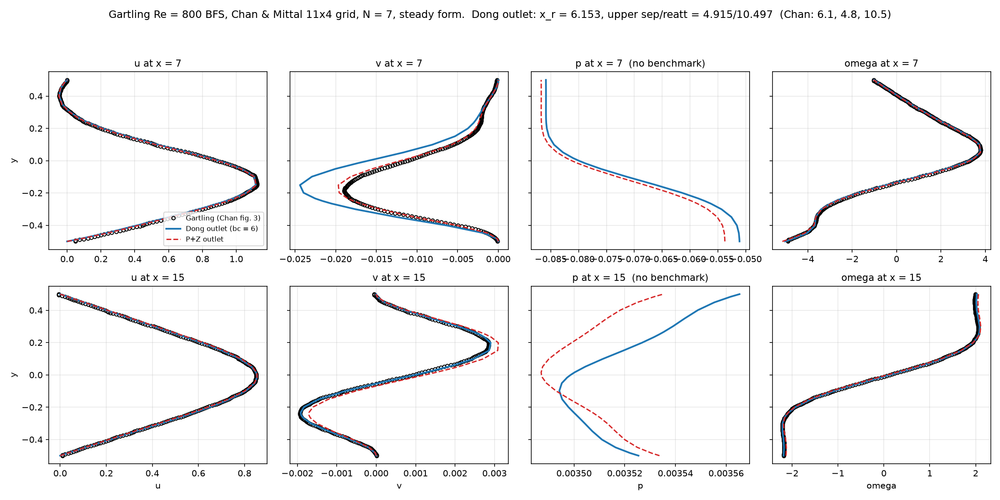
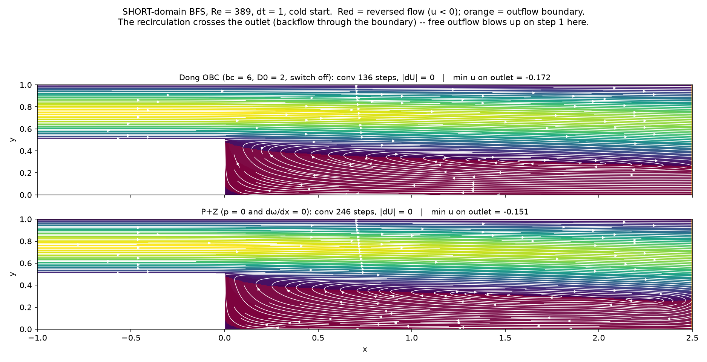
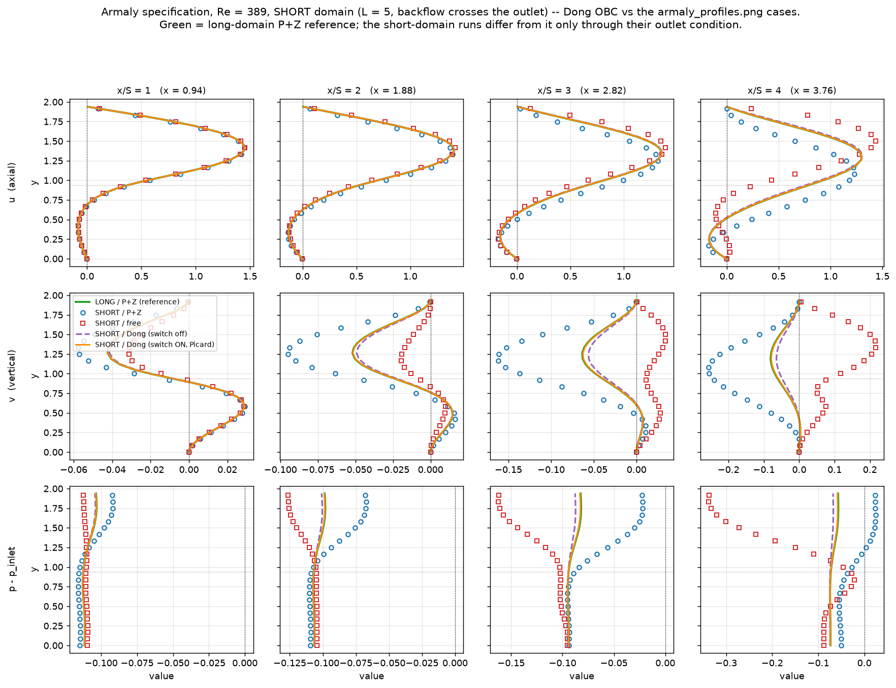
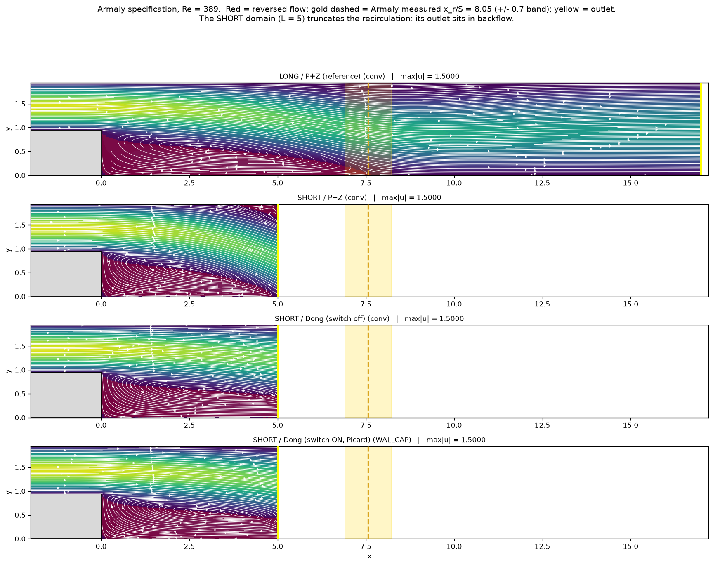
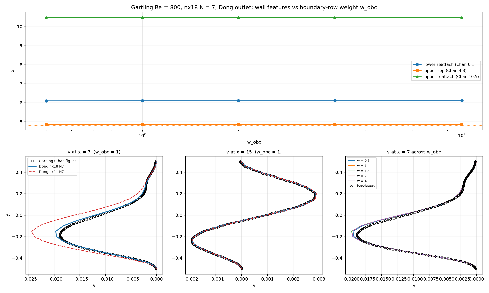

# Dong's open boundary condition, implemented and tested: bc = 6

Study date: 2026-08-19. Implements `OUTFLOW_DONG_OBC_PLAN.md` and runs its
test ladder, plus the two backflow cases the plan said did not exist yet.
The plan's §0 warning is confirmed (it does not move the `a_mass` limit), its
Stage 0–2 criteria all pass, and one result goes well beyond the plan: **on
short domains whose backflow crosses the outlet, the Dong condition
reproduces the long-domain reference where P+Z visibly cannot — including
the exit `v` that `OUTFLOW_BC_STUDY.md` §10h left as an open question.**

Implementation: `lssem2d/obc.py` (the boundary rows), hooks in
`lssem2d/solver.py` (`apply_A`, `compute_jacobi`, `newton_step`, `_ls_merit`,
`step_bdf`). Tests: `lssem2d/tests/test_obc.py` (8 tests; suite 82 → 90, all
passing). Drivers: `scratch/dong_obc_test.py` (channel: stage0 / ladder /
uniform / theta), `scratch/dong_seeded.py` (basin probe),
`scratch/dong_bfs.py` (+ `picard` mode; cnos short BFS),
`scratch/dong_gartling.py` (Chan & Mittal profiles),
`scratch/dong_armaly.py` (Armaly short domain; `run` / `plot` /
`streamlines`). Figures: `figs/dong_armaly_profiles.png`,
`figs/dong_armaly_streamlines.png`, `figs/dong_gartling_profiles.png`,
`figs/dong_bfs_streamlines.png`. Every field is saved to a
`scratch/dong_*.npz`.

---

## Executive summary

1. **`bc = 6` is the Dong outlet.** Two least-squares boundary rows on East
   edges (the plan's §1, normal `n = x̂`):
   `R_x = νD₀ ∂u/∂t − p + ν∂u/∂x − E_x`, `R_y = νD₀ ∂v/∂t + ν∂v/∂x − E_y`,
   added to the functional as `w_obc² ∫ (R_x² + R_y²) ds`. Nothing is imposed
   strongly — u, v, p and ω all stay free on the edge, so no mask code was
   touched (an unhandled bc code masks nothing, which is exactly right, and
   avoids the duplicated-mask trap of §3 of the outflow study). Defaults
   (`obc_D0 = 0`, switch off) give the traction-free form; `w_obc = 1`
   untuned throughout — the plan's §4 sweep remains undone.

2. **Stage 0 passes on the plan's exact criterion.** Poiseuille [0,12] 12×2
   N=10, dt=0.5, traction-free: Δp = **1.44000** as a pure prediction, rms
   div 8.1e−9 (≤ 1e−8 required), bit-exact fixed point in 139 steps, outlet
   ω right to 5.5e−7 with nothing imposed on it, `max|p_out|` 2e−9 with no
   pin anywhere (the p-null-space assert the plan demanded).

3. **Stage 1 passes.** The assembled operator with the `BᵀB` term stays
   symmetric PSD in the PCG inner product (on continuous fields — raw
   discontinuous probes fail for the *existing* operator too, a test trap
   worth remembering); a negative control pins that the rows actually change
   the operator; the Jacobi diagonal matches the true diagonal of A to
   1e−10.

4. **On the cold-start dt ladder Dong sits at the one-condition rung, and
   that is a basin fact, not a stability fact.** OUTFLOW_BC_STUDY §7b
   config (10×2 N=8, Re=100, cold start, tight solve): conv with
   Δp = 1.20000 and |dU| = 0 at dt = 1 / 0.5 / 0.25 (57 / 132 / 126 steps,
   D₀=0; similar at D₀=1), **blows up at dt = 0.1 and 0.05** where P+Z
   converges at 0.1. But seeded with the exact solution, Dong holds it
   **bit-exactly (drift 0.0) at dt = 0.1 and 0.05, both D₀ values** — the
   same two-attractor story as §6 of the outflow study, with the same
   remedy: continuation from a larger dt. Consistent with the plan's §0: it
   does not move the `a_mass` limit.

5. **Uniform-inlet (developing) channel: accuracy-neutral and stabilising.**
   Δp = 1.60275 (dt=1) / 1.60373 (dt=0.5) against the published 1.60273
   (free) / 1.60370 (Z) — five digits — and it converges at dt = 0.5 where
   free outflow fails. Like Z, it acts as a regularisation, not a
   developedness claim.

6. **Gartling Re=800 / Chan & Mittal (Stage 2): passes, and converges where
   P+Z did not.** Steady form, Chan's 11×4 grid, N=7: x_r = **6.153**,
   upper sep **4.915**, upper reatt **10.497** vs Chan's 6.1 / 4.8 / 10.5 —
   and |dU| = 8e−13 in **41 iterations** where the P+Z run capped at 300
   without converging. Profiles at x = 7 and 15 sit on Gartling's digitised
   curves in u and ω; `v` at x = 7 overshoots the trough (P+Z is closer
   there; roles reverse at x = 15). That station is Chan's own documented
   failure ("all except the vertical velocity profile at … 7"), v ~ 2% of u
   is the resolution-sensitive field, and which condition's exit-error
   footprint is *correct* is the §10h open question — an nx18 refinement
   would discriminate.

   

7. **Genuine backflow, cnos short BFS (Re 389, dt 1, outlet in inflow —
   free outflow blows up on step 1):**
   - **Switch off (D₀ = 2): converges from cold in 136 steps** to the same
     state as P+Z (J = 4.451 to 4 digits, max|u| = 1.500, outlet
     min u = −0.172), in **136 vs 246 steps**. Upstream of x = 1.5 the two
     agree to 1.3e−3 in u; differences concentrate at the exit (8.5e−2 in
     v), the truncation-is-local pattern of §10d.
   - **Switch armed, LAGGED (Dong's own explicit u* form): blows up by step
     11 from all three ICs.** Same signature as remedy E of the outflow
     study — an explicit boundary term at dt = 1 has its own CFL-like
     limit. Dong runs tiny DNS steps; we do not.
   - **Switch armed, PICARD (`obc_picard = True`, E at the current iterate,
     nsub = 5): stable from all three ICs**, same state from all three
     (J = 4.442, agreement 1.5e−4), |dU| ~ 7e−10 at the 30-min wall cap.
     The lag was the instability, not the condition. The switch also
     *weakens* the boundary backflow (min u out −0.172 → −0.113), which is
     its designed energy role.

   

8. **Armaly short domain (ER 1.94, Re 389, L = 5 with x_r ≈ 7.6 — backflow
   crosses the outlet): the headline result.** Against the long-domain P+Z
   reference of `figs/armaly_profiles.png`:
   - **Dong reproduces the long-domain u, v AND p at every station
     x/S = 1–4**, the switch-armed Picard variant essentially exactly (the
     orange curve is indistinguishable from green), switch-off very close;
   - SHORT/P+Z overshoots the v-trough ~2× and offsets p; SHORT/free has v
     qualitatively wrong and p diverging by x/S = 4.
   **This answers §10h for this case: the Dong/traction exit carries the
   long-domain v; the P+Z exit does not.** A truncated domain with a Dong
   outlet is a working substitute for a long one here — which is what an
   OBC is for.

   

   The streamline view of the same four runs — the two Dong panels carry
   the long panel's recirculation structure cleanly through the truncated
   outlet, while SHORT/P+Z's bubble is visibly distorted approaching its
   exit:

   

9. **Switch inertness holds to the tanh tail.** Poiseuille with the switch
   armed and no backflow: |Δ(Δp)| = 8e−6, `om_out` err 1.5e−3 vs 2.8e−7
   switch-off — the residue of Θ₀ = ½ exactly at the walls (u = 0 there).
   Harmless here; smaller δ sharpens it if it ever matters.

10. **The `w_obc` sweep (Stage 3, nx18 refinement): FLAT over 100×, and the
    v(x = 7) overshoot was resolution error.** Steady Gartling on a new
    `gartling_nx18_N7_grid.dat` (18×4 uniform, order 7; Chan's fig-6
    refinement level), `w_obc` ∈ {0.1, 0.25, 0.5, 1, 2, 4, 10}, run as
    parallel single-thread jobs (`scratch/dong_wobc_sweep.py`):

    | w_obc | x_r | up sep | up reatt |
    |---|---|---|---|
    | 0.1 … 10 (all) | **6.099 – 6.102** | 4.856 – 4.859 | 10.480 – 10.485 |

    - **The plan §4 worry is defused on this case**: the dimensionally
      arbitrary `w_obc = 1` sits in a flat region at least two decades wide;
      every value lands on Chan's 6.1 / 4.8 / 10.5.
    - **v at x = 7 converges onto Gartling's curve on nx18** (trough −0.019
      to −0.020 vs benchmark −0.019, against nx11's −0.025) at every
      converged weight — so the §6 overshoot was h-resolution error steered
      by the BC, not a defect of the condition. The one station Chan's own
      solver missed is recovered under refinement.
    - **One stall, documented**: `w_obc = 1` (N7) from a COLD start
      plateaued at |dU| = 3.78e−8 from iteration 400 to 704 — the steady
      form's line-search stall (`ARTIFICIAL_COMPRESSIBILITY.md` §5.3), a
      Newton-path accident at that weight, while 0.5/2/4/10 converge in
      ~100 its. Seeded from the converged w = 2 field it converges **in one
      iteration** to x_r = 6.101, the flat-line value — the w = 2 solution
      already is the w = 1 fixed point to within tolerance. Same treatment
      applies to the nx18 N6 (Chan fig-6 grid) cold start, which showed the
      same plateau at 4.9e−9.

    

## Practical guidance

- `mesh.bc[e,1] = 6` + defaults = traction-free outlet. Best
  all-round replacement for P+Z: same or better answers, roughly half the
  iterations (BFS) or convergence where P+Z caps (Gartling steady), no mask
  edits, no ω monkeypatch, no pin.
- For an outlet that sits in backflow, arm the switch **in Picard form**:
  `st.obc_delta = 0.05; st.obc_picard = True`, `max_newton ≥ 5` with line
  search. Never use the lagged form at dt ~ 1.
- `obc_D0`: 1/U_c per Dong; measured effect here is small (it mainly adds a
  boundary mass term). D₀ = 0 is fine for steady-seeking runs.
- Small dt still needs continuation (seed from a converged larger-dt run) —
  no outlet condition fixes that, per AMASS_RESOLVED.md.

## Open

- ~~`w_obc` sweep~~ and ~~nx18 refinement~~: **done, §10** — flat over
  0.1–10, and the v(x = 7) overshoot resolved as h-resolution error.
- The Fortran arbiter for exit v (§10h) — the Armaly result strongly favours
  the traction/Dong exit, but a same-solver long-vs-short check with the
  Fortran reference would close it.
- Picard convergence rate: nsub = 5 makes switch-armed steps ~5× costlier;
  a Newton linearisation of Θ₀ (plan §3.2's implicit option) would cut that.
- Legacy weighting (`w_mom`/`w_mass` unset) untested with bc = 6.
