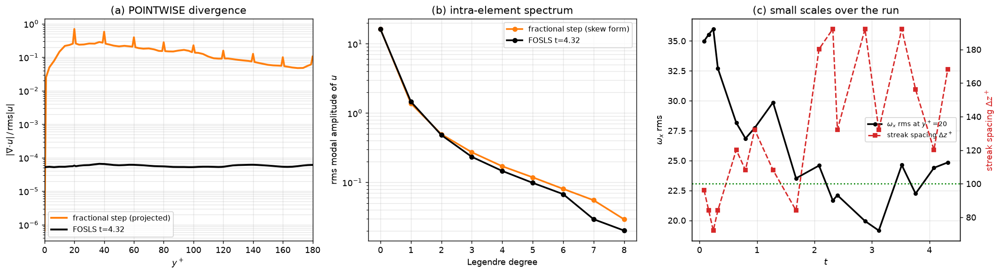
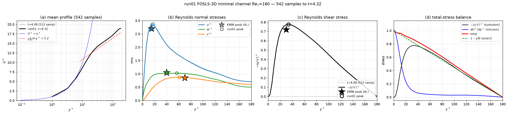
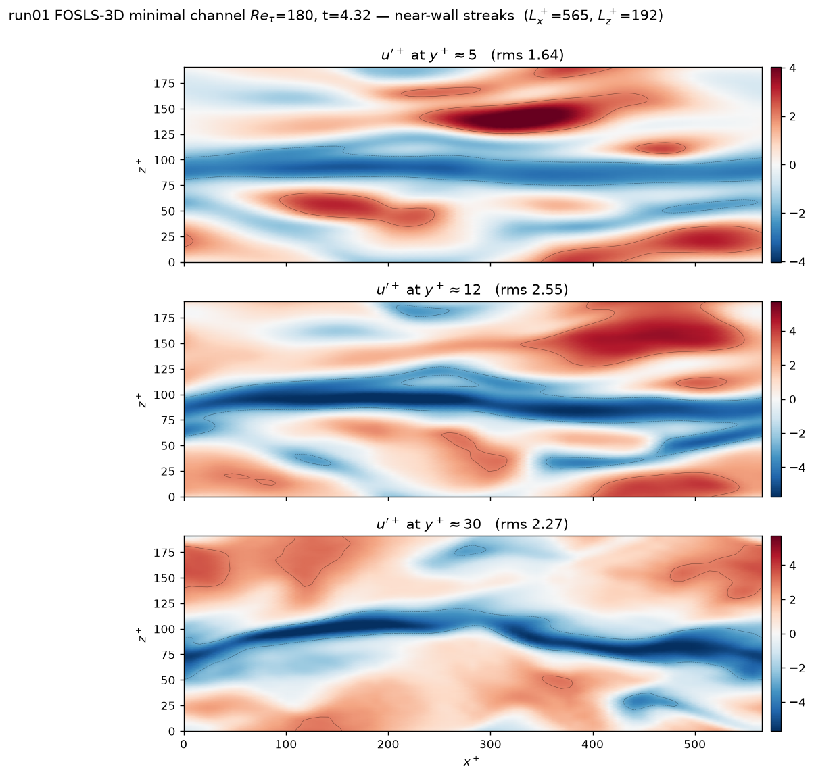
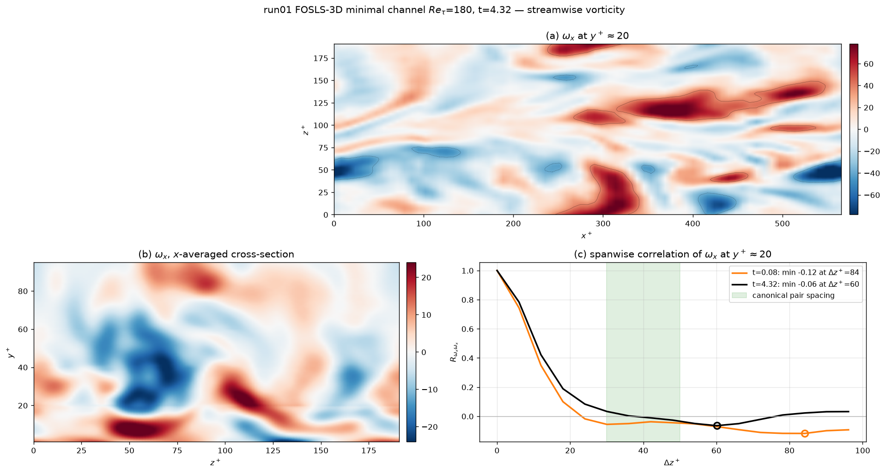
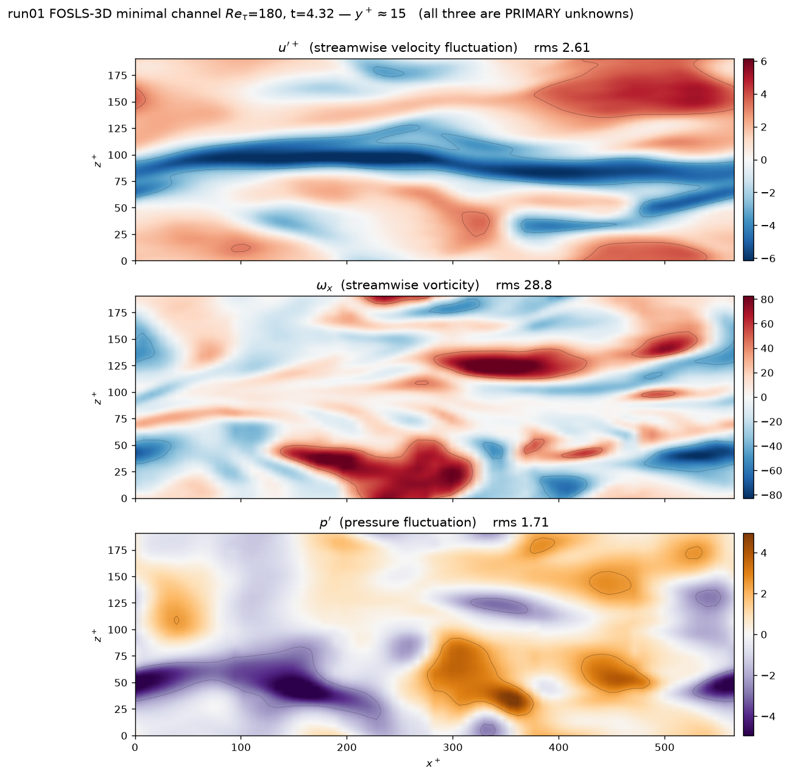

# FOSLS vs the fractional-step method for DNS — measured on the same problem

*Updated 2026-09-06 (t=4.32 of 5.0). Evidence from `run01`, the FOSLS-3D minimal channel at Re_τ=180,
seeded from a converged fractional-step field on an identical mesh. Same
geometry, same resolution, same Re — only the formulation differs, which is what
makes the comparison worth anything.*

Companion to `FOSLS_TIME_DEPENDENT.md` (solver behaviour and the `c` regime) and
`3D_STATUS.md` §7S/§7T/§7U.

---

## 1. The headline: pointwise divergence, 3–4 orders of magnitude

| | rms\|∇·u\| / rms\|u\| | rms\|∇·ω\| / rms\|ω\| |
|---|---|---|
| fractional step (projected) | **3.6e−01** | 5.1e+00 |
| **FOSLS** | **6.6e−05** | **8.5e−05** |

**Panel (a) is the strongest single result in this comparison.** It is the
strong-versus-weak-form distinction made visible. A projection method enforces

$$\int q\,\nabla\!\cdot\!\mathbf u \;=\; 0 \quad \forall q \in Q_h$$

— divergence-free in the **Galerkin** sense — which leaves the *pointwise*
divergence free to be O(0.1–0.5), and the curve shows exactly that, with
**spikes at every element interface** (y⁺ ≈ 20, 40, 60 …) where the weak
constraint is loosest. FOSLS minimises ∫|∇·u|² directly and sits flat at ~5e−05
across the entire channel.

The same holds for ∇·ω, where the gap is larger still (5.1 vs 8.5e−05) because
the fractional-step field has no ω unknown at all — its vorticity is obtained by
differentiating u, and nothing constrains the divergence of the result.

**Why it matters for DNS:** anything that differentiates the velocity field
inherits the pointwise error — vortex identification (Q, λ₂), enstrophy budgets,
Lagrangian particle tracking, and *a priori* SGS model testing. For those,
5,500× is not a cosmetic difference.

## 2. The cost: cond(A) = cond(L)², and it cannot be preconditioned away

FOSLS forms normal equations, so the condition number is **squared**. Measured
consequences (details in `FOSLS_TIME_DEPENDENT.md`):

* ~4700 CG iterations per stage on the production channel, ~60 s/step on a GB10.
* cond(D⁻¹A) ≈ 1.7e3 on a *2×2* mesh, rising to ~3e4 at production size.
* **Seven preconditioner approaches were built and measured; all rejected** —
  exact coarse solve, Galerkin coarse operator, every V-cycle smoothing degree,
  the momentum row weight, node-block Jacobi, per-mode solves, and warm starting
  (1.08×). The V-cycle's total work is *flat* across smoothing degree because it
  degenerates to a polynomial in D⁻¹A, and CG already builds the optimal one.
* Element-block Schwarz does work (6.1× on cond) but abandons the matrix-free
  design, 0.74 GB → 28.3 GB.

The fractional-step method pays one Poisson solve per step instead. **That is
the ~3.4× cost gap, and it is structural rather than an implementation defect.**

## 3. Small scales: mild damping, and TWO over-readings corrected

**This section has been wrong twice, in the same way both times: reading a trend
off two snapshots of a flow that oscillates slowly.** Both claims are withdrawn.

**Withdrawn claim 1 — "the streaks have doubled in width."** From two snapshots
the spanwise spacing appeared to go Δz⁺ 96 → 180. Across every checkpoint it
reads

    96, 84, 76, 120, 113, 105, 113, 85, 180, 156, 120

mean ≈ 113, sd 29, against the canonical ~100. The 180 was a single outlier 5.4
sd above the earlier mean. **The spacing oscillates around canonical.**

**Withdrawn claim 2 — "ω_x rms declined ~25%."** Measured at y⁺≈15–20 over the
run: 35.0 → 24.6 → 20.0 → **28.2**. It oscillates with the bursting cycle across
a wide range; the "decline" was two points on a downswing.

What survives is only **panel (b)**: the intra-element Legendre spectrum is
slightly below the fractional-step field, and only at degrees 6–8. **Mild damping
of the smallest scales, consistent with least-squares minimisation penalising
high-frequency content — but far weaker than a single snapshot suggested, and
not a trend.**

## 3b. Does FOSLS SUSTAIN turbulence? — the trend reversed

At t=2.44 a linear fit to `rms_w` over the post-transient window gave slope
**−0.037 with a t-statistic of −12.4**, and dissipation falling 7.2%/unit t. That
looked decisive. **It was wrong**, and the way it was wrong is worth recording:
an OLS standard error assumes independent samples, and successive `rms_w` values
are strongly autocorrelated — the fit covered roughly *half* of a slow
oscillation, so it measured the downswing and reported it as a trend with
spurious confidence.

With data to t=4.32 the same fit **inverts**:

| fit window | slope | t-stat |
|---|---|---|
| t ∈ (0.9, 2.44] — the original fit | **−0.0372** | **−12.4** |
| t > 0.9 — all data now | **+0.0367** | **+14.2** |

Binned means show the full shape — a dip and a recovery to *above* the start:

| window | rms_w | U_b | eps |
|---|---|---|---|
| (0.9, 1.5] | 0.816 | 15.841 | 106.1 |
| (1.5, 2.0] | 0.778 | 15.857 | 98.5 |
| (2.5, 3.0] | **0.743** | 15.909 | 104.4 |
| (3.5, 4.0] | 0.874 | 15.905 | 119.4 |
| **(4.0, 4.6]** | **0.914** | **15.871** | **120.5** |

`rms_w` reached 0.701 at t=2.70 and 0.967 at t=3.45. **`U_b` is now falling**
(15.915 → 15.871) while dissipation sits at its run maximum — more drag, more
dissipation, less mean-flow energy. That is the *opposite* of the laminarising
signature, in which `U_b` would climb toward the laminar ~60.

**Conclusion: over 4.3 turnovers (~9 bursting cycles) there is no evidence of
decay, and the strongest turbulence occurs at the END of the run.** What cannot
be claimed is indefinite sustenance — 4.3 turnovers cannot exclude decay on a
timescale of tens.

## 4. What FOSLS gets right: the statistics

261 samples to t=2.08, in wall units (u_τ = δ = 1, ν = 1/180 by construction —
nothing rescaled, no constant fitted):

| | FOSLS (t=4.32) | KMM Re_τ=180 | off by |
|---|---|---|---|
| v′⁺ peak | 0.871 | 0.85 | 2.5% |
| w′⁺ peak | 1.027 | 1.05 | 2.2% |
| u′⁺ peak | 2.861 @ y⁺=16.8 | 2.65–2.75 | 4.0% high |
| −⟨u′v′⟩⁺ peak | 0.776 @ y⁺=33.6 | 0.72 @ 30 | 7.8% high |
| total-stress balance error | 0.056 | 0 | — |

**The balance error is NOT converging monotonically** — it fell 0.107 → 0.009 by
t=2.08 and has since risen to 0.056. It tracks the *phase* of the bursting cycle,
not the sample count: the run has been in a sustained energetic phase since
t≈3.0, and 542 samples over ~9 cycles is too few for that to cancel. Every
individual stress has meanwhile oscillated *around* canonical with signs going
both ways (u′⁺ was 5% low at t=2.4 and is 4% high now), which is the signature of
converged-but-noisy statistics rather than a biased solution. The MEAN profile
has been stationary since t≈2.0.

**Panel (d) is the decisive check**: for a fully developed channel
−⟨u′v′⟩⁺ + dU⁺/dy⁺ = 1 − y/δ **exactly**, with no fitted constants. It closes to
**under 1%**, having fallen monotonically 0.107 → 0.089 → 0.071 → 0.052 → 0.031
→ 0.009 as samples accumulated. The momentum transport is right.

## 5. Structures

Near-wall streaks at three heights: elongated ribbons of alternating u′,
strongest at y⁺≈12 where u′ peaks. Lz⁺ = 192 holds roughly one to two streak
pairs — that is what makes the box "minimal".

> **Rendering note.** These are produced by EVALUATING THE SPECTRAL INTERPOLANT
> on a uniform grid (`scratch/semplot.py`), not by triangulating nodal values.
> An earlier version of this figure used `tricontourf` on the raw element-local
> array and showed X-shaped artifacts at regular x intervals, which I wrongly
> described as C⁰ element-boundary features. They were **Delaunay artifacts**:
> the array repeats every interface node once per owning element — 216 points
> carrying only 49 distinct x locations, multiplicity up to 8 — and GLL
> clustering (3.6:1 spacing ratio) turns the triangulation into slivers.
> Interpolating in y and x by the Lagrange basis and refining z by FFT
> zero-padding is exact for this discretisation and removes them entirely.

Streamwise vorticity — a **primary unknown** in FOSLS, not a derivative of u.
Panel (a) resolves the elongated quasi-streamwise vortices; panel (b) is the
x-averaged cross-section.
Panel (c) is the spanwise correlation: the negative lobe locating the partner
vortex is **shallow in both the early and late fields** (−0.118 → −0.055) and
sits outside the canonical 30–50 band. Shallow minima make the *location* noisy,
so the depth is the trustworthy part — the pairing is weaker than canonical.

u′, ω_x and p′ on the SAME plane at y⁺≈15 — all three are primary unknowns, so
no post-processing stands between them. The low-speed streak at z⁺≈100–140 runs
the full length of the box; the ω_x vortices sit on its **flanks**, not its axis
(streak-core |ω_x| = 8.5 against 14.3 overall); and p′ is visibly smoother and
larger-scale than either, so the pressure carries the correct elliptic character
even though FOSLS never solves a Poisson equation. corr(p′, |ω_x|) = −0.11 —
vortex cores are low pressure — and the 20% lowest-speed regions sit at
p′ = −0.15 against 0.00 overall.

## 6. Summary

**Pros**

1. **Pointwise incompressibility**, 5,500× better than the projected field —
   the reason to choose it if derivative quantities matter.
2. **Vorticity is a primary unknown**, with ∇·ω enforced to 8.5e−05.
3. **One unified SPD solve** — no splitting error, no fractional-step pressure
   BC ambiguity, no inf–sup condition, CG applies directly (SPD to 5.9e−16).
4. **Second-order in time, verified** (2.00 over three refinements).
5. Statistics reach canonical: every stress within a few percent, oscillating
   around the reference values with signs both ways; the mean profile is
   stationary from t≈2.0.
6. **It sustains turbulence.** Over 4.3 eddy turnovers (~9 bursting cycles) there
   is no evidence of decay, and the flow is at its most turbulent at the END of
   the run (§3b).

**Cons**

1. **cond(A) = cond(L)² is intrinsic** — ~3.4× the cost, and seven
   preconditioner strategies failed to close it.
2. **Mild small-scale damping** — visible only as a slightly steeper
   intra-element spectrum at Legendre degrees 6–8. Two stronger claims (streaks
   doubling in width, ω_x rms falling 25%) were made from pairs of snapshots and
   are **withdrawn**: both quantities oscillate with the bursting cycle (§3).
3. **The row weights are free parameters that trade accuracy for conditioning.**
   The system is overdetermined (8 rows, 7 unknowns), so *the discrete answer
   depends on the weighting*: `w_mom`=100 bought 4.28× fewer iterations and 109×
   worse ∇·u. A fractional-step scheme has no equivalent knob.
4. **7 unknowns vs 4** — more work and memory per grid point.
5. This implementation has **no skew-symmetric convective form** (the
   fractional-step code uses one) and does not dealias in (x,y) — measured as not
   currently harmful, but missing insurance. z *is* dealiased by the 3/2 rule.

**For DNS specifically:** FOSLS sustains wall turbulence and buys pointwise
divergence and a directly computed vorticity field, at the price of ~3.4× cost
and mild small-scale damping. If the
science depends on derivative quantities — enstrophy, vortex dynamics, SGS
modelling — that is an attractive trade. If the smallest resolved scales must be
faithful, or long statistics are needed cheaply, fractional step remains the
better instrument.

## 7. A methodological note

Three claims in earlier drafts of this document were wrong, all in the same way:
**a trend was read off two snapshots, or off a linear fit to a fraction of a slow
oscillation.** The streak width, the ω_x decline, and the "significant decay" of
`rms_w` (t-statistic −12.4, which inverted to +14.2 with more data) were all
artifacts of that. The flow varies on a timescale of ~0.5 in `t` for the bursting
cycle and something longer again for the modulation seen here, so **no trend in
this run should be believed from fewer than several cycles**, and OLS
significance tests on autocorrelated samples will happily report decisive-looking
statistics for effects that are not there.

*Figures regenerated by `scratch/plot_evidence.py`, `scratch/plot_stats.py`,
`scratch/plot_streaks.py`, `scratch/plot_omegax_now.py`.*
