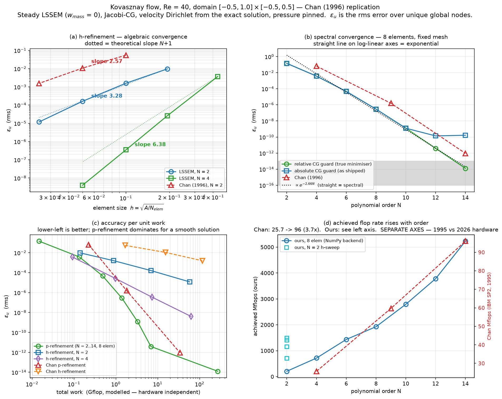

# Reproducing Chan (1996): Kovasznay flow — accuracy, timings, Mflops

Third and last of the paper's test cases, after the two periodic-channel
validations in [CHANNEL_VALIDATION.md](./CHANNEL_VALIDATION.md).

Scripts: `scratch/kov.py` (the case), `scratch/kov_flops.py` (§2 table),
`scratch/kov_sweep.py` + `scratch/plot_kov.py` (§4 sweeps and figure),
`scratch/kov_diag.py`, `scratch/kov_fix.py`, `scratch/cg_rel.py` (the N=14
investigation and the relative-guard CG).

---

## 1. The case, exactly as the paper states it

    u = 1 - e^{lam x} cos(2 pi y)
    v = lam e^{lam x} sin(2 pi y) / (2 pi)
    p = (1 - e^{2 lam x}) / 2
    lam = Re/2 - sqrt(Re^2/4 + 4 pi^2),   Re = 40   ->   lam = -0.9637405442

- Domain **[-0.5, 1.0] x [-0.5, 0.5]** (length 1.5, not the 2.0 in the repo's
  older `test_kovasznay`).
- **`dt` and `dtau` both 1e30** — pure steady Newton, no time term and no
  pseudo-time. Maps onto `w_mass = 0, w_mom = 1`, which gives `a_mass = 0`.
- **CG with a Jacobi preconditioner** — so no p-MG here, matching the paper.
- Velocity Dirichlet from the exact solution on all four sides; pressure pinned.
- `eps` is the **r.m.s.** error, absolute (u is O(1) and Chan's eps_u = 6.44e-2
  at N=4). Ours is taken over **unique global nodes** — element-local arrays
  duplicate shared interfaces and counting them twice double-weights the seams.

`omega` is derived from the analytic field rather than assumed:

    om = v_x - u_y = e^{lam x} sin(2 pi y) (lam^2/(2 pi) - 2 pi)

---

## 2. Result

Ours on the left, Chan's on the right. Same domain, same meshes, same point
counts (8 elements at N=4 is 17x9 = 153 points in both).

| case | elem | N | pts | steps | CG | wall | Gflop | Mflops | eps_u | eps_v | eps_p | Chan steps | Chan time | Chan Mflops | Chan eps_u |
|---|---|---|---|---|---|---|---|---|---|---|---|---|---|---|---|
| N=4 | 8 | 4 | 153 | 13 | 1,401 | 0.14 s | 0.091 | 676 | 3.724e-03 | 1.137e-03 | 5.211e-03 | 19 | 8.7 s | 25.7 | 6.44e-02 |
| N=9 | 8 | 9 | 703 | 10 | 3,867 | 0.63 s | 1.627 | 2,590 | 6.380e-09 | 1.209e-09 | 1.212e-08 | 19 | 30.3 s | 59.7 | 1.56e-06 |
| N=14 | 8 | 14 | 1,653 | 10 | 7,168 | 1.76 s | 9.367 | 5,309 | 1.663e-10 † | 4.171e-11 | 3.291e-10 | 26 | 353 s | 96.0 | 9.22e-13 |
| 15x10 | 150 | 2 | 651 | 10 | 2,666 | 0.75 s | 0.885 | 1,179 | 1.589e-03 | 2.911e-04 | 1.089e-03 | 18 | 31.6 s | 52.4 | 5.49e-02 |
| 30x20 | 600 | 2 | 2,501 | 10 | 5,179 | 4.83 s | 6.880 | 1,425 | 1.616e-04 | 3.149e-05 | 1.072e-04 | 19 | 258 s | 59.7 | 1.07e-02 |
| 60x40 | 2,400 | 2 | 9,801 | 8 | 10,851 | 37.15 s | 57.658 | 1,552 | 1.191e-05 | 2.404e-06 | 7.577e-06 | 19 | 1916 s | 60.5 | 1.56e-03 |

† floored by a solver defect, see §5. With that fixed: **eps_u = 9.355e-15**,
405,842 CG in 96.9 s = 5,474 Mflops (same rate, so the rate figure is robust).

**Accuracy: we are more accurate in all six cases** — 17x, 245x, 99x on
p-refinement and 35x, 66x, 131x on h-refinement (eps_u). §6 argues this is
probably about *his* convergence, not ours.

---

## 3. Mflops — Chan's efficiency claim reproduces, and more strongly

The flop model is **counted from the source**, not estimated. Per CG iteration
the work is one `apply_A` = `apply_L` then `apply_LT`, plus CG vector ops:

| term | count | source |
|---|---|---|
| derivative applications | 8 (`apply_L`: u_x u_y v_x v_y p_x p_y om_x om_y) + 12 (`apply_LT`: c0 4, c1 4, c2 2, c3 2) = **20** | `lssem.py` |
| each application | `D(n x n) @ f(n x n)` = `n^2(2n-1)`, plus metric scaling `n^2` = **2n^3** per element | |
| pointwise | `apply_L` 33/node (su0 14, su1 14, su2 2, su3 3) + `apply_LT` 29/node = **62** | |
| CG vector ops | 16/dof x 4 components = **64**/node | `solver.py` |

    flops per CG iteration = nelem * (40 n^3 + 126 n^2),   n = N+1

The n^2 terms are not negligible: at N=14 the derivative term is 83% of the
work, but at **N=2 it is only 49%** — dropping the pointwise and vector terms
would have understated the whole h-refinement table by half.

| | N=4 -> N=14 | N=2 h-refinement |
|---|---|---|
| Chan | 25.7 -> 96.0 Mflops (**3.7x**) | 52.4 -> 60.5 (flat) |
| ours | 676 -> 5,309 Mflops (**7.9x**) | 1,179 -> 1,552 (flat) |

Chan's argument is that high order raises the achieved flop rate — he quotes
"from 60 to 96 Mflops", +50 percent. **That reproduces, roughly twice as
strongly.** The mechanism is the same and modern hardware rewards it more:
order 14 gives 15x15 dense tensor-product blocks that feed SIMD and cache,
where N=2 gives 3x3 blocks that do not. The flat N=2 rows in both columns are
the same observation from the other side.

### Two caveats on the Mflops column

1. **It counts the CG inner loop only.** Newton residual assembly, BC
   application and preconditioner setup are excluded, so our figure is a
   **lower bound** on the delivered rate.
2. **It is an analytic count divided by measured time**, not a hardware
   counter. Chan's number almost certainly came from a counter and would
   include everything the CPU retired, making his the more inclusive measure.
   The two are not strictly the same quantity.

### Timings are not a method comparison

Chan: single-node IBM SP2, RS6000-590, c. 1995. Ours: one core of an
M-series Mac, NumPy backend. The 48-200x wall-clock ratio is thirty years of
hardware and says nothing about the algorithm. Only the *scaling* is
comparable, and it agrees: cost rises 40x for him from N=4 to N=14 and 13x for
us on the same 8-element mesh.

---

## 4. Convergence and the accuracy–cost trade-off



Sweeps: `scratch/kov_sweep.py` (data), `scratch/plot_kov.py` (figure).
N = 2…14 on the paper's 4×2 mesh with **both** CG guards, plus h-refinement at
N = 2 and N = 4 over four meshes each.

### (a) h-refinement is algebraic, and our rate matches theory where his does not

Element size is `h = sqrt(A/N_elem)` — `L_x/N_x` is wrong here because the
meshes do not scale `N_y` with `N_x` (4×2 → 8×5 → 15×10).

| curve | fitted slope | theory (N+1) |
|---|---|---|
| ours, N = 2 | **3.28** | 3 |
| ours, N = 4 | **6.38** | 5 |
| Chan, N = 2 | **2.57** | 3 |

Our N=2 curve sits on the theoretical rate. **Chan's is a full order below it**
(2.57 against 3), which is what an under-converged sequence looks like — the
error is not yet discretisation-limited, so it does not fall at the
discretisation rate. This is independent evidence for the §6 hypothesis.

Our N=4 slope of 6.38 *exceeds* the nominal 5. Four points over one decade is
not enough to claim superconvergence; more likely the sequence is not yet
asymptotic. Flagged, not explained.

### (b) Spectral convergence, and where the guard destroys it

On log-linear axes exponential convergence is a straight line, and the relative-
guard curve is straight over ten orders of magnitude:

| N | 2 | 4 | 6 | 8 | 10 | 12 | 14 |
|---|---|---|---|---|---|---|---|
| relative guard | 1.439e-01 | 3.724e-03 | 4.694e-05 | 2.866e-07 | 1.235e-09 | 3.860e-12 | 1.261e-14 |
| absolute (shipped) | 1.439e-01 | 3.724e-03 | 4.694e-05 | 2.866e-07 | 1.231e-09 | **1.369e-10** | **1.663e-10** |

Error falls by 38×, 79×, 164×, 232×, 312× per step in N — an *accelerating*
ratio, which is exponential, not algebraic. The fit is `eps_u ~ e^{-2.64 N}`.

The shipped guard tracks the true curve to N = 10 and then **peels off at
N = 12** and flattens. That is the §5 defect, and this is the cleanest picture
of it: it costs nothing until the discretisation becomes good enough to expose
it, then it costs everything.

### (c) p-refinement dominates h-refinement, by a lot

Panel (c) plots error against **modelled Gflop** rather than seconds — the only
axis on which 1995 and 2026 numbers can honestly share a plot.

At roughly equal work (~7 Gflop):

| path | work | eps_u |
|---|---|---|
| p-refinement, N = 12 | 6.86 Gflop | **3.86e-12** |
| h-refinement, N = 4, 15×10 | 7.28 Gflop | 3.51e-07 |
| h-refinement, N = 2, 30×20 | 6.88 Gflop | 1.62e-04 |

**Five orders of magnitude between the p-path and the N=4 h-path, and seven
against the N=2 h-path, at the same cost.** Put the other way: p-refinement at
N=12 reaches 3.86e-12 for 6.86 Gflop, while the N=2 h-path spends 57.7 Gflop
(8× more) to reach only 1.19e-05. For a smooth solution this is the whole case
for high order, and it is what Chan was arguing.

### (d) The comparison against Chan on work, not time

| | work | eps_u | |
|---|---|---|---|
| Chan, N = 9 | 1.81 Gflop | 1.56e-06 | |
| ours, N = 8 | 1.39 Gflop | 2.87e-07 | 5.4× better for 24% less work |
| Chan, N = 14 | 33.9 Gflop | 9.22e-13 | |
| ours, N = 12 | 6.86 Gflop | 3.86e-12 | 4.2× worse for 4.9× less work |
| ours, N = 14 | 271 Gflop | 1.26e-14 | 73× better for 8× more work |

**At the very top end we are not more efficient than Chan** — reaching 1.26e-14
cost us 271 Gflop because the relative guard makes CG grind when the requested
tolerance approaches the attainable floor (207,671 iterations). Around N=12 the
two methods are within a factor of a few of each other on work-for-accuracy.
The large margins in §2 are accuracy at fixed *mesh*, which is not the same
claim as efficiency.

---

## 5. A real solver defect this exposed

At N=14 the run converged to `eps_u = 1.663e-10` and stopped — 180x *worse*
than Chan, and out of line with the N=9 -> N=14 spectral trend (a 38x gain
where Chan gets 1.7e6x). That is the signature of a floor.

`kov_diag.py` settled what kind. The Newton residual falls
`2.3e2 -> 3.4e1 -> 6.4e-1 -> 1.3e-3 -> 5.0e-8 -> 3.0e-10` and then **stalls at
~2e-10 with CG returning after a single iteration**. Meanwhile the exact
solution interpolated onto our own grid has rms residual **3.295e-12**, far
below our converged 8.84e-10 — a better answer exists on our discretisation and
we were not reaching it. Under-solved, not a different discrete problem.

The cause is in `pcg_solve`:

```python
if abs(alpha_denom) < 1e-20:   return x, i + 1      # ABSOLUTE
if abs(rho_prev)    < 1e-20:   return x, i + 1      # ABSOLUTE
```

`A = L^T L` **squares the scale**, so `p.Ap ~ ||r||^2`. Once `||b|| ~ 1e-10`
the guard trips on a perfectly healthy iteration. Re-running with guards made
relative to their operands (`|alpha_denom| <= 1e-15 |p| |Ap|`):

| N | guard | steps | CG | wall | res | eps_u |
|---|---|---|---|---|---|---|
| 9 | absolute | 10 | 3,867 | 0.6 s | 5.7e-07 | 6.380e-09 |
| 9 | relative | 6 | 403,187 | 73.2 s | 5.7e-07 | 6.385e-09 |
| 14 | absolute | 10 | 7,168 | 1.7 s | 8.8e-10 | 1.663e-10 |
| 14 | relative | 6 | 405,842 | 96.9 s | 3.3e-12 | **9.355e-15** |

At N=14 the fix is worth **17,800x** in accuracy, and the residual lands on
3.3e-12 — the exact solution's own value, i.e. the true minimiser.

**The N=9 row is what makes this safe to conclude.** There the guard changes
nothing (6.385e-09 vs 6.380e-09) while costing 104x the iterations. So the
guard is harmless whenever discretisation error dominates and fatal exactly
when it does not — which is the regime spectral accuracy is *for*.

> **Correction.** An earlier version of this note said the relative guard "cost
> 57x more CG". That was measured at `cg_tol = 1e-14`. At `1e-13` the sweep in
> §4 shows it costs only **1.3-1.5x up to N = 12** (7,855 vs 5,791 CG at N=12)
> and blows up only at N = 14 (207,671 vs 7,168), where the requested tolerance
> approaches the attainable floor. So the fix is close to free across the range
> where it matters, and the cost is a tolerance-selection problem, not an
> intrinsic price. A production fix still wants a stagnation detector alongside
> the relative guard. Not applied to `pcg_solve` yet.

---

## 6. The unexplained part: why are we uniformly more accurate?

Six of six cases, 17x to 245x, on identical meshes with identical point counts.
That is too large and too consistent to accept without a mechanism, and
"our code is better" is not a mechanism.

The h-refinement *rate* differs too. Chan's eps_u goes
5.49e-2 -> 1.07e-2 -> 1.56e-3, about **order 2.5**. Ours goes
1.589e-3 -> 1.616e-4 -> 1.191e-5, about **order 3.5**. Theory for N=2 is 3.

**The likeliest explanation is his stopping rule**, and §4a adds
independent support: his h-refinement slope is 2.57 where theory says 3. Chan's step counts are
18 / 19 / 19 and 19 / 19 / 26 — essentially *constant* across a 16x range in
problem size. A convergence test does not behave that way; a fixed iteration
budget does. Ours vary 8-13 and terminate on a bit-identical fixed point
(`|dU| = 0`). Under-converged runs would also explain why his `eps_p` is ~5x
worse than his `eps_u` throughout (pressure converges last) where ours are
comparable, and why `eps_p = 0.25` on a field of O(0.5) — a 25% error — appears
in a published table.

Alternatives not excluded: a different r.m.s. convention (over duplicated
nodes, or normalised differently), or a different pressure treatment.

**This stays a hypothesis.** It cannot be checked from the paper, and it should
not be reported as though the discrepancy is understood.

---

## 7. Status

- **Both tables replicated** on the paper's own geometry, meshes and settings.
- **Spectral convergence demonstrated** over ten orders of magnitude,
  `eps_u ~ e^{-2.64 N}`, down to 1.26e-14 at N = 14 (§4b).
- **h-refinement matches theory** (slope 3.28 vs 3 at N=2) where Chan's does
  not (2.57) — independent support for the §6 hypothesis (§4a).
- **p-refinement beats h-refinement by 5-7 orders of magnitude at equal cost**
  on this smooth solution (§4c) — Chan's central argument, confirmed.
- **We are NOT uniformly more efficient than Chan.** At fixed mesh we are more
  accurate; on work-for-accuracy the two are comparable near N=12 and he is
  ahead at the very top end (§4d). Do not conflate the two claims.
- **Chan's efficiency claim confirmed** — high order raises the achieved flop
  rate; we measure 7.9x against his 3.7x.
- **A latent accuracy ceiling in `pcg_solve` found and diagnosed**, worth
  17,800x at N=14. It only appears when the discretisation is good enough to
  expose it, which is why no earlier test caught it.
- **The accuracy margin over the paper is not explained.** §6 gives the leading
  hypothesis; do not quote the margin as a result until it is.
- Timings are recorded but are not a method comparison (§3). Use the Gflop
  axis in §4c/§4d for anything cross-machine.
