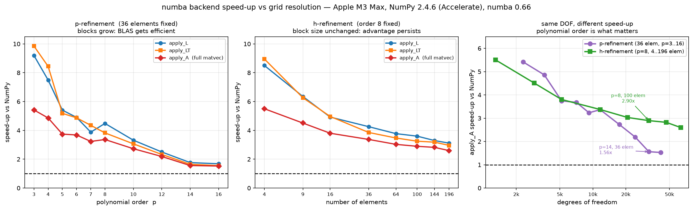

# The numba backend

Fused `@njit` kernels for the VVP operator, available as an **option**. NumPy
remains the default — nothing changes unless numba is asked for explicitly.

Implemented 2026-08-07. Supersedes the design in
[NUMBA_INTEGRATION_PROPOSAL.md](./NUMBA_INTEGRATION_PROPOSAL.md), whose kernel
source is stale (see §5 below).

> **Parity caveat (2026-08-12): per-operator parity does NOT imply agreement on
> accumulated states.** The gates in §6 verify a *single* application of
> `apply_L` / `apply_LT` / `compute_jacobi` to 1e-16, and that holds. But over a
> few hundred time steps with a tight CG the two backends settle on different
> fixed points. Measured on Poiseuille $Re=100$, order 8, 10x2, dt=1,
> `w_mom = w_mass = 1`, `cgsfac=1e-8`, `cg_tol=1e-10`, run to a bit-exact steady
> state in 300 steps:
>
> | backend | `newton_tol` | converged profile error |
> |---|---|---|
> | **numpy** | 1e-12 | **4.6471e-06** (= the published tight value to every digit) |
> | numba | 1e-12 | 8.4673e-06 |
> | numpy | 1e-14 | 4.6471e-06 |
>
> A 1.8x discrepancy at 4e-06, independent of `newton_tol`. Every published
> Poiseuille number was produced on numpy, and numpy is the one that reproduces
> them. **Any result at the 1e-05 level or below should be re-checked on numpy
> before it goes in a doc.** Use numba for speed on timings, scaling and
> qualitative behaviour; do not use it to measure accuracy floors.
> Reproduce: `scratch/pois_dt_w1.py` (header comment).

---

## 1. Using it

Two ways, both opt-in:

```bash
LSSEM_BACKEND=numba python your_script.py        # process-wide, read at import
```

```python
import lssem2d
lssem2d.set_backend('numba')     # at runtime, any time, reversible
lssem2d.get_backend()            # -> 'numba'
lssem2d.available('numba')       # probe without committing
```

The public names `apply_L` / `apply_LT` are unchanged, so every existing call
site and test picks up whichever backend is active with no edits.

Optional: pay JIT compilation up front rather than inside the first timed step.

```python
from lssem2d import kernels_numba
kernels_numba.warmup(state)      # requires update_linearisation() first
```

### Failure behaviour

Requesting `numba` when it is not importable **raises `ImportError`**; it does
not fall back silently. A silent fallback turns a missing dependency into an
unexplained 3x slowdown, which is precisely what corrupts a benchmark. Use
`available()` to branch deliberately.

---

## 2. Measured speedup

Apple M3 Max, Python 3.12.7, NumPy 2.4.6 (Accelerate), numba 0.66.0.
Best-of-5, microseconds per operator application.
Reproduce with `scratch/bench_numba_scaling.py` + `scratch/plot_numba_scaling.py`.



### Polynomial order is what matters, not problem size

Resolution moves two independent ways in a spectral element method, and **they do
not have the same effect**:

| sweep | range | `apply_A` speed-up |
|---|---|---|
| **p-refinement** (36 elements fixed) | p=3 -> p=16 | **5.42x -> 1.53x** |
| **h-refinement** (order 8 fixed) | 4 -> 196 elements | **5.50x -> 2.60x** |

At essentially the same problem size (~32k DOF), `p=14` on 36 elements gives
**1.56x** while `p=8` on 100 elements gives **2.90x** — nearly 2x apart. The two
curves do not collapse onto one another, so **a speed-up quoted "at N DOF" is
meaningless without stating the polynomial order.**

The mechanism is the one the fused kernel was built around. Its advantage comes
from avoiding BLAS call overhead on tiny $(n \times n)$ blocks and eliminating
temporaries. p-refinement grows the blocks, so Accelerate's matmul becomes
efficient and the gap closes toward parity. h-refinement adds more blocks of the
*same* size, so the per-block advantage persists — the h-curve flattens out
around 2.6-2.8x rather than heading for 1x.

### p-refinement, 36 elements fixed

| p | DOF | numpy `apply_A` | numba `apply_A` | `apply_L` | `apply_LT` | `apply_A` |
|---|---|---|---|---|---|---|
| 3 | 2,304 | 98.9 | 18.3 | 9.20x | 9.85x | **5.42x** |
| 4 | 3,600 | 129.2 | 26.6 | 7.49x | 8.44x | **4.86x** |
| 5 | 5,184 | 141.3 | 37.8 | 5.41x | 5.18x | **3.74x** |
| 6 | 7,056 | 191.8 | 52.1 | 4.90x | 4.87x | **3.68x** |
| 7 | 9,216 | 226.2 | 70.0 | 3.88x | 4.35x | **3.23x** |
| 8 | 11,664 | 309.8 | 92.1 | 4.48x | 3.83x | **3.36x** |
| 10 | 17,424 | 411.4 | 150.8 | 3.32x | 3.07x | **2.73x** |
| 12 | 24,336 | 511.5 | 233.7 | 2.50x | 2.33x | **2.19x** |
| 14 | 32,400 | 544.1 | 348.7 | 1.76x | 1.65x | **1.56x** |
| 16 | 41,616 | 744.7 | 487.6 | 1.68x | 1.55x | **1.53x** |

### h-refinement, order 8 fixed

| elements | DOF | numpy `apply_A` | numba `apply_A` | `apply_L` | `apply_LT` | `apply_A` |
|---|---|---|---|---|---|---|
| 4 | 1,296 | 94.5 | 17.2 | 8.50x | 8.95x | **5.50x** |
| 9 | 2,916 | 131.3 | 29.1 | 6.35x | 6.26x | **4.51x** |
| 16 | 5,184 | 177.5 | 46.7 | 4.92x | 4.96x | **3.80x** |
| 36 | 11,664 | 315.0 | 93.4 | 4.26x | 3.86x | **3.37x** |
| 64 | 20,736 | 484.5 | 159.9 | 3.77x | 3.47x | **3.03x** |
| 100 | 32,400 | 704.0 | 243.2 | 3.60x | 3.25x | **2.90x** |
| 144 | 46,656 | 977.6 | 346.4 | 3.30x | 3.18x | **2.82x** |
| 196 | 63,504 | 1214.9 | 468.0 | 3.11x | 2.96x | **2.60x** |

### Why `apply_A` gains less than its own components

At low order the kernels hit 9-10x individually while the full matvec caps at
~5.4x, because `gather_scatter` and the mask stay on the NumPy path — about 9% of
`apply_A`, explicitly out of scope in the proposal (§6 there). Once the kernels
are 10x faster, those unfused parts become the bottleneck. **If more speed is
wanted at low order, fusing `gather_scatter` is the remaining lever, not the
kernels.** At p>=14 the situation reverses: the kernels themselves are only
~1.7x, so there is little left to win anywhere.

### Where the production cases land

| case | resolution | expected `apply_A` speed-up |
|---|---|---|
| cavity (this study) | 4x4-8x8, p=8-12 | ~3.4x -> 2.2x |
| Chan BFS | 72 elem, order 10 | ~2.7x |

> An earlier version of this section reported speed-up against DOF alone
> (3.23x at 9k falling to 1.92x at 43k). That mixed p- and h-refinement into one
> axis and so attributed to *size* an effect that is really driven by *order*.
> The paired sweeps above supersede it.

End-to-end, cavity $Re=1000$, 4x4 order 8, dt=1.0, run to `max|dU| < 1e-8`:

| backend | steps | wall | speedup |
|---|---|---|---|
| numpy | 139 | 13.65 s | 1.00x |
| numba | 140 | 5.25 s | **2.60x** |

Steady states agree to **1.0e-04 max, 0.0077% of the u-range** (per component:
u 5.6e-06, v 4.8e-06, p 2.4e-06, om 1.0e-04). The one-step difference in
trajectory is the `fastmath` reordering, see §3.

### Interaction with the preconditioner

The preconditioner comparison in
[PRECONDITIONER_AND_DT_STUDY.md](./PRECONDITIONER_AND_DT_STUDY.md) was measured
against the NumPy matvec. Making the matvec cheaper shifts the Jacobi/p-MG
crossover toward **larger** meshes, because preconditioners that trade extra
matvecs for fewer iterations become relatively more expensive.

The size of that shift is itself order-dependent, per the sweeps above: the
cavity study spans p=8 to p=12, where numba gives 3.4x down to 2.2x. So the
shift is not uniform across the resolutions in that study — the coarse meshes
speed up more than the fine ones, which *compounds* the effect (Jacobi already
won on the coarse meshes). **The crossover has not been re-measured under numba;
do not assume the ~50k DOF figure carries over.**

---

## 3. `fastmath`

On by default; `LSSEM_FASTMATH=0` disables it. It permits floating-point
reassociation, which is worth a meaningful part of the speedup.

Per call the difference is ~1e-16 (round-off). Over a full run the trajectory
shifts slightly — 140 steps instead of 139 above — while steady states agree to
0.008% of the range. Turn it off if you need run-for-run bit-comparability with
the NumPy path rather than per-call agreement.

### A trap that was found and fixed

**numba's on-disk cache does not key on njit flags.** With `cache=True`, a kernel
compiled under `fastmath=True` is silently reused when `fastmath=False` is
requested, so `LSSEM_FASTMATH=0` appears to do nothing. Verified directly —
whichever flavour compiled first determined the result for both:

```
cache cleared, fastmath=0 first:  both runs -> -5.64503634916568409e-01
cache cleared, fastmath=1 first:  both runs -> -5.64503634916567965e-01
```

The differing checksums confirm the flag does change the arithmetic; the cache
was masking it. Fixed by giving each flavour its own cache directory
(`lssem2d/__nbcache__/{fastmath,strict}`, gitignored), set before `numba` is
imported since numba reads its configuration at import time.

---

## 4. Files

| file | role |
|---|---|
| `lssem2d/backend.py` | `get_backend` / `set_backend` / `available`, env resolution |
| `lssem2d/kernels_numba.py` | the two fused kernels, buffers, `warmup` |
| `lssem2d/lssem.py` | NumPy bodies renamed `_apply_L_numpy` / `_apply_LT_numpy`; public `apply_L` / `apply_LT` dispatch |
| `lssem2d/__init__.py` | re-exports the backend controls (new; package was previously namespace-only) |
| `lssem2d/tests/test_backend_parity.py` | the parity gate |

Dispatch is resolved once per backend switch via a listener registered with
`backend.register`, not per call, so there is no per-application lookup cost.
The numba work buffers (`_nb_D`, `_nb_su`, `_nb_c`) are allocated lazily on
first use, so selecting NumPy costs no extra memory.

---

## 5. The weighting bug this nearly reintroduced

**The kernel source in the proposal document is stale and must not be copied
verbatim.** It was written 2026-08-02, before the least-squares row-weighting fix.

It computes the momentum rows as `idt*u + N(u)` with `idt = fac1/dt`. The correct
form, matching `lssem_baseline.f90` `rhs()`, is `fac1*u + dt*N(u)`. These are the
same equation but differ by a factor `dt` **as least-squares rows**, so the old
form over-weights momentum by `1/dt` against continuity and the vorticity
definition. It is harmless where the residual is ~0 (cavity, Poiseuille) and
**diverges on under-resolved cases such as the BFS**.

The delivered kernels carry `f1` and `dtl` separately in `_kernel_L`, and
`_kernel_LT` scales the two momentum components of `su` by `dtl` on read — the
exact transpose, since the new operator is `R_new = S R_old` with
`S = diag(dt, dt, 1, 1)`.

Because the cavity cannot detect this class of error, the parity test runs at
**dt = 0.1, 1.0 and 0.0** (the steady form) across four meshes, rather than at one
convenient value.

---

## 6. Test coverage

`lssem2d/tests/test_backend_parity.py`, 16 tests, all skipped gracefully when
numba is absent:

- numba vs NumPy for `apply_L` and `apply_LT`, 4 meshes x 3 dt, tolerance 1e-13
  (measured ~2e-16, three orders of headroom)
- strided linearisation velocities — `newton_step` passes `fu = U[..., 0]`, which
  is a strided view; numba accepts it but compiles a slower path, so `_C()`
  guards it and this test pins the behaviour
- `set_backend` actually switches dispatch, and switching back reproduces the
  NumPy result **exactly** (`array_equal`, not a tolerance)
- default is `numpy`; unknown names raise
- self-adjointness under numba, `<x,Ay>` vs `<y,Ax>`, tolerance 1e-12

> The adjointness test projects its vectors first (`gather_scatter(v)/mult`, then
> mask). Random *local* arrays are not continuous and so are not in the
> operator's domain; testing with them shows a spurious ~4% asymmetry in **both**
> backends. That cost a false alarm during the original investigation.

Full suite: **47 passed** under `numpy`, under `numba`, and under
`numba + LSSEM_FASTMATH=0`.

(`lssem2d/tests/test_solver.py` remains excluded — it fails to collect on an
unrelated pre-existing issue, importing `cg_solve` which no longer exists.)
