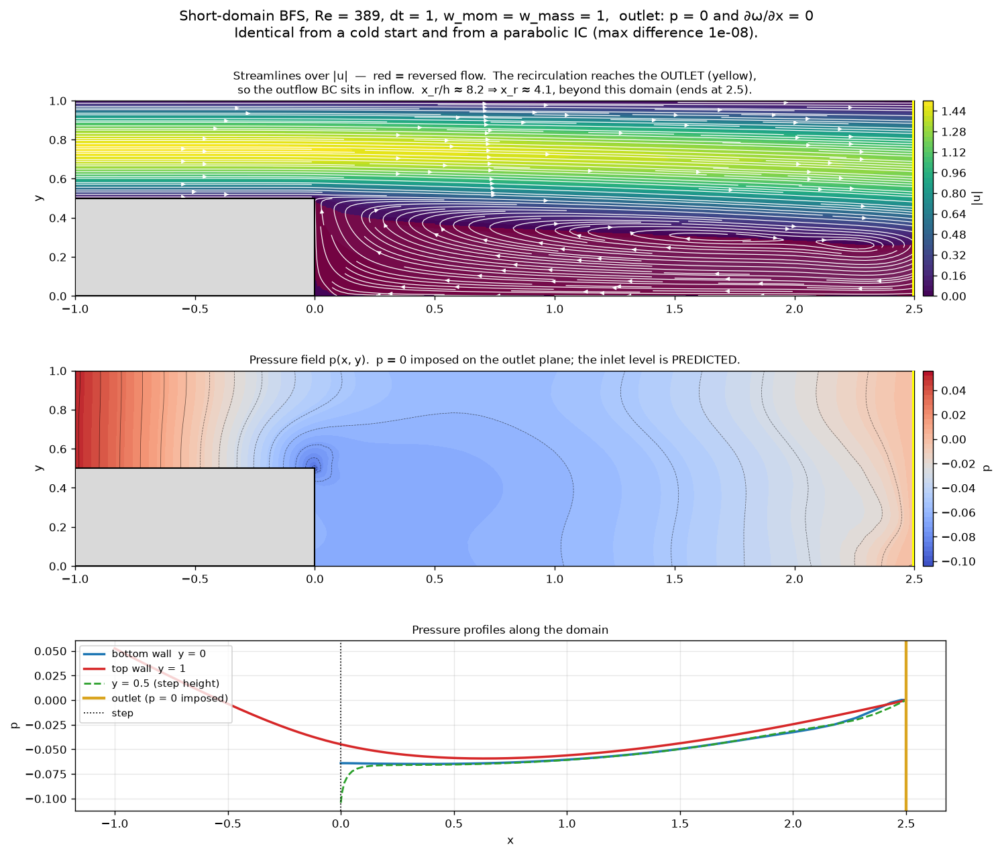
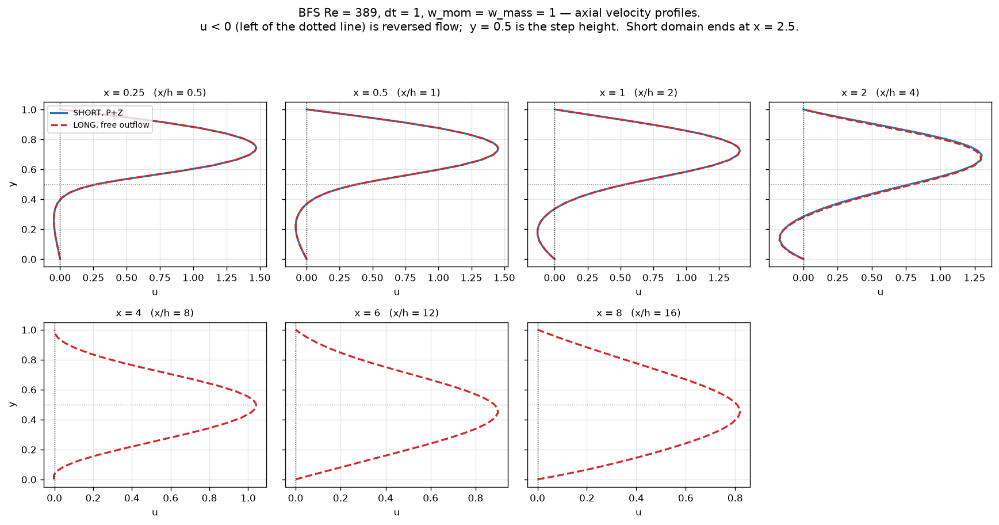
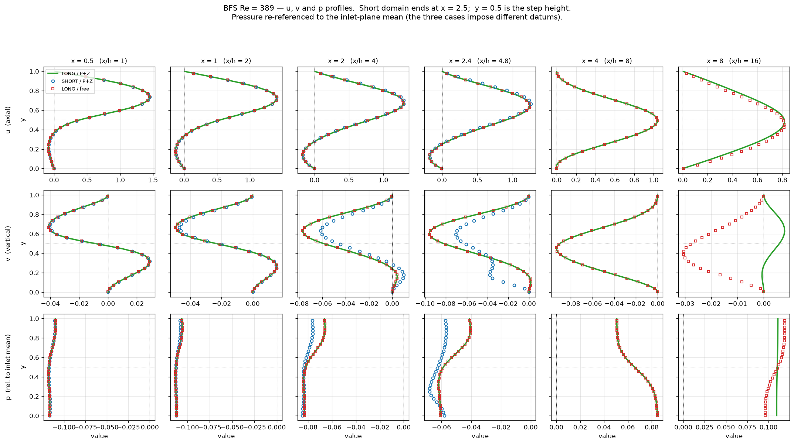
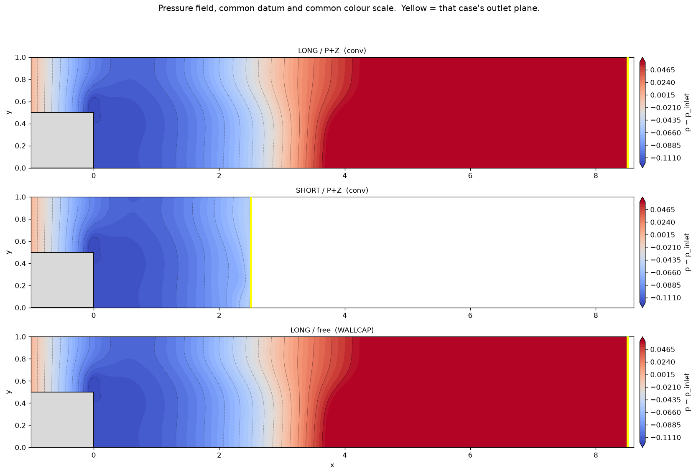
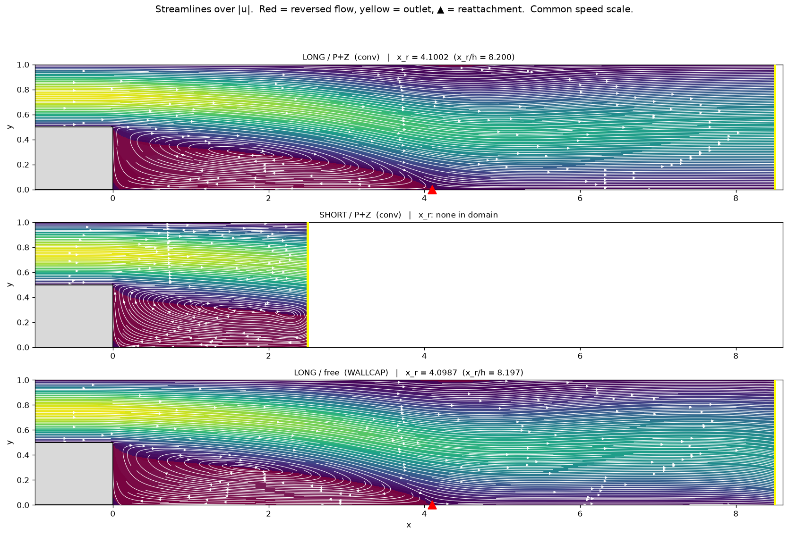

# The free outflow, not the momentum weight, is what breaks small dt on Poiseuille

Study date: 2026-08-12. **This corrects
[POISEUILLE_DT_STUDY.md](./POISEUILLE_DT_STUDY.md) §4**, which attributes the
`dt = 0.5, w_mom = w_mass = 1` non-convergence to the momentum weight
destabilising the iteration and concludes that legacy's coupling `weight = dt`
is "a *stable* pairing, not merely an arbitrary one." At the exact coefficients
that section calls destabilising, the iteration is perfectly stable once the
free outflow is removed.

Companion to [TEMPORAL_ACCURACY_STUDY.md](./TEMPORAL_ACCURACY_STUDY.md), which
needed a clean unsteady case and could not use this one, and to
[ARMALY_VALIDATION.md](./ARMALY_VALIDATION.md), which validates the BFS against
experiment at Armaly's true specification (reattachment within 1.2%) and finds
that free outflow BLOWS UP on that longer domain where the admissible pair
converges.

Reproduce: `scratch/pois_dt_bracket.py` (the onset), `scratch/pois_dt_small.py`
(instrumented trajectories, `nsub`), `scratch/pois_outflow_test.py` (the A/B/C
comparison and the spatial map), `scratch/pois_outflow_D.log` (the velocity-
Dirichlet control), `scratch/pois_periodic_dt.py` and
`scratch/pois_periodic_converged.log` (the controlled dt sweep),
`scratch/pois_blockratio.py` (the a priori diagnostic),
`scratch/pois_basin.log` and `scratch/pois_growth2.log` (the two attractors),
`scratch/pois_convective.log`, `scratch/pois_zerograd.log`,
`scratch/pois_corner.log`, `scratch/pois_omega_bc.log`, `scratch/pois_omega_final.py` (attempted remedies and the omega fix).

> **Read §6 before quoting §1–§5.** The disturbance is generated at the outflow,
> but the correct solution remains a *bit-exact fixed point at every dt tested*.
> What dt controls is which attractor the cold-start transient reaches, not
> whether the right answer is stable. That distinction changes the remedy.

---

## Executive summary

1. **The small-dt failure is a period-2 limit cycle, not divergence and not a
   stall.** $|U(k) - U(k-1)| = 9.1974$ forever while $|U(k) - U(k-2)| \sim 10^{-4}$
   and still falling. The iteration converges — to an orbit rather than a fixed
   point. The steady test $|dU|/dt < \mathrm{tol}$ can never fire.

2. **It is manufactured at the outflow boundary.** Same mesh, same order, same
   $\nu$, same weights, same exact solution, streamwise-periodic instead of
   inflow/outflow: dt = 1, 0.5 and 0.05 all converge to bit-exact fixed points
   ($|dU| = 0$), and dt = 0.25 and 0.1 converge monotonically — those two were
   capped at t = 150 for cost rather than run to the floor.

3. **The epicentre is $\omega$ at the two outlet/wall corner nodes.** Across the outlet
   plane $\omega$ oscillates 9.197 at the wall, 4.000 one node in, 0.203 two nodes in —
   a factor of 45 over two nodes — and 2.6e-06 at the centreline.

4. **Any ONE admissible condition at the outlet cures it — pressure, velocity or
   vorticity.** Properly enforced $p = 0$ across the outlet plane converges in
   155 steps at dt = 0.5 with $\Delta p = 1.20000$; so does $\partial\omega/\partial x = 0$, and so does
   imposing the velocity. What fails is imposing *nothing*.
   > **This replaces an earlier claim that "it is the velocity, not the
   > pressure", which was wrong because of a BUG — `bc = 4` never enforced
   > $p = 0$ at all.** `SolverState.get_global_mask` has no `bc == 4` branch
   > while `bc.apply_mask` does, and it is the former that builds
   > `b = -c_gs * mask_global` in `newton_step`. So `apply_bc` wrote $p = 0$
   > each iteration and the update moved it straight off: measured
   > `max|p_out| = 4.87e-01` against the 0 the BC claims. See §3.

5. **It is not the weighting.** The a priori pressure/velocity block ratio at
   `w_mom = w_mass = 1` holds 0.747 → 0.473 from dt = 5 to dt = 0.05, against
   legacy's 1256× collapse over the same range. The `w_mom` form does what it
   was designed to do.

6. **The outflow costs a factor of ~730 even at dt = 1, where everything
   "works".** Whole-field rms 7.95e-07 with free outflow against 1.09e-09
   periodic. The study's best-case Poiseuille accuracy is mostly boundary error.

7. **Sub-iterating makes it worse**, which is why this was not diagnosed as an
   ordinary Newton problem: `nsub = 5` raises the oscillation from 18.4 to 27.9
   and pushes $\max|u|$ to 1.77, above the physical inlet peak of 1.5.

8. **The onset is smooth, and dt = 0.5 is not special.** It is simply the first
   value below 1 that anyone tried.

9. **Large dt is not "more stable" — it lands in a different basin.** The exact
   solution is a *bit-exact fixed point at every dt*, free outflow included:
   seeded with it, dt = 0.5 holds $\Delta p = 1.20000$ to 1.85e-16 for 600 steps and
   never moves. The same dt from a cold start orbits at amplitude 9.2. There are
   two attractors, and dt decides which one the transient finds. See §6.

10. **How many admissible conditions you impose at the outlet sets how small dt
    can go — about a factor of 3 each** (§7b). Free = 0 conditions, dies below
    dt = 0.9. $p = 0$ *or* $\partial\omega/\partial x = 0$ = 1 condition, dies below 0.25. Both
    together = 2 conditions, the full ADN pair, converges at dt = 0.1 in 393
    steps with $\Delta p = 1.20000$ where either alone diverges. **P and Z are
    interchangeable** — it is the count that matters, not the field.
    **This is a BASIN ladder, not a stability ladder.** Seeded with the exact
    solution, the fixed point is bit-exact at **every dt from 1 down to 0.01** —
    `a_mass` from 1.5 to 150 — *with the free outflow that fails every cold
    start below 0.9*. Nothing is unstable; increased diagonal dominance does
    exactly what it should. The conditions widen the basin so the cold-start
    transient can reach a stable answer. Why that path fails at small dt is
    **open** — two proposed mechanisms have been measured and refuted.

10c. **It transfers to the BFS, and worse** (§7c). On the short domain at dt = 1,
    free outflow **blows up on the first step** from all three initial
    conditions tried — cold, local-parabola, and the smooth blend — reaching
    $\max|u|$ of 3603, 2890 and 398 against a physical 1.5. The admissible pair
    converges from all of them **to the same state**, agreeing at field level to
    ~1e-08, suggesting `STEADY_FORM_STUDY.md` §8's two converged states are one
    state plus an artifact. The converged flow is physically sensible —
    separation at the step, a single recirculation, textbook pressure recovery —
    and its missing reattachment is correct: $x_r \approx 4.1$ lies beyond a domain
    that ends at 2.5. **The reversed flow reaches the outlet, so the boundary
    sits in inflow**, which is why the same deficiency that costs 730× on
    Poiseuille is catastrophic here.

10d. **The short domain is usable with two conditions — truncation error is
    local.** Axial profiles match the long domain to **0.02% at x/h = 0.5, 0.1%
    at 1, 0.5% at 2, 1.8% at 4** (§7c), i.e. the error concentrates at the
    artificial boundary and decays fast upstream. And on the LONG domain, free
    outflow converges and gives the same $x_r/h = 8.20$ as P+Z — validating
    against the repo's 8.0 ± 0.3 gate — so the existing long-domain BFS results
    were running in the benign configuration.

10e. **The `bc = 4` bug is fixed in the library** (§3): `get_global_mask` now
    masks the pressure DOF on all four edges, outlet `max|p|` goes 4.87e-01 → 0,
    82 tests pass. $\partial\omega/\partial x = 0$ still has no BC code of its own and remains a
    monkeypatch plus a mask edit.

10g. **$x_r$ and streamlines CANNOT detect a bad outflow condition** (§7c). Across
    the long domain, free outflow and P+Z agree on reattachment to **0.04%** and
    are visually identical in both streamlines and pressure contours — while
    differing by **8% in $u$ and over 100% in $v$** at the exit. Truncation is the
    same story: invisible in $x_r$, 5.6% in $u$, **~40% in $v$**. The transverse
    velocity is the sensitive diagnostic and has not been plotted anywhere in the
    existing studies.

10h. **Which exit $v$ is CORRECT is open** (§7c). P+Z carries the *larger* residual
    near the outlet — 40–90× — because $\partial\omega/\partial x = 0$ is not exactly true where the
    flow is still developing. The earlier claim that free gets $v$ "qualitatively
    wrong" is withdrawn as an inference rather than a measurement. The Fortran
    reference solution for this case is the arbiter.

10f. **Much of this was already known on the Fortran side** (§7c, "Prior art").
    $p = 0$ at the outlet is the Fortran solver's DEFAULT and free-float was
    already recorded as failing; `VVP_NATURAL_OUTFLOW.md` already derives the
    pressure–vorticity natural condition from the Galerkin weak form. **The
    Python port's free outflow is a regression, not a design choice**, and the
    P+Z pair is a re-derivation rather than a new condition.

10a. **Any one of them also improves the answer where nothing was broken.** At
    dt = 1, where free outflow already converged, the whole-field error drops
    from 7.95e-07 to 7.73e-09 (P), 9.55e-09 (Z) or 7.84e-09 (P+Z) — within
    ~8× of the periodic no-outflow ideal of 1.09e-09, i.e. most of the ~730×
    boundary penalty recovered.

10b. **dt = 0.05 cannot be fixed with boundary conditions.** ADN caps the outlet
    at two; a third over-determines. P+Z fails there ($|dU|$ 586, $\Delta p$ 984), so
    the residual deficiency is not a boundary problem — most likely the
    mass-term anisotropy, `a_mass = fac1/dt = 30` acting on $u$ and $v$ while $\omega$ and
    $p$ get no $L^2$ control at all.

10i. **It does NOT impose developedness**, which was the caveat expected to
    limit it. On the uniform-inlet variant — genuinely undeveloped at the exit,
    so the condition's own assumption is violated — Z gives $\Delta p = 1.60272$ against
    free outflow's 1.60273, identical to five digits, and additionally converges
    at dt = 0.5 where free outflow does not. It behaves as a regularisation of
    the free boundary, not as a physical claim about the exit.

11. **Releasing no-slip at the outlet/wall corner does nothing at all** — the
    amplitude is identical to six digits with and without. The corner is where
    the mode peaks, but removing a *velocity* constraint there does not supply
    the missing *vorticity* one.

12. **Slaving $\omega$ to $v_x - u_y$ stabilises and gives the wrong answer** —
    $\Delta p = 1.87416$ at a bit-exact fixed point with `slip` exactly 0, reached by two
    different sub-iteration paths (§7a). It ties $\omega$ to the *local* velocity,
    whose one-sided $v_x$ nothing constrains, so the solver picks a wrong outlet
    velocity and lets $\omega$ follow it consistently. $\partial\omega/\partial x = 0$ works because it
    couples the boundary to the **interior** instead. *The first run supporting
    this verdict was lagged and non-convergent and did not establish it; the
    reason first given — redundancy with the vorticity row — was wrong, since
    that row is enforced only weakly.*

---

## 1. What is actually happening at dt = 0.5

Poiseuille control case (10 × 1, Re = 100, order 8, 10 × 2 elements, parabolic
inlet, free outflow, pin at the inlet corner), `w_mom = w_mass = 1`, tight solve
(`cgsfac = 1e-8`, `cg_tol = 1e-10`).

Sampling every 50 steps showed a state that never moved — and a step size that
never shrank:

```
    t=   50.5  step=   101  |dU|/dt= 1.839e+01  dp=    1.12961  max|u|=   1.5000
    ...  identical to 5 decimals for 1100 steps ...
    t=  575.5  step=  1151  |dU|/dt= 1.839e+01  dp=    1.12961  max|u|=   1.5000
    t=  600.0  step=  1200  |dU|/dt= 1.840e+01  dp=    1.07824  max|u|=   1.5000
```

> The stride of 50 is even, so every sample landed on an odd step and saw the
> same phase. The last line is an even step. That near-miss is worth recording:
> a period-2 orbit sampled at even stride is indistinguishable from a converged
> steady state in every column except the rate.

Checked per step, with the phases held properly:

| step | `\|U(k)-U(k-1)\|` | `\|U(k)-U(k-2)\|` | `\|U(k)-U(k-4)\|` |
|---|---|---|---|
| 71 | 9.1974e+00 | 5.2678e-05 | 2.2885e-05 |
| 75 | 9.1974e+00 | 4.4636e-05 | 2.0914e-06 |
| 80 | 9.1974e+00 | 9.9177e-05 | 4.6670e-06 |

Consecutive states differ by 9.2 indefinitely; states two and four steps apart
agree to 1e-04 and 1e-06 and are still tightening. The two phases carry
`dp = 1.12961` and `1.07824`, straddling the exact 1.2.

> `POISEUILLE_DT_STUDY.md` §4 reports `dp = 15.22` for this configuration at 600 steps. That run used the
> default `tol = 1e-6`; at `1e-10` the orbit sits near 1.1. Same
> non-convergence, different character — and `dp` alone cannot distinguish them,
> because which value you read depends on the phase you stop on.

---

## 2. Where it lives

**Streamwise** — amplitude of the step-to-step change, by element column:

| x range | max `\|dU\|` |
|---|---|
| 0 – 1 | 5.2438e-05 |
| 7 – 8 | 4.4601e-04 |
| 8 – 9 | 1.2208e-02 |
| **9 – 10** | **9.1975e+00** |

20,000× larger in the last element than two elements upstream, and it does not
propagate.

**Across the outlet plane**, by field:

| y | u | v | p | ω |
|---|---|---|---|---|
| 0.0000 (wall) | 0 | 0 | 3.973e-01 | **9.197e+00** |
| 0.0251 | 1.571e-01 | 1.620e-02 | 4.074e-01 | **4.000e+00** |
| 0.0807 | 2.202e-01 | 9.455e-02 | 3.798e-01 | 2.027e-01 |
| 0.2500 | 9.278e-03 | 2.177e-01 | 2.308e-02 | 1.857e-01 |
| 0.5000 (centre) | 2.232e-01 | 3.196e-06 | 5.777e-01 | 2.559e-06 |
| 1.0000 (wall) | 0 | 0 | 3.973e-01 | **9.197e+00** |

**Toward the corner along the wall**, inside the last element:

| x | ω at wall (j=0) | ω at mid-channel (j=4) |
|---|---|---|
| 9.0000 | 1.220e-02 | 5.865e-04 |
| 9.5000 | 3.239e-01 | 8.512e-03 |
| 9.8386 | 2.968e+00 | 7.038e-02 |
| 10.0000 | **9.197e+00** | 1.857e-01 |

754× growth along the wall approaching the corner, and 50× larger at the wall
than at mid-channel at the same x. The mode is symmetric about the centreline
and identical at both walls.

**The corner is the epicentre, but not the whole story.** $u$, $v$ and $p$ oscillate at
the 0.2 – 0.6 level across the entire outlet plane. The corner $\omega$ spike is 15–45×
above that, so it dominates, but the free outflow produces a plane-wide
disturbance as well.

**Mechanism this points to** — offered as the reading consistent with the
evidence, not as a separate measurement: at that node the wall imposes
$u = v = 0$ while the free outflow imposes nothing, and $\omega$ carries no boundary
condition on either side. `bc.apply_bc` writes W, E, S, N in that order, so the
wall row lands last and wins; the corner sits at zero velocity with $\omega$ free. The
vorticity row ties $\omega$ to $v_x - u_y$, leaving a near-unconstrained direction
concentrated at a single node.

**Why dt should matter to that node.** In this formulation only $u$ and $v$ carry a
time derivative — `step_bdf` builds `su_history` for fields 0 and 1 alone, and
`a_mass = fac1/dt` multiplies only those. $\omega$ and $p$ have no mass term at all. So
as dt falls, $u$ and $v$ are anchored ever harder to the previous time level while $\omega$
is left to the instantaneous rows; the four fields stop being treated
comparably. $\omega$ at a free outflow is the one quantity with neither a mass term nor
a boundary condition. This is consistent with the mode living in $\omega$ and with dt
controlling it, but §6 shows what dt actually selects is the **basin**, not the
stability of the fixed point.

---

## 3. What it is not

### A BUG: `bc = 4` does not enforce $p = 0$

**Found 2026-08-12, and it invalidates the variant-B row below.** The BC logic
exists twice and the two copies disagree:

| | `bc == 4` branch? |
|---|---|
| `bc.apply_mask` (bc.py) | **yes** — zeroes the pressure DOF |
| `SolverState.get_global_mask` (lssem.py) | **no** — handles only `(1,2,3)` and `5` |

`newton_step` builds `b = -c_gs * mask_global` from **`get_global_mask`**, and
`dU` is zero only where that mask is zero. So `apply_bc` writes $p = 0$ at the
top of every Newton iteration and the update immediately moves it off again.

```
  get_global_mask at outlet, p component : 1.0   (update NOT frozen)
  bc.apply_mask   at outlet, p component : 0.0   (frozen)
  after 60 steps:  max|p| on the outlet plane = 4.8672e-01     <- should be 0
```

**Blast radius: none, apart from this study.** Every script in `scratch/` that
builds `bc_E = 4` overrides it to 0 (free) before use, so nothing ever relied on
the condition. The bug was latent.

> **FIXED in the library, 2026-08-13.** `SolverState.get_global_mask` now has a
> `bc == 4` branch on **all four edges**, mirroring `bc.apply_mask`, with a
> comment recording that the two implementations duplicate each other and must
> stay in step. Verified: the two masks now agree, and `max|p|` on the outlet
> plane goes from **4.8672e-01 to exactly 0.0000e+00**. **82 tests pass.**
>
> Consequence for the scripts here: the per-script patch
> `st._global_mask[e,-1,:,2] = 0.0` is now redundant for pressure — `bc = 4`
> alone suffices — but harmless, so they still reproduce. A clean P+Z after this
> fix needs only the **ω** patch.

**What it invalidates:** variant B below tested nothing. Its agreement with free
outflow (9.1976 vs 9.1975) was not evidence that pressure is irrelevant — for
pressure it *was* free outflow. With the mask corrected, $p = 0$ **works**: see
§7b.

### The original (invalid) B comparison

Four variants at dt = 0.5, differing only in the outflow treatment, 200 steps.
**The B row is void** — kept only so the corrected result has something to be
compared against:

| variant | outflow | `\|U(k)-U(k-1)\|` | corner Δω | Δp |
|---|---|---|---|---|
| A | free (`bc = 0`), inlet pin | 9.1975e+00 | 9.1975e+00 | 1.078 / 1.130 |
| B | **$p = 0$ across the whole plane** (`bc = 4`), no pin | 9.1976e+00 | 9.1976e+00 | 1.130 |
| **D** | **velocity $u = 6y(1-y)$, $v = 0$** (`bc = 3`), pin, **p free** | **0.0000e+00** | **0.0000e+00** | **1.20000** |
| C | periodic, body force, **no outflow at all** | 1.7067e-03, falling | — | n/a |

`bc = 3` constrains only $u$ and $v$, leaving pressure free at the outlet and pinned
at the inlet — so D's $\Delta p = 1.20000$ is still a prediction, and it is exact to
six figures. That part stands.

> **The conclusion originally drawn here — "constraining pressure: no effect;
> the defect is in the velocity/vorticity treatment" — is WITHDRAWN.** B never
> constrained pressure. With the mask bug fixed, $p = 0$ alone cures the orbit
> as completely as D or Z does (§7b). The ω *localisation* in §2 is unaffected —
> the mode does live in $\omega$ at the corner — but it does not follow that $\omega$ is the
> only field whose constraint helps.

### Not the momentum weighting

The a priori criterion of `POISEUILLE_DT_STUDY.md` §3, computed from
`compute_jacobi` on the linearisation about the exact profile — the mean
diagonal of $L^\mathsf{T}L$ over pressure nodes divided by that over velocity nodes,
1.0 being equal weight:

| dt | legacy `a_flux` | legacy p/u | `w=1` `a_mass` | `w=1` p/u |
|---|---|---|---|---|
| 5 | 5.000 | 2.992e+00 | 0.300 | 7.466e-01 |
| 1 | 1.000 | 7.456e-01 | 1.500 | 7.456e-01 |
| 0.5 | 0.500 | 2.228e-01 | 3.000 | 7.423e-01 |
| 0.1 | 0.100 | 9.508e-03 | 15.00 | 6.520e-01 |
| 0.05 | 0.050 | 2.382e-03 | 30.00 | 4.729e-01 |

Legacy collapses 1256× over the range; `w_mom = w_mass = 1` holds within a factor
of 1.6. I had predicted the imbalance would simply move from `a_flux` to
`a_mass`; it does not, because the velocity diagonal is dominated by the gradient
terms ($\sim (N^2/h)^2 \sim 10^4$) and $a_{\mathrm{mass}}^2 = 900$ at dt = 0.05 is still small against
them. The mass term only takes over around `dt ≲ fac1/(N²/h) ≈ 0.01`.

> This column reproduces the published p/u values at small dt (9.51e-03 vs
> 9.9e-03 at dt = 0.1; 2.38e-03 vs 2.5e-03 at dt = 0.05) but saturates at large
> dt where the published table keeps climbing to 24.9 — a normalisation
> difference, not a disagreement about the mechanism.

### Not a Newton problem

`max_newton = 1` makes successive time steps one continuous iteration, so
sub-iteration was the obvious suspect. It is not: at dt = 0.5, `nsub = 5` gives
$|dU|/dt = 27.9$ against `nsub = 1`'s 18.4, no longer a clean constant, and
$\max|u| = 1.77$ — above the physical inlet peak of 1.5, which `nsub = 1` never
breached. Resolving each step's linear problem more accurately feeds the orbit.

---

## 4. The controlled test

The only way to have "no outflow" is to change the domain, so C above was not
controlled — it used a 2π × 2 domain on a 1 × 2 mesh. The controlled version
keeps **everything** and changes one thing:

| | Poiseuille | this |
|---|---|---|
| domain, mesh, order | 10 × 1, 10 × 2 elements, N = 8 | identical |
| ν, exact solution | 0.01, $u = 6y(1-y)$ | identical |
| weights, solver, tolerances | `w=1/1`, tight | identical |
| streamwise | inlet + FREE outflow, pin at inlet | **periodic + body force** `f_x = 12ν = 0.12` |

$12\nu$ is the study's own $dp/dx$; a periodic pressure cannot carry a mean
gradient, so it enters as a force (`CHANNEL_VALIDATION.md` §6).

Run to a bit-exact fixed point ($|dU| = 0$), whole-field rms:

| dt | `a_mass` | steps | final `\|dU\|` | whole-field rms |
|---|---|---|---|---|
| 1 | 1.50 | 210 | 0.000e+00 | 1.0902e-09 |
| 0.5 | 3.00 | 425 | 0.000e+00 | 7.6233e-10 |
| 0.05 | 30.0 | 4424 | 0.000e+00 | 3.2004e-10 |

**dt = 0.5 — the case that orbits at amplitude 9.2 with free outflow — converges
to a bit-exact fixed point in 425 steps.** The coefficients are the same
`(a_mass, a_flux) = (3.0, 1.0)` that `POISEUILLE_DT_STUDY.md` §4 calls destabilising.

Against free outflow at dt = 1 on the identical metric, 7.9519e-07: **the outflow
costs ~730×**. Its converged error is concentrated at the exit —

| x range | whole-field rms in that column |
|---|---|
| 0 – 1 | 1.0136e-09 |
| 7 – 8 | 3.7282e-08 |
| 8 – 9 | 2.8340e-07 |
| 9 – 10 | 2.5083e-06 |

— so the interior of the free-outflow solution is as good as the periodic one,
and the aggregate error is boundary error.

---

## 5. The onset is smooth

Free outflow, `w_mom = w_mass = 1`, steady test `|dU|/dt < 1e-9` after t ≥ 300,
capped at t = 600:

| dt | `a_mass` | status | final rate | prof err (outlet) | Δp |
|---|---|---|---|---|---|
| 1.0 | 1.50 | conv | 0.000e+00 | 4.647e-06 | 1.20000 |
| 0.9 | 1.67 | conv | 0.000e+00 | 3.025e-05 | 1.20000 |
| 0.8 | 1.88 | no | 9.230e-02 | 6.389e-04 | 1.19940 |
| 0.7 | 2.14 | no | 3.565e+00 | 5.884e-03 | 1.19158 |
| 0.6 | 2.50 | no | 8.210e+00 | 8.996e-02 | 1.12259 |
| 0.55 | 2.73 | no | 1.222e+01 | 3.702e-02 | 1.15120 |
| 0.5 | 3.00 | no | 1.840e+01 | 1.571e-01 | 1.07824 |

The orbit amplitude grows continuously — 0, 0, 9.2e-02, 3.6, 8.2, 12.2, 18.4 —
and simply crosses the convergence tolerance between dt = 0.9 and 0.8. There is
no threshold at 0.5.

> The `prof err` and `Δp` columns are non-monotone (0.55 reads better than 0.6)
> because for a non-converged run they record whichever phase of the orbit the
> cap stopped on. Only the rate column is meaningful for those rows.

Note also that dt = 0.9 *converges* yet is already 6.5× worse than dt = 1
(3.03e-05 vs 4.65e-06). Accuracy degrades before convergence fails.

---

## 6. Why large dt is well behaved: two attractors, not stability

The obvious reading of §5 is that the fixed point loses stability as dt falls.
**It does not.** Free outflow, `w_mom = w_mass = 1`, 600 steps, identical in
every respect except the initial condition:

| dt | initial condition | `\|dU\|` final | Δp | Δp err | prof err |
|---|---|---|---|---|---|
| 1 | cold start $U = 0$ | 0.000e+00 | 1.20000 | 7.10e-09 | 7.952e-07 |
| 1 | exact Poiseuille | 0.000e+00 | 1.20000 | 1.85e-16 | 0.000e+00 |
| **0.5** | **cold start $U = 0$** | **9.198e+00** | 1.07824 | 1.01e-01 | 2.222e-02 |
| **0.5** | **exact Poiseuille** | **0.000e+00** | **1.20000** | **1.85e-16** | **0.000e+00** |

At dt = 0.5, the dt that orbits, the exact solution is a **bit-exact fixed
point** and holds for 600 steps. Two attractors coexist; dt decides which one
the cold-start transient reaches. Large dt is not more stable — its path from
$U = 0$ simply stays in the good basin.

**And the fixed point is stable, not merely invariant.** Perturbed by 1e-08
(masked random), $|U - U^*|$ settles at ~5.3e-07 within one step and then holds
constant to four figures for 160 steps, at every dt from 5 to 0.5 and for both
boundary conditions. It neither grows nor decays.

That it does not *decay* is itself informative: the discrete steady problem has
a manifold of fixed points ~5e-07 wide, so a perturbation relaxes onto a
neighbouring steady solution and stays. Neutral, not attracting.

This resolves three loose ends:

- **`nsub = 5` making things worse** (§3). Under a linear-instability reading
  that was hard to explain. Under this one it is straightforward: more Newton
  work per step moves further along the cold-start path per unit time, deeper
  into the wrong basin.
- **The smooth onset** (§5). A linear instability would show a threshold in a
  growth rate. Progressive capture by a competing attractor looks exactly like
  the 9.2e-02 → 3.6 → 8.2 → 12.2 → 18.4 sequence.
- **The precedent.** `STEADY_FORM_STUDY.md` §8 found two converged states on the
  short BFS domain, where seeding from a good field held a solution a cold start
  could not reach, and called it "a basin problem, not a hopeless one". Same
  phenomenon on a different case.

**Practical consequence: small dt with free outflow is usable if it is
continued from a converged larger-dt solution** rather than cold-started —
which is the strategy §8 arrived at independently for the BFS.

> **Two diagnostics that failed, recorded so they are not repeated.**
>
> *Power iteration on the step map* (`scratch/pois_amplification.log`) returned
> $\lambda = 1.0000$ for every dt and both BCs, including dt = 5 (stable) and dt = 0.5
> (not). $G(U) = U$ holds exactly for any discrete steady solution, so $\lambda = 1$ is
> a true eigenvalue and the iteration converges to it, hiding everything else.
> Finding the interesting mode needs deflation or Arnoldi.
>
> *Growth from round-off* (`scratch/pois_growth.log`) gave `|dU| = 0.000e+00` at
> every step. Seeded with the exact field the residual is exactly zero, so PCG
> receives `b = 0` and returns `dU = 0` — the iteration freezes and nothing is
> ever seeded. The perturbation has to be injected explicitly.

---

## 7. Remedies tested

All at `w_mom = w_mass = 1`, dt = 0.5 unless stated. $\Delta p$ is a prediction in every
row except where noted.

| | outflow treatment | `\|dU\|` final | Δp | verdict |
|---|---|---|---|---|
| A | free | 9.198e+00 | 1.078 / 1.130 | the problem |
| B | $p = 0$ across the whole plane | 9.198e+00 | 1.130 | no effect |
| D | exact velocity imposed | 0.000e+00 | 1.20000 | works, but **imposes the answer** |
| E | convective `∂u/∂t + U_c ∂u/∂x = 0`, lagged | **NaN** | — | **diverges** |
| F | `∂u/∂x = 0` imposed algebraically | 2.265e-03 | **0.934** | stabilises, **23% low** |
| G | no-slip **released** at the two corner nodes | 9.198e+00 | 1.078 | no effect |
| S | ω **slaved** to `v_x - u_y` at the outlet | 4.694e-05 | **1.897** | stabilises, **58% high** |
| **Z** | **`∂ω/∂x = 0`, u/v/p all free** | **0.000e+00** | **1.20000** | **the fix — §7a** |

**E — convective, and why it blew up.** The lagged update
$u_{\mathrm{out}} \leftarrow u_{\mathrm{out}} - U_c\,dt\,\partial u/\partial x$ is a forward-Euler advection step at the
boundary and carries its own CFL limit. The tightest GLL spacing beside the
element edge at N = 8 is ≈0.05, so $\mathrm{CFL} = U_c\,dt/\Delta x \approx 1 \times 0.5/0.05 \approx 10$ — an
order of magnitude past the explicit limit. It would need dt ≲ 0.05, which is
useless when the problem is at dt = 0.5. **This says nothing against a
convective outflow; it rules out treating one explicitly.** An implicit version
means a Robin row in `bc.py`, which is a real code change, not a scratch patch.

**F — zero-gradient, the steady limit of E.** Imposed algebraically from the GLL
derivative row, $(D u)_N = 0 \Longrightarrow u_N = -(1/D_{NN}) \sum_{k<N} D_{Nk} u_k$, so no CFL.

| dt | | `\|dU\|` | corner Δω | Δp | prof err |
|---|---|---|---|---|---|
| 1 | free | 0.000e+00 | 0.000e+00 | 1.20000 | 7.952e-07 |
| 1 | zero-gradient | 2.276e-03 | 2.166e-03 | 0.92459 | 5.152e-02 |
| 0.5 | free | 9.197e+00 | 9.197e+00 | 1.07824 | 2.222e-02 |
| 0.5 | zero-gradient | 2.265e-03 | 2.175e-03 | 0.93440 | 4.996e-02 |

**It stabilises and gets the wrong answer.** The 9.197 orbit collapses to
2.3e-03 and dt = 0.5 behaves like dt = 1 — but $\Delta p = 0.93$, 23% low, with a 5e-02
profile error. Since D (the correct velocity) gives $\Delta p = 1.20000$ through the
same Dirichlet path, the path is sound and the defect is in the extrapolation:
zero-gradient fixes the outlet *shape* to whatever the interior supplies and
enforces nothing about the **flux**, so mass leaks. The standard remedy is to
rescale the extrapolated profile to the required mass flux. Untested here.

> Both E and F use `bc = 3`, which also forces $v = 0$ at the outlet — exact for
> this flow, so a mild piece of prior knowledge, but not zero. Neither is a pure
> outflow condition on both components.

**G — release the corner instead of constraining it.** The intuitive fix for a
wall/outflow incompatibility: `bc.apply_bc` writes W, E, S, N in that order, so
the wall lands last and the corner sits at `u = v = 0` with ω free. G inverts
that, treating the two corner nodes as free in $u$ and $v$ (both `apply_bc` and
`SolverState.get_global_mask` patched). **No effect whatsoever** — 9.198e+00 and
$\Delta p = 1.07824$ at dt = 0.5, identical to six digits with and without, from both
cold and exact starts. At dt = 1, $|u|$ at the corner stays exactly 0 even when
released, i.e. the solution satisfies no-slip there unprompted.

Worth keeping precisely because it is the obvious move and it fails: the corner
is where the mode *peaks*, but removing a **velocity** constraint there does not
supply the missing **vorticity** one.

---

## 7a. Constraining ω — the diagnosis, and the fix

G and B between them say the defect is neither the pressure nor the corner
velocity. What is left is ω itself, and the structural reason is worth stating.

**$\omega$ is not an independent physical field.** The continuous problem *defines* it
as $\omega = v_x - u_y$; given $u$ and $v$ it is determined, and it has no boundary
condition of its own because it is not independent. The VVP discretisation does
not reflect that: it carries $\omega$ as a fourth unknown at every node, on equal
footing with $u$, $v$, $p$, and enforces the defining relation only **weakly**, as one
least-squares row of four. In the interior the momentum rows involve $\omega$ and pin
it anyway. At a free outflow they do not — so there $\omega$ is free *twice over*: no
boundary condition, and slack in the row that defines it.

Two candidates, both leaving **$u$, $v$ and $p$ entirely free** at the outlet:

| | ω condition | exact for developed flow? | adds information? |
|---|---|---|---|
| S | `ω := v_x - u_y` (slaved) | yes, **by definition, for any flow** | **no** |
| Z | `∂ω/∂x = 0` | yes | yes |

$\omega = 0$ — the existing `bc = 5` — is not a candidate: the exact outlet vorticity
is $12y - 6$, i.e. −6 and +6 at the two walls. It is a symmetry-plane condition,
not an outflow one.

Both need two patches, because the BC logic exists twice: `bc.apply_bc` writes
the values, and `SolverState.get_global_mask` — a separate, cached
implementation — decides which DOFs the Newton update may touch. `compute_jacobi`
reads the same cached mask, so the preconditioner stays consistent.

Cold start, 600 steps. `slip` = $|\omega - (v_x - u_y)|$ at the outlet on the
converged state; `om err` = $|\omega - (12y-6)|$ against the analytic value, which
nothing tells the solver:

| dt | outlet ω | `\|dU\|` | Δp | Δp err | prof err | slip | om err |
|---|---|---|---|---|---|---|---|
| 1 | free | 0.000e+00 | 1.20000 | 7.10e-09 | 7.952e-07 | 2.565e-08 | 1.712e-04 |
| 1 | S slaved | 1.658e-04 | 1.87389 | 5.62e-01 | 5.680e-02 | 1.636e-04 | **1.711e+01** |
| 1 | **Z `∂ω/∂x=0`** | **0.000e+00** | **1.20000** | **3.34e-08** | **9.552e-09** | 2.428e-08 | 1.432e-06 |
| 0.5 | free | 9.198e+00 | 1.07824 | 1.01e-01 | 2.222e-02 | 8.751e-03 | 9.229e+00 |
| 0.5 | S slaved | 4.694e-05 | 1.89712 | 5.81e-01 | 5.885e-02 | 4.612e-05 | **1.836e+01** |
| 0.5 | **Z** | **0.000e+00** | **1.20000** | **4.72e-08** | **9.622e-09** | 2.501e-08 | 1.287e-06 |
| 0.25 | free | 4.511e+01 | 0.96355 | 1.97e-01 | 7.025e-02 | — | — |
| 0.25 | **Z** | **0.000e+00** | **1.20000** | **1.87e-07** | **4.340e-08** | — | — |

> **Z has a floor between dt = 0.25 and dt = 0.1.**
>
> | dt | `\|dU\|` | Δp (exact 1.2) | steps |
> |---|---|---|---|
> | 0.25 | **0.000e+00** | **1.20000** | conv |
> | 0.1 | 3.587e+02 | 281.6 | 971, capped |
> | 0.05 | 3.724e+02 | 1005.3 | 499, capped |
>
> No better than free outflow there (354–437, $\Delta p$ 147–537). Whatever Z supplies
> is enough for dt ≥ 0.25 and not enough by 0.1. **Unexplained.** The obvious
> next check is whether this is again a basin effect (§6) — whether Z at
> dt = 0.1 holds the exact solution when seeded with it, which would make it a
> continuation problem rather than a limit of the condition. Not yet run.

**Z fixes dt ≥ 0.25, and improves the answer where nothing was broken.**
Bit-exact fixed points at dt = 1, 0.5 and 0.25; $\Delta p$ right to ~1e-07 as a genuine
*prediction*
(nothing is imposed on $u$, $v$ or $p$); and at dt = 1, where free outflow already
converged, the whole-field error drops **83×**, from 7.952e-07 to 9.552e-09.
That is within **8.8×** of the periodic no-outflow ideal of 1.0902e-09 (§4) —
most of the ~730× boundary penalty recovered by constraining one scalar on one
plane. The outlet vorticity comes out right to 1.4e-06 against $12y - 6$, which
nothing told it.

> **Re-tested and RESOLVED (2026-08-12): the S verdict stands, but the first
> run did not establish it and the reason first given for it was wrong.**
> Details of both errors below; the corrected evidence is in "S, properly
> tested" after them.
>
> **The implementation was lagged, and the run never converged.** `slip` for S
> is 1.636e-04 against 2.4e-08 for both free and Z — four orders *worse*, when
> slaving should drive it to zero by construction — and it is essentially equal
> to S's own $|dU|$ of 1.658e-04. That is the signature of a lag: `apply_bc`
> computes $\omega$ from the field at the top of `newton_step`, the solve then moves $u$
> and $v$, and the final $\omega$ no longer matches the final velocity. $|dU|$ stalling
> at 1e-04 means the iteration never converged at all, so $\Delta p = 1.87$ is not "the
> answer slaving gives" — it is where a non-convergent run sat at step 600.
>
> **Proper slaving is static condensation**, eliminating the $\omega$ DOF so the
> Jacobian knows that perturbing $u$ or $v$ moves $\omega$ at the boundary. A lagged
> Dirichlet breaks exactly that coupling. Testing the cheap proxy first —
> re-applying the constraint inside every Newton sub-iteration, `nsub` = 1, 5,
> 20 — in `scratch/pois_omega_slaved2.py`.
>
> **And the stated reason was wrong.** "Redundant with the vorticity row" does
> not hold in a least-squares system: that row is enforced only **weakly**, so
> imposing the relation **strongly** at the boundary genuinely changes the
> discrete system by removing the slack that lets ω drift. Whatever the re-test
> shows, that sentence was not a correct argument.

### S, properly tested

The constraint re-applied inside every Newton sub-iteration, so the lag shrinks
as the sub-iterations converge (`scratch/pois_omega_slaved2.py`):

| dt | mode | `nsub` | status | steps | `\|dU\|` | Δp | slip |
|---|---|---|---|---|---|---|---|
| 1 | slaved | 1 | no | 600 | 1.658e-04 | 1.87389 | 1.636e-04 |
| 1 | slaved | 5 | **conv** | 287 | **0.000e+00** | **1.87416** | **0.000e+00** |
| 1 | slaved | 20 | **conv** | 75 | **0.000e+00** | **1.87416** | **0.000e+00** |
| 1 | Z | 1 | conv | 88 | 0.000e+00 | **1.20000** | 2.428e-08 |
| 0.5 | slaved | 1 | no | 600 | 4.694e-05 | 1.89712 | 4.612e-05 |
| 0.5 | slaved | 5 | **conv** | 236 | **0.000e+00** | **1.89715** | **0.000e+00** |
| 0.5 | slaved | 20 | **conv** | 92 | **0.000e+00** | **1.89715** | **0.000e+00** |
| 0.5 | Z | 1 | conv | 101 | 0.000e+00 | **1.20000** | 2.501e-08 |

**Sub-iterating removes the lag completely** — `slip` reaches exactly zero and
the iteration converges bit-exactly — so that diagnosis was right. **And the
answer does not move**: $\Delta p = 1.87416$ at both `nsub` = 5 and 20, identical to five
digits, converging in 287 and 75 steps by two different paths. It is a genuine
fixed point of the constrained problem, and it is 56% wrong.

**So the verdict holds: slaving $\omega$ stabilises and gives the wrong answer.** The
lag was real and worth removing, but it was not what made the answer wrong.

**Why it fails.** Slaving ties $\omega$ to the *local* velocity at the outlet — but
$v_x$ there is a one-sided derivative of a $v$ that nothing constrains. It
removes $\omega$'s freedom without removing the velocity's, so the solver settles on a
wrong outlet velocity and lets $\omega$ follow it consistently. That is exactly what
`slip = 0` alongside $\Delta p = 1.87$ means: the relation is satisfied perfectly, about
the wrong field. $\partial\omega/\partial x = 0$ instead links the boundary to the **interior**, and
that is the information that was missing.

> The argument first given here — that slaving is redundant because the system
> already carries the vorticity row — remains **wrong** regardless of the
> outcome. That row is enforced only *weakly*; imposing the same relation
> *strongly* removes real slack and changes the discrete system. The right
> distinction is local-vs-interior coupling, not redundancy.

### Does Z impose developedness? No.

$\partial\omega/\partial x = 0$ is exact only for fully developed flow, and the control case is
developed everywhere by construction — so it structurally cannot test that
assumption. `POISEUILLE_DT_STUDY.md`'s `develop` variant can: same mesh,
**uniform** inlet, genuinely undeveloped at the exit over L = 10. Its $\Delta p$ is
legitimately ≈1.6 from the entrance loss, so there is no analytic target and the
two conditions are judged against each other.

| dt | outlet ω | status | steps | `\|dU\|` | Δp |
|---|---|---|---|---|---|
| 1 | free | conv | 49 | 0.000e+00 | **1.60273** |
| 1 | Z | conv | 89 | 0.000e+00 | **1.60272** |
| 0.5 | free | **no** | 800 | 9.174e+00 | 1.48399 |
| 0.5 | Z | **conv** | 127 | 0.000e+00 | 1.60370 |

**Identical to five digits where free outflow works** (1.60272 vs 1.60273), on a
flow that violates the condition's own assumption. And where free outflow fails,
Z converges in 127 steps to a $\Delta p$ consistent with the dt = 1 value to 0.06%.

So the assumption is not enforced in any harmful way: $\partial\omega/\partial x = 0$ appears to act
as a *regularisation* of the free boundary rather than as a physical statement
about the exit. The ≈1.6 also independently reproduces the entrance loss
`POISEUILLE_DT_STUDY.md` §2 records for this variant.

> The `prof err` column is meaningless for these rows — it measures deviation
> from the parabola, and a uniform-inlet flow is genuinely not parabolic at the
> exit. Both conditions give 7.22e-02 because both find the same physical
> answer, not because both are wrong by the same amount.

**Free outflow at small dt is worse than "a period-2 orbit".** The A rows above
plus `pois_omega_bc2.log` / `pois_omega_smalldt.log`:

| dt | free-outflow `\|dU\|` | Δp (exact 1.2) |
|---|---|---|
| 0.5 | 9.20 | 1.078 |
| 0.25 | 45.1 | 0.964 |
| 0.1 | 354 – 437 | **147 – 537** |

By dt = 0.1 it is a large, still-growing excursion, not a bounded orbit — the
two runs disagree because they stopped at different points of it. The period-2
description in §1 holds for dt ≥ 0.25 and should not be extrapolated below.

> **Still running at the time of writing:** dt = 0.1 and 0.05 with Z, and the
> **developing-flow** stress test. $\partial\omega/\partial x = 0$ is exact only for FULLY DEVELOPED
> flow, and the control case is developed everywhere by construction, so it
> cannot expose that assumption. The uniform-inlet variant can. Until that
> reports, **Z is established for developed exits only** — and the BFS, where
> most of the affected conclusions live, has a short-domain outflow sitting
> inside a recirculation. Reproduce: `scratch/pois_omega_final.py`.

**Separation of concerns, which is the useful outcome:** constraining velocity
at the outflow buys **stability** at any dt (D, F, S all stabilise); getting the
**right answer** requires the constraint to add information the interior
equations lack, without imposing the solution. F fails it by leaking mass, S by
saying nothing, D by cheating. Z is the one that satisfies both.

---

## 7b. What functional analysis says, and the corrected pressure result

A least-squares method for a first-order system is well posed only if the
functional is **norm-equivalent** on the constrained space,

$$c_1\, \|U\|^2_{H^1} \;\le\; J(U) = \|L U - f\|^2_{L^2} \;\le\; c_2\, \|U\|^2_{H^1}$$

The upper bound is automatic; **coercivity is what boundary conditions buy.**
For the velocity part it reduces to the classical div–curl estimate, which needs
$u\cdot n$ **or** $u\times n$ prescribed on *all* of $\Gamma$. A boundary with neither loses the
estimate there — predicting a defect **localised at that boundary**, which is
exactly the amplitude map of §2 and the near-null manifold of §6.

### The count

The ADN (Agmon–Douglis–Nirenberg) complementing condition — Lopatinskii–Shapiro
— fixes how many conditions a first-order elliptic system needs. For 2D
velocity–vorticity–pressure the standard count is **two scalar conditions per
boundary point**. Free outflow supplies **zero**. That is the whole story of
§1–§6, and it is why *which* field you constrain matters less than *how many*.

### The admissible sets, in full

Values below are for this test case at the outlet plane (normal $n = \hat{x}$,
tangent $t = \hat{y}$), where the exact solution has
$u = 6y(1-y)$, $v = 0$, $p = -1.2$ relative to the inlet pin, $\omega = 12y - 6$.

| set | conditions | at this outlet that means | needs knowledge of the answer? | status |
|---|---|---|---|---|
| **1** | `u·n`, `u·t` | $u = 6y(1-y)$, $v = 0$ | **yes** — the whole profile | **D**: works, unusable |
| **2** | `u·n`, `ω` | $u = 6y(1-y)$, $ω = 12y-6$ | **yes** — both | not tested |
| **3** | `u·t`, `p` | **$v = 0$, $p = 0$** | **no** — both are free choices | **NOT TESTED — see below** |
| **4** | `p`, `ω` | $p = 0$, $ω = 12y-6$ | ω yes, unless replaced by `∂ω/∂x = 0` | **P+Z** |

**Set 3 is the one to reach for and the one never tried.** $u\cdot t = v = 0$ at a
straight channel exit is a modelling assumption, not knowledge of the solution —
it says the flow leaves normal to the plane, and it happens to be exact here.
Paired with $p = 0$ fixing the level, it gives a full admissible pair that
imposes *nothing* about the velocity profile, so $\Delta p$ and $u(y)$ both stay
predictions. It is also trivial to implement: `bc = 4` already writes $p$, and
$v = 0$ is one more line in the same branch.

### What the existing `bc` codes supply

| code | imposes | count | admissible set |
|---|---|---|---|
| 1, 2, 3 (wall / lid / inlet) | `u`, `v` | 2 | set 1 ✓ |
| 5 (symmetry) | $v = 0$, `ω = 0` | 2 | set 2 with `u·n` free ✓ |
| **4 (outlet)** | `p` **(and see §3 — it did not even do that)** | **1** | **none — deficient** |
| **0 (free)** | nothing | **0** | **none — deficient** |

**The codebase has no admissible outflow condition.** Codes 1/2/3 and 5 are
complete pairs; 4 and 0 are not. Everything in §1–§7 follows from running
production cases on code 0.

### Inadmissible, and why

- **Nothing (`bc = 0`)** — 0 conditions. Non-coercive; the near-null manifold of
  §6 is this made visible.
- **`p` alone (`bc = 4`)** — 1 condition. Half a pair. (It also never actually
  imposed `p`; §3.)
- **$\omega = 0$ alone** — 1 condition, *and the wrong value*: the exact outlet
  vorticity is $12y - 6$, i.e. ∓6 at the walls. `bc = 5` is a symmetry-plane
  condition and must not be used at an outflow.
- **$\omega := v_x - u_y$ (slaved)** — **0 conditions.** It is an identity among the
  unknowns, not boundary *data*: it supplies no trace information, which is why
  it converges to a wrong state with `slip` exactly 0 (§7a).

### Three caveats on applying this theory here

**The classical results are for steady Stokes.** Ours is nonlinear and
time-stepped. The BDF mass term adds $a_{\mathrm{mass}}^2 \|u\|^2_{L^2}$ to the functional — a
coercive contribution that partially substitutes for missing boundary control —
but **only for $u$ and $v$**; $\omega$ and $p$ carry no time derivative in this formulation.
So the effective coercivity is anisotropic across fields, and `a_mass = fac1/dt`
makes the anisotropy dt-dependent. That is the most likely explanation for a
single condition (P, or Z) succeeding at dt ≥ 0.25 where the count says two are
needed — and possibly for the floor below it.

**Strong vs weak imposition.** $\partial\omega/\partial x = 0$ is a *derivative* trace; imposing it
pointwise needs more regularity than $H^1$ provides. The clean LSFEM treatment is
to add a boundary term to the functional,

$$J \;\to\; J + \lambda \int_{\Gamma_{\mathrm{out}}} |B U - g|^2 \, ds$$

which restores coercivity without over-determining and sidesteps the trace
issue. Everything tested here is imposed strongly instead, because that is what
the existing BC machinery does.

**Corner compatibility.** Where a wall (set 1) meets an outflow (set 3 or 4) the
BC *type* changes. Kondratiev corner theory then gives an expansion $\sim r^\lambda$ with
$\lambda$ set by the angle and the pair; for a mixed Dirichlet/traction junction at 90°,
$\lambda$ can fall below 1, putting $\omega \sim r^{\lambda-1}$ outside $H^1$. If so the exact solution
is not in the space the method assumes, and no refinement fixes it — only a
graded mesh or singular enrichment. $\lambda$ was not computed for this operator, so
this is the natural reading of §2's corner spike, not an established result.

### The corrected results

With the `bc = 4` mask bug fixed (§3), `max|p_out|` verifies enforcement:

| dt | outlet BC | status | steps | `\|dU\|` | Δp | prof err | `max\|p_out\|` |
|---|---|---|---|---|---|---|---|
| 1 | free | conv | 73 | 0.000e+00 | 1.20000 | 7.952e-07 | 1.200 |
| 1 | **P** ($p=0$) | conv | 74 | 0.000e+00 | 1.20000 | **7.732e-09** | **0.000e+00** |
| 1 | **Z** (`∂ω/∂x=0`) | conv | 88 | 0.000e+00 | 1.20000 | 9.552e-09 | 1.200 |
| 1 | **P+Z** (set 4) | conv | **47** | 0.000e+00 | 1.20000 | 7.841e-09 | 0.000e+00 |
| 0.5 | free | **no** | 1200 | 9.198e+00 | 1.07824 | 2.222e-02 | 1.483 |
| 0.5 | **P** | conv | 155 | 0.000e+00 | 1.20000 | **1.687e-08** | 0.000e+00 |
| 0.5 | **Z** | conv | 101 | 0.000e+00 | 1.20000 | 9.622e-09 | 1.200 |
| 0.5 | **P+Z** | conv | 201 | 0.000e+00 | 1.20000 | **3.886e-09** | 0.000e+00 |

**Pressure alone cures it.** P converges in 155 steps at dt = 0.5 where free
outflow orbits at 9.198, with $\Delta p = 1.20000$ — and at dt = 1 it is marginally the
most accurate single condition (7.73e-09 against Z's 9.55e-09). $\Delta p$ remains a
prediction: with P the level is set at the outlet and $\Delta p = p_{\mathrm{in}} - 0$ with
$p_{\mathrm{in}}$ computed.

**So the rule is not "constrain ω".** *Any* admissible condition works —
pressure, velocity, or vorticity — and what fails is imposing none. That is what
the coercivity argument predicts, and it is why the original velocity-vs-pressure
framing was wrong even before the bug was found.

**P+Z is the best-conditioned:** 47 steps at dt = 1 against 73–88 for one
condition or none, and the lowest error at dt = 0.5 (3.886e-09). Two conditions
is what the theory asks for, and the iteration count reflects it.

### The ladder: each condition buys about a factor of 3 in dt

Small dt, cold start, all with the mask bug fixed:

| dt | `a_mass` | free (0 cond.) | P (1) | Z (1) | **P+Z (2)** |
|---|---|---|---|---|---|
| 1 | 1.5 | conv | conv | conv | **conv, 47 steps** |
| 0.5 | 3.0 | **fails** | conv | conv | **conv** |
| 0.25 | 6.0 | **fails** | conv | conv | **conv** |
| 0.1 | 15 | **fails** | **fails** | **fails** | **conv, 393 steps, Δp = 1.20000** |
| 0.05 | 30 | **fails** | — | **fails** | **fails**, `\|dU\|` 586, Δp 984 |

| conditions supplied | converges down to | fails at |
|---|---|---|
| 0 — free | 0.9 | 0.8 |
| 1 — P *or* Z | 0.25 | 0.1 |
| 2 — P+Z | 0.1 | 0.05 |

**This was predicted before it was run.** §7b said the ADN count wants two
conditions and that the dt ≤ 0.1 floor on Z might be the missing second one.
P+Z converges at dt = 0.1 in 393 steps to $\Delta p = 1.20000$ where *both* single
conditions diverge — P to $|dU|$ 211–412, Z to 359. The counting argument holds.

**P and Z are interchangeable**, which is the other half of the point: both
supply exactly one condition, both cure dt ≥ 0.25, both fail at 0.1. It is the
*number* of admissible conditions that matters, not which field they act on.

**dt = 0.05 cannot be fixed this way.** ADN caps the outlet at two conditions;
a third would over-determine. So the residual deficiency there is **not a
boundary problem** — the natural suspect is the mass-term anisotropy itself
(`a_mass = 30`, applied to $u$ and $v$ only, with $\omega$ and $p$ getting no $L^2$ control at
all). Adding boundary conditions has run out of road.

### It is the BASIN that the conditions widen, not an instability they cure

Small dt is **not unstable**. At dt = 0.1 with free outflow — the case that
diverges to $\Delta p = 20.9$ from a cold start — the exact solution is a bit-exact
fixed point:

| dt | outlet | seed | `\|dU\|` final | Δp | prof err |
|---|---|---|---|---|---|
| 0.1 | free | cold | 5.300e+02 | 20.86806 | 2.681e+00 |
| 0.1 | **free** | **exact** | **0.000e+00** | **1.20000** | **0.000e+00** |
| 0.1 | P+Z | cold | 0.000e+00 | 1.20000 | 1.378e-08 |
| 0.1 | P+Z | exact | 0.000e+00 | 1.20000 | 0.000e+00 |

So the ladder in the previous subsection is **not** a stability ladder. The
fixed point is stable at every dt tested; what the conditions buy is a **wider
basin**, letting the cold-start transient reach it from further away. This
generalises §6 from dt = 0.5 to dt = 0.1 and to the constrained variants.

**The naive objection is correct.** As dt falls, `a_mass = fac1/dt` grows and
the velocity block becomes more diagonally dominant, which *should* improve
stability — and it does. The linear solves are not the problem: CG converges,
and tightening `cg_tol` from 1e-6 to 1e-10 makes convergence *worse*, not
better (`STEADY_FORM_STUDY.md` §6). Nothing about the small-dt failure is a
linear-algebra failure.

> **A hypothesis, tested and REFUTED (2026-08-12).** Proposed: the momentum rows
> carry `a_mass = fac1/dt` while the continuity and vorticity rows carry weight 1
> with no dt, so the ratio "$u$ must not change" : "$u$ must be divergence-free"
> grows as $1/dt$ (1.5 at dt = 1, 30 at dt = 0.05), and the cold-start transient
> should therefore be progressively less incompressible.
>
> Measured — peak `rms(div u)` over the transient, matched physical time:
>
> | dt | `a_mass` | t=0.5 | t=1 | t=2 | t=25 | **PEAK** |
> |---|---|---|---|---|---|---|
> | 1 | 1.5 | 6.920e-01 | 6.920e-01 | 1.883e-02 | 1.165e-07 | **6.920e-01** |
> | 0.5 | 3.0 | 6.808e-01 | 2.401e-02 | 2.103e-03 | 1.968e-04 | **6.808e-01** |
> | 0.25 | 6.0 | 3.360e-02 | 9.979e-03 | 5.667e-04 | 5.040e-03 | **6.438e-01** |
>
> The peak is **flat and slightly falling** — 0.692, 0.681, 0.644 — where the
> hypothesis predicted growth. Refuted. (Late-time divergence does grow,
> 3.8e-09 → 2.1e-04 → 5.1e-03 at t = 50, but that is the failing state not being
> solenoidal — a consequence, not a cause.)
> Reproduce: `scratch/pois_divergence_hypothesis.py`.

### Stability holds to `a_mass = 150`; the objection is simply correct

Seeded with the exact solution, 300 steps, dt down to 0.01:

| dt | `a_mass` | outlet | `\|dU\|` | Δp err | prof err |
|---|---|---|---|---|---|
| 0.1 | 15 | free | 0.000e+00 | 1.85e-16 | 0.000e+00 |
| 0.075 | 20 | free | 0.000e+00 | 1.85e-16 | 0.000e+00 |
| 0.05 | 30 | free | 0.000e+00 | 1.85e-16 | 0.000e+00 |
| 0.025 | 60 | free | 0.000e+00 | 1.85e-16 | 0.000e+00 |
| **0.01** | **150** | **free** | **0.000e+00** | **1.85e-16** | **0.000e+00** |
| 0.01 | 150 | P+Z | 7.994e-15 | 1.85e-16 | 0.000e+00 |

**Across a 100× range in dt, spanning `a_mass` from 1.5 to 150, the correct
solution is a bit-exact fixed point — with the free outflow that fails every
cold start below dt = 0.9.** There is no small-dt instability of the
discretisation. The naive reading of diagonal dominance is right: it grows, and
it does not hurt. Everything called a "floor" in this study is the cold-start
transient failing to *reach* a stable answer.

And the cold-start ladder bottoms out just below dt = 0.1 even with both
conditions:

| dt | `a_mass` | P+Z cold start | `\|dU\|` | prof err |
|---|---|---|---|---|
| 0.1 | 15 | **conv**, 393 steps | 0.000e+00 | 1.378e-08 |
| 0.075 | 20 | marginal | 3.372e-01 | 3.737e-03 |
| 0.05 | 30 | fails | 5.044e+02 | 4.605e+00 |
| 0.025 | 60 | fails | 5.863e+02 | 7.757e+00 |

**Why the cold-start path leaves the basin at small dt is OPEN.** Two mechanisms
have been proposed and both killed by measurement: pressure-block collapse
(refuted by the block-ratio table, §3) and incompressibility tension (refuted
above). What is established is empirical and reproducible — stable fixed point
at every dt, cold-start failure below a dt threshold, and that threshold set by
how many admissible conditions the outlet carries.

---

## 7c. It transfers to the BFS, and more violently

Short-domain BFS, Re = 389, `w_mom = w_mass = 1`, dt = 1, three initial
conditions crossed with the outflow treatment (`scratch/bfs_outflow_ic.py`):

| IC | outflow | status | steps | `\|dU\|` | J start | J end | `max\|u\|` |
|---|---|---|---|---|---|---|---|
| cold | free | **BLEWUP at step 1** | 1 | 5.509e+04 | 0.000e+00 | 1.855e+14 | **3603** |
| cold | **P+Z** | **conv** | 244 | 0.000e+00 | 0.000e+00 | **4.451** | **1.500** |
| para | free | **BLEWUP at step 1** | 1 | 4.721e+04 | 2.009e+02 | 6.319e+13 | **2890** |
| para | **P+Z** | **conv** | 245 | 0.000e+00 | 2.009e+02 | **4.451** | **1.500** |
| devc | free | **BLEWUP at step 1** | 1 | 1.212e+04 | 2.040e+00 | 3.297e+10 | 398 |
| devc | **P+Z** | **conv** | 232 | 0.000e+00 | 2.040e+00 | **4.451** | **1.500** |

`para` = the local fully-developed parabola everywhere (inlet $6\eta(1-\eta)$,
$\eta = (y-0.5)/0.5$; downstream $3y(1-y)$, same mass flux 0.5), discontinuous at the
step by design — it assumes only "developed somewhere", never the answer.
`devc` = the smooth blended IC `bfs_steady.py` already uses.

**Free outflow blows up on the FIRST STEP from every initial condition**, to
$\max|u|$ of 3603, 2890 and 398 against a physical peak of 1.5. No initial
condition rescues it — including one built from the correct asymptotic profiles.

**The admissible pair converges from all THREE, to the same state.** $J = 4.451$
and $\max|u| = 1.500$ identical to four digits from $U = 0$, from a discontinuous
parabolic IC and from a smooth blend, all bit-exact fixed points in 232–245
steps. **Six runs: three with no admissible condition, all destroyed on step 1;
three with two conditions, all converged and identical.**

**This bears directly on `STEADY_FORM_STUDY.md` §8**, which found the short
domain has TWO converged states and reached the physical one only by seeding
from the long-domain solution — "a basin problem, not a hopeless one". With a
proper outflow condition there appears to be **one** state, reached from either
end. That section described this phenomenon before its cause was known.

### The converged state, and why $x_r$ is absent



`figs/bfs_pz_field.png` (field) and `figs/bfs_pz_streamlines.png` (both ICs plus
diagnostics). Reproduce: `scratch/bfs_pz_field.py`, which also saves the state
to `scratch/bfs_pz_state.npz`.

The flow separates at the step into a single large recirculation with its core
near $x \approx 1.5$, $y \approx 0.25$; the core flow accelerates over the bubble to $|u| \approx 1.5$.
Pressure is high at the inlet (≈ +0.05), has a sharp local minimum at the step
corner (≈ −0.10, the geometric singularity), and recovers monotonically to
exactly 0 at the outlet where it is imposed — the classic backward-step
signature of expansion loss followed by recovery.

**$x_r = \mathrm{nan}$ is CORRECT, not a detector bug.** `WEIGHT_VS_TIMESTEP_STUDY.md`
puts $x_r/h \approx 8.19$–$8.21$, so $x_r \approx 4.1$ at h = 0.5 — against a domain ending at
**$x = 2.5$**. The recirculation runs off the end because the short domain is too
short to contain it, exactly as `STEADY_FORM_STUDY.md` §5 says. (The
$x_r = 2.396$ in the cold/free row above is spurious: it came from a field with
$\max|u| = 3603$.)

**And that is why the BFS is so much harsher than Poiseuille.** The reversed
flow reaches the outlet plane, so the outflow boundary sits in **inflow** —
fluid entering the domain through the "outflow". That is the hardest case an
outflow condition faces, and it is why supplying zero conditions there blows up
on step 1 here while merely costing 730× in accuracy on Poiseuille. Same
deficiency, radically different consequence depending on what the flow is doing
at the boundary.

**The three ICs agree at field level, not just in J:**

| | u | v | p | ω |
|---|---|---|---|---|
| `max\|cold − para\|` | 8.924e-09 | 1.173e-08 | 1.288e-09 | 3.668e-07 |

All round-off. $J = 4.4508$ to five digits and $\max|u| = 1.5000$ to four across
all three. **One state, reached from $U = 0$, from a discontinuous parabolic IC,
and from a smooth blend.**

> **Caveats.**
>
> Field-level agreement was checked for **cold vs para** only; `devc` matched on
> `J` and $\max|u|$ but its field was not differenced.
>
> $J = 4.4508$ is **not a residual** and is not comparable to the ~3.69e-05 the
> short-domain studies report. `merit()` computes $\|L(U)\|^2$ from `apply_L`,
> which at `w_mass = 1` includes the mass term `a_mass·u` **without** subtracting
> the BDF history; those studies run the steady form (`w_mass = 0`), where
> `a_mass = 0` and the same expression *is* the steady residual. Its use here is
> as a fingerprint for "same state", which it does support.
>
> These runs use `w_mom = w_mass = 1` at dt = 1; the BFS studies use the steady
> form at other dt. This is a test of the mechanism, not a reproduction of their
> numbers.

### The LONG domain: free outflow is FINE there, and both validate

Same case, same settings, on the long grid (x to **8.5**, past reattachment):

| domain | outflow | status | steps | `\|dU\|` | `max\|u\|` | $x_r$ | **$x_r/h$** | wall |
|---|---|---|---|---|---|---|---|---|
| short | free | **blows up, step 1** | 1 | 5.5e+04 | 3603 | — | — | 20 s |
| short | P+Z | conv | 244 | 0.000e+00 | 1.5000 | none in domain | — | 304 s |
| **long** | **free** | **conv** | 342 | 0.000e+00 | 1.5000 | 4.099 | **8.20** | 1462 s |
| **long** | **P+Z** | **conv** | 353 | 0.000e+00 | 1.5000 | 4.100 | **8.20** | **990 s** |

**Free outflow converges on the long domain.** The same zero-condition boundary
that is fatal at x = 2.5 is harmless at x = 8.5 — because the outlet there sits
in clean unidirectional flow, past $x_r = 4.1$, instead of inside the
recirculation. **The deficiency is identical; what changes is whether the
boundary has to carry reversed flow.**

**Both validate against the reference.** $x_r/h = 8.20$ against the repo's gate
of **8.0 ± 0.3** (Armaly geometry, `BUILD_PROMPTS_PYTHON.md` Stage 9, gate 4), and inside the
8.135–8.250 band the project's own Fortran runs produced across a 100× dt range
(`PRECONDITIONER_AND_DT_STUDY.md` §5.1).

**And on the long domain the two BCs agree to four digits** — 4.099 vs 4.100,
0.02%. So for this metric the conditions buy nothing once the outlet is far
enough downstream. P+Z is still better conditioned: 990 s against 1462 s despite
taking *more* steps (353 vs 342), i.e. fewer CG iterations per step.

**This de-risks the existing BFS work.** Every long-domain result in
`WEIGHT_VS_TIMESTEP_STUDY.md` and `STEADY_FORM_STUDY.md` used free outflow with
the outlet far downstream — the benign configuration — and their reattachment
numbers agree with these. It is the SHORT-domain results that were running in the
pathological regime, which is precisely where `STEADY_FORM_STUDY.md` §5 found the
flow structure "contaminated" and §8 found two converged states.

> Caveat: $x_r$ is a coarse scalar. On Poiseuille, free outflow converged *and*
> matched $\Delta p$ to 7e-09 while still carrying 730× the whole-field error. The
> long-domain fields may differ similarly; differencing them is pending a rerun
> that saves the states.

### Do short and long agree where they overlap? Yes, to 0.5% within 2 step heights

The question the truncation debate turns on: with a proper outflow condition, is
the short-domain solution *right* over the region it covers, or is it globally
contaminated? Axial velocity profiles at matched stations
(`scratch/bfs_profiles.py`, reading saved states):



| station | short/P+Z (min, max) | long/free (min, max) | backflow difference |
|---|---|---|---|
| x = 0.25 (x/h = 0.5) | −0.0472, 1.4729 | −0.0473, 1.4728 | **0.02%** |
| x = 0.5 (x/h = 1) | −0.0831, 1.4525 | −0.0832, 1.4521 | **0.1%** |
| x = 1 (x/h = 2) | −0.1299, 1.4083 | −0.1305, 1.4074 | **0.5%** |
| x = 2 (x/h = 4) | −0.1728, 1.3021 | −0.1759, 1.2953 | **1.8%** |
| x = 4 (x/h = 8) | — | −0.0033, 1.0414 | (reattachment, $x_r$ = 4.1) |
| x = 6 (x/h = 12) | — | −0.0000, 0.8996 | reattached |
| x = 8 (x/h = 16) | — | −0.0000, 0.8189 | recovering (developed = 0.75) |

**Truncation error is localised at the artificial boundary and decays fast
upstream** — 0.02% at x/h = 0.5, 1.8% at x/h = 4, which is three-quarters of the
way to the exit. The profiles are visually indistinguishable in the first three
panels.

So the short domain is not globally wrong; it is wrong **near its own exit**.
With free outflow it was wrong *everywhere*, because it blew up on step 1. Given
two admissible conditions it reproduces the long-domain flow to better than 0.5%
within two step heights of the step — usable, provided nothing is read off the
last element or two.

Downstream, where only the long domain exists, the development is textbook: the
backflow has all but vanished by $x = 4$ (min = −0.0033, consistent with
$x_r = 4.1$), is identically zero by $x = 6$, and the peak has relaxed to 0.819 at
$x = 8$ — still above the fully-developed $3y(1-y)$ peak of 0.75, so the exit flow
is recovering but not yet developed.

> **Caveat on the numbers.** The long/free field here is a WALL-CAPPED state at
> `|dU| = 6.1e-05`, not the converged one: the rerun that saves states was
> competing with six other solver processes and managed 197 steps in 1503 s
> against 342 steps in 1462 s when it ran alone. Differences below ~1e-03 are
> therefore not resolvable — the 0.02% and 0.1% rows are "at least this good",
> not exactly that. The 1.8% at x = 2 is well clear of that floor and is real.

### The full field comparison: u, v, p, contours, streamlines

Three converged/near-converged states, compared from disk with no re-solving
(`scratch/bfs_compare_full.py`):

| state | file | status |
|---|---|---|
| SHORT / P+Z | `bfs_pz_state.npz` | converged, `\|dU\| = 0` |
| LONG / P+Z | `bfs_long_pz.npz` | converged, `\|dU\| = 0` |
| LONG / free | `bfs_long_free.npz` | **wall-capped**, `\|dU\| = 6.1e-05` |

> The three impose **different pressure datums** — short/P+Z and long/P+Z each set
> $p = 0$ on their own outlet (x = 2.5 and 8.5), long/free is pinned at the inlet.
> Everything below is re-referenced to the **inlet-plane mean**, which all three
> have. Comparing raw `p` would compare three different constants.



**Two boundary errors, each localised at its own artificial boundary.**

*A — truncation* (short/P+Z vs long/P+Z, both bit-exact, so this is pure boundary
effect, no convergence error):

| x/h | 0.5 | 1 | 2 | 3 | 4 | 4.8 |
|---|---|---|---|---|---|---|
| u, relative | 0.131% | 0.180% | 0.376% | 1.084% | 2.837% | **5.563%** |

*B — outflow BC on the long domain* (P+Z vs free, both reaching $x_r/h$ = 8.200
and 8.197):

| x/h | 0.5 | 2 | 4 | 8 | 16 |
|---|---|---|---|---|---|
| u, relative | 0.001% | 0.002% | 0.007% | 0.056% | **8.020%** |

Both decay fast away from the boundary that causes them.

### v and p are 5–7× more sensitive than u

The headline of the whole comparison. Max differences at the station nearest each
artificial boundary:

| | truncation, x/h = 4.8 | | BC effect, x/h = 16 | |
|---|---|---|---|---|
| | absolute | ≈ relative | absolute | ≈ relative |
| u | 6.94e-02 | **5.6%** | 6.56e-02 | **8.0%** |
| **v** | **3.76e-02** | **~40%** | **3.42e-02** | **> 100%** |
| **p** | **1.64e-02** | **~30%** | **1.36e-02** | **~27%** |

In the $x = 8$ panel the P+Z reference shows a small **positive** $v$ bump near
$y = 0.6$ while free outflow gives large **negative** $v$ across the lower half — a
difference exceeding the P+Z transverse velocity itself.



The pressure fields share the same structure — low core through the
recirculation, sharp minimum at the step corner, monotone recovery — and the two
long cases are nearly indistinguishable. Two details: the short domain's isobars
are visibly **more vertical near its exit** than the long domain's at the same x,
which is the imposed $p = 0$ flattening what it acts on; and recovery is complete
by x ≈ 4, so the last half of the long domain is nearly uniform in p — which is
*why* the outflow condition is benign there and fatal at x = 2.5.



The two long cases are visually identical, both reattaching at
$x_r/h$ = 8.200 and 8.197. The short domain shows the same bubble — same vortex
core near x ≈ 1.7, y ≈ 0.28 — running off the end.

**The practical lesson, and it indicts the metrics this project has been using:**

| diagnostic | truncation | BC error |
|---|---|---|
| reattachment $x_r/h$ | invisible (none in domain) | **0.04%** |
| streamlines by eye | look fine | **identical** |
| pressure contours by eye | look fine | **identical** |
| u profile | 5.6% | 8.0% |
| **v profile** | **~40%** | **wrong sign** |

**Reattachment length and streamline plots — the two things reported throughout
`WEIGHT_VS_TIMESTEP_STUDY.md` and `STEADY_FORM_STUDY.md` — are precisely the
diagnostics that cannot see a bad outflow condition.** The transverse velocity is
the sensitive one and has not been plotted anywhere.

### Which exit v is right? OPEN — and the residual points the other way

Residual of each equation, by element column, for the two long-domain cases:

| x₀ | P+Z div | free div | P+Z vort | free vort |
|---|---|---|---|---|
| 0.00 (step) | 5.592e+00 | 5.592e+00 | 6.433e+00 | 6.433e+00 |
| 1.96 | 1.070e-04 | 1.028e-04 | 8.745e-06 | 8.746e-06 |
| 3.75 | 5.591e-06 | 1.690e-06 | 1.643e-06 | 1.654e-06 |
| 5.95 | 4.468e-06 | 7.650e-08 | 9.824e-07 | 5.482e-08 |
| 6.76 | 6.940e-05 | 7.645e-07 | 4.702e-05 | 1.072e-06 |
| **7.61** | **1.299e-03** | **2.722e-05** | **1.071e-03** | **3.467e-05** |

**P+Z carries the LARGER residual near the outlet — 40–90×** — and larger over the
whole downstream half. That is the opposite of what was predicted (that free's
unconstrained exit would show as spurious residual).

The reading that fits: **$\partial\omega/\partial x = 0$ is not exactly true at $x = 8$.** The flow is
still developing there (peak $u = 0.819$ against the developed 0.75), so $\omega$ does vary
with $x$, and imposing zero gradient forces an error into the interior equations
near the boundary. That residual is the *price of the constraint*.

**So the claim that free outflow gets $v$ "qualitatively wrong" is withdrawn** — it
was inferred from free being unconstrained, not measured. On this evidence the
opposite is equally tenable: P+Z may be over-imposing developedness at an exit
that has not developed, biasing $v$ toward zero, with free's larger $v$ closer to the
truth.

Two things keep it open rather than settled the other way:

- **Lower residual is not correctness.** §6's near-null space is exactly a
  direction along which J can be lowered without being right — which is how free
  outflow converges to a *wrong* state on the short domain.
- **The developing-Poiseuille test showed Z does not bias a developing flow**
  ($\Delta p = 1.60272$ against free's 1.60273, §7a). But that is a global quantity and
  does not exclude a local bias in $v$ at the exit plane.

> **The arbiter** is a reference solution in which x = 8 is far from any outlet.
> `F90_SEM/pmg_clean/run_chan389_long/` holds the Fortran solution for this exact
> case, and the Fortran solver uses $p = 0$ at the outlet by default. Comparing
> all three against it at $x = 8$ would decide which transverse velocity is right.
> Not yet done.

### Prior art: this was substantially known on the Fortran side

Found 2026-08-13, after the above was measured. `F90_SEM/pmg_clean/` contains:

| document | content |
|---|---|
| `OUTFLOW_BC_STUDY.md` (1140 lines, BFS Re=800) | Tests three outflow treatments. **$p = 0$ on the whole outlet edge is the Fortran solver's DEFAULT** and works; **"free-float + 1 pin" FAILS** (BiCGSTAB breakdown); traction-free `σ·n = 0` converges. |
| `VVP_NATURAL_OUTFLOW.md` (392 lines) | Derives the formulation-consistent natural BC for VVP from the Galerkin weak form: a **pressure–vorticity flux**, not the primitive stress. Notes that least squares has no integration by parts, so it produces *no* boundary term, and the natural condition must be imposed explicitly as a boundary least-squares penalty. |
| `BFS_VALIDATION_STUDY.md` (191 lines) | Validates against **Gartling (1990)** and **Erturk (2008)** at Re = 800: $x_r$ 6.00 vs 6.10 (1.6%), upper-wall separation 4.87 vs 4.85, reattachment 10.43 vs 10.48, u-profiles at x = 7 and 15 matching Erturk to sub-1%. |

Three consequences, all of which should temper how this study is read:

1. **"Free outflow fails" was already known**, on a different case and a different
   solver. This study is independent confirmation, not discovery.
2. **The Python port's free outflow is a REGRESSION.** The Fortran default is
   $p = 0$ at the outlet; every Python scratch script overrides `bc = 4` to 0
   before use. The behaviour catalogued in §1–§7 is the consequence of dropping a
   condition the original code had — not a flaw in the method.
3. **P+Z ≈ the natural VVP outflow condition** that `VVP_NATURAL_OUTFLOW.md`
   derives from the weak form, and the boundary-penalty implementation proposed in
   §7b as "untested" is what that note already recommends. The agreement between
   an ADN-counting argument and a Galerkin-natural-BC derivation is reassuring for
   correctness, but the idea is not new here.

> Reproduce: `scratch/pois_option4.py` (`main()`, or import `run()`),
> `scratch/pois_pz_smalldt.log`, `scratch/pois_smalldt_seeded.log`.

---

## 8. What this changes

**`POISEUILLE_DT_STUDY.md` §4** — "at fixed `dt_eff`, raising the momentum weight
improves accuracy but destabilises the iteration… legacy's coupling
`weight = dt` turns out to be a *stable* pairing, not merely an arbitrary one."
The single data point behind this is the dt = 0.5 row, which is the outflow
artifact. The same coefficients are stable without the outflow. **The inference
does not hold.** Whether some *other* case would destabilise at high weight is
untested; nothing here shows it.

**The dt = 1 accuracy figures throughout the Poiseuille work** (5.26e-04 loose,
4.65e-06 tight) are dominated by outflow error, not by the discretisation.

**What is NOT overturned.** The legacy small-dt pressure under-weighting is
independently supported by the block-ratio measurement above and by the outlet
pressure spreads in `POISEUILLE_DT_STUDY.md` §3a — `a_flux = dt` genuinely does drive the pressure block
of $L^\mathsf{T}L$ toward singularity. That mechanism stands. What falls is the claim that
small dt is unusable *at fixed weight 1*.

### Practical guidance

1. **Do not cold-start small dt with a free outflow.** Continue from a converged
   larger-dt solution instead: at dt = 0.5 that is the difference between
   $\Delta p = 1.078$ on an orbit and $\Delta p = 1.20000$ at a bit-exact fixed point (§6).
2. **Do not read a converged-looking steady state off an even sampling stride.**
   A period-2 orbit sampled every even number of steps is indistinguishable from
   convergence in every column except the rate (§1).
3. **Do not quote Poiseuille accuracy below ~1e-06 as a discretisation figure**
   while the outflow is free; it is boundary-dominated by ~730× (§4).
4. **Prefer the periodic channel for anything measuring the scheme itself** —
   temporal order, weight sensitivity, solver behaviour. That is what
   `TEMPORAL_ACCURACY_STUDY.md` does.
5. **If an inflow/outflow domain is required, impose a full admissible PAIR at
   the outlet** — $p = 0$ together with $\partial\omega/\partial x = 0$ is the tested one (§7b), and
   $v = 0$ with $p = 0$ (set 3) is the cheaper untested alternative. One
   condition is enough for dt ≥ 0.25 and two for dt ≥ 0.1; free outflow is
   enough for nothing below dt = 0.9. At the recommended dt ≈ 1 any of them also
   buys ~100× in accuracy over free outflow, so there is no reason to run
   without one.
   > **Fix the `bc = 4` mask bug first** (§3) or $p = 0$ silently does nothing.

---

## 9. Caveats

- **Periodic and inflow/outflow are different physical problems.** The periodic
  channel has no entrance region and predicts no pressure drop. The controlled
  part of the comparison is the mesh, order, ν, weights, solver settings and
  exact solution; the boundary treatment necessarily differs, since that is the
  variable under test.
- **One geometry, one Reynolds number, one mesh** for the corner diagnosis. The
  BFS *is* now tested (§7c) and fails harder — free outflow blows up on step 1
  from every IC — but the corner localisation itself was only measured on
  Poiseuille.
- **The BFS conclusions in `WEIGHT_VS_TIMESTEP_STUDY.md` and
  `STEADY_FORM_STUDY.md` all rest on the free outflow** and should be
  re-examined; §7c shows the short-domain two-state finding is very likely the
  same artifact. Not done here.
- **That the defect is in the velocity/vorticity treatment is established** (B
  vs D). That the **corner specifically** is the seat of it is an inference from
  where the amplitude sits — D constrains the whole plane, not just the corner
  nodes, so it does not separate "corner" from "plane". Imposing velocity at the
  corner nodes alone would.
- **`dtau` was not used** anywhere in this study. `PSEUDO_TIME_DESIGN.md` notes
  $\delta\tau$ adds a multiple of the identity to the momentum rows, which is exactly the
  kind of term that can damp an orbit like this. Untested here, and the most
  promising untried remedy.
- **The basin boundary was not mapped.** Two initial conditions were tried, the
  extremes: $U = 0$ and the exact solution. Where the boundary between them lies
  — and whether a partially-converged field from dt = 1 is inside it — is
  unmeasured, though guidance 1 above assumes it is.
- **`max_newton = 1` throughout**, except the `nsub = 5` probe. The whole
  analysis is of that fixed-point map; a fully-converged Newton solve per step
  is a different map and might not have the second attractor at all.
- **One perturbation direction, one amplitude** (1e-08, seed 7) in the stability
  test. It is a single random draw, not a spectral statement.
