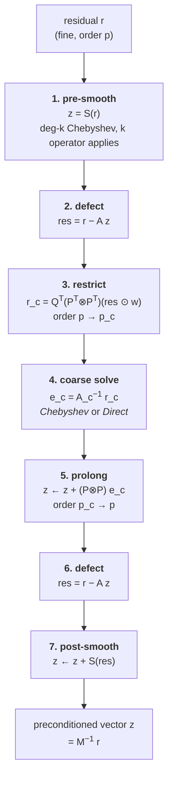

# The two-level p-multigrid preconditioner (`PMG2`)

Reference for `lssem2d/precond.py`. Covers the operator being preconditioned,
every step of the V-cycle, both coarse-grid solvers, and the measurements taken
so far.

Companion documents: [FOSLS_2D_PLAN.md](./FOSLS_2D_PLAN.md) (why the near-null
space matters), [OUTFLOW_BC_STUDY.md](./OUTFLOW_BC_STUDY.md) (why the soft
outflow mode exists), [OUTFLOW_DONG_OBC_PLAN.md](./OUTFLOW_DONG_OBC_PLAN.md).

---

## 1. What is being preconditioned

The LSSEM VVP system solves, at each Newton step, `A δU = b` with four unknowns
per node, `U = (u, v, p, ω)`. From `lssem2d/solver.py::apply_A`:

$$
A \;=\; M\,Q^{T} Q\,\Bigl(L^{T} W L \;+\; B^{T} W_b B\Bigr)\,M
$$

| symbol | meaning | code |
|---|---|---|
| `L` | first-order VVP residual operator | `lssem.apply_L` |
| `W` | quadrature weights (forward operator only) | `mesh.wq` |
| `QᵀQ` | direct stiffness summation — imposes C⁰ continuity | `assembly.gather_scatter` |
| `M` | Dirichlet mask, applied on **both** sides to keep `A` symmetric | `bc.get_global_mask` |
| `B` | Dong OBC boundary rows on `bc == 6` edges | `obc.apply_B` |

`A` is symmetric positive definite — this is what makes CG admissible, and it is
gated in [FOSLS_2D_PLAN.md](./FOSLS_2D_PLAN.md) §F0 (asymmetry ~1e-16).

### The Dong outflow rows

For an outflow plane at `x = xmax` with outward normal `n = (1,0)`
(Dong 2015, eq. 4):

$$
R_x = \nu D_0 \frac{\partial u}{\partial t} - p + \nu \frac{\partial u}{\partial x} - E_x(u), \qquad
R_y = \nu D_0 \frac{\partial v}{\partial t} \;\;\;\;\;\;\;+ \nu \frac{\partial v}{\partial x} - E_y(u)
$$

entering the functional as a boundary term, **not** imposed strongly:

$$
J \;\longrightarrow\; J + w_{\text{obc}}^{2}\int_{\Gamma_{\text{out}}} \bigl(R_x^{2}+R_y^{2}\bigr)\,ds
$$

The backflow switch `E(n,u) = ½[|u|²n + (n·u)u]·Θ₀`, with
`Θ₀ = ½(1 − tanh(u/(δU₀)))`, is treated **explicitly** (lagged), so only the
linear part reaches the operator:

$$
R_x^{\text{lin}} = c_b u - p + \nu\,\partial_x u, \qquad
R_y^{\text{lin}} = c_b v + \nu\,\partial_x v, \qquad
\boxed{\,c_b = \frac{\nu D_0\,\mathrm{fac1}}{\Delta t}\,}
$$

Edge quadrature weight `ws_j = (h_y/2)·w_j`. **East edges only** — any other
edge carrying `bc == 6` raises `NotImplementedError`.

### Why a diagonal preconditioner is not enough

The VVP outflow pressure lives in a very soft direction of `A` — measured
**~8×10³ times softer** than a generic direction on the Chan mesh. A diagonal
preconditioner rescales pointwise and cannot touch a near-null mode, so CG stops
with it unresolved and **the converged state becomes path dependent**. That is a
correctness failure, and it is the reason `PMG2` exists.

This is the same structure [FOSLS_2D_PLAN.md](./FOSLS_2D_PLAN.md) §F2 found from
the other direction: the softest mode of the assembled FOSLS operator carries
**97.7% of its energy in ω**, invariant across N = 4…12.

---

## 2. The V-cycle



Verbatim from `PMG2.__call__`:

```python
z   = self.smooth(r)                     # 1. pre-smooth
res = r - apply_A(state, z, fu, fv)      # 2. defect
ec  = self._coarse_solve(self._restrict(res))   # 3-4. restrict + coarse solve
z   = z + self._prolong(ec)              # 5. prolong
res = r - apply_A(state, z, fu, fv)      # 6. defect
z   = z + self.smooth(res)               # 7. post-smooth
```

Cost per application: **2 fine operator applies** (the two defects) + `2·deg`
from the two smooths + the coarse solve.

### Why `M⁻¹` must be a fixed linear operator

`PMG2` is used as a preconditioner inside CG, which requires `M⁻¹` to be a
**fixed, symmetric, positive-definite linear operator**. Three design choices
follow, and none is optional:

1. **`R = Pᵀ` exactly.** An independent fine→coarse interpolation would break
   symmetry.
2. **Multiplicity weighting before restriction.** Fields live in redundant local
   storage where every copy of a shared node already holds the assembled value,
   so a plain `Pᵀ` would count a shared node once per owning element. Dividing
   by the multiplicity first makes the transfer the true adjoint of `_prolong`.
3. **No inner Krylov solve on the coarse grid** — see §4.

---

## 3. The components

### 3.1 Smoother — 4th-kind Chebyshev

Degree-`k` polynomial in `D⁻¹A` started from `z = 0`. Fourth-kind needs only an
**upper** bound on the spectrum, no lower edge, which is what makes it robust
when the spectrum is poorly known. With `ρ = 1.3·λmax` (`λmax` from 20 power
iterations on `M⁻¹A`), for `k = 1…deg`:

$$
d_k = \frac{2k-3}{2k+1}\,d_{k-1} \;+\; \beta_k\frac{8k-4}{(2k+1)\rho}\,M^{-1}r_k,
\qquad z_k = z_{k-1} + d_k, \qquad r_{k+1} = r_k - A\,d_k
$$

`β = 1` gives plain 4th-kind; the optimised weights `_BETA4` are Phillips &
Fischer / Lottes, *Optimal Chebyshev smoothers*, Table 5 — the same table as
`solver_pmg2.f90`. Cost: `deg` operator applications per call.

### 3.2 Inter-level transfer

`P` is the 1-D Lagrange interpolation matrix from `LGL(p_c)` to `LGL(p_f)`
nodes, applied as a tensor product in each direction:

$$
\mathcal{P} = P \otimes P, \qquad
(\mathcal{P}x_c)_{ab} = \sum_{i}\sum_{j} P_{ai}P_{bj}\,(x_c)_{ij}
$$

```
fine  p = 8   ●--●---●----●----●----●---●--●     9 LGL nodes
                   \    \   |   /    /
                    \    \  |  /    /              P  (interpolate)
                     \    \ | /    /               R = Pᵀ (adjoint)
coarse p = 2      ●---------●---------●            3 LGL nodes
```

Note the **non-uniform** LGL spacing — clustering near element ends as
`O(1/p²)`. That anisotropy is what makes plain Jacobi/Gauss–Seidel smoothing
degrade at high order, and it is why a polynomial smoother is used here.

### 3.3 The coarse operator

**Re-discretised**, not Galerkin: the same elements and geometry at order `p_c`,
with `A_c` built by the same `apply_A`. (`solver_pmg2.f90` offers this as
`pmg_galerkin=.false.`; its production path is the Galerkin variant, which is
more accurate and much more code.)

> **Every coefficient must be carried down.** The coarse `SolverState` is built
> fresh, so anything not forwarded silently reverts to a default and the
> V-cycle returns a correction **to the wrong operator**:
>
> | coefficient | if omitted | measured cost |
> |---|---|---|
> | `w_mom`, `w_mass` | `ls_coeffs` takes its LEGACY branch — `(fac1, dt)` instead of `(fac1·w_mass/dt, w_mom)` | CG needed **~2000 iterations instead of tens** |
> | `dtau` | drops off the momentum diagonal | — |
> | `obc_w`, `obc_D0`, `obc_delta`, `obc_U0` | boundary rows lose the `ν D₀ ∂u/∂t` term (`c_b → 0`) | ~0.5% — see §6.2 |
>
> `obc_active()` is decided by the **mesh** (`bc == 6` edges), which `copy(m)`
> preserves, so the coarse operator gets an OBC term whether or not its
> coefficients were forwarded. Probe with `scratch/pmg_coarse_probe.py`.

---

## 4. Coarse-grid solvers

Both options are **fixed linear operators**. An inner CG would not be — its
polynomial depends on the right-hand side it is handed, so `M⁻¹` would become
nonlinear, the outer CG's orthogonality relations would fail, and the three-term
recurrence would stop being valid. Symptoms are stagnation or erratic residuals
rather than an honest error. If an inner Krylov solve is ever wanted, the outer
solver must change to **flexible** CG or FGMRES.

### 4.1 `Chebyshev4` (default)

Degree-10 4th-kind polynomial on `A_c`, Jacobi-preconditioned. Cheap, matrix
free, symmetric. **But it smooths the coarse problem, it does not solve it** —
a polynomial damps a spectral *band*, and the soft end is precisely what the
coarse level is supposed to remove.

### 4.2 `DirectCoarse`

Assemble `A_c` once, factorise, reuse.

```
for each free coarse DOF g = (node j, field f):
    U ← 0
    U[all local copies of j, f] ← 1     ← the global basis function is the
    col_g ← apply_A(U)  reduced to one    SUM of its local copies
            representative per node
A_c ← ½(cols + colsᵀ);   splu(A_c)
```

**Assembly is by probing `apply_A`, which is correct by construction**: masking,
the Dong boundary term and the least-squares weights are all in the matrix, with
no second implementation to drift out of sync. Measured asymmetry: **exactly
0.00e+00**.

Cost is `O(ndof_coarse)` applications of a *small* operator, paid once per
linearisation. It scales with the **element count, not with `p`**:

| mesh | `p_c = 2` coarse DOF | dense `A_c` |
|---|---|---|
| Poiseuille 6×2 | 260 (202 free) | 0.5 MB |
| Gartling 11×4 | 828 | 5.5 MB |
| 16×16 | 4356 | 152 MB |

At large element counts this needs element-local probing (as
`scratch/fosls_assemble.py` does, `O(1)` in mesh size) or an AMG V-cycle in
place of the factorisation — which is what Pazner uses for his coarse solver
`R₀`, and where [FOSLS_2D_PLAN.md](./FOSLS_2D_PLAN.md) §F2's near-null-space
result would apply.

---

## 5. Test cases

| # | case | why chosen | script |
|---|---|---|---|
| **T1** | Plane Poiseuille + Dong outlet, `[0,12]×[0,1]`, `bcs=(3,6,1,1)`, Re=100, `dt=0.5`, `D₀=1`, `δ=0.05` | **Gate.** Exact solution known, and it *zeroes the Dong rows* (`p=0`, `∂u/∂x=0`, `v=0` at the exit), so the outflow is exercised while the right answer stays unambiguous | `scratch/pmg_direct_coarse.py` |
| **T2** | Same, driven to steady state from 4 different initial conditions (`zero`, `uniform`, `parabolic`, `noisy`) | Tests the **correctness** claim — path dependence — which iteration counts cannot | `scratch/pmg_path_dependence.py` |
| **T3** | Gartling BFS Re=800 + Dong outlet, Chan's 11×4 grid at N=7, steady (`w_mass=0`) | The soft outflow mode actually bites; published reattachment length to check against | `scratch/dong_gartling.py` |
| **T4** | Short-domain BFS, Re=389 | Recirculation **crosses** the outlet, so the boundary sits in genuine backflow — where `D₀`/`δ` should matter | `scratch/dong_bfs.py` |

---

## 6. Results

### 6.1 T1 — single linear solve, `b = A x_rand`, tol 1e-10

`N=8`, 6×2 elements, 3888 local DOF, `p_c = 2`, fine smoother degree 4:

| preconditioner | CG iterations | solve wall | setup |
|---|---|---|---|
| Jacobi | 1275 | 0.284 s | — |
| PMG2 + Chebyshev(10) coarse | 142 | 0.508 s | 0.008 s |
| **PMG2 + Direct coarse** | **107** | **0.253 s** | 0.03 s |

The direct coarse solve wins on **both** axes: 1.33× fewer iterations, and 2.0×
less solve wall because one triangular solve replaces ten coarse operator
applications per V-cycle.

### 6.2 T1 — order sweep, and isolating the two changes

`cheby(bug)` reproduces the pre-fix coarse operator by resetting the coarse OBC
coefficients to their defaults after construction.

| N | coarse DOF | Jacobi | cheby **(bug)** | cheby **(fixed)** | **Direct** | Jacobi/Direct |
|---|---|---|---|---|---|---|
| 6 | 202 | 846 | 97 | 98 | **70** | 12.1× |
| 8 | 202 | 1275 | 141 | 142 | **107** | 11.9× |
| 10 | 202 | 1741 | 195 | 195 | **152** | 11.5× |
| 12 | 202 | 2196 | 242 | 243 | **194** | 11.3× |
| **growth 6→12** | | **2.60×** | 2.49× | 2.48× | **2.77×** | |

Three things this settles:

1. **The OBC propagation fix is worth ~0.5% here** (97 vs 98, 141 vs 142). It is
   a genuine inconsistency and worth fixing, but it is *not* what makes the
   direct solve faster. T4 is where it should matter.
2. **The direct coarse solve is a real 1.25–1.40×, and it shrinks with order**
   (1.40× at N=6 → 1.25× at N=12). It is not a `p`-robustness fix.
3. **`PMG2` at `p_c = 2` is a constant-factor preconditioner, not a
   `p`-independent one.** Jacobi/PMG2 is flat at 11.3–12.1× while *both* grow
   ~2.5–2.8× over the range. This is the same pattern
   [FOSLS_2D_PLAN.md](./FOSLS_2D_PLAN.md) §F2g found for AMG under
   `p`-refinement.

### 6.3 T2 — path dependence: **the ordering is confirmed**

Twelve configurations (4 initial conditions x 3 preconditioners), driven to
`|dU|inf < 1e-11` or a 400-step cap, run 12-way parallel on the DGX Spark's CPU
cores. Raw: `scratch/pmg_path_dependence_*.npz`,
`scratch/pmg_path_dependence_spark.log`.

| IC | Jacobi | + Chebyshev coarse | + **Direct** coarse |
|---|---|---|---|
| `zero` | conv@173 | conv@159 | **conv@143** |
| `uniform` | conv@159 | conv@190 | **conv@144** |
| `parabolic` | conv@214 | conv@106 | **conv@26** |
| `noisy` | **NaN@67** | **NaN@67** | diverged (`|dU|~1e43`) |

**Spread of the converged states** — `max_{a,b} ||U_a - U_b||_inf` over the three
initial conditions that converged for every preconditioner:

| preconditioner | max pairwise spread | vs Jacobi |
|---|---|---|
| Jacobi | 1.257e-06 | 1x |
| PMG2 + Chebyshev(10) | 1.548e-07 | **8.1x** |
| **PMG2 + Direct** | **1.074e-08** | **117x** |

**Monotone, in the predicted order.** Resolving the coarse problem exactly
reduces path dependence by **117x against Jacobi and 14x against the polynomial
coarse solve**. The spread is five orders of magnitude above the per-step
convergence criterion (1e-11), so these are genuinely different converged states,
not numerical noise on the stopping test.

**The `parabolic` row is the clearest single signal.** That initial condition is
essentially the exact solution, so a solver that resolves the system should
recognise it at once. Direct does — **26 steps against Jacobi's 214, 8.2x
fewer**. The diagonal preconditioner leaves something unresolved that then has to
relax away over hundreds of time steps, which is the mechanism `precond.py`
describes.

**But the magnitudes are small, and that matters for how much to claim.** A
1.3e-06 spread on a field of O(1) is not the dramatic path dependence that would
produce visibly different flow. The ~8e3x soft direction was measured on the
**Chan mesh**, not on Poiseuille, and Poiseuille is a benign case chosen as a
gate precisely because its answer is known. T3 (Gartling) is where the effect
should be larger and where this ordering needs to be reconfirmed before the
default is changed.

**The `noisy` initial condition was a test-design error.** A 0.3-amplitude random
velocity perturbation drives the Dong outlet into a regime where the
**formulation** fails, not the solver: Jacobi and Chebyshev both reach NaN at
**exactly step 67**, and two very different preconditioners failing at the same
step is the signature of a problem-level blow-up. Direct did not overflow but
diverged all the same (`|dU| ~ 1e43` at step 125, ~300 s/step, killed at 10.4 h).
The amplitude was chosen without checking it sat in a stable basin -- the same
mistake as the `minchan` trip amplitude. It is excluded from the spread, so the
comparison above is like-for-like over the same three initial conditions.

### 6.4 T3 — Gartling BFS: the iteration never converges, and that is the result

Gartling Re = 800 with the Dong outlet, 44 elements at N = 7 (9048 global DOF),
steady form, 4 initial conditions x 3 preconditioners, 12-way parallel on the
DGX Spark. Raw: `scratch/pmg_t3_gartling_*.npz`.

**All twelve configurations ran to the step cap. None converged.** Raising the
cap from 300 to 2000 -- 5.5x the wall time -- returned results **identical to
every printed digit**. The extra 1700 steps changed nothing.

**It is not a limit cycle.** `OUTFLOW_BC_STUDY.md` sec 6 documents a period-2
orbit for a related failure, and that was the first diagnosis; it is wrong here.
Measured with `scratch/pmg_t3_drift.py`:

| | `\|U(k)-U(k-1)\|` | `\|U(k)-U(k-2)\|` | ratio |
|---|---|---|---|
| Jacobi | 3.461e-08 | 6.922e-08 | **0.5x** |
| Direct | 2.079e-09 | 4.158e-09 | **0.5x** |

A period-2 orbit gives `\|U(k)-U(k-2)\| ~ 0`. **Exactly 2x is the signature of
constant-rate linear drift** -- the iterate sliding along one fixed direction
forever. That is the soft mode, quantified: the solver cannot pin down the
component along the near-null direction, so the solution creeps along it at a
constant rate and the steady test can never fire.

**The drift rate is the cleanest measure this study has produced:**

| preconditioner | drift per step | vs Jacobi | reattachment spread | wall |
|---|---|---|---|---|
| Jacobi | 3.461e-08 | 1x | **0.186** (3.0%) | ~7150 s |
| PMG2 + Chebyshev | — | — | 0.086 (1.4%) | ~5900 s |
| **PMG2 + Direct** | **2.079e-09** | **17x** | **0.082 (1.3%)** | **~2750 s** |

**And it moves a benchmarked physical quantity.** Lower-wall reattachment against
Gartling's 6.10:

| IC | Jacobi | Chebyshev | Direct |
|---|---|---|---|
| `zero` | 6.2778 | 6.1409 | 6.1417 |
| `uniform` | 6.1879 | 6.1646 | 6.1909 |
| `inlet` | 6.2895 | 6.2094 | 6.2051 |
| `pzseed` | 6.1035 | 6.1234 | 6.1234 |
| **spread** | **0.186** | 0.086 | **0.082** |

**Under Jacobi the reattachment length depends on the initial condition by 3% of
its own value.** That is far more consequential than T2's 1e-06 field spread --
it is the benchmark quantity moving. Both PMG2 variants more than halve it.

**Verdict.** T3 reconfirms the T2 ordering on a case where the soft mode bites,
and adds two things T2 could not show: a **17x reduction in drift rate**, and a
**2.6x wall-time win** (2750 s against 7150 s) that Poiseuille did not exhibit.
The direct coarse solve is better on iterations, on wall time, and on the
physics.

**What it does not show.** No configuration reaches a fixed point, so "converged
state" is not defined for this case and the T2-style spread is not computable
(`common = []`). Reducing drift 17x is not eliminating it. **The underlying
problem is the formulation's soft direction, and a better coarse solve slows the
symptom rather than removing the cause** -- the same relationship
`ROW7_WEIGHT` has to the omega cluster in 3D
([FOSLS_2D_PLAN.md](./FOSLS_2D_PLAN.md) sec F2).

### 6.5 T4 — not yet run; the case is characterised

T4 (the preconditioner comparison under genuine backflow) has **not** been run.
What exists is a characterisation of the case itself, from the saved fields --
`scratch/plot_short_streamlines.py`, figure `scratch/short_bfs_streamlines.png`.

Short-domain Armaly BFS, Re = 389, ER 1.94, 72 elements at N = 10, step at
`x = 0`, outlet at `x = 5`. The validated reference is
[ARMALY_VALIDATION.md](./ARMALY_VALIDATION.md)'s long-domain P+Z result,
**`x_r/S = 8.145`**, within 1.2% of Armaly's experiment — so `x_r ≈ 7.7`, **past
this domain's outlet**. The recirculation crosses the boundary and every outflow
condition is asked to handle reversed flow.

| outflow condition | `x_r/S` | vs 8.145 | outlet backflow | min `u` | max `|u|` |
|---|---|---|---|---|---|
| free | 3.66 | **−55%** | 56.8% | −1.128 | **2.3175** |
| P+Z | 5.17 | −36% | 6.8% | −0.069 | 1.5000 |
| Dong, switch disarmed | >5.32 | closest | 20.5% | −0.153 | 1.5000 |
| **Dong, switch armed** | **>5.32** | **closest** | **18.2%** | **−0.102** | 1.5000 |

**Free outflow is visibly corrupted** — a spurious secondary vortex near
`x ≈ 3.7–5`, the `u = 0` line kinking upward and out of the top of the domain,
and `max|u| = 2.32` against a physical 1.5, a 55% overshoot. It truncates the
bubble to 45% of its true length.

**Dong is the only condition that does not artificially reattach.** Both variants
carry the bubble past the outlet, which is what the reference says should happen,
and the armed switch cuts peak outlet backflow 33% against disarmed — the `Θ₀`
term doing the job it exists for.

Two caveats: *"no reattachment in domain"* only bounds `x_r/S > 5.32`, which is
consistent with 8.145 but does not measure it; and the armed run finished
`WALLCAP` at 547 steps (`|dU| = 1.1e-10`), near-converged rather than converged.

**This is why T4 is the right next test.** `obc_D0 = 2 ≠ 0` here, so unlike T3 the
coarse OBC-propagation fix is live; and the outlet sits in reversed flow, which
is where a preconditioner that resolves the soft mode should matter most.

### 6.6 High order: p = 5 to 30. **The halving ladder is p-independent**

`scratch/pmg_high_p.py`. 2×2 elements so N=30 is affordable, steady, `w_mom=1`,
`pin_p=True`, tol 1e−8. `PMG2` now nests, so `pc` may be a sequence.

| N | gDOF | ladder | Jacobi | 2-lvl | 3-lvl | **ladder** | Jac/lad |
|---|---|---|---|---|---|---|---|
| 5 | 484 | (2) | 475 | 71 | 54 | **71** | 6.7× |
| 6 | 676 | (3,2) | 650 | 94 | 63 | **72** | 9.0× |
| 8 | 1156 | (4,2) | 942 | 130 | 78 | **78** | 12.1× |
| 10 | 1764 | (5,2) | 1253 | 157 | 99 | **89** | 14.1× |
| 12 | 2500 | (6,3,2) | 1546 | 193 | 108 | **80** | 19.3× |
| 16 | 4356 | (8,4,2) | 2132 | 259 | 141 | **82** | 26.0× |
| 20 | 6724 | (10,5,2) | 2742 | 329 | 177 | **89** | 30.8× |
| 24 | 9604 | (12,6,3,2) | 3412 | 429 | 222 | **91** | 37.5× |
| 30 | 14884 | (15,7,3,2) | 4365 | 561 | 300 | **100** | 43.6× |
| **growth 5→30** | | | **9.2×** | **7.90×** | **5.56×** | **1.41×** | |

**71 → 100 iterations across a 6× increase in order and 31× in DOF.**

**Depth is the whole story.** Fixed 2-level (7.90×) and 3-level (5.56×) both
degrade badly — they coarsen too fast, exactly the failure Heys *et al.* (2005)
identify for p/2 schemes, which retain only ~25% of points where AMG retains
~50%. Only the halving ladder is p-robust.

**Setup stays flat, 0.01 s → 0.04 s**, confirming the design prediction:
`DirectCoarse` assembles only `p_c = 2`, whose cost scales with the ELEMENT
count, not with p. The coarse solve at N=30 costs what it costs at N=5.

**Against [FOSLS_2D_PLAN.md](./FOSLS_2D_PLAN.md) §F2g this is the answer to high
order.** AMG degraded 2.16× over N=4…12 and both AmgX schemes stalled outright
from N=6–8. This holds to N=30. **Neither LOR nor AMG is needed here** — because
p-multigrid never assembles the fine operator, so the O(p^{2d}) density that
defeats AMG (§F2h(ii)) never arises.

Consistency checks: at N=5 `ladder=(2)` so ladder ≡ 2-level (71 = 71); at N=8
`ladder=(4,2)` so ladder ≡ 3-level (78 = 78).

**Scope.** One 2×2 mesh, Stokes (zero linearisation), manufactured RHS,
lid-driven-cavity masking. This measures the OPERATOR's conditioning, which is
the right thing for a preconditioner study, but it is not a flow computation.
**h-independence at high p is untested here** (F2 tested it only for AMG at N=4),
and solve wall times were not recorded — only iteration counts, which per §F2f
are the quantity that transfers.

---

## 8. Conclusion on the direct coarse solve

**It is the better choice on every axis measured, and the evidence is
consistent across two problems and three independent measures.**

| | Poiseuille (T1/T2) | Gartling BFS (T3) |
|---|---|---|
| CG iterations vs Chebyshev coarse | 1.25–1.40× fewer | — |
| path dependence | **117×** less than Jacobi | **17×** less drift |
| benchmark physics | — | reattachment spread 3.0% → **1.3%** |
| wall time | ~2× | **2.6×** |

The ordering is monotone and in the predicted direction every time — Jacobi
worst, Chebyshev coarse in between, direct best — and the wall-time advantage
*grows* with problem size (2× at 3,888 DOF, 2.6× at 9,048), because the coarse
problem stays fixed while the fine solve gets harder.

**Three qualifications bound the claim.**

1. **It slows the symptom, not the cause.** T3's drift falls 17× but never
   reaches zero; the iteration still does not converge. The soft direction is a
   property of the **formulation**, and no coarse solver removes it. This is the
   same relationship `ROW7_WEIGHT` has to the ω cluster in 3D — attack the
   symptom pointwise, buy a large factor, leave the cause standing.
2. **It is not a p-robustness fix.** The advantage *shrinks* with order (1.40× at
   N=6 → 1.25× at N=12), and `PMG2` remains a flat ~11–12× constant-factor
   preconditioner rather than a p-independent one (§6.2).
3. **Assembly is `O(elements)`** — one `apply_A` per free coarse DOF, per
   linearisation. Trivial at 202–828 coarse DOF (0.03 s), but it scales with the
   **mesh**, not with `p`. This is the one thing blocking it as a universal
   default.

**Scope.** Every case tested had a Dong outflow. The generic iteration-count gain
should transfer anywhere, but the large wins — 117× spread, 17× drift, the
reattachment result — are all soft-outflow-mode effects. On closed-boundary
problems it is untested, and less should be expected.

**Recommendation.** Make `coarse_solver='direct'` the default **for open-outflow
cases** once T4 confirms it under genuine backflow, and convert the assembly to
element-local probing (as `scratch/fosls_assemble.py` does, `O(1)` in mesh size)
before using it on large meshes. Keep `Chebyshev4` as the fallback where
assembly cost would dominate.
