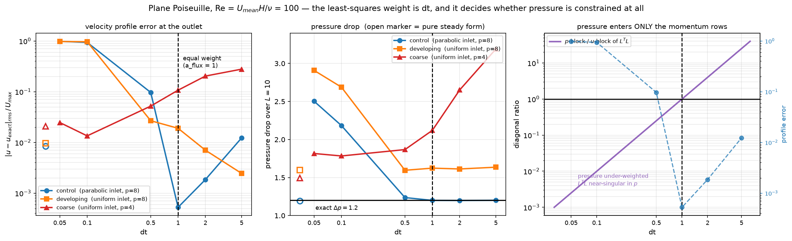
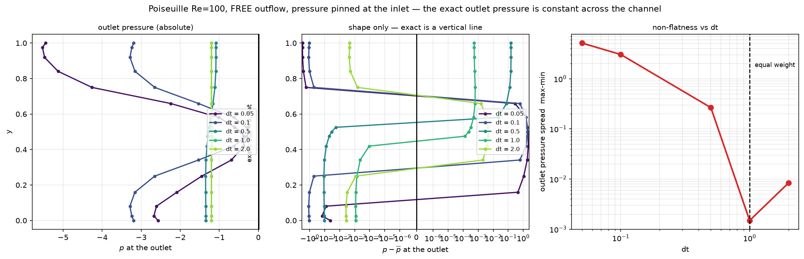

# Poiseuille Re=100: what dt actually controls in the LSSEM VVP formulation

Study date: 2026-08-08. Companion to
[PRECONDITIONER_AND_DT_STUDY.md](./PRECONDITIONER_AND_DT_STUDY.md), which found
the BFS steady state to be dt-dependent. This one isolates *why*, on a case with
a known exact solution, and led to the `w_mom` / `w_mass` parameters that
decouple the least-squares weight from the time step.

> **Correction (2026-08-12): §4's stability conclusion is WITHDRAWN — it was a
> boundary-condition artifact.** The `dt = 0.5, w_mass = w_mom = 1` failure that
> §4 reads as "the weight destabilises the iteration" is a period-2 limit cycle
> generated by the FREE OUTFLOW, not by the weighting. On the identical mesh,
> order, ν, weights and exact solution, made streamwise-periodic instead of
> inflow/outflow, dt = 0.5 at those exact coefficients converges to a bit-exact
> fixed point in 425 steps — as do dt = 1 and dt = 0.05. Imposing velocity at
> the outlet also cures it completely (`|dU| = 0`, Δp = 1.20000); imposing
> pressure across the whole outlet plane does nothing.
>
> Stronger still: **at dt = 0.5 with the free outflow, seeded with the exact
> solution, the scheme sits at Δp = 1.20000 (error 1.85e-16) for 600 steps and
> never moves.** The correct answer is a bit-exact fixed point at that dt; the
> orbit is a *second attractor* that only a cold start reaches. So dt does not
> control stability here, it controls which basin the transient finds — meaning
> small dt is usable if continued from a larger-dt solution.
>
> The free outflow also costs ~730x in accuracy at dt = 1, where everything
> appears to work. See [OUTFLOW_BC_STUDY.md](./OUTFLOW_BC_STUDY.md).
> **The dt-as-weight mechanism in §2 and §3 is unaffected** and is
> independently confirmed by the block-ratio measurement there.

> **Correction (2026-08-09): the effect reported here is real, and UNDERSTATED
> by 113x.** Every run below used the default absolute CG tolerance
> `tol = 1e-6` (see [CG_TOLERANCE_FLOOR.md](./CG_TOLERANCE_FLOOR.md)). The sweep
> has since been re-run with both floors lowered (`cgsfac=1e-8`, `tol=1e-10`):
> dt=1 improves **113x**, 5.26e-04 → **4.65e-06**, while dt=0.05 is unchanged at
> 98.5% error — no amount of linear-solve accuracy helps a near-singular
> pressure block. The spread over dt goes from **1875x to 212,061x**. Full table
> in [STEADY_FORM_STUDY.md](./STEADY_FORM_STUDY.md) §6, reproduce with
> `scratch/dt_tight.py`. Read the numbers below as a lower bound.

Follow-up: [WEIGHT_VS_TIMESTEP_STUDY.md](./WEIGHT_VS_TIMESTEP_STUDY.md) uses
these parameters to separate the weighting from the time step on the BFS, and
shows the lid-driven cavity is ~300x less sensitive than Poiseuille.
[STEADY_FORM_STUDY.md](./STEADY_FORM_STUDY.md) then removes the time derivative
altogether (`w_mass = 0`), which turns the weight into a single monotone knob.

Reproduce: `scratch/poiseuille_dt.py` (dt sweep), `scratch/plot_poiseuille.py`
(figure), `scratch/poiseuille_pout.py` (outlet pressure), `scratch/poiseuille_new.py`
(`w_mom`), `scratch/wmass_run.py` (the two-parameter sweep).

---

## Executive summary

1. **dt is the least-squares weight of the momentum equations**, not just a time
   step. The momentum rows are `fac1*u + dt*N(u)`; the constraints are unweighted.

2. **Pressure appears ONLY in the momentum rows.** So the pressure block of
   `LᵀL` scales as `dt²`. At small dt the pressure is effectively unconstrained,
   `LᵀL` develops a near-null space in `p`, and the exact solution stops being
   the *unique* minimiser. Measured: dt=0.05 gives **98% velocity error on a
   problem whose exact solution is exactly representable**.

3. **The optimum is dt = 1**, where the pressure and velocity blocks are equally
   weighted. There, Δp = 1.19999 against the analytic 1.2 — five significant
   figures — and the profile error is 5.3e-04. Across the sweep the profile
   error varies **1875×**.

4. **dt=1 is essentially universal** — the equal-weight point is 1.00 ± 1% for
   every mesh, order, Reynolds number and geometry tested, including both BFS
   grids. It is not a tuned constant.

5. **This is a design flaw, not a tuning knob**, so two weights were added.
   `w_mom` multiplies only the spatial operator `N(U)`; `w_mass` multiplies the
   time-derivative group. Together they set the momentum weight and the effective
   time step independently (`dt_eff = dt·w_mom/w_mass`). Default is legacy.

6. **The decoupling does not rescue small dt, and the sweep says why.** At fixed
   `dt_eff` a higher momentum weight is more accurate but destabilises the
   iteration: `dt_eff=0.5` with weight 1 fails to converge (Δp = 15.2) where
   legacy at the same `dt_eff` and weight 0.5 converges in 60 steps. Legacy's
   coupling `weight = dt` is a *stable* pairing, not an arbitrary one. And
   `w_mass = dt, w_mom = 1` turns out to be legacy-at-dt=1 in disguise — the
   nominal dt becomes decorative.
   > **Half of this is withdrawn (2026-08-12).** The destabilisation claim is a
   > free-outflow artifact — see the banner above and
   > [OUTFLOW_BC_STUDY.md](./OUTFLOW_BC_STUDY.md). The
   > `w_mass = dt, w_mom = 1` = legacy-at-dt=1 identity is unaffected; it was
   > verified bit-identically at the operator level and still holds.

---

## 1. Setup

| | |
|---|---|
| geometry | L × H = 10 × 1 |
| Re | `U_mean·H/ν` = 100, so ν = 0.01 |
| inlet | parabolic, `u = 6y(1-y)`, U_mean = 1, U_max = 1.5 |
| outlet | FREE — nothing imposed on u, v, p, ω |
| pressure pin | inlet plane, lower-left corner |
| walls | no-slip |
| exact | `dp/dx = -12νU_mean/H² = -0.12`, **Δp over L = 1.20** |

The pressure drop is a *prediction*: pressure is pinned only at the inlet and the
outflow is free, so nothing imposes the drop.

**Three variants**, because the control alone gives a null result by construction:

| variant | mesh | inlet | why |
|---|---|---|---|
| `control` | 10×2, order 8 | parabolic | exact solution is in the discrete space |
| `develop` | 10×2, order 8 | **uniform** | entrance region is non-polynomial |
| `coarse` | 5×1, order 4 | uniform | deliberately under-resolved |

> A coarse or low-order mesh does **not** perturb the control. `u = 6y(1-y)` is
> degree 2, exact for any N ≥ 2; the rectangle's geometry mapping is affine; the
> residual is zero pointwise so quadrature order is irrelevant. To make dt matter
> the *solution* has to leave the polynomial space, which is what the uniform
> inlet does. (My first design used low order as the perturbation. That was
> wrong and was replaced.)

---

## 2. Results



### control — parabolic inlet, order 8

| dt | profile err | Δp | Δp err | p-block/u-block |
|---|---|---|---|---|
| 0 (pure steady) | 8.46e-03 | 1.19224 | 6.5e-03 | — |
| 0.05 | 9.85e-01 | 2.50359 | 1.09 | 0.0025 |
| 0.1 | 9.37e-01 | 2.18379 | 0.820 | 0.0099 |
| 0.5 | 9.67e-02 | 1.23704 | 3.1e-02 | 0.249 |
| **1.0** | **5.26e-04** | **1.19999** | **5.3e-06** | **0.994** |
| 2.0 | 1.85e-03 | 1.19837 | 1.4e-03 | 3.98 |
| 5.0 | 1.23e-02 | 1.20100 | 8.3e-04 | 24.9 |

**1875× spread in profile error across dt**, on a problem whose exact solution
the discretisation can represent perfectly. The minimum sits exactly where the
pressure and velocity blocks are equally weighted.

### the other two variants

| variant | best dt | profile err there | spread over dt |
|---|---|---|---|
| control | **1.0** | 5.25e-04 | 1875× |
| develop | 5.0 | 2.45e-03 | 399× |
| coarse | **0.1** | 1.35e-02 | 21× |

**The trend reverses when under-resolved.** The coarse case is best at *small* dt
and degrades monotonically to 2.8e-01 at dt=5 — when the mesh cannot represent
the momentum equation, deliberately down-weighting it is the right thing to do.
So "dt=1" presumes adequate resolution.

> Caveat on `develop`: its Δp settles near 1.6, not 1.2, and that is **physically
> correct** — uniform-inlet flow has a genuine entrance loss. The `dp_err` column
> is meaningless for that variant; only `control` should be judged against 1.2.

---

## 3. Mechanism

Which variables does each least-squares row involve?

```
momentum-x : fac1*u + dt*( u u_x + v u_y + p_x + nu om_y )   -> u,v,P,om   weight dt
momentum-y : fac1*v + dt*( u v_x + v v_y + p_y - nu om_x )   -> u,v,P,om   weight dt
continuity :            u_x + v_y                            -> u,v        weight 1
vorticity  :            om + u_y - v_x                       -> u,v,om     weight 1
```

**Pressure appears only in the momentum rows.** Its block in `LᵀL` therefore
carries `dt²`, while the constraint rows carry 1. At dt=0.05 the pressure is
~400× under-weighted; `LᵀL` is near-singular in `p`, the minimiser is not unique,
and the solver converges — genuinely, to `diff = 0` — to a wrong member of the
near-null space.

This is the flaw in the intuition that "a representable exact solution must be
recovered". Zero residual makes it *a* minimiser; it does not make it *the*
minimiser.

### Why dt = 1, universally

```
pressure diagonal ~ dt² · Σ(P_x² + P_y²)
velocity diagonal ~      Σ(fac1²P² + P_x² + P_y²)
```

Once the gradient terms dominate the mass term — i.e. once resolved — the ratio
collapses to exactly `dt²` and the balance point is dt=1 regardless of anything
else. Measured:

| case | order | ν | equal-weight dt |
|---|---|---|---|
| Poiseuille control (10×2) | 8 | 0.01 | 1.003 |
| Poiseuille fine (20×4) | 8 | 0.01 | 1.001 |
| Poiseuille p=12 | 12 | 0.01 | 1.001 |
| Poiseuille Re=1000 | 8 | 0.001 | 1.003 |
| BFS Chan short | 10 | 1/389 | 1.010 |
| BFS Chan long | 10 | 1/389 | 1.007 |
| Poiseuille coarse (5×1) | 4 | 0.01 | 1.329 |

The coarse case deviates precisely because it is the one where `fac1²P²` still
matters. This is an **a priori** criterion: computable from `compute_jacobi`
without running anything.

It also independently corroborates the BFS analysis, which put the optimum at
dt = 0.72–0.91 from a completely different argument (crossing of the normalised
steady residuals).

---

## 3a. Outlet pressure — the sharpest single diagnostic

The exact solution is `p = p₀ − Gx`, **independent of y**, so the pressure across
the outlet plane must be a vertical line. Nothing imposes this: the outflow is
free and pressure is pinned only at the inlet corner, so `p(y)` at the outlet is
entirely a prediction. It turns out to be the most direct probe of the
under-weighting, because it isolates pressure with no velocity scaling in the
way.



| dt | outlet p spread (max−min) | as % of Δp | mean p_out (exact −1.2) |
|---|---|---|---|
| 0.05 | 5.157 | **430%** | −2.527 |
| 0.1 | 3.048 | 254% | −2.130 |
| 0.5 | 0.266 | 22.2% | −1.237 |
| **1.0** | **1.50e-03** | **0.12%** | **−1.19999** |
| 2.0 | 8.35e-03 | 0.70% | −1.19834 |

At dt=0.05 the outlet pressure swings from −5.4 at the top wall to −0.7 near
y=0.35 — a **5.16 variation across a plane whose total streamwise drop is only
1.2**. By dt=1 it is flat to 0.12% and the mean is −1.19999, exactly the analytic
drop below the pinned inlet. The non-flatness has a clean minimum at dt=1 and
rises again by dt=2.

This is the pressure under-weighting made visible rather than inferred: with `p`
present only in the momentum rows, at small dt nothing constrains its
cross-channel variation, and the free outflow lets it drift. The velocity error
tracks it exactly (98.5% → 0.05%) because a wrong pressure gradient drives a
wrong velocity.

> dt=5 is absent from this figure. That case ran 50 minutes without completing
> despite taking only 60 steps in the §2 sweep; it was stopped rather than
> diagnosed. An open loose end, not a result.

---

## 4. The `w_mom` parameter

Because dt is doing two unrelated jobs — temporal resolution and equation
weighting — one number cannot optimise both. `SolverState` takes `w_mom`:

```python
SolverState(mesh, D, nu, dt, fac1, w_mom=1.0)
```

### What it does to the equations

The momentum PDE discretised in time is

```
(fac1*u - sum_m alpha_m u^{n-m}) / dt  +  N(U) = 0
```

with `N(U) = u.grad(u) + grad(p) + nu*curl(omega)`. Making this a least-squares
row requires choosing a scale, and that choice is not neutral because the other
three rows are fixed at weight 1.

```
legacy   :  fac1*u - sum alpha_m u^{n-m}          +  [dt] * N(U)
w_mom set:  (fac1/dt)*u - (1/dt) sum alpha_m u^{n-m}  +  [w] * N(U)
```

**`w_mom` multiplies ONLY `N(U)`.** It does not appear in the mass term, the
history term, or either constraint row. The time-derivative terms keep their
natural `1/dt`.

| | a_mass | a_flux | a_hist |
|---|---|---|---|
| legacy | `fac1` | `dt` | 1 |
| `w_mom` set | `fac1/dt` | `w_mom` | `1/dt` |

Because BDF gives `fac1 = sum alpha_m`, the mass and history terms cancel
identically at steady state (measured: exactly `0.000e+00`). So the functional
being minimised at steady state is

```
J = integral[ w^2 (N_1^2 + N_2^2) + (div u)^2 + (omega + u_y - v_x)^2 ]
```

against legacy's identical expression with **`dt^2`** in place of `w^2`. That
single substitution is the whole change: the momentum weight becomes `w`, with
no dt in it.

The coefficients live in one place, `lssem.ls_coeffs()`, consumed by `apply_L`,
`apply_LT`, `compute_jacobi`, `step_bdf`'s history term, and both numba wrappers
— the five sites that must agree or the mass terms stop cancelling and the
solver silently converges to a modified equation. **Default is legacy**, so
nothing changes unless asked.

### Verification

| gate | result |
|---|---|
| A — `w` absent from `a_mass` and `a_hist` | exact at every (dt, w) |
| B — `a_mass` independent of `w` at fixed dt | 15.0 at dt=0.1, 1.5 at dt=1.0 |
| C — steady mass term cancels, residual = `w*N(U)` | exactly `0.000e+00` |
| D — legacy path untouched | `(fac1, dt, 1)` at every dt |
| E — dt=1.0, `w_mom`=1.0 reproduces legacy | **bit-identical**, all three operators |
| F — numba matches numpy | 1.0e-16 – 2.2e-16 |
| G — `apply_LT` still the exact transpose | 1.7e-16 – 4.2e-16 |
| full suite, both backends | 47 passed |

**Confirmed against the analytic solution** (dt=1.0, `w_mom`=1.0, Jacobi):

| quantity | computed | exact | error |
|---|---|---|---|
| pressure drop over L=10 | **1.199994** | 1.200000 | 5.3e-06 |
| outlet pressure spread | 1.50e-03 | 0 | 0.12% of dp |
| velocity profile | 5.26e-04 | 0 | 5.3e-04 |

The outlet pressure varies only in the sixth decimal about a mean of −1.199988.

### `w_mass` — the second weight

`w_mom` alone pins `a_mass = fac1/dt` to the time step, so it reaches only a line
in the `(a_mass, a_flux)` plane. `w_mass` supplies the missing degree of freedom
by weighting the time-derivative group:

```python
SolverState(mesh, D, nu, dt, fac1, w_mom=1.0, w_mass=0.5)
```

```
w_mass * [fac1*u - sum_m alpha_m u^{n-m}] / dt   +   w_mom * N(U)
```

It multiplies the mass and history terms **together**, so they still cancel
identically at steady state and the steady residual remains exactly
`w_mom * N(U)` — `w_mass` cannot corrupt the converged answer, only the path
taken and the conditioning.

| | nature | meaning |
|---|---|---|
| `w_mom` | numerical | least-squares weight of momentum against the constraints |
| `w_mass / w_mom` | physical | a time rescaling: **`dt_eff = dt · w_mom / w_mass`** |

`w_mass` alone has no physical meaning — it is half of a time rescaling. **Set
`w_mass = w_mom` for time-accurate runs** (then `dt_eff = dt`). For steady-state
work the group cancels, so `w_mass/w_mom` acts as a pseudo-time step chosen for
convergence rather than accuracy: larger `w_mass` gives a smaller pseudo-step and
more diagonal dominance in the velocity block — slower but more stable.

Gates, all passing: `w_mom` absent from `a_mass`/`a_hist`; `a_mass` independent
of `w_mom`; steady cancellation exactly `0.000e+00` for arbitrary `w_mass`;
legacy untouched; `w_mass = w_mom = dt` bit-identical to legacy; `w_mass = dt,
w_mom = 1` bit-identical to legacy-at-dt=1 at every nominal dt; numba parity
1.1e-16 – 1.7e-16; self-adjointness 2.2e-16 – 7.8e-16; `dt_eff` matches
`a_flux·fac1/a_mass` exactly; 47 tests on both backends.

### What the two-parameter space actually shows

| config | a_mass | a_flux | **dt_eff** | steps | converged | prof err | Δp |
|---|---|---|---|---|---|---|---|
| legacy dt=1.0 | 1.5 | 1.0 | 1.0 | 279 | yes | 5.255e-04 | 1.19999 |
| dt=0.5, `w_mass`=0.5, `w_mom`=1 | 1.5 | 1.0 | 1.0 | 279 | yes | 5.255e-04 | 1.19999 |
| dt=0.1, `w_mass`=0.1, `w_mom`=1 | 1.5 | 1.0 | 1.0 | 279 | yes | 5.255e-04 | 1.19999 |
| dt=0.5, `w_mass`=1.0, `w_mom`=1 | 3.0 | 1.0 | **0.5** | 600 | **no** | 7.78e-01 | **15.22** |
| legacy dt=0.5 | 1.5 | 0.5 | **0.5** | 60 | yes | 9.67e-02 | 1.23704 |

Three conclusions, none of them the convenient one.

**Smaller dt does not buy stability here.** Every converged run has
`dt_eff = 1.0`; the one that failed has the *smaller* effective step.

**It is the weight, not the step, that destabilises.** The last two rows share
`dt_eff = 0.5` and differ only in momentum weight, 1.0 against 0.5. The
higher-weight row is exactly `2x` the legacy row and does not converge; the
legacy row settles in 60 steps. So at fixed `dt_eff`, raising the momentum weight
improves accuracy but destabilises the iteration — and legacy's coupling
`weight = dt` turns out to be a *stable* pairing, not merely an arbitrary one.

> **WITHDRAWN (2026-08-12).** The non-convergence of the `weight = 1` row is a
> free-outflow artifact, not a property of the weighting. Remove the outflow
> (periodic + body force, everything else identical) and `(a_mass, a_flux) =
> (3.0, 1.0)` converges to a bit-exact fixed point in 425 steps. Constrain the
> velocity at the outlet and it converges with Δp = 1.20000. The iteration is
> converging to a period-2 orbit seeded in ω at the outlet/wall corners, whose
> amplitude is 20,000x larger in the last element than four elements upstream.
> Whether high weight destabilises some *other* case is untested; this row does
> not show it. [OUTFLOW_BC_STUDY.md](./OUTFLOW_BC_STUDY.md)

**`w_mass = dt, w_mom = 1` is legacy-at-dt=1 in disguise.** Rows 1–3 are
identical to every digit and take the same 279 steps, at nominal dt of 1.0, 0.5
and 0.1 — verified bit-identical at the operator level for `apply_L`, `apply_LT`
and `compute_jacobi`. The nominal dt becomes decorative. This does **not** give a
small time step with dt=1 accuracy; it silently takes unit steps.

**Practical upshot:** the useful corner of the two-parameter space is
`dt_eff ≈ 1` with `weight ≈ 1`, and the simplest route there is `dt = 1`. The
parameters let you express the alternatives and show why they do not help, which
beats leaving it a matter of argument — but they are not a way to run at small dt
and keep dt=1 accuracy.

### An earlier version of this parameter was wrong

The first implementation used `a_mass = w*fac1/dt`, `a_hist = w/dt` — scaling
the mass and history terms by `w` as well. That makes `w` factor out of the
entire row:

```
a_mass*u + a_flux*N - a_hist*sum(alpha u_old)  =  (w/dt) * [legacy row]
```

so `w` could only rescale the row and could never change the balance between the
time-derivative term and `N(U)`. Sweeps run under those semantics (dt=0.1,
`w_mom` 0.5–0.7) showed no weight beating legacy, but that finding says nothing
about the corrected form and has been removed rather than reinterpreted. The one
data point that survives is `w_mom = 1`, where the two forms coincide.

---

## 5. Two corrections made during this study

Recorded because both were plausible and both were wrong.

**"dt won't matter for Poiseuille."** I predicted no dt sensitivity because the
exact solution is representable and has zero residual. Wrong — see §3. Zero
residual does not imply a unique minimiser.

**"The small-dt runs terminated prematurely."** The stopping test was
`max|ΔU per step| < 1e-11`, which scales with dt, so small-dt runs appeared to
stop early. I diagnosed that as the cause of the dt trend. It was not: rerunning
with a dt-normalised rate criterion and a minimum physical time (t ≥ 300, three
viscous times) reproduced the numbers **bit-identically**. The runs had genuinely
converged. The criterion was still wrong and was fixed, but it was not the cause.

**Also fixed in passing:** `dt=0` cannot be driven through `step_bdf`. That
routine builds `su_history` unconditionally from the BDF alphas, while `apply_L`
zeroes `f1` when `dt==0`, so the fixed point solves `N(u) = 1.5u` — a spurious
reaction term. The pure steady form must call `newton_step` directly with a zero
history, which is what `scratch/poiseuille_dt.py` now does.
