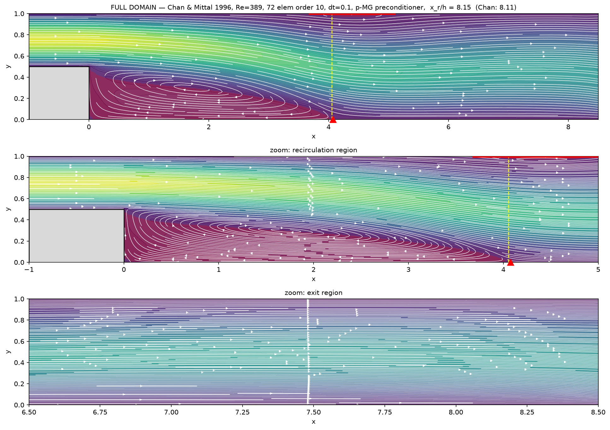
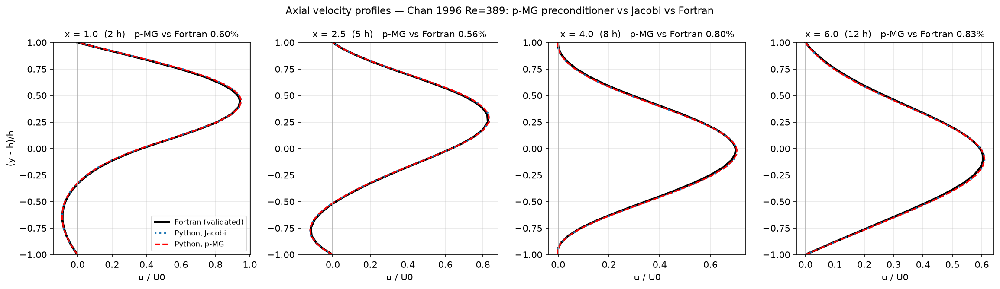
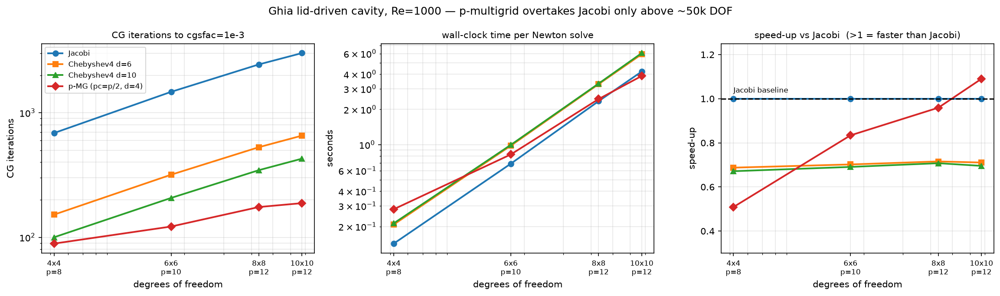
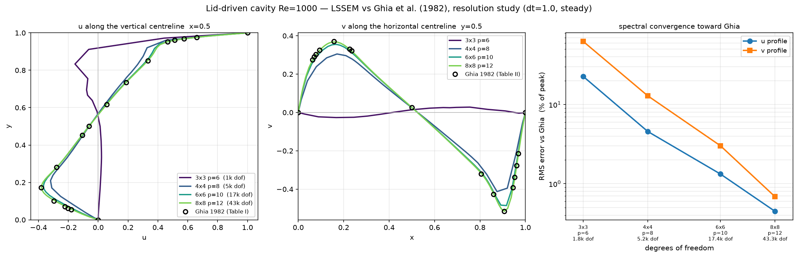
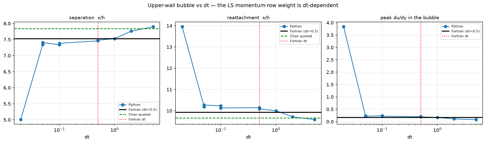
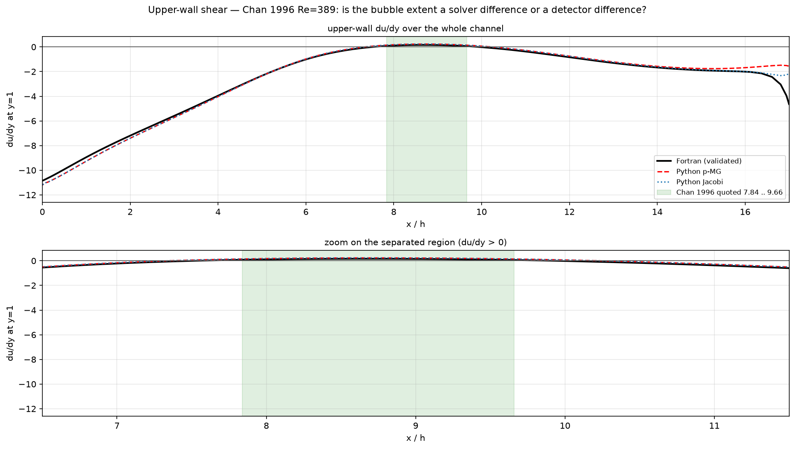

# Preconditioners, dt-weighting, and benchmark validation of the LSSEM VVP solver

Study date: 2026-08-07. All measurements on Apple Silicon, NumPy, single-threaded
matvec. Reproduction scripts are named inline.

---

## Executive summary

1. **Three preconditioners are implemented** in `lssem2d/precond.py` — Jacobi,
   4th-kind Chebyshev, and a two-level p-multigrid V-cycle — selectable via
   `pcg_solve(precond=...)`. All three are verified symmetric and SPD.

2. **Whether multigrid pays depends on conditioning, not size.** On the BFS
   (Chan) case p-MG cuts CG iterations 9.9x and wins 1.25x on wall clock. On the
   lid-driven cavity it cuts iterations only 3x and *loses* 2x, because the
   cavity is far better conditioned. Cavity crossover is ~50k DOF.

3. **The LSSEM steady state is dt-dependent.** Momentum rows carry `dt`;
   continuity and vorticity do not. This is structural, not a bug, and it means
   **two runs at different dt are not comparable**. It cost us a false alarm
   (see §5).

4. **Cavity validation converges spectrally to Ghia 1982** — 0.45% (u) and 0.69%
   (v) RMS at 8x8 order 12.

5. Two latent defects found and fixed: a stale test assertion, and a dead
   `extra_shape` flag that inflated the Jacobi diagonal by up to 9.8%.

---

## 1. What was implemented

`lssem2d/precond.py`:

| class | cost per application | notes |
|---|---|---|
| `Jacobi` | 0 matvecs | `z = M_inv * r`, the pre-existing behaviour |
| `Chebyshev4` | `deg` matvecs | 4th-kind, Lottes optimised weights (`_BETA4`) |
| `PMG2` | `2*deg + coarse_deg + 2` | two-level V-cycle, p-coarsening |

`Chebyshev4` needs only an upper spectral bound, obtained by 20 power iterations
on `D^-1 A` with a 1.3 safety factor. Measured `lambda_max(D^-1 A) = 3.2816` on
the Chan mesh. The weight table is transcribed from `solver_pmg2.f90`'s `beta4`.

`pcg_solve` gained an optional `precond=` callable; the default path is
unchanged, so nothing differs unless a preconditioner is passed explicitly.

### 1.1 Correctness gates (these matter more than they look)

| preconditioner | symmetry residual | SPD |
|---|---|---|
| Jacobi | 2.56e-15 | yes |
| Chebyshev4 d=4 | 1.47e-15 | yes |
| Chebyshev4 d=6 | 0.00e+00 | yes |
| PMG2 | 8.23e-16 | yes |

Two bugs were caught *only* by the symmetry check, and both would have been
invisible otherwise:

**Restriction must be the adjoint of prolongation — with multiplicity removed
first.** Using independent nodal interpolations both ways gave symmetry 8.12e-02.
Naively setting `R = P.T` made it *worse* (3.06), because these arrays live in
redundant local storage where each copy of a shared node already holds the
assembled value, so a plain transpose double-counts at element interfaces.
Dividing by the fine multiplicity before transferring, then re-assembling, gives
8.23e-16.

**The coarse solve must be a fixed linear operator.** The first version used CG,
whose polynomial depends on the right-hand side — so the "V-cycle" was not a
linear operator at all. Replaced with fixed-degree Chebyshev.

> The broken PMG2 **converged in 105 iterations and looked like the best of the
> four.** A non-symmetric preconditioner does not announce itself. Always gate on
> symmetry, never on iteration count.

---

## 2. Performance — BFS / Chan Re=389

72 elements, order 10, dt=0.1, real Newton RHS, target `cgsfac=1e-3`.
Script: benchmark section of the session; `lssem2d/precond.py` API.

| preconditioner | CG iters | A-applies | A/iter | wall s |
|---|---|---|---|---|
| jacobi | 2922 | 2923 | 1.0 | 2.38 |
| chebyshev4 d=2 | 1642 | 4927 | 3.0 | 3.79 |
| chebyshev4 d=4 | 975 | 4876 | 5.0 | 3.75 |
| chebyshev4 d=6 | 516 | 3613 | 7.0 | 2.76 |
| **pmg2 d=2** | **294** | 3823 | 13.0 | **1.91** |

Iterations fall **9.9x**; wall clock improves only **1.25x**, because each V-cycle
costs 13 matvecs. **Chebyshev alone is slower than Jacobi** despite 5.7x fewer
iterations.

### 2.1 The real payoff is the soft modes, not speed

Full 2500-step Chan run with each preconditioner:

| | reattachment x_r/h | profiles vs Fortran | **exit p spread** |
|---|---|---|---|
| Jacobi | 8.152 | 0.56–0.83% RMS | 0.2356 |
| p-MG | 8.151 | 0.56–0.83% RMS | **0.0475** |
| Fortran reference | 8.154 | — | 0.113 |

Velocity profiles are **indistinguishable** between the two preconditioners
(<=0.09% RMS) — as required, since a preconditioner must not change the answer.
But the outflow pressure spread drops **5x**, from 2x above the Fortran reference
to below it.

This is the reason p-MG was built. The VVP outflow pressure lies in a direction
~8300x softer than generic; a residual-based stopping test cannot control it, so
Jacobi stops with it unresolved and the converged state becomes path dependent.
A coarse-grid correction removes it. Diagonal scaling structurally cannot.




---

## 3. Performance — lid-driven cavity Re=1000

### 3.1 At the stock mesh, Jacobi wins outright

4x4 elements, order 8, dt=0.1, linearised about the converged state.
Script: `cavity_precond.py`.

| preconditioner | 1 Newton solve (it / wall) | 20 BDF steps (it / wall) | speedup |
|---|---|---|---|
| **jacobi** | 310 / **0.066 s** | 9445 / **2.10 s** | **1.00x** |
| chebyshev4 d=6 | 58 / 0.079 s | 1862 / 2.78 s | 0.76x |
| pmg2 pc=4 | 105 / 0.207 s | 2289 / 4.88 s | 0.43x |
| pmg2 pc=2 | 104 / 0.196 s | 2650 / 5.33 s | 0.39x |

Chebyshev cuts iterations 5.3x and p-MG 3.0x, and **both still lose**. Note
`pc=4` and `pc=2` give near-identical counts (105 vs 104) — the coarse level is
contributing almost nothing.

Why the opposite conclusion from §2? Jacobi needs **310** iterations here versus
**2922** on Chan. The cavity is a closed domain with no outflow, hence none of
the soft modes a coarse-grid correction exists to remove. **Conditioning is the
driver, not problem size.**

### 3.2 But the ranking flips with resolution

Script: `cavity_scaling.py`. One real Newton solve; p-MG is `pc=p/2, deg=4`.

| mesh | DOF | Jacobi it | p-MG it | iteration ratio | **p-MG wall speedup** |
|---|---|---|---|---|---|
| 4x4 p=8 | 5,184 | 687 | 89 | 7.7x | 0.51x |
| 6x6 p=10 | 17,424 | 1471 | 122 | 12.1x | 0.83x |
| 8x8 p=12 | 43,264 | 2443 | 175 | 14.0x | 0.96x |
| 10x10 p=12 | 67,600 | 3012 | 188 | 16.0x | **1.09x** |

Classic multigrid signature: Jacobi's iteration count grows **4.4x** across the
range while p-MG's grows only **2.1x**, so the ratio widens 7.7x -> 16x and the
advantage keeps growing. Chebyshev sits flat at ~0.70x at every resolution and
never wins.



### 3.3 Practical guidance

- Cavity-like (well-conditioned, closed): **Jacobi below ~50k DOF, p-MG above.**
- BFS-like (outflow, soft modes): **p-MG regardless of size** — it won at 3,168 DOF.
- **Chebyshev alone is not recommended** on either problem; it only earns its
  keep as the smoother inside the V-cycle.
- These are NumPy-matvec numbers. The numba backend (now implemented — see
  [NUMBA_BACKEND.md](./NUMBA_BACKEND.md)) cuts matvec cost by a factor that
  depends strongly on polynomial order: **~3.4x at p=8, ~2.7x at p=10, ~2.2x at
  p=12**, and only ~1.5x by p=16. Cheaper matvecs push the crossover to *larger*
  meshes and favour Jacobi further, since preconditioners that trade extra
  matvecs for fewer iterations become relatively more expensive. The crossover
  above has **not** been re-measured under numba.

---

## 4. Validation against Ghia et al. (1982), Re=1000

Script: `cavity_ghia_res.py`, `plot_ghia_res.py`. dt=1.0, run to steady state
(all four reached `dU = 0.00e+00`, so these are converged discretisation errors).

| mesh | DOF | RMS u | % of peak | RMS v | % of peak |
|---|---|---|---|---|---|
| 3x3 p=6 | 1,764 | 0.2271 | 22.71% | 0.3240 | 62.85% |
| 4x4 p=8 | 5,184 | 0.0457 | 4.57% | 0.0665 | 12.90% |
| 6x6 p=10 | 17,424 | 0.0133 | 1.33% | 0.0156 | 3.02% |
| **8x8 p=12** | **43,264** | **0.0045** | **0.45%** | **0.0035** | **0.69%** |

Error falls ~50x (u) and ~90x (v) across the range — clean spectral convergence.



Two observations:

- **The stock 4x4 p=8 cavity is marginal** at 4.6% / 12.9%; one refinement to
  6x6 p=10 reaches 1.3% / 3.0%.
- **v is the more discriminating profile.** It starts ~3x worse than u (63% at
  the coarsest mesh) because its extremum near the moving-lid corner (-0.5155 at
  x=0.9063) is sharp, but it converges faster and overtakes u by 8x8.

### 4.1 Benchmark-data hazard

The repo contains **two different `ghia_v` arrays**, both labelled only
"Ghia et al. (1982)", differing by ~3x:

| location | peak v | Reynolds number |
|---|---|---|
| `scratch/plot_cavity.py:49` (`ghia_v_1000`) | -0.51550 | **Re=1000** |
| `lssem2d/tests/plot_verification.py:72` (`ghia_v`) | -0.2453 | **Re=100** |

Neither is wrong — `plot_verification.py` is a Re=100 script and uses the Re=100
data correctly. But the names carry no Reynolds number, so grabbing the wrong one
is easy. **Recommend renaming to `ghia_v_re100` / `ghia_v_re1000`.** The same
applies to the two `ghia_u` arrays.

---

## 5. The LSSEM steady state is dt-dependent

**This is the most transferable finding in the study.**

In `lssem_baseline.f90` (~line 230) and mirrored in the Python `apply_L`:

```fortran
su(ij,1) = fac1*u(ij,ne)*facem + dt*( ... )*facem   ! momentum: carries dt
su(ij,3) = ( dudx(ij) + dvdy(ij) )*facem            ! continuity: no dt
su(ij,4) = ( om(ij,ne) + dudy(ij) - dvdx(ij) )*facem ! vorticity: no dt
```

At steady state the BDF mass terms cancel exactly (BDF2: 1.5 - 2 + 0.5 = 0), so
the least-squares functional becomes

```
J = |dt*N(u)|^2  +  |div u|^2  +  |om + curl u|^2
```

The momentum equations are weighted by **dt^2** against the constraints. The
converged state is a dt-dependent compromise, not a fixed point that dt merely
approaches. Small dt under-weights momentum and lets the constraints dominate.

### 5.1 Measured, Chan Re=389 upper-wall separation bubble

| dt | separation x/h | reattach x/h | length/h | peak du/dy | primary x_r/h |
|---|---|---|---|---|---|
| 0.05 | 7.343 | 10.190 | 2.848 | 0.227 | 8.135 |
| 0.1 | 7.340 | 10.232 | 2.893 | 0.235 | 8.152 |
| 0.5 | 7.460 | 10.144 | 2.684 | 0.200 | 8.181 |
| 1.0 | 7.529 | 9.999 | 2.469 | 0.167 | 8.199 |
| 2.0 | 7.761 | 9.714 | 1.952 | 0.109 | 8.213 |
| 5.0 | 7.901 | 9.584 | 1.683 | 0.082 | 8.250 |
| Chan 1996 quoted | 7.84 | 9.66 | 1.82 | — | 8.11 |

Monotone in dt. Chan's published bubble corresponds to **dt ~ 2-5**.

**For steady-state work, prefer LARGE dt.** Small dt is not "more accurate"; it
is a differently- and worse-weighted minimisation.

Note the primary reattachment moves only 8.135 -> 8.250 across a 100x dt range —
**nearly dt-immune**. That is exactly why this hid: the headline validation
metric agreed to 0.5% throughout while the weak secondary feature was off 20%.



### 5.2 The false alarm it caused

The Python p-MG run (dt=0.1) was compared against the validated Fortran run
(dt=0.5, `run_chan389_long/in.nml`). The bubble looked 20% too long and 43% too
strong, which read as a Python bug. It was not.

Restarting the Fortran from its converged state and relaxing it at **dt=0.1**
(`run_chan389_relax01` + `relax02`, to t=510, converged to 0.01%):

| | separation x/h | reattach x/h | length/h | peak du/dy |
|---|---|---|---|---|
| Fortran dt=0.5 | 7.523 | 9.927 | 2.404 | 0.1636 |
| **Fortran dt=0.1** | **7.312** | **10.286** | **2.974** | **0.2456** |
| Python dt=0.1 | 7.340 | 10.232 | 2.893 | 0.2353 |
| agreement | 0.38% | 0.53% | 2.7% | 4.2% |

Down from 2.4% / 3.1% / 20% / 43%. The residual few percent did **not** close
with further relaxation (tested and refuted), but it is **smaller than Python's
own spread from merely moving the pressure pin** (dev-IC vs inlet-pin at fixed
dt: 0.6% / 5.0% / 6.2%). At matched dt the two codes agree to within this
problem's own soft-mode / path-dependence noise floor.



Two hypotheses were raised and **refuted** along the way, recorded so they are
not re-tried:

- *"Fortran's BDF2 `fac1=1.5` makes the effective weight `fac1*dt`."* No —
  `step_bdf` mutates its history list in place, so Python switches to BDF2 with
  identical coefficients after the first step.
- *"The residual gap is incomplete relaxation."* No — continuing to t=510 moved
  separation by 0.01%; it settled at 7.312, not Python's 7.340.

> **Rule: never compare two LSSEM runs at different dt.**

---

## 6. Defects found and fixed

### 6.1 `compute_jacobi(extra_shape=True)` — removed

`extra_shape` added a bare shape term to the momentum diagonals with **no
counterpart in `apply_L`**. Error against the true diagonal, measured by probing:

| dt | invdt = fac1/dt | `extra_shape=False` | `extra_shape=True` |
|---|---|---|---|
| 0.01 | 150 | 3.6e-16 | 0.018% |
| 0.1 | 15 | 2.5e-16 | 0.19% |
| 0.5 | 3.0 | 4.2e-16 | 1.7% |
| 1.0 | 1.5 | 2.3e-16 | 4.1% |
| 5.0 | 0.3 | 4.2e-16 | 9.2% |
| 20.0 | 0.075 | 3.9e-16 | **9.8%** |

Provenance: a leftover A/B toggle from rewriting `compute_jacobi` from
brute-force probing to closed-form einsum (`scratch/test_dge.py`). The question
it existed to answer was settled — `False` reproduces the brute-force diagonal to
2.22e-16 — and the losing branch was never deleted. It was never enabled
anywhere.

Removed. Note it did **not** affect correctness, only preconditioner quality; but
its damage peaks at large dt, which §5 now recommends for steady-state work.

### 6.2 `test_wq_sum` — stale assertion

Asserted a BFS area of 14.0, left over from a retired `L_out=6, H=1` geometry.
The current `build_bfs` is `L_out=20, H=0.5`, giving **21.0**. The test had been
failing on a clean checkout, masking any regression landing in that file. Fixed,
and a per-element quadrature check derived from the mesh was added so it cannot
go stale the same way.

### 6.3 Known, not fixed

`lssem2d/tests/test_solver.py` **fails to collect** — it imports `cg_solve`,
which does not exist (the function is `pcg_solve`; the test was not updated when
it was renamed). Nothing in that file has been running.

---

## 7. Reproduction

| script | produces |
|---|---|
| `cavity_precond.py` | §3.1 cavity preconditioner table |
| `cavity_scaling.py` | §3.2 resolution scaling |
| `cavity_ghia_res.py` + `plot_ghia_res.py` | §4 Ghia validation |
| `upper_wall.py` | §5.2 upper-wall shear, one detector on all fields |
| `upper_dt.py` | §5.1 dt sweep |
| `scratch/test_dge.py` | §6.1 diagonal vs brute force |

Fortran side, in `F90_SEM/pmg_clean/`: `run_chan389_long` (dt=0.5 reference),
`run_chan389_relax01` and `run_chan389_relax02` (relaxed to dt=0.1, §5.2).
