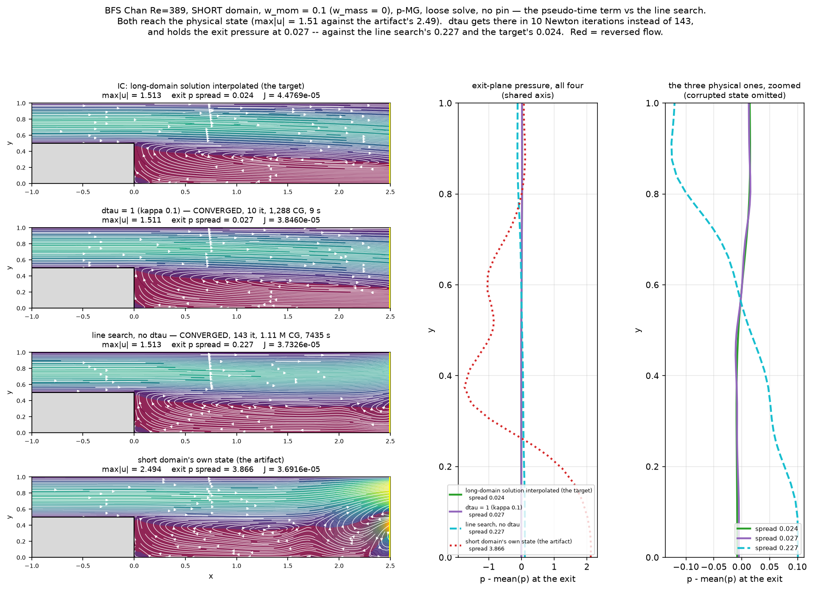

# The pseudo-time term (δτ): implementation and first results

Implemented 2026-08-09, following [PSEUDO_TIME_DESIGN.md](./PSEUDO_TIME_DESIGN.md).
The term comes from the 1996 F77 source (`reference/tj_channel_1996.f`), which
carries a pseudo-time derivative on the momentum rows that both
`lssem_baseline.f90` and this port dropped.

**Read the caveats in §6 before using any of this.** The headline result is on
the short BFS domain, which this project's own accumulated guidance says is not
a discriminating test — and it was seeded from the answer. The implementation is
verified; its usefulness is not yet established.

---

## 1. What was implemented

Smaller than the design note anticipated. The term is algebraically just
`a_mass → a_mass + κ` with `κ = a_flux/dtau`, in `L`, `Lᵀ` **and** the Jacobi
diagonal — so the fused numba kernels needed no edit, only the coefficient
handed to them.

- `lssem.ls_pseudo(state)` — returns κ, or 0.0 when `dtau is None` (the default,
  so nothing changes silently).
- `SolverState(..., dtau=None)`.
- `_apply_L_numpy`, `_apply_LT_numpy`, `kernels_numba.apply_L/apply_LT`,
  `solver.compute_jacobi` — each adds κ to the mass coefficient.
- `solver._drop_pseudo(state, r, U)` — removes κ·U from a **residual**.

That last one is the whole contract. `apply_L` carries κ·u unconditionally
because it is also the operator applied to the increment inside `apply_A`, where
the κ·dU term is the point. But at the two places a residual is formed
(`newton_step`, `_ls_merit`) it must come back out, mirroring the Fortran's
`dt*(fu − u) ≡ 0`. Without it, δτ would change the equations being solved
instead of only the Jacobian.

---

## 2. Verification

| check | result |
|---|---|
| `dtau=None` gives κ=0 for legacy, `w_mom`/`w_mass`, and steady form | 0.0 |
| residual invariant: `max|r(dtau) − r(None)|` | **5.55e-17** (roundoff) |
| …with the cancellation disabled (control) | **3.16e-02** — 5.7e14× larger, so the check bites |
| operator gains exactly κ: `max|dL − κ·u·wq|` | 1.7e-16 |
| transpose: `max|dLᵀ − κ·su|` | 2.5e-14 |
| Jacobi diagonal vs true diagonal of `A` | 2.8e-16 relative |

Tests **48 → 66**, passing on both backends. New `test_pseudo_time.py` pins the
operator/residual contract and includes `test_residual_check_is_live`, which
asserts the *uncancelled* residual does move — otherwise the invariance test
would pass vacuously. `test_backend_parity.py` gained δτ cases so the fused
kernels cannot silently drift to the unaugmented operator.

The residual agreement is **roundoff, not bit-exact**: `apply_L` computes
`(a_mass+κ)·u` then multiplies by `wq`, while the cancellation subtracts
`κ·u·wq`. Different operation order, same value.

> A note on how this went. The Jacobi check initially failed at **`dtau=None`
> too** — relative error 1.8 on the untouched code path. That was the test, not
> the solver: `apply_A` gather-scatters, so setting one *local* node to 1 is not
> a global unit vector where elements meet. Restricted to element-interior nodes
> it is 2.8e-16.

---

## 3. Poiseuille: the O(κ·R) prediction, confirmed

Design note §3 predicts the converged state moves by `O(κ·R)` — free where the
least-squares residual vanishes, not free otherwise. Poiseuille Re=100 tests
this because its exact solution is exactly representable. Steady form
(`w_mass=0, w_mom=1`), swept at matched κ:

| κ | `dtau` | iters | J | profile error | Δp | Δp error |
|---|---|---|---|---|---|---|
| 0 | ∞ | 9 | 8.175e-18 | 2.560e-06 | 1.200000 | 4.95e-09 |
| 0.01 | 100 | 10 | 4.471e-18 | 1.347e-06 | 1.200000 | 1.90e-07 |
| 0.1 | 10 | 14 | 3.197e-16 | 2.839e-06 | 1.199997 | 2.69e-06 |
| 1.0 | 1 | 40 | 2.588e-16 | 2.127e-06 | 1.199998 | 2.05e-06 |
| 10.0 | 0.1 | 600 | — | **cap** | — | — |

With the residual at `J ~ 1e-16–1e-18` the profile error is **flat across three
decades of κ** (1.3e-06 … 2.8e-06) and not even monotone — scatter, not a κ
effect. Δp holds six significant figures.

The same sweep at the **default** `tol = 1e-6` tells the other half:

| | J (residual) | profile error, κ=0 → κ=1 |
|---|---|---|
| loose | 3.4e-09 | 8.46e-03 → 5.10e-02, **6× worse** |
| tight | ~1e-17 | 2.56e-06 → 2.13e-06, **flat** |

Shrink `R` by seven decades and the perturbation vanishes with it. That is a
clean two-regime confirmation of §3 — **and a warning**: at the default
tolerance floor, `R` is *not* small, so δτ does move the answer there.

> The loose run was my first attempt at this test and I initially read it as
> falsifying the theory. It was contaminated: `prof err = 8.46e-03` at κ=0 is
> exactly the tolerance-limited value in `CG_TOLERANCE_FLOOR.md` §3.

Cost rises with κ: 9 → 10 → 14 → 40 iterations, and κ=10 does not converge.

---

## 4. BFS case A — where δτ works

Short domain, `w_mom = 0.1`, seeded from the long-domain solution interpolated
onto the short grid (`STEADY_FORM_STUDY.md` §8). Undamped and without δτ this
**diverges at Newton step 2**, `max|u|` 1.51 → 115.

| `dtau` | κ | status | iters | CG | wall | J | max\|u\| | exit p spread | exit rev |
|---|---|---|---|---|---|---|---|---|---|
| — | 0 | **DIVERGED** | 2 | 6,589 | 45 s | — | 115.07 | — | — |
| 10 | 0.01 | **DIVERGED** | 2 | 6,206 | 42 s | — | 118.13 | — | — |
| **1** | **0.1** | **conv** | **10** | **1,288** | **9 s** | 3.8460e-05 | **1.511** | **0.027** | **24.4%** |
| 0.1 | 1.0 | cap | 80 | 5,066 | 37 s | 4.6853e-05 | 1.502 | 0.029 | 25.0% |
| *line search, no δτ* | — | *conv* | *143* | *1,113,973* | *7,435 s* | *3.7326e-05* | *1.513* | *0.227* | *34.1%* |
| *the target (IC)* | — | — | — | — | — | *4.4769e-05* | *1.513* | *0.024* | *24.4%* |



**865× fewer CG iterations than the line search, 826× less wall time**, and it
holds the solution closer: exit pressure spread **0.027** against the target's
0.024, where the line search drifted to 0.227. Exit reversal is **24.4%**,
identical to the target's 24.4%, against the line search's 34.1%.

**And δτ has the highest `J` of the three states** — 3.8460e-05 vs 3.7326e-05
(line search) vs 3.6916e-05 (the artifact). The state closest to the physically
correct field is the *worst* minimiser of the functional. Third independent
instance of that pattern in this project; on this problem `J` ranks solutions in
the opposite order to physical quality.

---

## 5. BFS case B — where it does not

Short domain, `w_mom = 1.0`, from the converged no-pin field. Undamped this caps
at 80 iterations; the line search converges it in 53.

| `dtau` | κ | status | iters | CG | J | max\|u\| | exit p spread |
|---|---|---|---|---|---|---|---|
| — | 0 | cap | 80 | 55,544 | 1.1229e-03 | 2.323 | 3.120 |
| 100 | 0.01 | cap | 80 | 55,752 | 1.1229e-03 | 2.323 | 3.105 |
| 33.3 | 0.03 | cap | 80 | 56,443 | 1.1232e-03 | 2.320 | 3.058 |
| 10 | 0.1 | cap | 80 | 57,390 | 1.1239e-03 | 2.320 | 2.871 |
| 1 | 1.0 | cap | 80 | 42,758 | 1.1683e-03 | 2.255 | 2.535 |
| 0.1 | 10.0 | cap | 80 | 11,901 | **3.7253e+00** | 2.524 | 3.174 |

**δτ does not rescue case B at any κ tested**, including κ = 0.1, the value that
worked in case A. And κ = 10 degrades `J` by **3,300×** — the `O(κ·R)`
perturbation becoming catastrophic rather than small.

> The first version of this sweep varied `dtau` at fixed `w_mom` and so compared
> κ = 0.1 against κ = 10 while calling it a `dtau` comparison. Since
> `κ = a_flux/dtau = w_mom/dtau`, the same `dtau` means ten times more damping at
> `w_mom = 1.0` than at 0.1. The design note's own risk list warns about exactly
> this. Sweep κ, not `dtau`.

### The usable window

Across Poiseuille and both BFS cases:

| κ | behaviour |
|---|---|
| ≤ 0.01 | too weak — case A still diverges |
| ≈ 0.1 | converges case A in 10 iterations; no effect on case B |
| ≥ 1 | iteration count climbs steeply |
| ≥ 10 | fails to converge (Poiseuille), or wrecks the answer (BFS case B, J ×3,300) |

Narrow, and not obviously transferable between problems.

---

## 6. Caveats — read before using this

**Both BFS validation cases are on the short domain, which is not a
discriminating test.** `project-truncated-outflow-multivalued` records that the
truncated case has multiple converged states and that physically irrelevant
choices — pin location, `nsub`, `nitcgs`, the momentum formulation, the initial
condition — each select a different member, with spreads of tens of percent. Its
explicit guidance is *never use the truncated case to test a solver, operator or
BC change; use the long domain as the discriminator.* The δτ headline was run on
precisely the configuration that guidance rules out.

**Case A was seeded from the answer.** It starts from the long-domain solution
interpolated onto the short grid, so it tests whether the correct field is a
stable fixed point of the truncated problem — a real question, answered "only
with damping" — but **not** whether the method finds that field on its own.
Starting from the answer and staying near it is not a demonstration of accuracy.

**The 1996 code has never been run.** Everything here rests on reading its source
against ours. Design note §6 step 6 remains undone.

**Chan's CTR Fig. 2 short-domain claim has not been reproduced in Python.** That
replication (`project-uniflo-provenance`) is a July result in the Fortran:
interior preserved to ~1% through 4h, defect confined to the outlet plane. This
session never computed Fig. 2's actual metric — `u(y)` and `ω(y)` at 4–5h against
the long domain. Everything reported here is `x_r/h`, `max|u|`, exit pressure and
`J`, none of which is what Chan plotted.

**At the default tolerance floor δτ moves the answer.** §3 shows the perturbation
is only negligible once `R` is small, and `tol = 1e-6` does not make it small.

---

## 6b. Correction (2026-08-10): the `nsub = 5` failures were undamped Newton

A sweep of δτ with `nsub = 5` sub-iterations per time step (short BFS, dt=0.1,
`w_mom = w_mass = 1`, cold developed IC) had **six of eight runs diverge,
including the κ = 0 control** — which the `nsub = 1` control survived. I read
that as sub-iteration destabilising the scheme. **It does not.** The cause was an
uncontrolled Newton step length, and it is fixed.

Instrumenting `|dU|` and the implicit residual `J` per sub-iteration shows it
directly:

```
step 0  sub 0:  J 9.30e-01 -> 2.55e-03   ratio 0.003    max|u| 1.500    CG 318
step 0  sub 1:  J 2.55e-03 -> 1.20e-03   ratio 0.468    max|u| 1.500    CG 404
step 0  sub 2:  J 1.20e-03 -> 8.94e+02   ratio 748184   max|u| 5.567    CG 6201
```

Sub-iterations 0 and 1 behave exactly as sub-iteration should — `J` falls three
decades, `max|u|` sits at the physical inlet peak. Sub-iteration 2 takes
`|dU| = 22.9` and destroys the solution, and it never recovers. This is the same
undamped-Newton failure as `STEADY_FORM_STUDY.md` §2 ("an *accurate* linear solve
diverges where a sloppy one converges"): as the residual falls the soft outflow
modes dominate, `CG` jumps 404 → 6201, and the step explodes. With `nsub = 1`
you never take a third sub-iteration, so the shortfall was acting as accidental
damping.

The fix is the line search with **`ls_memory = 1`** — see the correction in
`STEADY_FORM_STUDY.md` §8. GLL is wrong here because sub-iteration 0 always
drops `J` by ~3 decades from the previous time level, so `max(J)` anchors on the
pre-Newton residual and licenses steps that grow `J` by 184×. Armijo holds
`max|u| = 1.500` for every time step with no sub-iteration ever increasing `J`.
`step_bdf` now defaults `ls_memory` by regime.

**Two conjectures of mine were refuted along the way and are recorded so they
are not repeated:** that under-converged implicit steps drift toward explicit
and destabilise (withdrawn — unsupported), and that the CG absolute tolerance
floor was responsible (tested: `tol` = 1e-10 and 1e-14 give bit-identical
results, so the floor stops binding by 1e-10 and is not the mechanism).

---

## 7. The 1996 channel cases — δτ against published rates (2026-08-11)

§6 closed with the complaint that every δτ number here was measured on the short
BFS domain, which has no reference answer. The two Chan (1996) channel cases do:
`CHANNEL_VALIDATION.md` reproduces the Stokes decay rate and the Orr–Sommerfeld
growth rate, both to well inside Chan's own published error. Re-running them
across κ is the first δτ measurement in this project against a **known answer**.

Scripts: `stokes_dtau.py`, `os_dtau.py`. κ = `dt`/`dtau` in both (`w_mom = 1`).

**Stokes decay** — N=10, dt=0.0025, exact σ = 9.3137399:

| `dtau` | κ | σ | rel err | shift vs κ=0 |
|---|---|---|---|---|
| — | 0 | 9.3154840 | +1.87e-04 | — |
| 1.0 | 0.0025 | 9.3154520 | +1.84e-04 | -3.4e-06 |
| 0.1 | 0.025 | 9.3116990 | -2.19e-04 | -4.1e-04 |
| 0.01 | 0.25 | 9.0331680 | -3.01e-02 | -3.0e-02 |
| 0.001 | 2.5 | 4.7430260 | **-4.91e-01** | -4.9e-01 |

**Orr–Sommerfeld growth** — N=14, dt=0.1, exact σ = 0.00223497:

| `dtau` | κ | σ | rel err | vs undamped |
|---|---|---|---|---|
| — | 0 | 0.00223466 | -0.014% | — |
| 100 | 0.001 | 0.00223014 | -0.216% | 15× worse |
| 10 | 0.01 | 0.00222823 | -0.302% | 22× worse |
| 1.0 | 0.1 | 0.00220575 | -1.307% | 93× worse |
| 0.1 | 1.0 | 0.00155276 | **-30.524%** | 2180× worse |

Three findings.

**δτ always slows the dynamics.** Every shift is negative in both cases — decay
rates shrink, growth rates shrink. It is a damping term and behaves like one.

**A growth rate is ~100× more fragile than a decay rate.** Stokes is untouched at
κ = 0.0025 and still fine at 0.025; Orr–Sommerfeld is already 22× degraded at
κ = 0.01. A growth rate is a small imbalance (0.00223 against O(1) advection), so
a perturbation to the momentum operator lands directly on the measured quantity,
whereas the Stokes decay rate is leading-order and only notices κ once it is
comparable to `a_mass`.

**The F77's own setting is not free on its own test case.** At `dt = 0.01,
dtau = 1` the 1996 code runs κ = 0.01 — the third row — costing 22× in
growth-rate accuracy. Chan's reported 0.76% at N=14 sits in the same band.

### The bias is against the DISCRETISATION residual, not the Newton residual

§3 established the shift is `O(κ·R)`, vanishing as `R → 0`. It is tempting to
read `R` as the Newton residual and conclude that converging the sub-iterations
harder makes δτ free. **It does not.** `os_dtau_conv.py`, same case, δτ fixed at
κ = 0.01, sub-iterations tripled:

| `dtau` | κ | `nsub` | σ | rel err |
|---|---|---|---|---|
| — | 0 | 2 | 0.00223466 | -0.014% |
| 10 | 0.01 | 2 | 0.00222823 | -0.302% |
| — | 0 | 6 | 0.00223516 | +0.009% |
| 10 | 0.01 | 6 | 0.00222838 | **-0.295%** |

2 → 6 sub-iterations moves the biased case from -0.302% to -0.295%: nothing. The
control confirms the extra Newton is not otherwise disturbing the answer.

`R` in `O(κ·R)` is the **least-squares residual at the minimum**, and `J_min > 0`
always — the discrete solution does not satisfy the PDE exactly. Newton
converges accurately to the *augmented* system's fixed point, which is displaced
from the true minimiser by an amount set by mesh and `dt`, not by iteration
count. This is why §3's Poiseuille test showed the shift vanishing: that case has
an **exactly representable** solution, so `R → 0` genuinely. It does not
generalise to cases that do not.

The practical consequence, which contradicts a plausible reading of §3: **δτ is
not automatically free at a steady state either**, since `R₀ ≠ 0` there too. It
would be free if implemented in vanishing-increment form, `κ(U^{k+1} − U^k)`,
which cancels identically at a fixed point. Folding κ into `a_mass` on both `ℒ`
and `ℒᵀ` — what we do, and what §1 describes — is Levenberg–Marquardt on the
normal equations, and that biases the fixed point instead. Two schemes, one
name; ours is the second.

> Caveat: `os_dtau_conv.py` does not record the Newton residual history, so it
> cannot fully exclude that 6 fixed sub-iterations are still unconverged. The
> `J_min > 0` argument is what carries the conclusion; the run is consistent
> with it, not independent proof.

> A first version of this run imported `os_base` (wall fraction fixed at 0.30 →
> elements 0.6/0.8/0.6) instead of `os_base2` with `WFRAC=0.15`. The control
> came back at -2.668% instead of -0.014% — the superseded mesh's known ~2.7%
> error at N=14. Caught by the control, which is why the control is there.

**Guidance.** Choose κ by what you are measuring, not by `dt` — the
`dtau ≈ 100·dt` heuristic is not supported. For a leading-order quantity κ ≲ 0.01
is cheap; for stability or transition work κ ≲ 0.001, and even that costs an
order of magnitude. If you are measuring a rate, turn δτ off.

---

## 8. Next

1. Short domain from **its own** IC with δτ, then `u(y)` and `ω(y)` at 4h and 5h
   against the long domain — Fig. 2's real metric, the correct experiment.
2. Re-run the δτ validation on the **long** domain, so its conclusions rest on
   the discriminating case.
3. ~~Run the 1996 channel cases~~ — **done, §7.** Both rates reproduced and swept
   across κ.
4. Try the vanishing-increment form `κ(U^{k+1} − U^k)` and check whether it
   leaves the converged state alone where the present form does not. If the F77
   implements that form, §1's reading of it needs revisiting.
