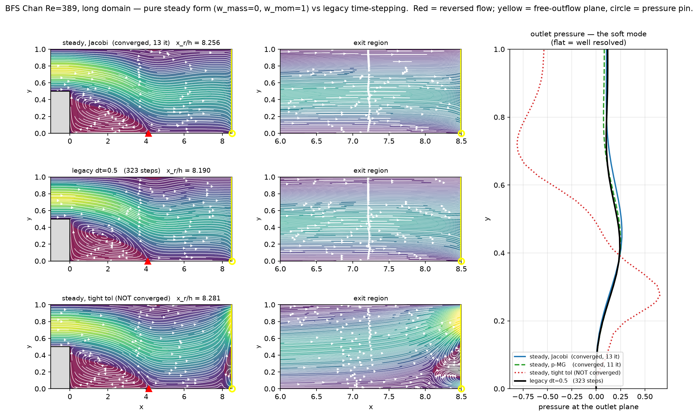
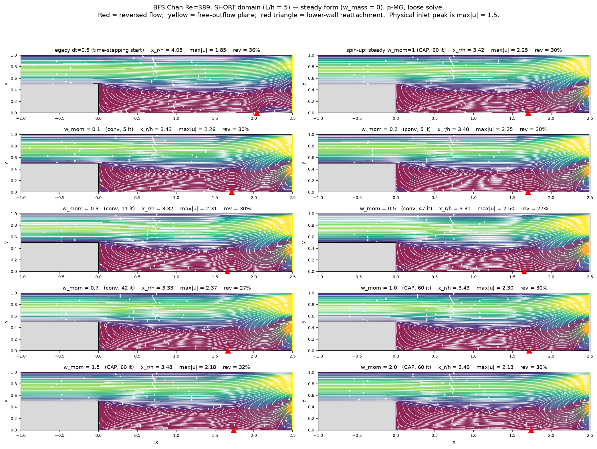
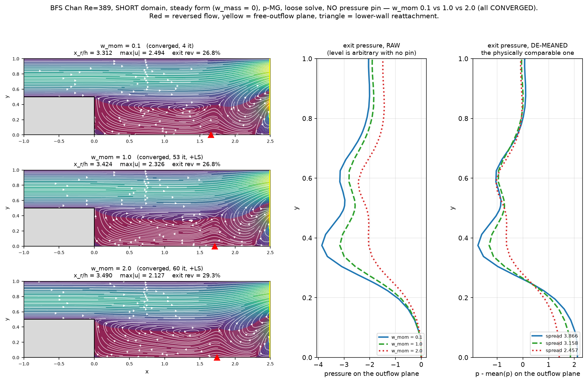
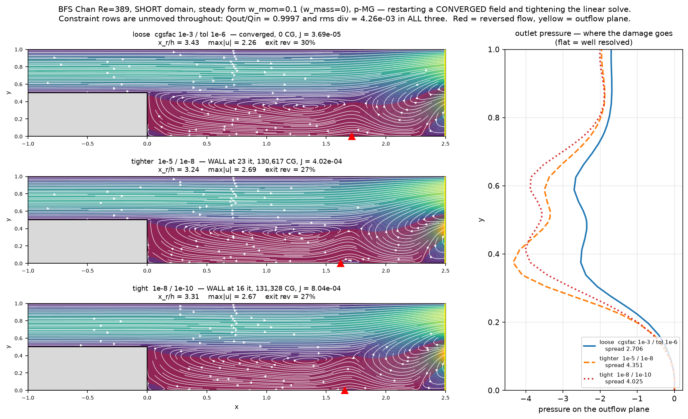
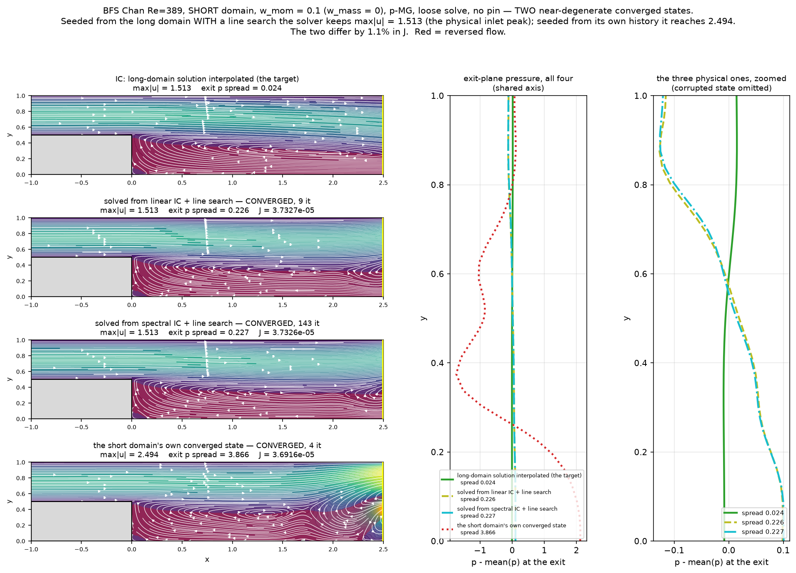

# The pure steady form: `w_mass = 0`, globalisation, and the `w_mom` sweep

Study date: 2026-08-08/09. Third in the sequence that began with
[POISEUILLE_DT_STUDY.md](./POISEUILLE_DT_STUDY.md) (dt *is* the momentum
weight) and [WEIGHT_VS_TIMESTEP_STUDY.md](./WEIGHT_VS_TIMESTEP_STUDY.md)
(separating the two). Here the time-derivative term is removed entirely, which
turns the least-squares weighting into a **single tunable knob** with no time
step attached, and exposes two solver issues that the mass term had been hiding.

Reproduce: `scratch/bfs_steady.py` (preconditioner/tolerance matrix),
`scratch/ls_diag2.py` (line-search comparison), `scratch/bfs_wmom_sweep.py`
(long-domain `w_mom` sweep), `scratch/bfs_wmom_short.py` (short domain),
`scratch/dt_tight.py` (tight-tolerance re-check of the Poiseuille headline),
`scratch/bfs_short_tight.py` and `scratch/bfs_nopin2.py` (§7).

---

## Executive summary

1. **`w_mass = 0` gives a genuine steady solver.** The momentum row becomes
   exactly `w_mom * N(U)` with no time-derivative term; `dt` becomes dead input.
   The BFS converges in **11 Newton iterations / 59 s** against ~320 time steps.

2. **An *accurate* linear solve DIVERGES where a sloppy one converges.**
   `cgsfac=1e-3, tol=1e-6` → converged in 11 iterations. `cgsfac=1e-8, tol=1e-10`
   → `max|u|` 1.51 → 40.05 in a single step. Solver inexactness was acting as
   accidental damping; nothing about the formulation changed.

3. **Newton's path here is legitimately non-monotone, so strict Armijo is
   wrong.** `|dU|` runs 0.80 → 2.31 → 0.088 → 0.77 → 0.033 → 0.0087 → 0,
   converging *through* a spike at iteration 6. Monotone Armijo rejects that
   spike and stalls at `alpha ~ 3e-08`. A Grippo–Lampariello–Lucidi
   non-monotone test reproduces the undamped result exactly (11 iterations,
   `alpha = 1` throughout).

4. **`w_mom` is a clean, monotone accuracy knob on the BFS.** Sweeping
   0.1 → 2.0 moves mass conservation 0.9997 → 0.9849 and the upper-wall bubble
   3.174 → 1.988, *monotonically in every quantity*, with everything else fixed.
   There is no value that improves both — it trades constraint accuracy against
   momentum accuracy.

5. **No stability limit without the mass term.** `w_mom = 2.0` converges in 8
   iterations. The *time-stepping* form diverged at the equivalent
   `a_flux = 2.0`. Removing the mass term removes the instability.

6. **The Poiseuille dt headline survives a tight-tolerance re-check and was
   understated** — 1875× loose becomes **212,061×** tight (§6).

7. **The pressure pin never sets a pressure level.** It is a mask on the
   *increment* ($\delta p = 0$ at one node), so the level is inherited from the
   initial condition. Removing the pin entirely costs **one** extra CG
   iteration and changes nothing — CG on a consistent singular system is
   well-behaved (§7).

8. **Tightening the solve erases the `w_mom` distinction.** Two weights 15×
   apart in `J` converge to the same outflow-dominated state. The knob in item 4
   only exists at loose tolerance (§7).

9. **The truncated domain has two converged states 1.1% apart in `J`, and the
   physical one is the higher minimum.** Seeded from the long-domain solution
   and globalised, the short domain holds `max|u| = 1.513` (the physical inlet
   peak) with an exit pressure spread of 0.227; left to its own history it
   converges to 2.494 and 3.866. The physical state costs 860× more CG. Which
   one you get is decided by the initial condition, not by the solver (§8).

---

## 1. What `w_mass = 0` does

From `ls_coeffs` ([lssem2d/lssem.py](./lssem2d/lssem.py)), the momentum row is

```
a_mass * u  +  a_flux * N(U)          a_mass = fac1*w_mass/dt      a_flux = w_mom
```

and the constraints (continuity, vorticity definition) carry weight 1. Setting
`w_mass = 0` kills `a_mass`, so:

- the row is `w_mom * N(U)` — the steady residual, weighted;
- `dt` cancels out of the coefficients entirely and is **dead input**. A script
  nominally running "dt = 0.5" with `w_mass = 0` is not time-stepping at all;
- `w_mom` is the *only* weight in the system, measured against the constraints;
- each "step" is one Newton iteration on the steady equations, with no
  time-derivative term to damp it.

That last point is what surfaces §2 and §3.

---

## 2. The inexact-solve paradox

BFS Chan Re=389, long domain, `w_mom = 1`, `w_mass = 0`:

| preconditioner | `cgsfac` | `tol` | iters | CG total | outcome | wall |
|---|---|---|---|---|---|---|
| Jacobi | 1e-3 | 1e-6 | 13 | 61,401 | **converged** | 56 s |
| p-MG | 1e-3 | 1e-6 | **11** | **4,354** | **converged** | **59 s** |
| Jacobi | 1e-8 | 1e-10 | 120 | 2,650,480 | cap, 45.5% exit reversal | 2,428 s |
| p-MG | 1e-8 | 1e-10 | 2 | 4,951 | **diverged, max\|u\| = 40.1** | 65 s |

Trace of the divergence: `(iter, max|dU|, max|u|)` = `(1, 1.3e+01, 1.51)`,
`(2, 5.6e+02, 40.05)`.

This is backwards from the usual expectation, and it is not a formulation
defect. An undamped Newton step is only guaranteed to help near the root. An
*inexact* solve returns a shorter, blunter `dU`, which functions as unintended
damping; tightening the solve removes that protection and lets the full — far
too long — step through. The correct fix is a real globalisation strategy,
not a deliberately sloppy solve.

Note also that Jacobi at tight tolerance does not diverge but never converges
either: it burns 2.65 M CG iterations over 40 minutes and ends with 45.5%
reversed flow at the outlet. Sloppiness is load-bearing in the whole default
configuration.



*Converged steady form (Jacobi and p-MG, which agree — the check that the state
is real rather than preconditioner-dependent), the legacy dt=0.5 time-stepping
reference, and the failed tight-tolerance run. Red is reversed flow; the yellow
line is the free-outflow plane and the circle is the pressure pin. The exit
pressure should be flat: p-MG gives a spread of 0.254 and Jacobi 0.267 against
legacy's 0.247, while the unconverged tight run reaches 1.468 with 45.5% of the
plane in reverse. Reproduce with `scratch/plot_bfs_exit.py`.*

---

## 3. The non-monotone line search

Added to `newton_step` / `step_bdf` behind `line_search=False`, so nothing
changes silently. The merit function is the least-squares functional Newton is
already minimising:

```python
def _ls_merit(state, U, su_history, f_known=None):
    r = apply_L(state, U, f, g) - su_history      # apply_L emits wq*R
    return float(np.sum(r * r / wq))              # so J = sum(r^2/wq)
```

One `apply_L` per evaluation — cheap next to the CG solve it protects. `dU` is
zero at masked (Dirichlet) dofs because `b` carries `mask_global` and `apply_A`
preserves it, so `U + alpha*dU` keeps its boundary values for any `alpha` and
the merit can be evaluated directly on the trial state.

### Why monotone Armijo fails

The undamped run converges in 11 iterations with this `|dU|` history:

```
0.80  ->  2.31  ->  0.088  ->  0.77  ->  0.033  ->  0.0087  ->  0
```

It converges *through* a spike. Strict Armijo rejects the spike, backtracks to
`alpha = 0.125`, then plateaus for eight iterations and stalls:

| variant | outcome | iters | final \|dU\| | min alpha |
|---|---|---|---|---|
| no line search | converged | **11** | 0.00e+00 | 1 |
| monotone Armijo (`ls_memory=1`) | **cap** | 30 | 6.66e-08 | **2.98e-08** |
| non-monotone (`ls_memory=10`) | converged | **11** | 0.00e+00 | 1 |

The Grippo–Lampariello–Lucidi test compares against the **worst** merit of the
last `ls_memory` iterations rather than the immediately previous one:

```python
hist.append(J0); del hist[:-ls_memory]
J_ref = max(hist)
while _ls_merit(state, U + alpha*dU, ...) > (1.0 - 1e-4*alpha)*J_ref:
    alpha *= 0.5
```

`ls_memory = 1` reduces exactly to monotone Armijo, so the two are the same code
path.

### What it does and does not fix

It reproduces the undamped loose-tolerance result exactly, at zero cost
(`alpha = 1` at every iteration), and it catches genuine blow-up. It does
**not** rescue the tight-tolerance case:

| tolerance | line search | outcome |
|---|---|---|
| loose (1e-3 / 1e-6) | none | converged, 11 it |
| loose | non-monotone | converged, 11 it, `alpha=1` throughout |
| loose | monotone | cap at 30 |
| tight (1e-8 / 1e-10) | none | diverged at iteration 2 |
| tight | non-monotone | cap at 30, `min alpha = 0.0078` |

At tight tolerance the line search converts divergence into *wandering* — the
solve no longer blows up (`max|u|` stays at 1.500), but it does not converge
either. So the tight-tolerance failure is **not** purely a step-length problem.
The remaining suspect is the soft outflow modes, measured elsewhere at ~8,300×
softer than generic: at tight tolerance the solver resolves those modes and
starts chasing them, and a residual-based stopping test cannot see the
difference. This is unresolved.

**Recommendation as it stands: use the loose solve on the steady form.** It is
the configuration that converges, and it is also the cheapest.

---

## 4. Sweeping `w_mom` — long domain

Long domain (L/h = 17, 72 elements, order 10), `w_mass = 0`, p-MG, loose solve.
Every run restarts from the **same converged `w_mom = 1` field**, so Newton only
has to move to the new minimiser rather than develop the flow. References:
Fortran `x_r/h` 8.154, bubble 2.404, exit p spread 0.113; Chan 1996 `x_r/h` 8.11,
bubble 1.82. Exact references: `Qout/Qin = 1`, `div = 0`, `max|u| <= 1.5`,
exit reversal 0%.

| `w_mom` | iters | CG | Qout/Qin | rms div | max\|u\| | x_r/h | **bubble** | p spread | exit rev | wall |
|---|---|---|---|---|---|---|---|---|---|---|
| 0.1 | 4 | 2,980 | **0.9997** | **3.53e-03** | 1.513 | 8.331 | 3.174 | 0.267 | 0.0% | 35 s |
| 0.2 | 5 | 1,633 | 0.9989 | 1.16e-02 | 1.511 | 8.325 | 3.079 | 0.266 | 0.0% | 19 s |
| 0.3 | 5 | 1,216 | 0.9978 | 2.14e-02 | 1.509 | 8.314 | 2.958 | 0.264 | 0.0% | 15 s |
| 0.5 | 5 | 888 | 0.9955 | 4.16e-02 | 1.505 | 8.292 | 2.708 | 0.260 | 0.0% | 11 s |
| 0.7 | 5 | 786 | 0.9934 | 5.87e-02 | 1.502 | 8.276 | 2.515 | 0.257 | 0.0% | 10 s |
| 1.0 | 3 | 0 | 0.9908 | 7.78e-02 | 1.500 | 8.261 | 2.312 | 0.254 | 0.0% | 0 s |
| 1.5 | 6 | 2,935 | 0.9874 | 9.80e-02 | 1.500 | 8.251 | 2.121 | 0.238 | 0.0% | 35 s |
| 2.0 | 8 | 4,881 | 0.9849 | 1.10e-01 | 1.500 | 8.253 | **1.988** | **0.233** | 0.0% | 58 s |

`w_mom = 1.0` shows 3 iterations and **0 CG** because it *is* the starting
field — a self-consistency check on the restart protocol.

### Every quantity is monotone, and the trade-off is explicit

Mass loss climbs 0.03% → 1.51% while the bubble shrinks 3.174 → 1.988. Nothing
else moves. This is the cleanest demonstration in the project that the weight
slides error between the constraint rows and the momentum rows: **no `w_mom`
improves both.**

- Best mass conservation: `w_mom ≈ 0.1` (`Qout/Qin` 0.9997, div 3.5e-03) —
  better than *any* configuration measured anywhere in this project, including
  the dt=0.05 time-stepping run, and without that run's 43% exit reversal.
- Best separation and exit pressure: `w_mom = 2.0` (bubble 1.988 — closest to
  Chan's 1.82 — and p spread 0.233).
- Closest to the **Fortran** bubble of 2.404: `w_mom ≈ 0.85`.

### Reattachment is still the wrong metric

`x_r/h` moves 8.331 → 8.251 across the whole sweep — **1%** — while the bubble
moves 60%. This reconfirms
[WEIGHT_VS_TIMESTEP_STUDY.md](./WEIGHT_VS_TIMESTEP_STUDY.md) §4: on the long
domain `x_r` is insensitive to everything, which is why it agreed with Fortran
to 0.5% throughout the original dt study while the bubble was off by 20%.

### The stability limit belonged to the mass term

`WEIGHT_VS_TIMESTEP_STUDY.md` Row A recorded divergence at `a_flux = 2.0`
(`max|u| = 10.6` at step 48). With `w_mass = 0` the same `a_flux = 2.0`
converges in 8 iterations. The mass term — not the momentum weighting — carried
the instability. This confirms on the harder problem what was first seen on
Poiseuille.

---

## 5. The same sweep on the SHORT domain — and why it is not usable

Repeated verbatim on the truncated domain (L/h = 5, `scratch/bfs_wmom_short.py`).
No converged steady field existed there, so the legacy time-stepping solution
(dt=0.5, developed IC, SE pin) was first run in the steady form at `w_mom = 1` to
produce a common start.

**The spin-up never converged** — it hit the 60-iteration cap:

| | Qout/Qin | rms div | max\|u\| | x_r/h | p spread | exit rev | status |
|---|---|---|---|---|---|---|---|
| legacy dt=0.5 (the start) | 0.9924 | 6.51e-02 | 1.850 | 4.079 | 0.981 | 36.4% | converged |
| spin-up, steady `w_mom=1` | 0.9909 | 1.03e-01 | 2.253 | 3.415 | 2.719 | 29.5% | **cap at 60** |

| `w_mom` | iters | CG | Qout/Qin | rms div | max\|u\| | x_r/h | p spread | exit rev | status |
|---|---|---|---|---|---|---|---|---|---|
| 0.1 | 5 | 1,294 | **0.9997** | **4.26e-03** | 2.264 | 3.431 | 2.706 | 29.5% | conv |
| 0.2 | 5 | 1,403 | 0.9989 | 1.52e-02 | 2.254 | 3.402 | 2.715 | 29.5% | conv |
| 0.3 | 11 | 4,889 | 0.9979 | 2.89e-02 | 2.308 | 3.319 | 2.973 | 29.5% | conv |
| 0.5 | 47 | 24,599 | 0.9956 | 5.58e-02 | 2.497 | 3.309 | 3.881 | 27.3% | conv |
| 0.7 | 42 | 22,162 | 0.9935 | 7.81e-02 | 2.368 | 3.333 | 3.433 | 27.3% | conv |
| 1.0 | 60 | 37,946 | 0.9909 | 1.03e-01 | 2.300 | 3.433 | 2.864 | 29.5% | **cap** |
| 1.5 | 60 | 41,045 | 0.9876 | 1.29e-01 | 2.179 | 3.483 | 2.580 | 31.8% | **cap** |
| 2.0 | 60 | 60,371 | 0.9851 | 1.45e-01 | 2.125 | 3.486 | 2.456 | 29.5% | **cap** |



### The mass-side response is geometry-independent

`Qout/Qin` runs 0.9997 → 0.9851 and rms div 4.26e-03 → 1.45e-01 — matching the
long-domain values (§4) **to three digits at every `w_mom`**. That half of the
`w_mom` response is a property of the weighting alone and transfers between
geometries unchanged.

### Everything about flow structure is contaminated

- **`max|u|` is 2.13–2.50 against the physical inlet peak of 1.5** — a 42–67%
  overshoot. The figure localises it precisely: the bright wedge at the top of
  the outflow plane in every panel. The exit is accelerating the upper channel
  to compensate for the reverse flow it admits below. This is the free-outflow
  condition failing, not a bubble effect.
- **The upper-wall bubble cannot be measured at all** (`sep`/`bubble` = NaN):
  separation never resolves, because the outflow plane cuts the recirculation.
  The one metric that actually discriminates on the long domain is unavailable
  here.
- **The exit pressure spread is 2.46–3.88 against 0.23–0.27 on the long
  domain** — an order of magnitude worse.
- **27–32% of the exit plane is reversed in every run**, against 0.0% throughout
  the long-domain sweep.
- **`x_r/h` is non-monotone** (3.31 … 3.49) and has moved ~0.6 h upstream from
  the legacy start's 4.08.

### The steady form restructures the flow here

The legacy start has one clean primary bubble reattaching at `x_r/h = 4.08`.
Every steady-form panel replaces it with a recirculation filling the lower
channel to the exit plus a **second counter-rotating cell** near the outflow
(two vortex centres are visible at `w_mom` 0.1–0.7).

**Conclusion: use the short domain only for cost comparisons, never to judge
flow structure.** The long-domain sweep in §4 is the one to read.

> ### Correction (2026-08-09): every "cap" above is an ITERATION-BUDGET limit
> ### and carries NO information about the weights
>
> This section originally read the three capped runs as "Newton wandering among
> near-degenerate states" and cited them as multi-valuedness. **That was wrong.**
> All three converge; 60 was simply too small a cap. Re-run from a different
> converged start (the no-pin `w_mom = 0.1` field) with `line_search=True` and a
> 250-iteration cap (`scratch/bfs_wx_ls.py`):
>
> | `w_mom` | status | iters | CG | wall | J start → end |
> |---|---|---|---|---|---|
> | 1.0 | **conv** | **53** | 33,980 | 231 s | 3.539e-03 → 1.122e-03 |
> | 1.5 | **conv** | **73** | 73,914 | 498 s | 7.960e-03 → 1.546e-03 |
> | 2.0 | **conv** | **60** | 68,284 | 463 s | 1.415e-02 → 1.873e-03 |
>
> In every case the capped run had **already arrived** and was only failing to
> certify: at `w_mom = 1.5` the 60-iteration and 73-iteration runs give the same
> `J` (1.546e-03), the same `x_r/h` (3.463) and the same exit spread to 0.2%.
>
> An intermediate reading of mine — that this was specifically a *globalisation*
> failure — was also too strong, and is corrected here. The line search does
> help at `w_mom = 1.0`, converging in 53 iterations against a cap at 60 and
> using **18% fewer CG iterations than the run that failed**. But 1.5 and 2.0
> needed a bigger budget more than they needed damping. The common mechanism is
> a **period-2 oscillation** in `max|dU|` — large step, tiny step, repeat:
>
> ```
> w_mom 1.5:  12.0, 0.83, 1.71, 0.023, 2.27, 0.103, 1.47, 0.162
> w_mom 2.0:  12.8, 1.44, 1.64, 0.035, 1.16, 0.021, 1.03, 0.014
> ```
>
> Convergence is set by whether the small legs decay, which is slow but does
> happen. Budget for 50–100 Newton iterations on this domain, not 60.
>
> **`w_mom = 1.0` is also single-valued here**, contrary to the original text:
> two unrelated starts, with and without the pin, reach the same state to 3–4
> digits (`Qout/Qin` 0.9909, `rms div` 1.03e-01, `max|u|` 2.325, `x_r/h` ≈ 3.42).
> The multi-valuedness claim for this domain now rests **only** on the separate
> §7 evidence (two different converged states at `w_mom = 0.1`), not on any of
> these caps.
>
> ### The converged short-domain sweep
>
> With all three certified, the trends are monotone and match §4 in direction:
>
> | `w_mom` | iters | x_r/h | max\|u\| | exit p spread | exit rev | Qout/Qin | rms div |
> |---|---|---|---|---|---|---|---|
> | 0.1 | **4** | 3.312 | 2.494 | 3.866 | 26.8% | **0.9997** | **4.28e-03** |
> | 1.0 | 53 | 3.424 | 2.326 | 3.158 | 26.8% | 0.9909 | 1.03e-01 |
> | 2.0 | 60 | **3.490** | **2.127** | **2.457** | 29.3% | 0.9851 | 1.45e-01 |
>
> 
>
> **`w_mom` scales the exit-pressure excursion without changing its shape.** The
> de-meaned profiles share the same trough at y ≈ 0.38, the same inflection near
> y ≈ 0.6 and the same zero crossing at y ≈ 0.25; only the amplitude moves
> (3.866 → 2.457, −36%). The weight is not restructuring the outflow — it is
> turning down the gain on a mode shape fixed by the geometry and the boundary
> condition. That is what the soft-mode picture predicts.
>
> **The exchange rate on this domain is poor.** `max|u|` improves 2.494 → 2.127,
> removing 37% of the excess over the physical 1.5, while `rms div` degrades
> **34×** and mass loss goes 0.03% → 1.5%. On the long domain the same weight
> change bought a 27% bubble movement for ~1% mass. Here you pay an order of
> magnitude in divergence for a partial fix to an overshoot still 42% too high at
> `w_mom = 2.0` — and `w_mom = 0.1` is also **13× cheaper** (4 iterations).
> On this geometry, take `w_mom = 0.1`.

---

## 6. Correction: the Poiseuille dt result was understated

[CG_TOLERANCE_FLOOR.md](./CG_TOLERANCE_FLOOR.md) flagged that all earlier runs
used the default absolute CG tolerance `tol = 1e-6`, and left the headline
figures marked as unchecked. They have now been re-run with both floors lowered
(`cgsfac=1e-8, tol=1e-10`):

| dt | loose: prof err | tight: prof err | $\Delta p$ tight |
|---|---|---|---|
| 0.05 | 9.852e-01 | 9.855e-01 | 2.5049 (analytic 1.2) |
| 0.1 | 9.370e-01 | 9.359e-01 | 2.1803 |
| 0.5 | 9.673e-02 | 1.875e-01 (did not converge in 9000 steps) | 1.1727 |
| **1.0** | 5.255e-04 | **4.647e-06** | **1.200000** |
| 2.0 | 1.853e-03 | 5.130e-06 | 1.200000 |

| | spread over dt |
|---|---|
| loose solve | 1,874.9× (published: 1875×) |
| **tight solve** | **212,061×** |

**The dt effect is real and 113× larger than published.** Tightening the solve
improved dt=1 by 113× (5.26e-04 → 4.65e-06) and left dt=0.05 untouched at 98.5%
error, because there the pressure block of $L^\top L$ is near-singular and no amount
of linear-solve accuracy helps. The caveat banners on
`POISEUILLE_DT_STUDY.md` and `WEIGHT_VS_TIMESTEP_STUDY.md` should be read as
"the effect is larger than reported", not "the effect may be an artifact".

(dt=0.5 getting *worse* at tight tolerance is a non-convergence, not a
regression: it failed to reach steady state within 9000 steps.)

---

## 7. Tolerance and the pressure pin on the short domain

Reproduce: `scratch/bfs_short_tight.py`, `scratch/bfs_nopin2.py`,
`scratch/plot_short_tight.py`.

Restarting a **converged** short-domain field and tightening the solve, p-MG
throughout. Caps are 30 Newton iterations and 900 s per run.

| `w_mom` | cgsfac / tol | iters | CG | J start → end | Qout/Qin | rms div | max\|u\| | p spread |
|---|---|---|---|---|---|---|---|---|
| 0.1 | 1e-3 / 1e-6 | 3 | **0** | 3.693e-05 → 3.693e-05 | 0.9997 | 4.26e-03 | 2.264 | 2.706 |
| 0.1 | 1e-5 / 1e-8 | 23 | 130,617 | 3.693e-05 → **4.015e-04** | 0.9997 | 4.26e-03 | 2.685 | 4.351 |
| 0.1 | 1e-8 / 1e-10 | 16 | 131,328 | 3.693e-05 → **8.044e-04** | 0.9997 | 4.26e-03 | 2.672 | 4.025 |
| 0.5 | 1e-3 / 1e-6 | 3 | **0** | 5.390e-04 → 5.390e-04 | 0.9956 | 5.58e-02 | 2.497 | 3.881 |
| 0.5 | 1e-5 / 1e-8 | 30 | 49,978 | 5.390e-04 → 8.301e-04 | 0.9956 | 5.58e-02 | 2.648 | 4.441 |
| 0.5 | 1e-8 / 1e-10 | 30 | 66,827 | 5.390e-04 → 8.211e-04 | 0.9956 | 5.58e-02 | 2.638 | 4.447 |
| 0.1 | 1e-8 / 1e-10 **+ line search** | 16 | 130,563 | 3.693e-05 → **3.692e-05** | 0.9997 | 4.26e-03 | **2.265** | 3.239 |



### Tightening makes the functional WORSE, and the damage is all outflow

`J` rises by up to 22× while Newton is supposedly minimising it, and `max|dU|`
grows monotonically (2.67 → 3.52 → 4.03 → 5.80 → 6.13 → 6.89 → 7.13) rather
than blowing up in one step as it did on the long domain — wandering, not
divergence. Meanwhile **`Qout/Qin` and `rms div` are bit-identical across every
row**: 0.9997 / 4.26e-03 at `w_mom = 0.1` and 0.9956 / 5.58e-02 at 0.5. Every
bit of the added residual is momentum-side. The figure localises it: the
interior recirculation barely moves, while the outlet pressure develops a deep
trough at y ≈ 0.35–0.40 — the height where the shear layer meets the outflow
plane — going from −2.5 to −4.3.

### Tightening erases the `w_mom` distinction

The two weights start a factor of 15 apart in `J` and converge to the same
place: `J ≈ 8.1e-04`, `max|u| ≈ 2.65`, `x_r/h ≈ 3.25`, exit spread ≈ 4.0–4.45.
**The monotone knob of §4 stops existing once the solve is tight.** The
degradation is milder at the higher weight (1.5× against 22×), consistent with
the mechanism: weighting momentum up makes the outflow modes less soft relative
to the constraints, leaving less unconstrained space to wander into.

The non-monotone line search is the only thing that holds the loose answer at
tight tolerance (`J` 3.692e-05, `max|u|` 2.265). On the short domain it works;
on the long domain (§3) it only converted divergence into a stall.

### The pressure pin does not set a pressure level

The constant-pressure mode is exactly null — adding 5 to `p` everywhere changes
`J` by a relative **1.3e-14**. Iterating the shifted field back **with the pin
on leaves the shift in place** (`p` at the pin node stays 5.0).

[lssem.py:180](./lssem2d/lssem.py) is `mask_local[e_p, i_p, j_p, 2] = 0.0` — the
pin is a mask on the **increment**. It forces $\delta p = 0$ at that node, which
removes the null direction and makes $L^\top L$ nonsingular; it never assigns a
value. **The pressure level is inherited from the initial condition and the pin
only stops it moving.** Every "pinned" result in this project has whatever level
its IC had; `p = 0` at the pin node is a property of the initial field.

### Removing the pin entirely changes nothing

A first attempt was a **null result and must not be cited**: restarted from its
own converged field, the loose stopping test found `‖b‖` already under threshold
and PCG returned after **zero** iterations, so the pin could not have had an
effect either way. Identical numbers proved nothing because no solve ran.

Forcing real work (start from the `w_mom = 0.5` field, solve at `w_mom = 0.1`):

| | status | iters | CG | J | Qout/Qin | max\|u\| | x_r/h | p spread |
|---|---|---|---|---|---|---|---|---|
| with pin | conv | 4 | 901 | 3.6916e-05 | 0.999699 | 2.49396 | 3.31181 | 3.86803 |
| **no pin** | conv | 4 | **902** | 3.6916e-05 | 0.999699 | 2.49415 | 3.31225 | 3.86583 |

Same iteration count, **one extra CG iteration in total**, same functional to
five digits; the fields differ by `max|du| = 2.6e-03` (~0.1% of `max|u|`), which
is loose-solver noise, not a null-mode shift (a shift would give pressure
spread ~0 and velocity ~0). This is the textbook result: CG on a **consistent**
singular system is well-behaved, because the right-hand side is a residual and
so has no null component for CG to amplify. The pin is not load-bearing.

### J does not rank physical quality

That run converged at `w_mom = 0.1` to a **different state** than the §5 sweep
did, reached only by starting elsewhere:

| | J | max\|u\| | x_r/h | p spread |
|---|---|---|---|---|
| from the `w_mom=0.5` field | **3.6916e-05** (lower) | 2.494 | 3.312 | 3.868 |
| from the sweep (§5) | 3.6926e-05 | **2.264** | 3.431 | **2.706** |

**The better-`J` state is the worse-looking one.** Two genuine minimisers at
identical parameters — another face of the multi-valuedness, and a caution
against using the functional to judge solution quality on this domain.

---

## 8. Two converged states: seeding the short domain from the long one

Reproduce: `scratch/bfs_interp3.py` (spectral interpolation + solve),
`scratch/check_interp.py` and `scratch/check_py.py` (verification),
`scratch/plot_two_states2.py` (figure).

The short domain's outflow plane (x = 2.5) lies in the **interior** of the long
domain (x up to 8.5), and the long-domain bubble does not reattach until
`x_r/h = 8.33` (x = 4.17). So the long solution restricted to x ≤ 2.5 is the
physically correct field for that region. Interpolating it onto the short grid
and re-solving asks whether the truncated problem can hold it.

Interpolation is spectral — the long-domain order-10 polynomial evaluated at the
short nodes. It has to be: the grids genuinely differ downstream (61 of 122
unique short-grid x nodes have no long-grid counterpart), and *linear*
interpolation agrees on velocity to 7.5e-04 but is off by **0.195 in vorticity**,
costing 40% in `J`. It is a real interpolation, not a restriction.

### The correct field verified three ways

| | J | Qout/Qin | rms div | max\|u\| | exit p spread | exit rev |
|---|---|---|---|---|---|---|
| interpolated long-domain field | 4.4769e-05 | 0.9997 | 5.98e-03 | **1.513** | **0.024** | 25.0% |
| short domain's own state | **3.6916e-05** | 0.9997 | 4.28e-03 | 2.494 | 3.866 | 27.3% |

`max|u| = 1.513` is the physical inlet peak (1.5); the short domain's own state
overshoots it by 66%. `x_r/h` is undefined for the correct field, correctly —
the bubble reattaches beyond the truncated domain.

The small cross-stream pressure variation was challenged and checked:

- re-evaluating the long solution at x = 2.5 by a separate code path reproduces
  the spread to **1.4e-17**;
- the **Fortran** solution gives 0.02196 there against Python's 0.02443, with
  20–24% of the plane reversed in both;
- the y-momentum row is satisfied: `max|p_y| = 0.08119` against
  `max|-(u v_x + v v_y) + nu om_x| = 0.08127`, residual 9.6e-05, and integrating
  `p_y` across the channel gives +0.02256 against the field's +0.02255.

So `p` is **not** constant across that plane — `p_y` reaches 0.081 — but the
integrated variation is small because the flow is quasi-parallel there
(`max|v| = 0.102` against `max|u| = 1.270`). Cross-stream pressure scales with
the transverse dynamic head $v^2 \approx 0.010$, not the streamwise one. For contrast,
the long domain's own outflow plane at x = 8.5 has a spread of 0.267 — 10× the
interior value — so outflow planes *do* distort pressure; the effect is local.

### Without globalisation it diverges; with it, the state is held

| | status | iters | CG | J end | max\|u\| | exit p spread |
|---|---|---|---|---|---|---|
| spectral IC, no line search | **DIVERGED** | 2 | 6,589 | — | 115.07 | — |
| linear IC, + line search | conv | 9 | 39,118 | 3.7327e-05 | 1.513 | 0.226 |
| spectral IC, + line search | conv | **143** | **1,113,973** | 3.7326e-05 | 1.513 | 0.227 |

Both interpolations converge to the **same** state — `J` to five significant
figures, exit reversal identical at 34.1%. The divergence was purely a missing
globalisation, not interpolation error: linear and spectral ICs blow up
identically (115.01 vs 115.07).



### The result: a basin problem, not a hopeless one

| | J | max\|u\| | exit p spread | Newton it | CG |
|---|---|---|---|---|---|
| **physical state** | 3.7326e-05 | **1.513** | **0.227** | 143 | 1,113,973 |
| **artifact state** | **3.6916e-05** | 2.494 | 3.866 | 4 | 1,294 |

Two genuine converged solutions of the identical problem, **1.1% apart in the
functional**, 65% apart in peak velocity and 17× apart in exit pressure. The
physical one is the *higher* minimum and costs **860× more CG iterations** — the
solver has every reason to prefer the wrong one. Which you get is decided
entirely by the initial condition.

The Jacobian is also far worse conditioned at the correct field: 7,512 CG per
Newton step against 259 at the artifact state, a factor of 29. That is part of
why the artifact is the attractor.

**Three distinct things, not two.** The recovered state is *not* the long-domain
restriction:

| | exit p spread |
|---|---|
| long-domain truth at x = 2.5 | 0.024 |
| short domain, seeded and globalised | 0.227 |
| short domain, own history | 3.866 |

Handed the right answer and solved carefully, the truncated domain still cannot
hold it — the outflow condition pulls the exit pressure out by 9× and exit
reversal from 24.4% to 34.1%. It simply does not pull it all the way to the
artifact. **That 0.227 is the honest measure of what truncation costs.**

---

## 9. Practical guidance

- **For a steady answer, use `w_mass = 0` with the loose solve** (`cgsfac=1e-3`,
  `tol=1e-6`) and p-MG. 11 Newton iterations against ~320 time steps.
- **Do not tighten the linear solve on the steady form** until the outflow soft
  modes are understood. It diverges (p-MG) or wanders (Jacobi, 2.65 M CG
  iterations).
- **Enable `line_search=True` by default on the steady form.** This was
  originally written as "enable it when you cannot control the tolerance",
  treating it as insurance. That understates it: on the short domain at
  `w_mom = 1.0` it converged a case that otherwise capped, using **18% fewer CG
  iterations and less wall time** than the run that failed (§5 correction). It
  is free when unneeded (`alpha = 1`), it rescues the tight-tolerance
  short-domain case (§7), and at worst it converts divergence into a detectable
  stall (§3). **`ls_memory` now defaults by regime and you should not override
  it** — see the correction below.

> ### Correction (2026-08-10): `ls_memory` depends on the regime
>
> This section originally said "leave `ls_memory` at its default of 10; setting
> it to 1 gives monotone Armijo, which fails here." That is true **only for the
> steady form**, and wrong for a sub-iterated time step.
>
> | regime | what it is | correct setting |
> |---|---|---|
> | `max_newton = 1` (steady form) | successive calls form ONE continuous iteration | **GLL, `ls_memory = 10`** |
> | `max_newton > 1` (time step) | a bounded solve at a FIXED time level | **Armijo, `ls_memory = 1`** |
>
> The steady form is legitimately non-monotone — `|dU|` runs
> 0.80 → 2.31 → 0.088 → 0.77 → … and converges *through* the spike, where Armijo
> backtracks to `alpha = 0.125` and stalls at ~3e-08.
>
> A sub-iterated time step is the opposite. Sub-iteration 0 always drops `J` by
> ~3 decades because it starts from the *previous time level*, so a window that
> retains that value makes `J_ref = max(J)` the pre-Newton residual — and GLL
> then accepts steps that **grow `J` by 184×** while still sitting under it.
> Measured on the short BFS (dt=0.1, `w_mom = w_mass = 1`, `nsub = 5`):
>
> | line search | outcome |
> |---|---|
> | none | `max\|u\|` 1.500 → **5.567 inside the first time step**, `J` ×748,184 |
> | GLL (`ls_memory = 10`) | creeps to **6.776** by step 5; `J` still grows on alternate sub-iterations |
> | **Armijo (`ls_memory = 1`)** | **holds `max\|u\|` = 1.500 for every step; no sub-iteration ever increases `J`** |
>
> `step_bdf` now picks the default from `max_newton`, so both regimes are right
> without the caller choosing. An explicit `ls_memory` still overrides it.
>
> This also corrects a claim in `PSEUDO_TIME_RESULTS.md` §6b: the `nsub = 5`
> divergences recorded there were **undamped Newton**, not a property of $\delta\tau$ or of
> sub-iteration. More sub-iterations do improve convergence once the step length
> is controlled.
- **Budget 50–100 Newton iterations on the short domain, not 60.** Convergence
  there proceeds by a slowly-damping period-2 oscillation; `w_mom` = 1.0, 1.5
  and 2.0 need 53, 73 and 60 iterations. A cap of 60 reports "did not converge"
  on runs that have already arrived — check the *field change*, not just the
  status, before concluding anything from a cap.
- **Pick `w_mom` from the quantity you care about**: ~0.1–0.2 for mass
  conservation, ~0.85 to match the Fortran bubble, ~2.0 for the sharpest
  separation and cleanest exit pressure. This is a better knob than dt — it does
  the same thing without touching the time integration and without the
  divergence limit.
- **Never tune on `x_r`** on the long domain.
- **On a truncated domain, seed from a longer one and enable the line search.**
  That is the only configuration that reaches the physical state (§8); starting
  from the truncated domain's own history converges — quickly and cleanly — to
  a 66% velocity overshoot instead. Do not read a clean, cheap convergence as
  evidence of a good answer here: the artifact state converges in 4 Newton
  iterations and 1,294 CG, the physical one in 143 and 1.1 M.
