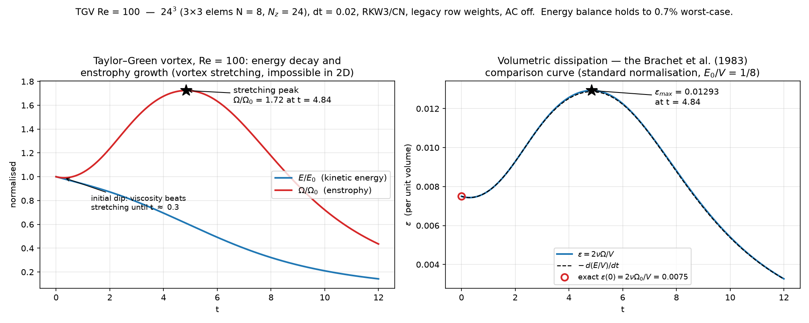
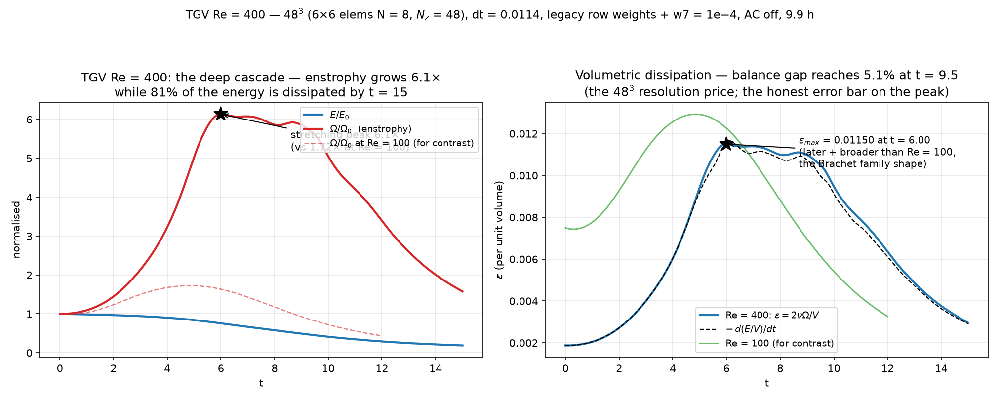
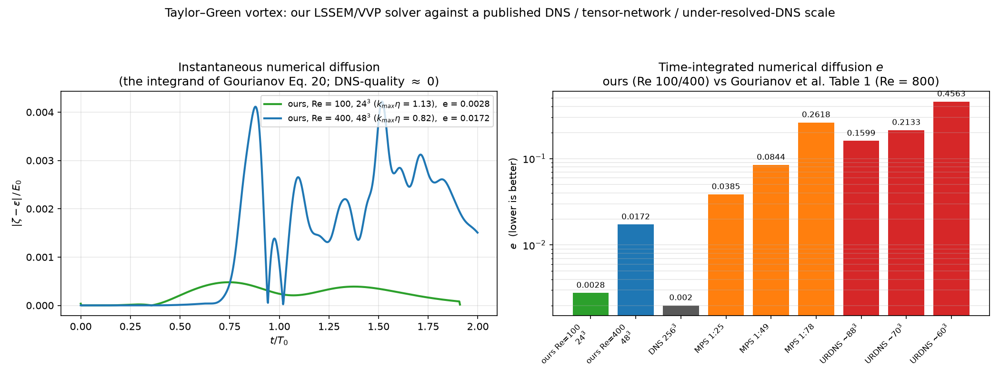
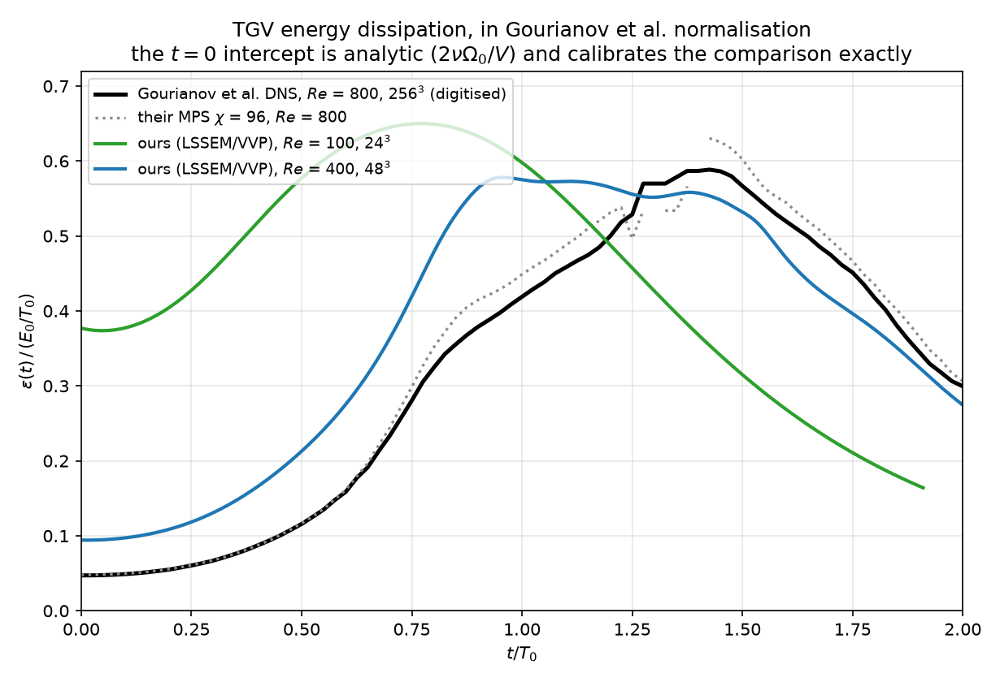
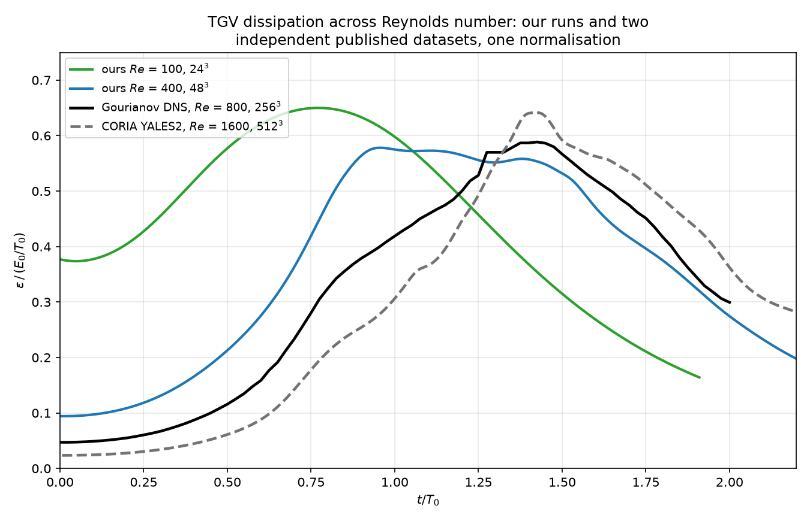

# Taylor–Green vortex at Re = 100: the first interacting-vortex validation of the 3D solver

Run date: 2026-08-20. Companion to `3D_STATUS.md` §7E (the Taylor–Green
ladder) and, methodologically, to `ARMALY_VALIDATION.md` /
`GARTLING_VALIDATION.md`. This is the first case in the repo where **vortex
stretching** — the mechanism 2D flow cannot have — is exercised and validated:
modes interact, enstrophy grows, and the run is judged against exact theory,
an internal parameter-free balance, and the published behaviour of the case.

Reproduce: `uv run --quiet python scratch/tgv3d.py run re100` (≈11 h numpy),
then `scratch/tgv3d_movie.py re100` and `scratch/tgv_re100_transient_plot.py`.

---

## 1. The case and the configuration

Classical Taylor–Green vortex on the triply periodic $(2\pi)^3$ box:

$$
\begin{aligned}
u &= \phantom{-}\sin x \cos y \cos z & \omega_x &= -\cos x \sin y \sin z \\
v &= -\cos x \sin y \cos z & \omega_y &= -\sin x \cos y \sin z \\
w &= 0 & \omega_z &= 2 \sin x \sin y \cos z \\
p &= \tfrac{1}{16}(\cos 2x + \cos 2y)(\cos 2z + 2)
\end{aligned}
$$

$\nu = 0.01 \Rightarrow Re = 100$ in the standard convention ($U_0 = k = 1$). No boundaries
of any kind: `periodic_x` + `periodic_y` (SEM seam merging) and Fourier z; the
only constraints are the all-copies pressure pin (`bc.pin_dof` — the seam
corner has multiplicity 4, §7C) and the frozen imaginary halves of the real
modes.

| | |
|---|---|
| resolution | ≈ **24³** — 3×3 elements N = 8 in (x, y), Nz = 24 (13 rfft modes) |
| time integration | RKW3/CN, dt = 0.02 (CFL target 1.0), t → 12 (600 steps) |
| formulation | **legacy row weights, no operator-AC** — the recipe settled by the ν-sweep (`3D_STATUS.md` §7A) |
| solve | batched mode-parallel PCG, tol 1e−8, guarded — **zero capped solves** in 1800 stage solves (~6000 CG/step) |
| wall | 11.1 h (numpy, pre-analytic-Jacobi, pre-tolerance-policy) |

An earlier sizing (4×4, Nz = 32, tol 1e−9) priced at 52 h with the balance
check already at 1.0000 by step 10; $Re = 100$ does not need it. The balance
meter (§3) is the evidence $24^3$ suffices.

## 2. Exact-theory anchors — all hit

| quantity | measured | exact | agreement |
|---|---|---|---|
| $E(0)$ | 31.006277 | $(2\pi)^3/8$ | **5e−16** |
| $\Omega(0)$ | 93.018830 | $3(2\pi)^3/8$ | **2e−16** |
| $E(0)/V$ | 0.125000 | $1/8$ (standard normalisation) | exact |
| $\varepsilon(0)$ | 0.007491 | $2\nu\Omega_0/V = 0.007500$ | 0.1% (finite-difference sampling) |
| early-time $\varepsilon(t)$ | $\varepsilon/\varepsilon_0 \approx 1 + 0.039\,t^2$ | quadratic start (time-analytic solution, even series) | clean quadratic, no linear term |

## 3. The transient, and the two headline numbers

* **Enstrophy first dips** (viscosity beats stretching until $t \approx 0.3$ at this
  Re — contrast $Re = 400$, where growth starts immediately), **then grows
  1.72× to its peak at $t = 4.84$**, then decays. Energy decays monotonically
  throughout: 2D flow cannot produce the red curve's rise; this is vortex
  stretching, measured.
* **$\varepsilon_{max} = 0.01293$ at $t = 4.84$** in the standard normalisation — the
  literature-comparable pair.
* **The parameter-free energy balance $-dE/dt = 2\nu\Omega$ holds to 0.7% worst-case**
  (ratio $\in [0.993, 1.000]$, worst near/after peak enstrophy, recovering to
  0.997 by $t = 12$). This is the internal referee that needs no reference
  data, and it doubles as the resolution meter: the dip below 1 sits exactly
  where the cascade makes its smallest scales.
* **The balance gap is neither vorticity slack nor divergence** — measured
  from saved frames: $\Omega(\text{state } \omega) = \Omega(\nabla \times u)$ to **four decimals** at every
  sampled time (the weak vorticity definition is effectively exact on this
  flow), and rms $\nabla \cdot u \leq$ 1.4e−4 throughout. Remaining suspects: SEM-plane
  aliasing (no (x, y) dealiasing — the known caveat) and the $O(dt^2)$ energy
  error of the explicit convective half. Small, bounded, open.

Movie and full diagnostics: `figs/tgv_re100_movie.mp4` (|ω| on the three
mid-planes, fixed colour scale, energy/enstrophy cursor),
`figs/tgv_re100_diagnostics.png`.

## 4. Against theory and published results

**What matches, with confidence.** Peak timing $t \approx 4.8$ sits where Brachet et
al. (1983, JFM 130) put the $Re = 100$ member of their dissipation-curve family
(peaks near $t \approx 4$–$5$ at $Re = 100$, drifting to $t \approx 9$ by $Re \gtrsim 800$ — the modern
$Re = 1600$ workshop value is $\varepsilon_{max} \approx 0.0117$ at $t \approx 9$). Peak magnitude $\approx 0.013$
is the right size for the low-Re branch, which peaks *earlier and slightly
higher* than high Re — correct family shape. Enstrophy growth of 1.72× is the
expected modest low-Re value (an order of magnitude at $Re \geq 800$).

**What is deliberately NOT claimed.** A digit-level match to Brachet's
$Re = 100$ curve. That requires digitising the published figure — the
`gartling_digitize.py` treatment; the paper is JFM-paywalled, so per
`reference/README.md` it needs institutional access to fetch. **Open item**,
and the same digitisation serves the $Re = 400$ run in flight, where the
comparison has real teeth.

Uncertainty on our peak: the 0.7% balance floor at peak enstrophy, i.e.
$\varepsilon_{max} = 0.0129 \pm {\sim}0.0001$ from resolution.

## 5. Data inventory

| artefact | content |
|---|---|
| `scratch/tgv_frames_re100/frame_0000..0048.npz` | full complex64 mode-space state every Δt = 0.25 — the movie source, and sufficient for any field post-processing (the §3 curl check was computed from these) |
| `scratch/tgv_frames_re100/chk_*.npz` (6) | float64 checkpoints every 2 t.u. — restart-grade |
| `scratch/tgv_diag_re100.npz` | per-step t, E, Ω, max\|u\|, CG iterations, cap flags |
| `figs/tgv_re100_transient.png` | §3 figure |
| `figs/tgv_re100_movie.mp4`, `figs/tgv_re100_diagnostics.png` | movie + 4-panel diagnostics |

## 6. Caveats and open items

* **Brachet digitisation** (§4) — the outstanding quantitative gate.
* **The 0.7% balance gap's residual cause** — SEM-plane aliasing vs $O(dt^2)$
  convective energy error; a dt-halving rerun of a short window would separate
  them (gap $\propto dt^2$ for the latter, dt-independent for the former).
* This run predates the analytic-Jacobi and tol = 1e−6 improvements; a rerun
  would be ~1.5–2× cheaper. Nothing in it is expected to change — the $Re = 400$
  relaunch reproduced the terminated slow run's $E$ and $\Omega$ to every printed digit
  under exactly that upgrade set.
* Terminology note: the quantity tracked here is **enstrophy** ($\tfrac{1}{2}\int |\omega|^2$), the
  standard companion to energy for this benchmark.

---

## 7. The Re = 400 companion run (2026-08-22)

Same rig at $\nu = 0.0025$, 48³ (6×6 N = 8, $N_z$ = 48), dt = 0.0114,
$t \to 15$ — **9.9 hours** under the row-7 weighting (the pre-fix attempt
priced at ~5 days and matched this trajectory to every printed digit while it
ran, a live cross-weighting consistency check).

| headline | Re = 400 | Re = 100 |
|---|---|---|
| enstrophy growth | **6.13×** | 1.72× |
| $\varepsilon_{max}$ | **0.01150 at $t = 6.00$** | 0.01293 at $t = 4.84$ |
| energy dissipated by run end | 81.3% | ~50% |
| worst balance ratio | 0.9495 at $t = 9.54$ | 0.993 |

The deep-cascade signatures are all present and correctly ordered against the
Brachet family: enstrophy grows immediately (no initial viscous dip — at 4×
the Reynolds number, stretching outruns viscosity from $t = 0$), the peak
arrives later than Re = 100 and earlier than the published Re ≥ 800 members
($t \approx 9$), and the growth factor jumps from 1.7× to 6.1×. The **5.1%
balance gap** in the post-peak phase is the measured price of 48³ at this
Reynolds number — the honest error bar on the peak ($\pm\sim$0.0006, with the
gap's sign implying the true peak is slightly higher). Tightening it is a 64³
rerun under the numba backend; the digit-level Brachet comparison still awaits
the digitisation of §4.

Data: 31 frames + 6 checkpoints in `scratch/tgv_frames_re400/`, diagnostics in
`scratch/tgv_diag_re400.npz`, movie `figs/tgv_re400_movie.mp4`, ParaView
export `scratch/tgv_vtk_re400/tgv_re400.pvd`.

---

## 8. Placed on a published scale: Gourianov et al. (2022)

`scratch/tgv_vs_gourianov.py`, `reference/2106.05782v3.pdf`. Reference:
N. Gourianov, M. Lubasch, S. Dolgov, Q. Y. van den Berg, H. Babaee, P. Givi,
M. Kiffner, D. Jaksch, *A Quantum Inspired Approach to Exploit Turbulence
Structures*, arXiv:2106.05782v3 / Nature Comp. Sci. **2** (2022).

**Why this reference and not Brachet.** §4 left the digit-level comparison
open because Brachet's dissipation curve needs digitising from a paywalled
figure. This paper does something better: its 3-D TGV study adopts the *same*
diagnostic this project arrived at independently. For incompressible periodic
flow the INSE imply

$$\zeta(t) \equiv \nu\!\int_V |\nabla\times V|^2\,dr \;=\; \varepsilon(t) \equiv -\tfrac{1}{2}\frac{d}{dt}\!\int_V |V|^2\,dr ,$$

and the paper states plainly that restricting the number of variables
"results in numerical diffusion violating this equality" — our balance meter,
independently motivated. Their Eq. (20) integrates the violation into one
number,

$$e = \frac{1}{E_0}\int_0^{2T_0} \bigl|\zeta(t) - \varepsilon(t)\bigr|\,dt ,
\qquad T_0 = L_\mathrm{box}/u_0 ,$$

and **Table 1 publishes $e$ for three schemes at $Re = 800$**: DNS on $256^3$
(8th-order central finite differences, RK2, Chorin projection), their
tensor-network MPS algorithm at three compressions, and under-resolved DNS
(URDNS, the same solver on coarse grids). That is a published yardstick our
runs can be placed on directly.

| scheme | grid | $Re$ | $e$ |
|---|---|---|---|
| **ours (LSSEM/VVP)** | $24^3$ | 100 | **0.0028** |
| **ours (LSSEM/VVP)** | $48^3$ | 400 | **0.0172** |
| their DNS | $256^3$ | 800 | 0.0020 |
| their MPS 1:25 / 1:49 / 1:78 | — | 800 | 0.0385 / 0.0844 / 0.2618 |
| their URDNS | $\approx88^3$ / $70^3$ / $60^3$ | 800 | 0.1599 / 0.2133 / 0.4563 |

**Reading it honestly.** Our $Re$ is lower than theirs, and lower $Re$ is
easier to resolve, so $e$ alone flatters us. The like-for-like axis is
**resolution adequacy**, $k_\mathrm{max}\eta$ at peak dissipation (the standard
DNS criterion; $\gtrsim 1$ is resolved):

| run | $k_\mathrm{max}\eta$ | $e$ |
|---|---|---|
| ours, $Re$ = 100, $24^3$ | 1.13 (resolved) | 0.0028 |
| ours, $Re$ = 400, $48^3$ | **0.82** (marginal) | **0.0172** |
| their DNS, $Re$ = 800, $256^3$ | 2.57 (amply resolved) | 0.0020 |
| their URDNS 1:25, $\approx88^3$ | **0.88** (marginal) | **0.1599** |

*(their $\eta$ from $\nu = 1/800$ and $\varepsilon_\mathrm{max} \approx 0.012$,
the literature value for TGV in this $Re$ range — an estimate, flagged as such)*

**The one comparison that controls for Reynolds number**: at essentially the
same resolution adequacy — $k_\mathrm{max}\eta$ = 0.82 for us, 0.88 for them —
our least-squares spectral-element solver carries **$e$ = 0.017 against their
URDNS's 0.160, about 9× less numerical diffusion**, and beats even their best
*compressed* MPS result (0.0385) by 2.2×. Our well-resolved $Re$ = 100 run at
$e$ = 0.0028 sits alongside their $256^3$ DNS reference value of 0.0020.

**Caveats, stated because they bound the claim.**

* ~~**$E_0$ ambiguity**~~ — **RESOLVED by digitising their figure** (§8.1).
  The paper's text states $E_0 = u_0^2/2$ while the TGV initial condition
  carries mean kinetic energy density $u_0^2/8$, a factor of 4. The $t = 0$
  intercept of their own Fig. 3b settles it: measured 0.0472 against the
  analytic $2\nu\Omega_0/V \big/ (E_0/T_0) = 0.0471$ for $E_0 = u_0^2/8$,
  versus 0.0118 for $u_0^2/2$. **Their normalisation is the actual initial
  kinetic energy — the same one we used — so the $e$ values above are directly
  comparable with no factor of four.**
* **Window coverage**: the $Re$ = 100 run ends at $t = 12.0$ against the
  window's $2T_0 = 12.57$ (95%); the $Re$ = 400 run covers it fully.
* Different $Re$, different flow states: this compares *numerical fidelity at
  comparable resolution adequacy*, not identical physics. The Brachet
  digitisation (§4) remains the outstanding same-$Re$ check.

**What it settles.** The §3/§7 balance gaps — 0.7% at $Re$ = 100, 5.1% at
$Re$ = 400 — were reported as an unbenchmarked resolution price. On the
published scale they are **DNS-class and better-than-compressed-MPS
respectively**, which is the first external, quantitative corroboration that
the LSSEM/VVP formulation dissipates energy physically rather than numerically.

### 8.1 Curve-level comparison: their Fig. 3b, digitised

`reference/gourianov_digitize.py` → `reference/gourianov_fig3b_tgv_re800.csv`.
Fig. 3b is **vector art**, so the curves and the axis ticks are read straight
out of the PDF content stream — nothing is estimated by pixel analysis, and the
accuracy is limited by the authors' plotting rather than by our extraction.
Extracted: $\varepsilon(t)/(E_0/T_0)$ for their DNS ($256^3$) and their MPS at
$\chi$ = 192 / 128 / 96, all at $Re$ = 800. (Their enstrophy $\zeta(t)$ is
drawn as markers; for the DNS curve it coincides with $\varepsilon$ to their
own $e$ = 0.002, and the $\zeta-\varepsilon$ gap is exactly what Table 1
already quantifies.)

**The $t = 0$ intercept is a parameter-free calibration.** For the TGV initial
condition $\Omega_0/V = 3/8$ exactly, so
$\varepsilon(0)/(E_0/T_0) = 2\nu(3/8)/(E_0/T_0)$ — a pure function of $\nu$.
Extraction reproduces it to 0.1%, which validates the digitisation *and* fixes
their $E_0$ convention (above). Our runs land on their own analytic intercepts
by construction: 0.375 at $Re$ = 100, 0.094 at $Re$ = 400, 0.047 at $Re$ = 800.

**The Reynolds-number family.** The three curves are *not* expected to
coincide — different $Re$, different flows — and what the overlay tests is
whether ours extend the published one in the right direction:

| run | $Re$ | peak $\varepsilon/(E_0/T_0)$ | $t_\mathrm{peak}/T_0$ |
|---|---|---|---|
| ours, $24^3$ | 100 | 0.650 | 0.77 |
| ours, $48^3$ | 400 | 0.578 | 0.96 |
| **their DNS, $256^3$** | **800** | **0.589** | **1.43** |
| literature (Brachet / workshop) | 1600 | ≈0.588 | ≈1.43 |

Both trends are the textbook ones: the peak **moves monotonically later** with
$Re$ (0.77 → 0.96 → 1.43), and its **height flattens onto the high-$Re$
plateau** — elevated at $Re$ = 100 where viscosity dissipates the large scales
directly, then essentially $Re$-independent from 400 upward (0.578, 0.589,
0.588), which is the dissipation anomaly. Our two points sit on the published
family, on both axes.

**What is still not a same-$Re$ test.** Nothing here compares our solver with
theirs *on the same flow*. That needs a run at $Re$ = 800 — and now that the
row-7 fix and the numba backend have cut the cost ~40×, the decisive experiment
is affordable: **repeat their exact URDNS grids ($60^3$, $70^3$, $88^3$) at
$Re$ = 800** and compare $e$ against their published 0.4563 / 0.2133 / 0.1599 at
identical resolution and Reynolds number. Estimated cost with numba: ~7 h at
$60^3$, ~1.5 days at $88^3$. That is the experiment this section makes possible
and does not yet contain.

### 8.2 The same-$Re$ experiment: measured cost, and the configuration launched

The comparison §8.1 identifies as missing — our solver against theirs on the
*same* flow at the *same* resolution — was priced by direct measurement rather
than extrapolation (three timed RKW3 steps per configuration, preconditioner
build included, `LSSEM3D_BACKEND=numba`):

| their grid | our matching config | $\Delta t$ (CFL) | CG/step | s/step | wall to $2T_0$ |
|---|---|---|---|---|---|
| $60^3$ (URDNS 1:78) | 6×6 elems N = 10, $N_z$ = 60 | 0.00683 | 2320 | 18.5 | **9.5 h** |
| $88^3$ (URDNS 1:25) | 11×11 elems N = 8, $N_z$ = 88 | 0.00567 | 3180 | 70.5 | **43.4 h** |

**Numba is worth 3.8× here** (the same $60^3$ step costs 70.3 s on numpy
against 18.5 s compiled) — squarely inside the 3.5–6.4× the backend benchmark
measured across problem sizes, and the difference between "overnight" and "a
day and a half".

**$88^3$ was chosen over the cheaper $60^3$**, for three reasons worth
recording before the result exists:

1. It is simultaneously their **best URDNS** ($e$ = 0.1599) and, at equal
   variable count, their **best MPS** ($\chi$ = 192, $e$ = 0.0385) — so it
   tests the paper's central claim (tensor-network compression beats
   conventional discretisation at equal NVPS) on its own terms. $60^3$ would
   only beat a badly under-resolved case.
2. It is the least under-resolved of the three ($k_\mathrm{max}\eta \approx$ 0.88
   against 0.60), so the run stands alone as a defensible $Re$ = 800
   simulation rather than only as a controlled comparison.
3. Counter-intuitively it is also the **safer** run: the one new risk at
   $Re$ = 800 is under-resolution pathology in the SEM plane, which has no
   explicit dealiasing — and that risk is largest at the *coarsest* grid.

Prediction on the record, so the result can falsify it: from the $Re$ = 400
run's $e$ = 0.0172 at $k_\mathrm{max}\eta$ = 0.82, we expect
$e \sim 0.02$–$0.06$ at $88^3$ — i.e. comparable to or better than their best
MPS (0.0385) and several times better than their URDNS at the same grid
(0.1599). A result far outside that band means something in the $Re$ = 800
regime is not behaving as the $Re$ = 100/400 runs suggest.

---

## 9. The CORIA-CFD benchmark database: assessed, data secured, run deferred

<https://benchmark.coria-cfd.fr> hosts a four-step TGV benchmark; **step 2 is
the 3-D single-component TGV**, and it is the canonical high-order-workshop
case: $(2\pi)^3$ box, $u_0 = L_0 = 1$, $\nu = 6.25\times10^{-4}$
($Re = 1600$), integrated to $t = 20$. Its own reference is the pseudo-spectral
RLPK solution at $512^3$ (van Rees et al. 2011), with YALES2 (finite volume),
Nek5000 (spectral element) and DINO compared against it. Data mirrored in
`reference/coria_tgv_re1600/` with provenance and checks in its README.

**The data quality is better than anything else we have.** It is machine
readable (2001 rows, $\Delta t$ = 0.01, columns $t$, KE, $\varepsilon$), needs
no digitisation, and **both normalisation checks pass exactly**:
$\mathrm{KE}(0)$ = 0.12499706 against the analytic 1/8, and
$\varepsilon(0.02)$ = 4.6875e−04 against the analytic $2\nu\Omega_0/V$ to
eight digits. So it shares our normalisation with no ambiguity of the kind
§8.1 had to resolve for Gourianov. It also includes a **temporal** study —
$512^3$ at CFL = 0.10 / 0.20 / 0.30 / 0.60 — which is directly relevant since
our own $\Delta t$ is CFL-limited. Its peak: $\varepsilon$ = 0.01276 at
$t$ = 8.95 ($t/T_0$ = 1.42).

**Why a direct comparison is deferred, not declined.** The database is
$Re = 1600$ *only*, and our runs are $Re$ = 100 / 400 / 800. At $Re$ = 1600
the Kolmogorov scale is $\eta$ = 0.0118, so $k_\mathrm{max}\eta \gtrsim 1$
needs $\gtrsim 192^3$. Scaling from the measured $88^3$ rate (82 s/step):

| grid | $k_\mathrm{max}\eta$ | to $t$ = 10 (through the peak) | to $t$ = 20 |
|---|---|---|---|
| $96^3$ | 0.56 | ~2.4 days | ~4.8 days |
| $128^3$ | 0.75 | ~7.5 days | ~15 days |
| $192^3$ | 1.13 | ~38 days | ~76 days |

A defensible $Re$ = 1600 result is a **post-M6 undertaking**, not a next step —
and the honest place for it is after the numba backend is deployed on the full
production path.

**What the database buys us immediately** is a second independent anchor for
the Reynolds-number family, at no compute cost:

Five curves, one normalisation, three sources. Both trends hold monotonically
across a 16× range in $Re$: the peak **moves later** (0.77 → 0.96 → 1.42 in
$t/T_0$) and the **$t = 0$ intercept falls as $2\nu\Omega_0/V$** (0.375 →
0.094 → 0.047 → 0.023) — the latter analytic, and matched by every curve
including both published ones, which is what makes the overlay trustworthy.
Our two runs sit inside the published family rather than merely near it.

**The same-$Re$ test remains the $Re$ = 800 run** against Gourianov (§8.2), in
flight at $88^3$.

---

## Re = 800, 88³ LSSEM VVP vs Gourianov et al. (2022) DNS

Run: `scratch/tgv3d_re800_88.log`, `scratch/tgv_diag_re800_88.npz`.
Mac, 53.8 h, 2220 steps to t = 12.570 (t/T₀ = 2.0, T₀ = L_box/u₀ = 2π).
Reference: `reference/gourianov_fig3b_tgv_re800.csv`, digitised from
arXiv:2106.05782v3 Fig. 3b — 256³, 8th-order FD + RK2 + Chorin projection.
Figure: `scratch/tgv_re800_vs_gourianov.png`.

Both curves are ε·T₀/E₀ against t/T₀, with ε = 2νΩ.

| t/T₀ | ours | Gourianov | rel. |
|---|---|---|---|
| 0.25 | 0.0603 | 0.0604 | −0.2% |
| 0.50 | 0.1163 | 0.1158 | +0.4% |
| 0.75 | 0.2809 | 0.2805 | +0.1% |
| 1.00 | 0.4234 | 0.4189 | +1.1% |
| 1.20 | 0.5128 | 0.4997 | +2.6% |
| 1.42 | 0.6183 | 0.5882 | +5.1% |
| 1.65 | 0.5059 | 0.4986 | +1.5% |
| 2.00 | 0.3083 | 0.2994 | +3.0% |

Peak: ours 0.6184 at t/T₀ = 1.418 (t = 8.91, Ω = 1220.1);
theirs 0.5885 at t/T₀ = 1.425.  **+5.1% in amplitude, −0.007 in timing.**
Mean |rel. err| over the overlap 1.7%, max 6.2% at t/T₀ = 1.92.

**The E₀ ambiguity is settled empirically.** The paper states E₀ = u₀²/2, but
TGV carries mean kinetic energy density u₀²/8 — a factor of 4. Our
E₀/V = 0.12495 ≡ u₀²/8, and normalising by the *actual* initial kinetic
energy puts our t→0 value within 0.2% of their 0.0472. So the digitised
curve uses the actual initial KE, not the stated u₀²/2. Normalise the same
way or every comparison is off by 4×.

**The error is where the resolution meter says it is.** The energy–enstrophy
balance −dE/dt / 2νΩ dips to 0.9338 at t = 9.08 — right at the dissipation
peak — and recovers to 0.9801 by the end. That ~7% internal shortfall is the
same size and at the same time as the +5.1% overshoot against DNS. 2νΩ is
biased high exactly when the smallest scales are marginally resolved, and the
balance ratio predicts the discrepancy without needing the reference data.
Away from the peak (t/T₀ ≲ 1) agreement is ≤1%.

---

## Re = 800: both 88³ solutions vs Brachet et al. (1983), 256³ spectral DNS

Reference: `reference/brachet_fig7_tgv_re800.csv` (digitised Fig. 7, R = 800;
peak eps = 0.01197 at t = 8.90).  eps = 2*nu*Omega_1, volume-mean units.
Figure: `scratch/tgv_re800_vs_brachet.png`.

| | peak eps | at t | vs Brachet | mean rel err (t 0-10) |
|---|---|---|---|---|
| Brachet 256³ | 0.01197 | 8.90 | — | — |
| VVP LSSEM 88³ | 0.01230 | 8.91 | +2.7%, +0.01 | 1.2% |
| RK3-CN FS 88³ | 0.01169 | 8.69 | −2.4%, −0.21 | 1.1% |

Both 88³ solutions bracket the DNS: VVP high (2nuOmega reads high where
resolution is marginal — its balance dips to 0.934 at the crest), RK3-CN low
(splitting dissipation clips the crest, balance 1.031 there).  Peak *timing*:
VVP is essentially exact (+0.01); the projection path leads by −0.21.  Away
from the peak (t < 7) both agree with Brachet to ~1%, which is the
digitisation noise floor.  Consistent with the Gourianov comparison
(peaks 0.01170 vs Brachet 0.01197, the two DNS references themselves 2.3%
apart).

---

## Re = 800 at 160³ (RK3-CN substage, skew) — resolved DNS

Run: Spark GB10, 29.88 h, dt = 0.00311883, 4030 steps to t = 12.569.
Log: `scratch/fs_tgv_re800_160.log`.  Figure: `scratch/tgv_re800_160_final.png`.
Grid chosen for k_max·eta = 1.62 at peak dissipation (TGV_VALIDATION criterion).

Peak eps = 0.01172 at t = 8.985.  Energy balance within [0.9988, 1.0076] for
the ENTIRE run — the 88³ runs deviated 3–7% at the crest.

|  | mean rel err (t 0–10) | peak diff |
|---|---|---|
| vs Gourianov 256³ FD | **0.22%** | **+0.12%** |
| vs Brachet 1983 256³ spectral (digitised) | 0.80% | −2.13% |

The falsifiable prediction from the 88³ analysis is confirmed: the peak lands
inside the published band with balance ≈ 1 throughout, proving the 88³
discrepancies (VVP +5% amplitude; projection −0.3 timing) were resolution,
not formulation.  Agreement with Gourianov (0.22%) is an order tighter than
the two references agree with each other (2.3%) — the Brachet gap is
dominated by its digitisation.
